# Period Finding / Signal Detection

This page documents the VARTOOLS commands for detecting and characterizing signals in light curves, both periodic (Lomb-Scargle, AoV, PDM, BLS, FTP, wavelets) and template-shaped transients (matched filter). Commands output peak periods or trial-centre times, significance, and signal-to-noise statistics to the output table; periodograms / matched-filter surfaces are optionally written to on-disk files.

---

### `-LS` — Generalized Lomb-Scargle

**Syntax**
```
-LS
    < "var" minpvar | "expr" minpexpr | minp >
    < "var" maxpvar | "expr" maxpexpr | maxp >
    < "var" subsamplevar | "expr" subsampleexpr | subsample >
    Npeaks operiodogram [outdir] ["noGLS"]
    ["whiten"] ["clip" clip clipiter]
    ["fixperiodSNR" < "aov" | "ls" | "injectharm" | "fix" period
                    | "list" ["column" col]
                    | "fixcolumn" <colname | colnum> >]
    ["bootstrap" Nbootstrap] ["maskpoints" maskvar]
```

**Description**

Perform a Generalized Lomb-Scargle (GLS) period search for sinusoidal signals. The search runs over frequencies from `fmin = 1/maxp` to `fmax = 1/minp` with a uniform frequency step `Δf = subsample/T`, where `T` is the time baseline. The GLS implementation of [Zechmeister and Kürster (2009)](https://ui.adsabs.harvard.edu/abs/2009A%26A...496..577Z/abstract) allows a floating mean and heteroscedastic errors, unlike the traditional LS periodogram.

For each of the three search parameters (`minp`, `maxp`, `subsample`) you may either give a fixed value on the command line, use the `"var"` keyword followed by a variable name, or use the `"expr"` keyword to evaluate an analytic expression for each light curve.

Python equivalent: [`LS`](../python/commands/period-finding.md#ls-generalized-lomb-scargle).

The statistic reported is:

```
LS = (chi0^2 - chi(f)^2) / chi0^2
```

where `chi0^2` is χ² about the weighted mean and `chi(f)^2` is χ² about the best-fit sinusoid at frequency `f`. For the traditional (non-generalized) periodogram, `LS` is the standard un-normalized Lomb-Scargle power.

**Parameters**

| Parameter | Description |
|-----------|-------------|
| `minp` | Minimum period to search (days). |
| `maxp` | Maximum period to search (days). |
| `subsample` | Frequency oversampling factor. Typical value: 0.1 (one-tenth of the fundamental frequency resolution). |
| `Npeaks` | Number of highest peaks to find and report. |
| `operiodogram` | `1` to write the periodogram to `outdir/$basename.ls`; `0` to skip. |
| `outdir` | Directory for periodogram files (required when `operiodogram = 1`). |
| `"noGLS"` | Compute the traditional (non-generalized) Lomb-Scargle periodogram. |
| `"whiten"` | After each peak, whiten the light curve at that period before searching for the next peak. The SNR for each peak is computed on the whitened periodogram. |
| `"clip" clip clipiter` | Sigma-clipping parameters for the mean/RMS calculation used in the SNR estimate. `clip` is the clipping factor; `clipiter` is `1` for iterative clipping (default: iterative 5σ). |
| `"fixperiodSNR" ...` | Also output `log(FAP)` and SNR at a specified period. Sources: `"aov"` (last `-aov`), `"ls"` (last `-LS`), `"injectharm"` (last `-Injectharm`), `"fix" period`, `"list"`, or `"fixcolumn"`. |
| `"bootstrap" Nbootstrap` | Estimate the FAP via bootstrap resampling (`Nbootstrap` simulations). Each simulation uses the observed times with magnitudes drawn randomly with replacement. |
| `"maskpoints" maskvar` | Exclude points with `maskvar ≤ 0` from the periodogram calculation. |

**Output columns** (per peak `k`, command index `i`)

| Column | Description |
|--------|-------------|
| `LS_Period_k_i` | Best period of peak `k` (days). |
| `Log10_LS_Prob_k_i` | Log₁₀ of the formal false alarm probability. |
| `LS_SNR_k_i` | Spectroscopic SNR: `(LS - <LS>) / RMS(LS)`. |

**References**

Cite [Zechmeister & Kürster 2009](https://ui.adsabs.harvard.edu/abs/2009A%26A...496..577Z/abstract), A&A, 496, 577 and Press et al. 1992 (*Numerical Recipes*) for the GLS periodogram. For the traditional LS periodogram also cite [Lomb 1976](https://ui.adsabs.harvard.edu/abs/1976Ap%26SS..39..447L/abstract), [Scargle 1982](https://ui.adsabs.harvard.edu/abs/1982ApJ...263..835S/abstract), and [Press & Rybicki 1989](https://ui.adsabs.harvard.edu/abs/1989ApJ...338..277P/abstract).

**Examples**

**Example 1.** Run the Lomb-Scargle period search on a single light curve, reporting the top 5 peaks, writing periodograms, applying whitening, and using iterative 5σ clipping for SNR.

```bash
vartools -i EXAMPLES/2 -oneline -ascii \
    -LS 0.1 10. 0.1 5 1 EXAMPLES/OUTDIR1 whiten clip 5. 1
```

Output:
```
LS_Period_1_0 = 1.23440877 (Log10_LS_Prob = -704.49194, LS_SNR = 126.52865)
LS_Period_2_0 = 0.54573861 (Log10_LS_Prob = -60.19769, LS_SNR = 12.22747)
LS_Period_3_0 = 0.55647766 (Log10_LS_Prob = -52.64556, LS_SNR = 9.46714)
LS_Period_4_0 = 0.25922584 (Log10_LS_Prob = -28.26507, LS_SNR = 7.42006)
LS_Period_5_0 = 0.50172744 (Log10_LS_Prob = -25.89142, LS_SNR = 8.63338)
```

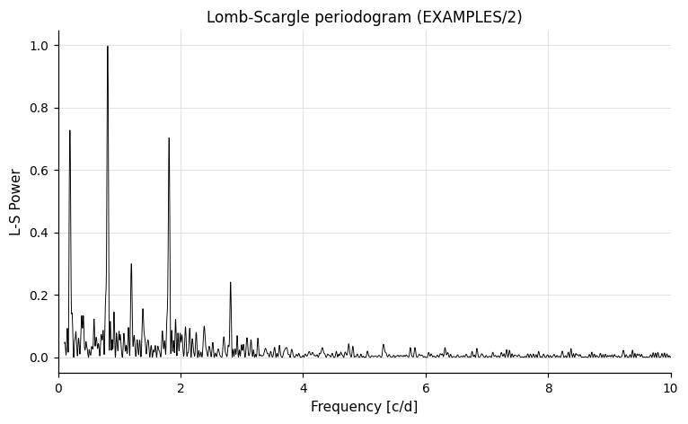

After pre-whitening peak 1 the periodogram looks like this — the dominant 1.234-day signal has been removed; subsequent peaks are now visible above the residual:

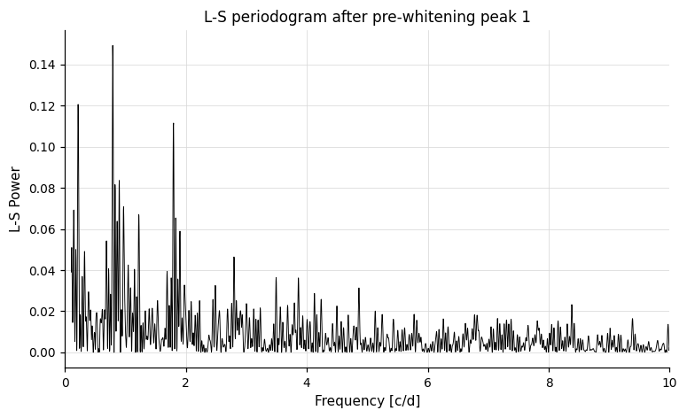

---

### `-aov` — Phase-Binned Analysis of Variance

**Syntax**
```
-aov
    ["Nbin" < "var" Nbinvar | "expr" Nbinexpr | Nbin >]
    < "var" minpvar | "expr" minpexpr | minp >
    < "var" maxpvar | "expr" maxpexpr | maxp >
    < "var" subsamplevar | "expr" subsampleexpr | subsample >
    < "var" finetunevar | "expr" finetuneexpr | finetune >
    Npeaks operiodogram [outdir]
    ["whiten"] ["clip" clip clipiter] ["uselog"]
    ["fixperiodSNR" < "aov" | "ls" | "injectharm" | "fix" period
                    | "list" ["column" col]
                    | "fixcolumn" <colname | colnum> >]
    ["maskpoints" maskvar]
```

**Description**

Perform an Analysis of Variance (AoV) period search using phase binning. For each trial frequency, the light curve is phase-folded and binned; the AoV statistic θ_aov measures how much variance is explained by the phase bins relative to the total variance. A high θ_aov indicates a good phase-coherent signal.

The initial search uses a frequency step of `subsample/T`. The top peaks are refined to a resolution of `finetune/T`.

Python equivalent: [`aov`](../python/commands/period-finding.md#aov-phase-binned-analysis-of-variance).

**Parameters**

| Parameter | Description |
|-----------|-------------|
| `"Nbin"` | Number of phase bins (default: 8). |
| `minp` / `maxp` | Period search range (days). Accepts `"var"` or `"expr"` keywords. |
| `subsample` | Coarse frequency step factor. |
| `finetune` | Fine-tuning frequency step factor applied near peak periods. |
| `Npeaks` | Number of peaks to report. |
| `operiodogram` | `1` to write period vs. θ_aov to `outdir/$basename.aov`. |
| `"whiten"` | Whiten the light curve at each peak before searching for the next one. |
| `"clip" clip clipiter` | Clipping parameters for the SNR calculation. |
| `"uselog"` | Output `ln(θ_aov)` SNR: `(<-ln(θ_aov)> - ln(θ_aov)) / RMS(-ln(θ_aov))`. Also outputs the mean and RMS of `-ln(θ_aov)`. |
| `"fixperiodSNR" ...` | Output AoV statistic and SNR at a specified period. Syntax identical to `-LS`. |
| `"maskpoints" maskvar` | Exclude points with `maskvar ≤ 0`. |

**Output columns** (per peak `k`, command index `i`)

| Column | Description |
|--------|-------------|
| `Period_k_i` | Best period of peak `k` (days). |
| `AOV_k_i` | θ_aov statistic. |
| `AOV_SNR_k_i` | Signal-to-noise ratio in the periodogram. |
| `AOV_NEG_LOG_FAP_k_i` | `-ln(FAP)` (formal false alarm probability). |

**References**

Cite [Schwarzenberg-Czerny 1989](https://ui.adsabs.harvard.edu/abs/1989MNRAS.241..153S/abstract), MNRAS, 241, 153 and [Devor 2005](https://ui.adsabs.harvard.edu/abs/2005ApJ...628..411D/abstract), ApJ, 628, 411.

**Examples**

**Example 1.** Run the phase-binning AoV period search on a light curve, using 20 phase bins, searching periods between 0.1 and 10.0 days, reporting the top 5 peaks with iterative 5σ clipping.

```bash
vartools -i EXAMPLES/2 -oneline -ascii \
    -aov Nbin 20 0.1 10. 0.1 0.01 5 1 EXAMPLES/OUTDIR1 whiten clip 5. 1
```

Output: Five detected periods with `Period_1_0 = 1.23583047` (`AOV_1_0 = 18330.55450`, AOV_SNR, AOV_NEG_LN_FAP) through `Period_5_0 = 0.12056969` (`AOV_5_0 = 16.69317`), with corresponding SNR and negative log FAP values for each.

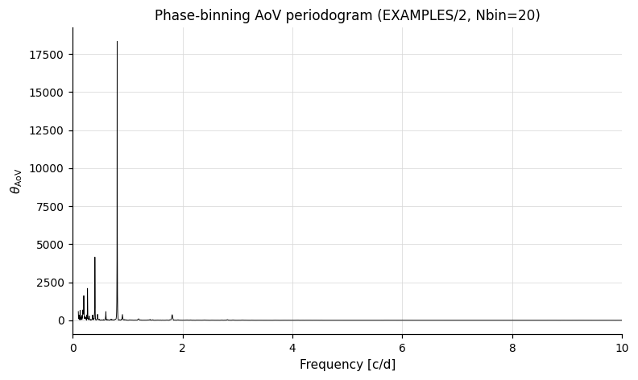

---

### `-aov_harm` — Multi-Harmonic Analysis of Variance

**Syntax**
```
-aov_harm
    < "var" Nharmvar | "expr" Nharmexpr | Nharm >
    < "var" minpvar | "expr" minpexpr | minp >
    < "var" maxpvar | "expr" maxpexpr | maxp >
    < "var" subsamplevar | "expr" subsampleexpr | subsample >
    < "var" finetunevar | "expr" finetuneexpr | finetune >
    Npeaks operiodogram [outdir]
    ["whiten"] ["clip" clip clipiter]
    ["fixperiodSNR" < "aov" | "ls" | "injectharm" | "fix" period
                    | "list" ["column" col]
                    | "fixcolumn" <colname | colnum> >]
    ["maskpoints" maskvar]
```

**Description**

Perform an AoV period search fitting a multi-harmonic model instead of phase bins. The model signal has `Nharm` harmonics. If `Nharm < 1`, the number of harmonics is automatically varied to minimize the false alarm probability (accounting for the penalty for overfitting). All other parameters are identical to `-aov`.

Python equivalent: [`aov_harm`](../python/commands/period-finding.md#aov_harm-multi-harmonic-analysis-of-variance).

**Parameters**

| Parameter | Description |
|-----------|-------------|
| `Nharm` | Number of harmonics in the model signal (≥ 1). Set to `0` or negative to allow automatic selection. Accepts `"var"` or `"expr"` keywords. |
| All others | Same as `-aov`. |

**Output columns**

Same structure as `-aov` with prefix `AOV_HARM`.

**References**

Cite [Schwarzenberg-Czerny 1996](https://ui.adsabs.harvard.edu/abs/1996ApJ...460L.107S/abstract), ApJ, 460, L107.

**Examples**

**Example 1.** Run the multi-harmonic AoV period search with 1 harmonic, searching periods between 0.1 and 10.0 days, reporting the top 2 peaks with whitening and iterative 5σ clipping.

```bash
vartools -i EXAMPLES/2 -oneline -ascii \
    -aov_harm 1 0.1 10. 0.1 0.01 2 1 EXAMPLES/OUTDIR1 whiten clip 5. 1
```

Output: Period values and AOV_HARM, SNR, and logarithmic FAP values for 2 identified peaks (1.23533969 days and 0.49981672 days).

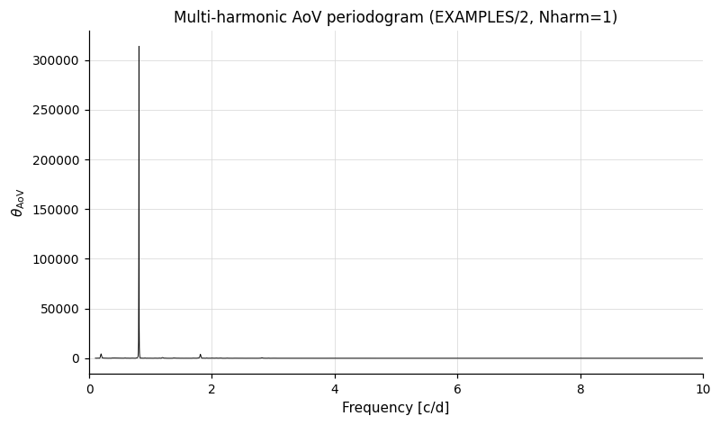

---

### `-PDM` — Phase Dispersion Minimization

**Syntax**
```
-PDM < "step" | "linterp" | "multicover" | "tophat" | "gauss" >
    ["Nbin" < "var" Nbinvar | "expr" Nbinexpr | Nbin >]
    ["Nc"   < "var" Ncvar   | "expr" Ncexpr   | Nc >]
    ["dphi" < "var" dphivar | "expr" dphiexpr | dphi >]
    < "var" minpvar | "expr" minpexpr | minp >
    < "var" maxpvar | "expr" maxpexpr | maxp >
    < "var" subsamplevar | "expr" subsampleexpr | subsample >
    < "var" finetunevar | "expr" finetuneexpr | finetune >
    Npeaks operiodogram [outdir]
    ["clip" clip clipiter] ["noerr"] ["whiten"]
    ["fixperiodSNR" < "aov" | "ls" | "pdm" | "injectharm" | "fix" period
                    | "list" ["column" col]
                    | "fixcolumn" <colname | colnum> >]
    ["bootstrap" Nboot] ["maskpoints" maskvar]
```

**Description**

Perform a Phase Dispersion Minimization (PDM) period search. For each trial frequency the light curve is phase-folded and a statistic θ ∈ [0, 1] measures the residual dispersion against a phase-fold model. A signal at the correct period produces θ near 0; pure noise yields θ near 1. The first argument selects one of five variants:

| Variant | Model | Notes |
|---------|-------|-------|
| `step` | Per-bin mean over `Nbin` fixed phase bins ([Stellingwerf 1978](https://ui.adsabs.harvard.edu/abs/1978ApJ...224..953S/abstract)). | Classic PDM. |
| `linterp` | Linear interpolation between adjacent bin means (cuvarbase default). | Smoother periodogram than `step`; less bin-edge sensitivity for the same `Nbin`. |
| `multicover` | Average of `Nc` phase-shifted `Nb`-bin sets (each shifted by `1/(Nb·Nc)`). | Reduces bin-edge sensitivity at the cost of more computation. Schwarzenberg-Czerny 1997 explicitly notes that no analytic FAP exists for `Nc > 1`; the reported `PDM_NEG_LN_FAP` uses the single-cover Beta formula and should be treated as approximate. |
| `tophat` | Per-point weighted mean of phase-neighbours inside `\|Δφ\| ≤ dphi`. | Binless — no phase grid. Useful for sparse light curves where bin occupancy is irregular. Costs O(N²) per trial period. |
| `gauss` | Per-point weighted mean with Gaussian phase kernel of sigma `dphi`. | Smoother binless variant. Same O(N²) cost. |

The initial search uses a frequency step of `subsample/T`. The top peaks are refined to a resolution of `finetune/T`. Defaults: `Nbin = 8`, `Nc = 2` (for `multicover`), `dphi = 0.05` (for `tophat`/`gauss`).

Python equivalent: [`PDM`](../python/commands/period-finding.md#pdm-phase-dispersion-minimization).

**Parameters**

| Parameter | Description |
|-----------|-------------|
| `variant` | Required: one of `step`, `linterp`, `multicover`, `tophat`, `gauss`. |
| `"Nbin"` | Number of phase bins (per cover for `multicover`). Default 8. Rejected with `tophat`/`gauss`. Accepts `"var"`/`"expr"`. |
| `"Nc"` | Number of phase-shifted bin sets, multicover only. Default 2. Accepts `"var"`/`"expr"`. |
| `"dphi"` | Phase-window half-width (`tophat`) or kernel sigma (`gauss`). Default 0.05. Rejected with binned variants. Accepts `"var"`/`"expr"`. |
| `minp` / `maxp` | Period search range (days). Accepts `"var"`/`"expr"`. |
| `subsample` | Coarse frequency step factor. The coarse-grid frequency step is `Δf = subsample / T`, where `T` is the time-span of the light curve. |
| `finetune` | Fine-tuning frequency step factor applied near peak periods. The fine-tune step is `Δf_fine = finetune / T`. |
| `Npeaks` | Number of peaks to report. |
| `operiodogram` | `1` to write period vs. θ to `outdir/$basename.pdm`. When `whiten` is set, the file gains one column per whitening cycle. |
| `"clip" clip clipiter` | σ-clipping factor and iterate-flag for the periodogram mean/RMS used in the SNR. Default 5σ iterative, matching `-aov`. |
| `"noerr"` | Use uniform point weights instead of `1/σ²`. |
| `"whiten"` | Subtract the step-bin phase model at each peak before searching for the next. Adds per-cycle `Mean_PDM_Theta_k_N` and `RMS_PDM_Theta_k_N` output columns; the periodogram dump gains one column per cycle. |
| `"fixperiodSNR" ...` | Report θ/SNR/FAP at a specified period in addition to the peak search. Sources: `aov` / `ls` / `pdm` (the most recent prior period-finder of that type), `injectharm`, `fix` *period*, `list` (with optional `column N`), or `fixcolumn` *name*. |
| `"bootstrap" Nboot` | Replace the analytic Schwarzenberg-Czerny FAP with an empirical FAP calibrated from `Nboot` shuffled-light-curve trials. Bootstrap can be used to calibrate the FAP; in practice it may be too slow for large analysis projects. |
| `"maskpoints" maskvar` | Exclude points where `maskvar ≤ 0`. |

The trailing keyword block is parsed in a strict order matching the syntax shown above; mis-ordering or duplicating these keywords produces a command-syntax error.

**Output columns** (per peak `k`, command index `N`)

| Column | Description |
|--------|-------------|
| `PDM_Period_k_N` | Best period of peak `k` (days). |
| `PDM_Theta_k_N` | θ statistic (lower is better; 1 = random, 0 = perfectly coherent). |
| `PDM_SNR_k_N` | `(θ_mean − θ_peak) / θ_rms` using the (possibly clipped) periodogram noise estimate. A poor significance statistic for PDM — included for consistency with `-aov`; prefer `PDM_NEG_LN_FAP_k_N` for thresholding. |
| `PDM_NEG_LN_FAP_k_N` | `−ln(FAP)`. Computed analytically from the Schwarzenberg-Czerny 1997 Beta((N−Nb)/2, (Nb−1)/2) distribution with an effective-trials-factor correction, or empirically from the bootstrap distribution when `"bootstrap"` is set. Rigorous for `step` under standard ANOVA assumptions; approximate for the other variants. |
| `Mean_PDM_Theta_N` / `RMS_PDM_Theta_N` | Periodogram mean and RMS used for the SNR (one set per command unless `whiten` is set, in which case the per-cycle pairs `Mean_PDM_Theta_k_N` / `RMS_PDM_Theta_k_N` are emitted instead). |

When `fixperiodSNR` is set, four additional columns are appended: `PDM_PeriodFix_N`, `PDM_Theta_PeriodFix_N`, `PDM_SNR_PeriodFix_N`, `PDM_NEG_LN_FAP_PeriodFix_N`.

**References**

Cite [Stellingwerf 1978](https://ui.adsabs.harvard.edu/abs/1978ApJ...224..953S/abstract), ApJ, 224, 953 and [Schwarzenberg-Czerny 1997](https://ui.adsabs.harvard.edu/abs/1997ApJ...489..941S/abstract), ApJ, 489, 941. See also [Zalian, Chadid & Stellingwerf 2014](https://ui.adsabs.harvard.edu/abs/2014MNRAS.440...68Z/abstract), MNRAS, 440, 68 for a modern restatement. The `linterp` variant follows the implementation in [cuvarbase](https://github.com/johnh2o2/cuvarbase) (package developed by John Hoffman; the linterp PDM contribution was written by Attila Bodi).

**Examples**

**Example 1.** Phase-binned PDM with linear interpolation between bin means, top 5 peaks, iterative 5σ clipping, periodogram dump.

```bash
vartools -i EXAMPLES/2 -oneline \
    -PDM linterp Nbin 20 0.1 10. 0.1 0.01 5 1 EXAMPLES/OUTDIR1 \
        clip 5. 1 whiten
```

**Example 2.** Multicover variant with 8 bins per cover and 4 phase-shifted covers — useful when bin-edge sensitivity dominates a step-PDM analysis.

```bash
vartools -i EXAMPLES/2 -oneline \
    -PDM multicover Nbin 8 Nc 4 0.1 10. 0.1 0.01 3 1 EXAMPLES/OUTDIR1
```

**Example 3.** Binless tophat variant on a narrower period range (binless variants cost O(N²) per trial frequency).

```bash
vartools -i EXAMPLES/2 -oneline \
    -PDM tophat dphi 0.05 0.5 2.0 0.5 0.05 2 1 EXAMPLES/OUTDIR1
```

**Example 4.** Bootstrap-calibrated empirical FAP (2000 trials, fixed RNG seed for reproducibility).

```bash
vartools -i EXAMPLES/2 -oneline -randseed 1 \
    -PDM linterp Nbin 8 0.1 10. 0.1 0.01 3 0 \
        bootstrap 2000
```

---

### `-FTP` — Fast Template Periodogram

**Syntax**
```
-FTP < "file" template_file
     | "fitlc" lc_path
            < "ascii" t_col mag_col err_col
            | "fits"  t_colname mag_colname err_colname >
            Nharm period
     | "inline" Nharm
            < "var" c1var | "expr" c1expr | c1 >
            < "var" s1var | "expr" s1expr | s1 > ...
            (2*(Nharm+1) coefficient specs)
     | "filelist" ["column" colnum] >
    < "var" minpvar | "expr" minpexpr | minp >
    < "var" maxpvar | "expr" maxpexpr | maxp >
    < "var" subsamplevar | "expr" subsampleexpr | subsample >
    < "var" finetunevar | "expr" finetuneexpr | finetune >
    Npeaks operiodogram [outdir]
    ["clip" clip clipiter] ["noerr"] ["posamponly"] ["whiten"]
    ["fixperiodSNR" < "aov" | "ls" | "pdm" | "ftp" | "injectharm" | "fix" period
                    | "list" ["column" col]
                    | "fixcolumn" <colname | colnum> >]
    ["bootstrap" Nboot] ["maskpoints" maskvar]
    ["method" < "auto" | "brute" | "poly" | "verify" >]
    ["sums"   < "auto" | "direct" | "nfft" >]
```

**Description**

Perform a Fast Template Periodogram (FTP) search. FTP is a non-linear extension of the generalised Lomb-Scargle periodogram ([Hoffman, VanderPlas, Hartman & Bakos 2021](https://ui.adsabs.harvard.edu/abs/2021arXiv210112348H/abstract)) that fits a known periodic template shape `M(φ) = Σₙ₌₁..ₕ [cₙ cos(n φ) + sₙ sin(n φ)]` at each trial period instead of a single sinusoid. The reported `FTP_Power_k_N ∈ [0, 1]` is the fraction of the centred chi-square variance explained by the best-fit template at the trial period; 1 = exact fit. FTP is most useful when the signal shape is known a priori — RR Lyrae and Cepheid templates, or any signal whose Fourier coefficients can be reliably pre-computed.

The first argument selects how the template is sourced:

| Mode | Description |
|------|-------------|
| `file` | Read `cₙ`, `sₙ` directly from a two-column whitespace-separated text file. The file has H rows: column 1 is `cₙ`, column 2 is `sₙ`. H is inferred from the row count. Lines starting with `#` and blank lines are ignored. |
| `fitlc` | Build the template by fitting a Fourier series of total order `Nharm + 1` to the light curve at `lc_path` at the fixed `period`. Format `ascii` takes 1-indexed column numbers (use `err_col = 0` for an unweighted fit); `fits` takes column-name strings (use `err_colname = "none"` for an unweighted fit). The resulting template is mean-subtracted and amplitude-normalised so the half peak-to-peak of `M(φ)` is 1. |
| `inline` | Specify the `2*(Nharm + 1)` coefficients `c₁, s₁, c₂, s₂, …` directly. Each slot is a literal float, a `var` keyword followed by a variable name, or an `expr` keyword followed by a quoted expression — `var` / `expr` forms evaluate per light curve, allowing the template to vary across LCs. No mean-subtraction or normalisation is applied. |
| `filelist` | Read each LC's template file path from a column of the `-l` input list. Without `column N` the next available column is used. Each LC's template is loaded just before its periodogram runs, so H can differ across the list. If an LC's template fails to load, that LC is skipped (sentinel-filled output) and the run continues. |

Following the `-harmonicfilter` / `-Injectharm` convention, `Nharm` counts harmonics **above** the fundamental — so `Nharm = 0` is a pure-fundamental (sinusoidal) template with H = 1, `Nharm = 1` adds a 2nd harmonic for H = 2, and so on.

The initial search uses a frequency step of `subsample/T`; the top peaks are refined to a resolution of `finetune/T`. The default `method = "auto"` selects the polynomial fast path for `H ≤ 2` and the brute-force grid scan otherwise — the polynomial path is faster only for very low harmonic counts (the per-frequency contraction cost scales as H⁴). The default `sums = "auto"` selects NFFT-batched summation when vartools was built with `--with-nfft` (roughly 4× faster than per-frequency direct loops at N = 10⁴), and falls back to `direct` otherwise.

For non-sinusoidal templates an amplitude `θ₁ < 0` is **not** a phase shift — it corresponds to a flipped template, which generally does not match the input signal. By default the search reports the global maximum of the periodogram regardless of sign, with `FTP_NegAmp_k_N = 1` flagging suspect peaks; pass `"posamponly"` to skip negative-amplitude solutions during the search.

By default the Beta distribution from GLS is used to estimate the false alarm probability (FAP) - this is not formally correct, but should have similar asymptotic behavior to the true FAP. Use `"bootstrap" Nboot` to enable an empirical-CDF FAP calibrated from `Nboot` shuffled-light-curve trials (mirrors `-LS` / `-PDM` bootstrap; with `whiten` the distribution is calibrated once from the original LC). For peaks more extreme than any trial a log-log polynomial extrapolation to the most-extreme 10% of the bootstrap distribution is used.

Python equivalent: [`FTP`](../python/commands/period-finding.md#ftp-fast-template-periodogram).

**Parameters**

| Parameter | Description |
|-----------|-------------|
| `template_source` | Required: `file`, `fitlc`, `inline`, or `filelist`; selects which of the mode-specific sub-syntaxes is in effect. |
| `template_file` | `file` mode only: path to a two-column `cₙ sₙ` text file. |
| `lc_path` | `fitlc` mode only: path to the light curve from which the template is built. |
| `ascii t_col mag_col err_col` / `fits t_colname mag_colname err_colname` | `fitlc` mode only: format-specific column specifiers. `err_col = 0` (ASCII) or `err_colname = "none"`/`""` (FITS) requests an unweighted fit. |
| `Nharm` | `fitlc` / `inline` modes: harmonics above the fundamental. Total template harmonic count is `Nharm + 1`. |
| `period` | `fitlc` mode only: fixed period at which the template Fourier series is fit (literal float — `var` / `expr` are not accepted for this slot). |
| `c1 s1 c2 s2 …` | `inline` mode: `2*(Nharm + 1)` coefficient specs in alternating c/s order. Each spec is a literal float, `"var" name`, or `"expr" text`. |
| `column colnum` | `filelist` mode only: 1-indexed column of the `-l` input list holding each LC's template path. Optional; the next available column is used when omitted. |
| `minp` / `maxp` | Period search range (days). Accepts `"var"`/`"expr"`. |
| `subsample` | Coarse frequency step factor (`Δf = subsample / T`). |
| `finetune` | Fine-tune frequency step factor near peak periods (`Δf_fine = finetune / T`). |
| `Npeaks` | Number of peaks to report. |
| `operiodogram` | `1` to write period vs. FTP power to `outdir/$basename.ftp`. With `whiten`, one column per whitening cycle. |
| `"clip" clip clipiter` | σ-clipping factor and iterate-flag for the SNR noise estimate. Default 5σ iterative, matching `-aov` / `-PDM`. |
| `"noerr"` | Use uniform point weights instead of `1/σ²`. |
| `"posamponly"` | Skip negative-amplitude solutions during the search — the periodogram becomes the best positive-amplitude fit at each frequency. |
| `"whiten"` | After each peak, subtract `θ₁ · M(ω t − θ₂) + θ₃` from the LC and recompute the periodogram for the next peak. Adds per-cycle `Mean_FTP_Power_k_N` / `RMS_FTP_Power_k_N` columns (one pair per peak instead of the per-LC pair). |
| `"fixperiodSNR" …` | Additionally report FTP power / SNR / θ₂ / NegAmp at a specified period. Sources: `aov` / `ls` / `pdm` / `ftp` (the most recent prior period-finder of that type), `injectharm`, `fix` *period*, `list` (with optional `column N`), or `fixcolumn` *name*. Evaluation is against the **original** light curve even when `whiten` is set. |
| `"bootstrap" Nboot` | Enable empirical-CDF FAP via `Nboot` shuffled-LC trials. |
| `"maskpoints" maskvar` | Exclude points where `maskvar ≤ 0`. |
| `"method" mode` | Per-frequency optimisation: `auto` (default; poly for H ≤ 2, brute otherwise), `brute` (720-sample θ₂ scan + golden refinement; correct to ~1e-12), `poly` (root-finding via the Hoffman et al. polynomial), or `verify` (run both methods and emit a per-LC stderr comparison summary; returns the brute result). |
| `"sums" mode` | Per-LC summation strategy: `auto` (NFFT if built with `--with-nfft`, else `direct`), `direct`, or `nfft`. |

The trailing keyword block is parsed in a strict order matching the syntax above; mis-ordering or duplicating these keywords produces a command-syntax error.

**Output columns** (per peak `k`, command index `N`)

| Column | Description |
|--------|-------------|
| `FTP_Period_k_N` | Best period of peak `k` (days). |
| `FTP_Power_k_N` | FTP power statistic ∈ [0, 1]; higher is better, 1 = exact template fit. |
| `FTP_SNR_k_N` | `(P_peak − P_mean) / P_rms` over the clipped periodogram. |
| `FTP_NegAmp_k_N` | `1` if the best fit at the peak had `θ₁ < 0` (flipped template — generally not a real signal for non-symmetric `M(φ)`); `0` otherwise. |
| `FTP_Theta_k_N` | Best-fit phase shift `θ₂` in radians. |
| `Mean_FTP_Power_N` / `RMS_FTP_Power_N` | Periodogram mean and RMS used for the SNR (one set per command unless `whiten` is set, in which case per-cycle `Mean_FTP_Power_k_N` / `RMS_FTP_Power_k_N` are emitted instead). |
| `FTP_NEG_LN_FAP_k_N` | `−ln(FAP)`. Estimated from the GLS Beta distribution by default. When `bootstrap` is set: read from the empirical CDF, or from a log-log extrapolation to the most-extreme 10% of the bootstrap distribution when the peak is more extreme than any trial. |

When `fixperiodSNR` is set, five additional columns are appended: `FTP_PeriodFix_N`, `FTP_Power_PeriodFix_N`, `FTP_SNR_PeriodFix_N`, `FTP_NegAmp_PeriodFix_N`, `FTP_Theta_PeriodFix_N`, `FTP_NEG_LN_FAP_PeriodFix_N`.

**References**

Cite [Hoffman, J., VanderPlas, J., Hartman, J. D., & Bakos, G. A. 2021](https://ui.adsabs.harvard.edu/abs/2021arXiv210112348H/abstract), arXiv:2101.12348. The reference Python implementation is at [PrincetonUniversity/FastTemplatePeriodogram](https://github.com/PrincetonUniversity/FastTemplatePeriodogram) (package developed by John Hoffman).

**Examples**

**Example 1.** File-mode pure-cosine (H = 1) template — the degenerate Lomb-Scargle-like case, useful for showing the output column structure.

```bash
vartools -i EXAMPLES/2 -oneline \
    -FTP file EXAMPLES/2.ftptemplate 0.1 10. 0.1 0.01 3 1 EXAMPLES/OUTDIR1
```

**Example 2.** Build a 6-harmonic template by fitting a Fourier series to the light curve at its known period, then search the same LC with iterative whitening between peaks.

```bash
vartools -i EXAMPLES/2 -oneline \
    -FTP fitlc EXAMPLES/2 ascii 1 2 3 5 1.235 \
         0.1 10. 0.1 0.01 3 0 \
         clip 5. 1 whiten
```

**Example 3.** Inline-specified template plus bootstrap FAP and a fixed-period evaluation.

```bash
vartools -i EXAMPLES/2 -oneline -randseed 1 \
    -FTP inline 1 1.0 0.0 0.3 0.0 \
         0.1 10. 0.1 0.01 2 0 \
         fixperiodSNR fix 1.235 bootstrap 500
```

**Example 4.** Per-LC template paths read from a column of the input list (`-l`).

```bash
vartools -l EXAMPLES/lc_list_ftp -header \
    -FTP filelist column 2 0.1 2.0 0.1 0.01 2 0
```

---

### `-matchedfilter` — Inverse-Variance Matched Filter

**Syntax**
```
-matchedfilter "template"
    < "exp"       < "var" v | "expr" e | tau >
    | "doubleexp" < "var" v | "expr" e | tau_rise >
                  < "var" v | "expr" e | tau_decay >
    | "flare"     < "var" v | "expr" e | tfwhm >
    | "gauss"     < "var" v | "expr" e | sigma >
    | "box"       < "var" v | "expr" e | width >
    | "triangle"  < "var" v | "expr" e | width >
    | "trap"      < "var" v | "expr" e | rise >
                  < "var" v | "expr" e | flat >
                  < "var" v | "expr" e | fall >
    | "file"      template_file
    | "expr"      ["varname" name] "<expression>" >
    < "var" v | "expr" e | support_halfwidth >
    "mode" < "window" | "nfft" >
    "signs" < "both" | "positive" | "negative" >
    Npeaks omatchfile [outdir]
    ["min_separation" < "var" v | "expr" e | sep >]
    ["whiten"]
    ["maskpoints" maskvar]
```

**Description**

Run an inverse-variance matched filter over the light curve to detect template-shaped transients or features (flares, transits, eclipses, bumps). Unlike the periodogram commands above, the matched filter does **not** assume periodicity; it scans the LC for single-shot occurrences of a template-shaped feature. At each trial centre `τ` (one of the LC's own time points) the algorithm fits a scaled, time-shifted template `g(t − τ)` plus a local constant offset `c` to the data within the support window:

$$y_i \sim a \cdot g(t_i - \tau) + c + \text{noise}_i, \quad w_i = 1/\sigma_i^2$$

The offset `c` is a nuisance parameter that absorbs the LC's local baseline, so the absolute magnitude of the LC does not have to be pre-subtracted; the reported amplitude `â` is the perturbation amplitude in light-curve units at the peak. The best-fit amplitude and signed SNR are

$$\hat{a}(\tau) = \frac{\text{Cov}_w(y, g)}{\text{Var}_w(g)}, \quad \text{SNR}(\tau) = \hat{a}(\tau) \cdot \sqrt{\sum_i w_i (g_i - \langle g \rangle_w)^2}$$

taken over points with `|t_i − τ| ≤ support_halfwidth`. The SNR is signed: positive for matches that share the template's orientation, negative for inverted matches (e.g. detecting a transit with a positive box template gives a strongly-negative SNR). The matched filter is scale-invariant in `g`, so the named templates are normalised to peak amplitude 1.

The first argument selects how the template is sourced:

| Mode | Description |
|------|-------------|
| `exp` | Single-decay exponential: `g(s) = exp(−s/tau)` for `s ≥ 0`, else 0. Parameter `tau` is the decay timescale. |
| `doubleexp` | Rise-then-decay profile `(1 − exp(−s/tau_rise))·exp(−s/tau_decay)` for `s ≥ 0`, normalised so the peak amplitude is 1. |
| `flare` | Davenport+2014 empirical M-dwarf flare template. Parameter `tfwhm` is the rise full-width-at-half-maximum. |
| `gauss` | Gaussian: `g(s) = exp(−s²/(2 sigma²))`. |
| `box` | Box: `g(s) = 1` for `|s| ≤ width/2`, else 0. |
| `triangle` | Symmetric V at `s = 0`: `g(s) = 1 − 2|s|/width` for `|s| ≤ width/2`, else 0. |
| `trap` | Trapezoid: linear rise of duration `rise`, flat top of duration `flat`, linear fall of duration `fall`. Centred in `s ∈ ±(rise + flat + fall)/2`. |
| `file` | Read the template from a 2-column whitespace-separated ASCII file (column 1 = template-relative time `s`, column 2 = amplitude `g(s)`). Lines starting with `#` are skipped. Rows are sorted by `t` and exact-duplicate `t` values are dropped at load time. Linear interpolation between rows. |
| `expr` | Define the template analytically. The expression is evaluated per data point with a stump variable bound to the template-relative time `s = t_i − τ` within the support window. The stump variable is named `"s"` by default; pass `"varname" NAME` before the expression to use a different name. The expression may reference the stump variable, per-star scalars, and constants; light-curve-vector references are rejected at parse time. |

In all cases the `support_halfwidth` argument is an **outer truncation window**: `g(s)` is zero for `|s| > support_halfwidth` regardless of the template's intrinsic shape.

The required `mode` keyword selects the algorithm:

| Mode | Description |
|------|-------------|
| `window` | Exact for any time sampling, supports heteroscedastic `σ`. Trial centres are the LC's own (sorted) time points; two cursors sweep forward through the data to find each support window. Cost: `O(N · n_window)` where `n_window` is the average number of data points falling within `±support_halfwidth` of each trial. |
| `nfft` | NFFT-batched evaluation (requires vartools built `--with-nfft`). Two adjoint NFFTs over the data nodes plus five forward NFFTs against three pre-FFT'd kernels (the support indicator, the template, and the template squared). Cost: `O(N_nfft · log(N_nfft) + N)`. Assumes **homoscedastic** `σ` (median); sharp-edged templates (`box`, `triangle`, `trap`) develop a few-percent spectral-leakage artefact near the support boundary. Prefer `mode window` for the cleanest semantics when sharp edges or per-point `σ` matter. |

The required `signs` keyword sets the polarity filter applied to peak ranking and the per-LC noise estimate: `positive` for bumps that match the template orientation, `negative` for inverted matches, `both` to rank by `|SNR|`.

`Npeaks` distinct peaks are found by iteratively picking the most significant remaining trial and masking a `±min_separation` window around its `τ`. Default `min_separation` equals `support_halfwidth`. When `whiten` is set, the search additionally subtracts `â · g(t − τ_k)` from a working copy of the LC between peaks; the original LC is restored on return.

Python equivalent: [`MatchedFilter`](../python/commands/period-finding.md#matchedfilter-template-matched-filter-transient-search).

**Parameters**

| Parameter | Description |
|-----------|-------------|
| `template` | One of `exp`, `doubleexp`, `flare`, `gauss`, `box`, `triangle`, `trap`, `file`, `expr`. Selects the template-source mode. |
| `tau` / `tau_rise` / `tau_decay` / `tfwhm` / `sigma` / `width` / `rise` / `flat` / `fall` | Template-specific scalar parameter(s). Each accepts the standard `<"var" v \| "expr" e \| val>` per-LC pattern. |
| `template_file` | `file` mode only: path to a 2-column ASCII file. |
| `varname NAME` | `expr` mode only: name of the time-relative variable in the expression. Default `s`. |
| `<expression>` | `expr` mode only: vartools-syntax analytic expression for `g(s)`. |
| `support_halfwidth` | Outer truncation half-width. Accepts `var` / `expr`. |
| `mode` | `window` (exact, heteroscedastic) or `nfft` (NFFT-batched, homoscedastic). |
| `signs` | `both`, `positive`, or `negative`. |
| `Npeaks` | Number of peaks to report. |
| `omatchfile` | `1` to write the `(t, SNR, amplitude)` surface to `outdir/$basename.mf`; `0` to suppress. |
| `"min_separation" sep` | Mask half-width around each peak. Default = `support_halfwidth`. |
| `"whiten"` | Iteratively subtract `â · g(t − τ_k)` from a working copy of the LC between peaks. |
| `"maskpoints" maskvar` | Optional. Exclude points where `maskvar ≤ 1e-7`. |

The trailing keyword block is parsed in a strict order matching the syntax above.

**Output columns** (per peak `k`, command index `N`)

| Column | Description |
|--------|-------------|
| `MatchedFilter_Time_k_N` | Trial centre `τ` of the `k`-th peak. |
| `MatchedFilter_SNR_k_N` | Signed SNR at the peak. |
| `MatchedFilter_Amplitude_k_N` | Best-fit amplitude `â` at the peak, in light-curve units. |
| `MatchedFilter_Mean_SNR_N` / `MatchedFilter_RMS_SNR_N` | Mean and RMS of `SNR(τ)` over the sign-filtered trial grid. |

**References**

Cite [Davenport, J. R. A., Hawley, S. L., Hebb, L. et al. 2014, ApJ, 797, 122](https://ui.adsabs.harvard.edu/abs/2014ApJ...797..122D/abstract) when using the `flare` named-template kind. The matched-filter formulation itself is standard; [Turin, G. L. 1960, IRE Transactions on Information Theory, IT-6, 311](https://ieeexplore.ieee.org/document/1057571) ("An introduction to matched filters") is the canonical reference.

**Examples**

**Example 1.** Gaussian template, smooth-feature search.

```bash
vartools -i EXAMPLES/2 -oneline \
    -matchedfilter template gauss 0.5 2.0 mode window signs both 3 0
```

**Example 2.** Box template recovering an injected transit. `signs negative` keeps only inverted (dip) matches.

```bash
vartools -i EXAMPLES/3.transit -oneline \
    -matchedfilter template box 0.083 0.5 mode window signs negative 1 0
```

**Example 3.** Analytic exponential-decay template for flare-shaped events, with `min_separation` and pre-whitening between peaks.

```bash
vartools -i EXAMPLES/2 -oneline \
    -matchedfilter template expr "exp(-s/0.005) * (s>0)" 0.02 \
        mode window signs negative 5 0 min_separation 0.05 whiten
```

---

### `-BLS` — Box-fitting Least Squares

**Syntax**
```
-BLS
    < "r" < "var" rminvar | "expr" rminexpr | rmin >
              < "var" rmaxvar | "expr" rmaxexpr | rmax > |
      "q" < "var" qminvar | "expr" qminexpr | qmin >
          < "var" qmaxvar | "expr" qmaxexpr | qmax > |
      "density" < "var" rhovar | ... | rho >
                < "var" minexpdurfracvar | ... | minexpdurfrac >
                < "var" maxexpdurfracvar | ... | maxexpdurfrac > >
    < "var" minpervar | "expr" minperexpr | minper >
    < "var" maxpervar | "expr" maxperexpr | maxper >
    < "nf" < ... | nfreq > |
      "df" < ... | dfreq > |
      "optimal" < ... | subsample > >
    < "var" nbinsvar | "expr" nbinsexpr | nbins >
    timezone Npeak outperiodogram [outdir] omodel [modeloutdir]
    correctlc ["extraparams"] ["fittrap"] ["nobinnedrms"]
    ["ophcurve" outdir phmin phmax phstep]
    ["ojdcurve" outdir jdstep]
    ["stepP" | "steplogP"]
    ["adjust-qmin-by-mindt" ["reduce-nbins"]]
    ["reportharmonics"] ["maskpoints" maskvar]
```

**Description**

Run the Box-Least Squares (BLS) transit search algorithm ([Kovács, Zucker & Mazeh 2002](https://ui.adsabs.harvard.edu/abs/2002A%26A...391..369K/abstract)). BLS searches for periodic box-shaped (trapezoidal) dips consistent with a transiting companion. The search is performed over a grid of trial periods and phase bins.

Python equivalent: [`BLS`](../python/commands/period-finding.md#bls-box-fitting-least-squares).

Three ways to specify the allowed range of transit durations:

- `"q" qmin qmax` — minimum and maximum fractional transit duration (fraction of the orbit spent in transit).
- `"r" rmin rmax` — minimum and maximum stellar radius in solar radii. The q range for each period is derived from `q = 0.076·R^(2/3)·P^(-2/3)`.
- `"density" rho minexpdurfrac maxexpdurfrac` — stellar density (g/cm³) with minimum and maximum fractions of the expected circular-orbit transit duration.

**Parameters**

| Parameter | Description |
|-----------|-------------|
| `minper` / `maxper` | Period search range in days. |
| `"nf" nfreq` | Total number of trial frequencies. Rule of thumb: `nfreq ≈ T · (fmax - fmin) / (0.25·qmin)`. |
| `"df" dfreq` | Explicit frequency step size. |
| `"optimal" subsample` | Use [Ofir (2014)](https://ui.adsabs.harvard.edu/abs/2014A%26A...561A.138O/abstract) optimal frequency spacing (requires `"density"` mode). |
| `nbins` | Number of phase bins (≥ `2/qmin`). |
| `timezone` | Hours to add to UTC to obtain local time; used to compute the fraction of Δχ² from a single night. |
| `Npeak` | Number of peaks to find and report. |
| `outperiodogram` | `1` to output the BLS spectrum (SN vs. period) to `outdir/$basename.bls`. |
| `omodel` | `1` to output the best-fit box model to `modeloutdir/$basename.bls.model`. |
| `correctlc` | `1` to subtract the transit model before passing to the next command. |
| `"extraparams"` | Include additional false-positive diagnostic parameters in the output. |
| `"fittrap"` | Fit a trapezoidal transit at each BLS peak. Adds `qingress` (fraction of transit duration in ingress) and `OOTmag` to output. |
| `"nobinnedrms"` | Compute BLS_SN without binned RMS (faster, but SN is suppressed for high-significance peaks). |
| `"ophcurve" outdir phmin phmax phstep` | Output a model phase curve to `outdir/$basename.bls.phcurve`. |
| `"ojdcurve" outdir jdstep` | Output a model light curve (JD space) to `outdir/$basename.bls.jdcurve`. |
| `"stepP"` / `"steplogP"` | Sample the BLS spectrum at uniform P or log(P) steps instead of uniform frequency steps. |
| `"adjust-qmin-by-mindt"` | Adaptively increase `qmin` at each frequency to `max(qmin, mindt·f)`. |
| `"reduce-nbins"` | (With `adjust-qmin-by-mindt`) adaptively reduce `nbins` at each frequency. |
| `"reportharmonics"` | Report period harmonics even if a higher-power peak at a multiple of that frequency exists. |
| `"maskpoints" maskvar` | Exclude points with `maskvar ≤ 0` from the BLS spectrum. |

**Output columns** (per peak `k`, command index `i`)

| Column | Description |
|--------|-------------|
| `BLS_Period_k_i` | Best period of peak `k` (days). |
| `BLS_Tc_k_i` | Mid-transit epoch. |
| `BLS_SN_k_i` | Signal-to-noise ratio in the BLS spectrum. |
| `BLS_SR_k_i` | BLS spectral residual. |
| `BLS_SDE_k_i` | Signal detection efficiency. |
| `BLS_Depth_k_i` | Transit depth (magnitudes). |
| `BLS_Qtran_k_i` | Fractional transit duration `q`. |
| `BLS_deltaChi2_k_i` | Δχ² of the best-fit transit. |
| `BLS_SignaltoPinknoise_k_i` | Signal-to-pink-noise ratio. |
| `BLS_Ntransits_k_i` | Number of observed transits. |
| `BLS_Npointsintransit_k_i` | Points within the transit window. |
| `BLS_fraconenight_k_i` | Fraction of Δχ² from a single night. |
| `BLS_Rednoise_k_i` | Estimated red noise level. |
| `BLS_Whitenoise_k_i` | Estimated white noise level. |

When `"fittrap"` is given, `BLS_Qingress_k_i` and `BLS_OOTmag_k_i` are also included.

**References**

Cite [Kovács, Zucker & Mazeh 2002](https://ui.adsabs.harvard.edu/abs/2002A%26A...391..369K/abstract), A&A, 391, 369. For the optimal frequency sampling cite [Ofir 2014](https://ui.adsabs.harvard.edu/abs/2014A%26A...561A.138O/abstract), A&A, 561, A138.

**Examples**

**Example 1.** Apply the BLS transit search to a light curve with an injected transit, scanning fractional durations 0.01–0.1, searching periods 0.1–20.0 days with 100,000 frequencies and 200 phase bins, fitting a trapezoid model and outputting a phase curve.

```bash
vartools -i EXAMPLES/3.transit -ascii -oneline \
    -BLS q 0.01 0.1 0.1 20.0 100000 200 0 1 \
        1 EXAMPLES/OUTDIR1/ 1 EXAMPLES/OUTDIR1/ 0 fittrap \
        nobinnedrms ophcurve EXAMPLES/OUTDIR1/ -0.1 1.1 0.001
```

Output:
```
Name                         = EXAMPLES/3.transit
BLS_Period_1_0               =     2.12334706
BLS_Tc_1_0                   = 53727.297293937358
BLS_SN_1_0                   =   7.26127
BLS_SR_1_0                   =   0.00238
BLS_SDE_1_0                  =   6.34195
BLS_Depth_1_0                =   0.01220
BLS_Qtran_1_0                =   0.03576
BLS_Qingress_1_0             =   0.19618
BLS_OOTmag_1_0               =  10.16686
BLS_i1_1_0                   =   0.98213
BLS_i2_1_0                   =   1.01790
BLS_deltaChi2_1_0            = -24217.21939
BLS_fraconenight_1_0         =   0.43155
BLS_Npointsintransit_1_0     =   165
BLS_Ntransits_1_0            =     4
BLS_Npointsbeforetransit_1_0 =   127
BLS_Npointsaftertransit_1_0  =   143
BLS_Rednoise_1_0             =   0.00151
BLS_Whitenoise_1_0           =   0.00489
BLS_SignaltoPinknoise_1_0    =  14.38935
BLS_Period_invtransit_0      =     1.14594782
BLS_deltaChi2_invtransit_0   = -3301.69183
BLS_MeanMag_0                =  10.16740
```

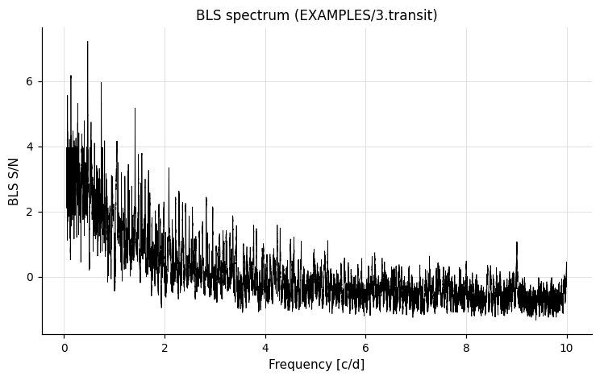

The output `*.bls.model` file contains the phased data and the best-fit trapezoidal transit model — together they look like:

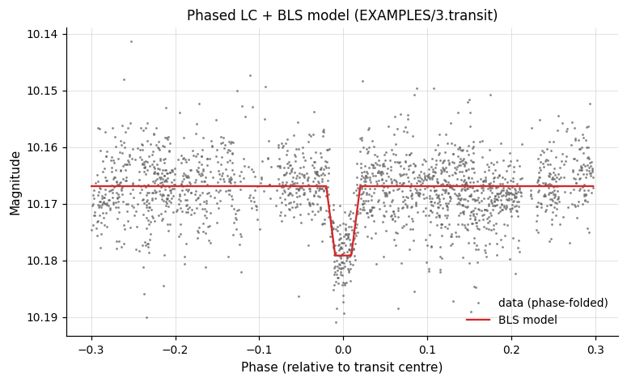

---

### `-BLSFixPer` — BLS at a Fixed Period

**Syntax**
```
-BLSFixPer
    < "aov" | "ls" | "list" ["column" col]
      | "fix" period | "fixcolumn" <colname | colnum>
      | "expr" expr >
    < "r" rmin rmax | "q" qmin qmax >
    nbins timezone omodel [model_outdir] correctlc ["fittrap"]
    ["maskpoints" maskvar]
```

**Description**

Run BLS at a single fixed period, searching only for the most transit-like signal at that period. Useful as a second pass after a full BLS or LS period search.

Python equivalent: [`BLSFixPer`](../python/commands/period-finding.md#blsfixper-bls-at-a-fixed-period).

**Parameters**

| Parameter | Description |
|-----------|-------------|
| Period source | `"aov"` (last `-aov`), `"ls"` (last `-LS`), `"list"`, `"fix" period`, `"fixcolumn"`, or `"expr"`. |
| `"r" rmin rmax` / `"q" qmin qmax` | Transit duration range (stellar radius bounds or fractional duration bounds). |
| `nbins` | Number of phase bins. |
| `timezone` | UTC offset for single-night fraction calculation. |
| `omodel` | `1` to output the model to `model_outdir` (suffix: `.blsfixper.model`). |
| `correctlc` | `1` to subtract the model from the light curve. |
| `"fittrap"` | Fit a trapezoid transit at the BLS peak. |
| `"maskpoints" maskvar` | Exclude points with `maskvar ≤ 0`. |

**References**

Cite [Kovács, Zucker & Mazeh 2002](https://ui.adsabs.harvard.edu/abs/2002A%26A...391..369K/abstract), A&A, 391, 369.

**Examples**

**Example 1.** Fit a box-shaped (with trapezoid fitting) transit model at a fixed period of 2.12345 days, scanning fractional durations 0.01–0.1 with 200 phase bins, and compute RMS before and after subtracting the transit.

```bash
vartools -i EXAMPLES/3.transit -ascii -oneline \
    -rms \
    -BLSFixPer fix 2.12345 q 0.01 0.1 200 0 0 1 fittrap \
    -rms
```

Output:
```
Name                             = EXAMPLES/3.transit
Mean_Mag_0                       =  10.16727
RMS_0                            =   0.00542
Expected_RMS_0                   =   0.00104
Npoints_0                        =  3417
BLSFixPer_Period_1               =  2.12345000
BLSFixPer_Tc_1                   = 53727.29676321477
BLSFixPer_SR_1                   =   0.00238
BLSFixPer_Depth_1                =   0.01189
BLSFixPer_Qtran_1                =   0.03626
BLSFixPer_Qingress_1             =   0.20623
BLSFixPer_OOTmag_1               =  10.16687
BLSFixPer_i1_1                   =   0.98158
BLSFixPer_i2_1                   =   1.01785
BLSFixPer_deltaChi2_1            = -24228.56603
BLSFixPer_fraconenight_1         =   0.43366
BLSFixPer_Npointsintransit_1     =   166
BLSFixPer_Ntransits_1            =     4
BLSFixPer_Npointsbeforetransit_1 =   129
BLSFixPer_Npointsaftertransit_1  =   144
BLSFixPer_Rednoise_1             =   0.00151
BLSFixPer_Whitenoise_1           =   0.00489
BLSFixPer_SignaltoPinknoise_1    =  14.08946
BLSFixPer_deltaChi2_invtransit_1 = -2934.30109
BLSFixPer_MeanMag_1              =  10.16740
Mean_Mag_2                       =  10.16678
RMS_2                            =   0.00489
Expected_RMS_2                   =   0.00104
Npoints_2                        =  3417
```

---

### `-BLSFixDurTc` — BLS with Fixed Transit Duration and Epoch

**Syntax**
```
-BLSFixDurTc
    <"duration" <"fix" dur | "var" varname | "expr" expression
        | "fixcolumn" <colname | colnum>
        | "list" ["column" col]>>
    <"Tc" <"fix" Tc | "var" varname | "expr" expression
        | "fixcolumn" <colname | colnum>
        | "list" ["column" col]>>
    ["fixdepth" <"fix" depth | "var" varname | "expr" expression
        | "fixcolumn" <colname | colnum>
        | "list" ["column" col]>
        ["qgress" <"fix" qgress | "var" varname | "expr" expression
            | "fixcolumn" <colname | colnum>
            | "list" ["column" col]>]]
    <"var" minpvar | "expr" minpexpr | minper>
    <"var" maxpvar | "expr" maxpexpr | maxper>
    <"var" nfvar | "expr" nfexpr | nfreq> timezone
    Npeak outperiodogram [outdir] omodel [model_outdir]
    correctlc ["fittrap"]
    ["ophcurve" outdir phmin phmax phstep]
    ["ojdcurve" outdir jdstep] ["maskpoints" maskvar]
```

**Description**

Run BLS with the transit duration and a reference epoch fixed. The period is still searched over a grid from `minper` to `maxper`. Optionally the transit depth and ingress fraction (`qgress`) can be fixed as well. For `qgress`: `0` = box-shaped transit; `0.5` = V-shaped (grazing) transit.

Python equivalent: [`BLSFixDurTc`](../python/commands/period-finding.md#blsfixdurtc-bls-with-fixed-transit-duration-and-epoch).

**Parameters**

| Parameter | Description |
|-----------|-------------|
| `"duration"` | Transit duration. Source: `"fix"` (command line), `"fixcolumn"`, or `"list"`. |
| `"Tc"` | Reference transit epoch. Same source options as `"duration"`. |
| `"fixdepth"` | Optionally fix the transit depth. |
| `"qgress"` | Optionally fix the ingress fraction. |
| `minper` / `maxper` / `nfreq` | Period range and number of trial frequencies. |
| All others | Same as `-BLS`. |

**Examples**

**Example 1.** Run a BLS search on `EXAMPLES/3.transit` fixing the transit duration to `0.076996297` days and the transit epoch to `53727.29676321477`. Search periods between 0.1 and 20 days using 100,000 frequency steps. The time-zone is set to 0 (only affects the `BLSFixPer_fraconenight` statistic). The periodogram and model are not output, but the best-fit model is subtracted from the light curve before passing it to the next command. The `fittrap` keyword fits a trapezoidal transit. The two `-rms` calls show how subtracting the BLS model reduces the scatter.

```bash
vartools -i EXAMPLES/3.transit -oneline \
    -rms \
    -BLSFixDurTc duration fix 0.076996297 \
        Tc fix 53727.29676321477 0.1 20. 100000 \
        0 1 0 0 1 fittrap \
    -rms
```

**References**

Cite [Kovács, Zucker & Mazeh 2002](https://ui.adsabs.harvard.edu/abs/2002A%26A...391..369K/abstract), A&A, 391, 369.

---

### `-BLSFixPerDurTc` — BLS with Fixed Period, Duration, and Epoch

**Syntax**
```
-BLSFixPerDurTc
    <"period" <"fix" per | "var" varname | "expr" expression
        | "fixcolumn" <colname | colnum>
        | "list" ["column" col]>>
    <"duration" <"fix" dur | "var" varname | "expr" expression
        | "fixcolumn" <colname | colnum>
        | "list" ["column" col]>>
    <"Tc" <"fix" Tc | "var" varname | "expr" expression
        | "fixcolumn" <colname | colnum>
        | "list" ["column" col]>>
    ["fixdepth" <"fix" depth | "var" varname | "expr" expression
        | "fixcolumn" <colname | colnum>
        | "list" ["column" col]>
        ["qgress" <"fix" qgress | "var" varname | "expr" expression
            | "fixcolumn" <colname | colnum>
            | "list" ["column" col]>]]
    timezone omodel [model_outdir]
    correctlc ["fittrap"]
    ["ophcurve" outdir phmin phmax phstep]
    ["ojdcurve" outdir jdstep] ["maskpoints" maskvar]
```

**Description**

Run BLS with the period, transit duration, and reference epoch all fixed. Only the phase of the transit (within a single period) is searched. All options are similar to `-BLSFixDurTc`, except the period is also specified.

Python equivalent: [`BLSFixPerDurTc`](../python/commands/period-finding.md#blsfixperdurtc-bls-with-fixed-period-duration-and-epoch).

**Examples**

**Example 1.** Fit a box-shaped transit to `EXAMPLES/3.transit` at a fixed period of 2.12345 days, with the duration fixed at `0.076996297` days and the transit epoch at `53727.29676321477`. The model is subtracted from the light curve and passed to the next command. The `fittrap` keyword fits a trapezoidal transit. The two `-rms` calls show how subtracting the BLS model reduces the scatter.

```bash
vartools -i EXAMPLES/3.transit -oneline \
    -rms \
    -BLSFixPerDurTc period fix 2.12345 \
        duration fix 0.076996297 \
        Tc fix 53727.29676321477 \
        0 0 1 fittrap \
    -rms
```

**References**

Cite [Kovács, Zucker & Mazeh 2002](https://ui.adsabs.harvard.edu/abs/2002A%26A...391..369K/abstract), A&A, 391, 369.

---

### `-dftclean` — DFT Power Spectrum + CLEAN

**Syntax**
```
-dftclean <"var" nbvar | "expr" nbexpr | nbeam>
    ["maxfreq" <"var" mfvar | "expr" mfexpr | maxf>]
    ["outdspec" dspec_outdir]
    ["finddirtypeaks" Npeaks ["clip" <"var" cvar | "expr" cexpr | clip>
    clipiter]]
    ["outwfunc" wfunc_outdir]
    ["clean" <"var" gvar | "expr" gexpr | gain> <"var" snvar | "expr" snexpr |
    SNlimit>
        ["outcbeam" cbeam_outdir]
    ["outcspec" cspec_outdir]
    ["findcleanpeaks" Npeaks ["clip" <"var" cvar | "expr" cexpr | clip>
    clipiter]]]
    ["useampspec"] ["verboseout"] ["maskpoints" maskvar]
```

**Description**

Compute the Discrete Fourier Transform (DFT) power spectrum of the light curve using the FDFT algorithm ([Kurtz 1985](https://ui.adsabs.harvard.edu/abs/1985MNRAS.213..773K/abstract)) and optionally deconvolve it with the CLEAN algorithm ([Roberts, Lehar & Dreher 1987](https://ui.adsabs.harvard.edu/abs/1987AJ.....93..968R/abstract)) to remove aliasing due to the window function.

Python equivalent: [`dftclean`](../python/commands/period-finding.md#dftclean-dft-power-spectrum-clean).

**Parameters**

| Parameter | Description |
|-----------|-------------|
| `nbeam` | Number of frequency samples per `1/T` frequency element (`T` = light curve baseline). Controls the spectral resolution. |
| `"maxfreq" maxf` | Maximum frequency (cycles/day). Default: `1 / (2 · min_time_separation)` (Nyquist). |
| `"outdspec" dspec_outdir` | Write the dirty (uncleaned) power spectrum to `dspec_outdir/$basename.dftclean.dspec`. |
| `"finddirtypeaks" Npeaks` | Find the top `Npeaks` peaks in the dirty spectrum. |
| `"outwfunc" wfunc_outdir` | Write the window function to `wfunc_outdir/$basename.dftclean.wfunc`. |
| `"clean" gain SNlimit` | Apply the CLEAN algorithm. `gain` ∈ [0.1, 1.0] (smaller = slower convergence, more thorough); iterations continue until the highest remaining peak is below `SNlimit` × noise. |
| `"outcbeam" cbeam_outdir` | Write the clean beam to `cbeam_outdir/$basename.dftclean.cbeam`. |
| `"outcspec" cspec_outdir` | Write the clean power spectrum to `cspec_outdir/$basename.dftclean.cspec`. |
| `"findcleanpeaks" Npeaks` | Find the top `Npeaks` peaks in the clean spectrum. |
| `"clip" clip clipiter` | Clipping parameters for peak SNR calculation (default: iterative 5σ). |
| `"useampspec"` | Compute SNR on the amplitude spectrum instead of the power spectrum. |
| `"verboseout"` | Include the mean and standard deviation of the spectrum before and after clipping in the output. |
| `"maskpoints" maskvar` | Exclude points with `maskvar ≤ 0`. |

**References**

Cite [Kurtz 1985](https://ui.adsabs.harvard.edu/abs/1985MNRAS.213..773K/abstract), MNRAS, 213, 773 for the FDFT algorithm. Cite [Roberts, Lehar & Dreher 1987](https://ui.adsabs.harvard.edu/abs/1987AJ.....93..968R/abstract), AJ, 93, 968 for the CLEAN algorithm.

**Examples**

**Example 1.** Compute the DFT power spectrum of a light curve up to 10 cycles/day, find the top dirty-spectrum peak using iterative 5σ clipping.

```bash
vartools -i EXAMPLES/2 -oneline -ascii \
    -dftclean 4 maxfreq 10. outdspec EXAMPLES/OUTDIR1 \
        finddirtypeaks 1 clip 5. 1
```

Output:
```
Name                         = EXAMPLES/2
DFTCLEAN_DSPEC_PEAK_FREQ_0_0 =     0.81189711
DFTCLEAN_DSPEC_PEAK_POW_0_0  = 0.000687634
DFTCLEAN_DSPEC_PEAK_SNR_0_0  =   59.8532
```

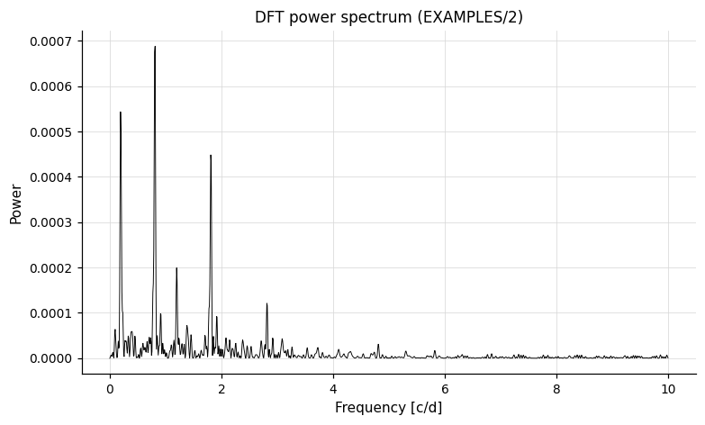

**Example 2.** Inject three harmonic signals into a light curve, compute the DFT, find the top 3 dirty-spectrum peaks, then apply the CLEAN algorithm and find the top 3 clean-spectrum peaks.

```bash
vartools -i EXAMPLES/4 -oneline -ascii \
    -Injectharm fix 0.697516 0 ampfix 0.1 phaserand 0 0 \
    -Injectharm fix 2.123456 0 ampfix 0.05 phaserand 0 0 \
    -Injectharm fix 0.426515 0 ampfix 0.01 phaserand 0 0 \
    -dftclean 4 maxfreq 10. outdspec EXAMPLES/OUTDIR1 \
        finddirtypeaks 3 clip 5. 1 \
        outwfunc EXAMPLES/OUTDIR1 \
        clean 0.5 5.0 outcbeam EXAMPLES/OUTDIR1 \
        outcspec EXAMPLES/OUTDIR1 \
        findcleanpeaks 3 clip 5. 1 \
        verboseout
```

The dirty spectrum, the spectrum after CLEAN deconvolution, the CLEAN beam, and the window function are written to `EXAMPLES/OUTDIR1/`:

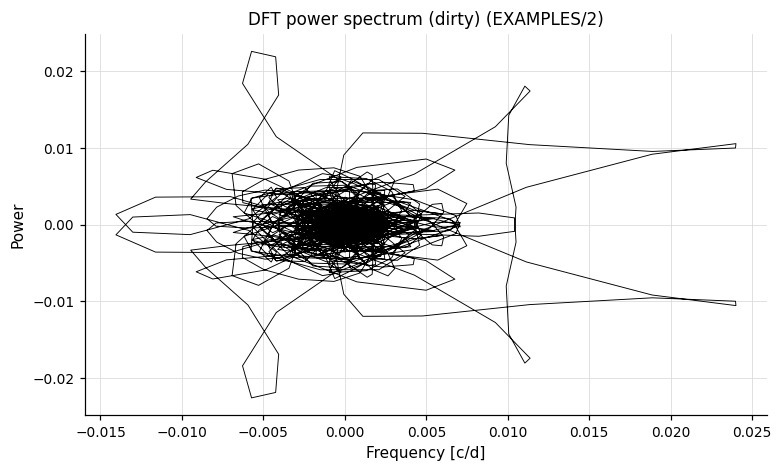
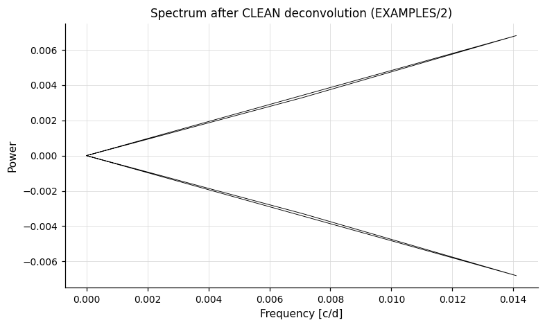
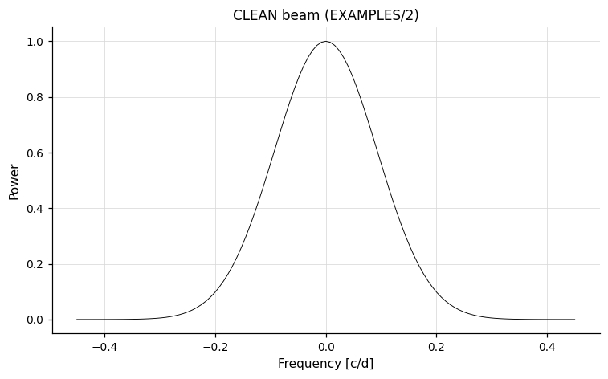
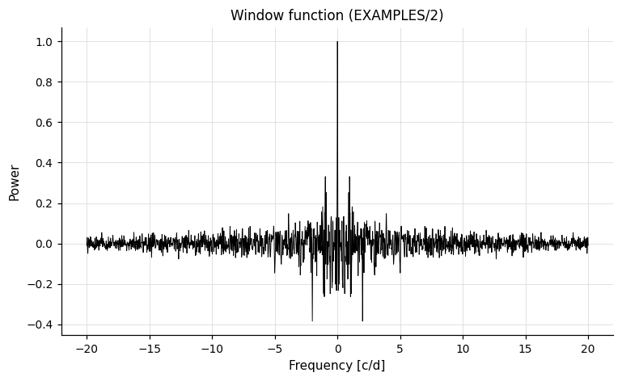

---

### `-wwz` — Weighted Wavelet Z-Transform

**Syntax**
```
-wwz <"maxfreq" <"auto" | "var" v | "expr" e | maxfreq>>
    <"freqsamp" <"var" v | "expr" e | freqsamp>>
    <"tau0" <"auto" | "var" v | "expr" e | tau0>>
    <"tau1" <"auto" | "var" v | "expr" e | tau1>>
    <"dtau" <"auto" | "var" v | "expr" e | dtau>>
    ["c" <"var" v | "expr" e | cval>]
    ["outfulltransform" outdir ["fits" | "pm3d"] ["format" format]]
    ["outmaxtransform" outdir ["format" format]]
    ["maskpoints" maskvar]
```

**Description**

Compute the Weighted Wavelet Z-Transform (WWZ) as defined by [Foster (1996)](https://ui.adsabs.harvard.edu/abs/1996AJ....112.1709F/abstract) using an abbreviated Morlet wavelet:

```
f(z) = exp(i·2π·f·(t-τ) - c·(2π·f)²·(t-τ)²)
```

The transform is computed for all combinations of trial frequency (up to `maxfreq`) and time shift (`tau0` to `tau1` in steps of `dtau`). This yields a time-frequency map of the signal power that is especially useful for non-stationary signals.

The decay constant `c` (default: `1/(8π²)`) controls the trade-off between time and frequency resolution.

Python equivalent: [`wwz`](../python/commands/period-finding.md#wwz-weighted-wavelet-z-transform).

**Parameters**

| Parameter | Description |
|-----------|-------------|
| `"maxfreq" auto/val` | Maximum frequency in cycles/day. `"auto"` = `1 / (2 · min_time_separation)`. |
| `"freqsamp" freqsamp` | Frequency sampling as a multiple of `1/T`. |
| `"tau0" auto/val` | Start time for the time-shift scan. `"auto"` = minimum time in the light curve. |
| `"tau1" auto/val` | End time for the time-shift scan. `"auto"` = maximum time in the light curve. |
| `"dtau" auto/val` | Step size in time shift. `"auto"` = minimum time separation. |
| `"c" cval` | Morlet wavelet decay constant (default: `1/(8π²)`). |
| `"outfulltransform" outdir` | Write the full 2D transform (time-shift × frequency) to `outdir/$basename.wwz`. Add `"fits"` for multi-extension FITS, or `"pm3d"` for gnuplot pm3d-compatible text format. |
| `"outmaxtransform" outdir` | Write the transform maximized over frequencies as a function of time-shift to `outdir/$basename.mwwz`. |
| `"format" format` | Override the default filename convention (same syntax as `-o "nameformat"`). |
| `"maskpoints" maskvar` | Exclude points with `maskvar ≤ 0`. |

**Output columns**

| Column | Description |
|--------|-------------|
| `WWZ_maxZ_i` | Maximum value of the Z-transform over all time-shifts and frequencies. |
| `WWZ_maxfreq_i` | Frequency corresponding to the maximum Z. |
| `WWZ_maxpower_i` | Power at the maximum Z. |
| `WWZ_maxamp_i` | Amplitude at the maximum Z. |
| `WWZ_maxNeff_i` | Effective number of data points at the maximum Z. |
| `WWZ_maxtau_i` | Time shift at the maximum Z. |
| `WWZ_maxmeanmag_i` | Local mean magnitude at the maximum Z. |
| `WWZ_medZ_i` | Median over time-shifts of the maximum-Z frequency's Z value. |
| (and corresponding `med*` columns for the other quantities) | |

**References**

Cite [Foster 1996](https://ui.adsabs.harvard.edu/abs/1996AJ....112.1709F/abstract), AJ, 112, 1709.

**Examples**

**Example 1.** Compute the WWZ for `EXAMPLES/8`, scanning frequencies between 0 and 2.0 cycles per day at a step of 0.25/T (where T is the difference between the last and first observation times). Time-shifts run from the first observation to the last (`tau0` and `tau1` both `auto`) in steps of 0.1 days. The full 2-D transform is written to `EXAMPLES/OUTDIR1/8.wwz` in gnuplot `pm3d` format; the maximum-Z projection over frequency is written to `EXAMPLES/OUTDIR1/8.mwwz`. A significant periodic signal is seen near time 53735.17392 at a frequency of 0.30645 cyc/day, which is not present near the beginning or end of the time series.

```bash
vartools -i EXAMPLES/8 -oneline \
    -wwz maxfreq 2.0 freqsamp 0.25 tau0 auto tau1 auto dtau 0.1 \
        outfulltransform EXAMPLES/OUTDIR1/ pm3d \
        outmaxtransform EXAMPLES/OUTDIR1
```

A heat-map of the full transform can be generated in gnuplot with:

```
gnuplot> set pm3d map
gnuplot> unset key
gnuplot> splot "EXAMPLES/OUTDIR1/8.wwz" u 1:2:3
```

Or directly with matplotlib:

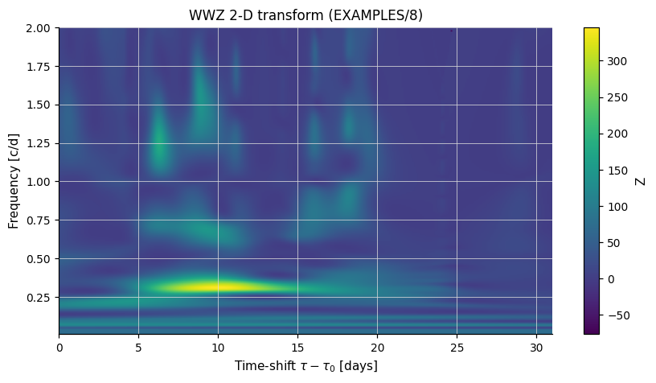

The transient ~0.3 cyc/day signal is clearly visible only between days 5–20 of the series.

---

### `-GetLSAmpThresh` — Minimum Detectable Amplitude

**Syntax**
```
-GetLSAmpThresh
    < "ls" | "list" ["column" col] > minp thresh
    < "harm" Nharm Nsubharm | "file" listfile >
    ["noGLS"]
```

**Description**

Determine the minimum peak-to-peak amplitude that a signal at a given period must have to be detected by a Lomb-Scargle search with `-ln(FAP) > thresh`. The signal shape is either a Fourier series or read from a file. The threshold is computed by scaling the signal template until the LS statistic reaches the detection limit.

Python equivalent: [`GetLSAmpThresh`](../python/commands/period-finding.md#getlsampthresh-minimum-detectable-amplitude).

**Parameters**

| Parameter | Description |
|-----------|-------------|
| `"ls"` | Use the period from the most recent `-LS` command. |
| `"list"` | Read the period from the input list (optional `"column"` keyword). |
| `minp` | Minimum period that would be searched (sets the FAP scale). |
| `thresh` | Desired `-ln(FAP)` detection threshold. |
| `"harm" Nharm Nsubharm` | Describe the signal shape as a Fourier series with `Nharm` harmonics and `Nsubharm` sub-harmonics. The series is fit to the light curve at the specified period. |
| `"file" listfile` | Two-column file: `signal_file signal_amp`, one row per light curve. Each `signal_file` provides the signal magnitude in column 3; `signal_amp` is the peak-to-peak amplitude of that signal. |
| `"noGLS"` | Compute the threshold for the traditional (non-generalized) LS periodogram. |

**Output columns**

| Column | Description |
|--------|-------------|
| `GetLSAmpThresh_minfactor_i` | Minimum factor by which the current signal must be scaled to remain detectable. |
| `GetLSAmpThresh_minamp_i` | Corresponding minimum peak-to-peak amplitude (magnitudes). |

**Examples**

**Example 1.** Run LS to find the best period, extract the sinusoidal signal with `-harmonicfilter`, then compute the minimum detectable amplitude at that period given a threshold of `-ln(FAP) > 100`.

```bash
vartools -i EXAMPLES/2 -oneline \
    -LS 0.1 10. 0.1 1 0 \
    -harmonicfilter ls 0 0 0 fitonly \
    -GetLSAmpThresh ls 0.1 -100 harm 0 0
```

Output:
```
Name                                       = EXAMPLES/2
LS_Period_1_0                              =     1.23440877
Log10_LS_Prob_1_0                          = -4000.59209
LS_Periodogram_Value_1_0                   =    0.99619
LS_SNR_1_0                                 =   45.98308
HarmonicFilter_Mean_Mag_1                  =  10.12217
HarmonicFilter_Period_1_1                  =     1.23440877
HarmonicFilter_Per1_Fundamental_Sincoeff_1 =   0.05008
HarmonicFilter_Per1_Fundamental_Coscoeff_1 =  -0.00222
HarmonicFilter_Per1_Amplitude_1            =   0.10026
LS_AmplitudeScaleFactor_2                  =   0.02425
LS_MinimumAmplitude_2                      =   0.00243
```

