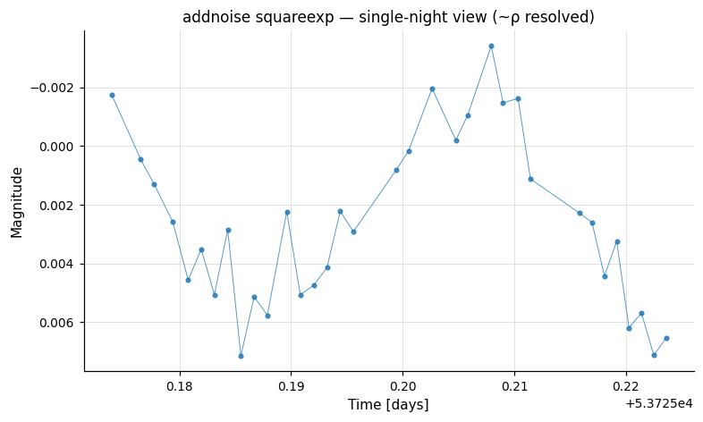

# Simulation

Commands for injecting signals and noise into light curves, and for replicating light curves to support Monte Carlo experiments.

---

## `-addnoise`

```
-addnoise
    <   "white"
            <"sig_white" <"fix" val | "var" varname | "expr" expression
                | "list" ["column" col]>>
      | "squareexp"
            <"rho" <"fix" val | "var" varname | "expr" expression
                | "list" ["column" col]>>
            <"sig_red" <"fix" val | "var" varname | "expr" expression
                | "list" ["column" col]>>
            <"sig_white" <"fix" val | "var" varname | "expr" expression
                | "list" ["column" col]>>
            ["bintime" <"fix" val | "var" varname | "expr" expression
                | "list" ["column" col]>]
      | "exp"
            <"rho" <"fix" val | "var" varname | "expr" expression
                | "list" ["column" col]>>
            <"sig_red" <"fix" val | "var" varname | "expr" expression
                | "list" ["column" col]>>
            <"sig_white" <"fix" val | "var" varname | "expr" expression
                | "list" ["column" col]>>
            ["bintime" <"fix" val | "var" varname | "expr" expression
                | "list" ["column" col]>]
      | "matern"
            <"nu" <"fix" val | "var" varname | "expr" expression
                | "list" ["column" col]>>
            <"rho" <"fix" val | "var" varname | "expr" expression
                | "list" ["column" col]>>
            <"sig_red" <"fix" val | "var" varname | "expr" expression
                | "list" ["column" col]>>
            <"sig_white" <"fix" val | "var" varname | "expr" expression
                | "list" ["column" col]>>
            ["bintime" <"fix" val | "var" varname | "expr" expression
                | "list" ["column" col]>]
      | "wavelet"
            <"gamma" <"fix" val | "var" varname | "expr" expression
                | "list" ["column" col]>>
            <"sig_red" <"fix" val | "var" varname | "expr" expression
                | "list" ["column" col]>>
            <"sig_white" <"fix" val | "var" varname | "expr" expression
                | "list" ["column" col]>>
    >
```

Add time-correlated Gaussian noise to the light curve. The user must choose one of five covariance models.

For every numerical parameter, supply the value using one of:

- `"fix" val` — Fixed value for all light curves.
- `"var" varname` — Read the value from a named per-star variable.
- `"expr" expression` — Evaluate an analytic expression per light curve.
- `"list" ["column" col]` — Read the value from the input light curve list. By default the next available column is used; use `"column" col` to specify explicitly.

Python equivalent: [`addnoise`](../python/commands/simulation.md#addnoise-add-synthetic-noise).

### Noise models

#### `"white"` — Pure white (uncorrelated) noise

Adds independent Gaussian noise with standard deviation `sig_white` to each point.

| Parameter | Description |
|-----------|-------------|
| `sig_white` | Standard deviation of the white noise |

#### `"squareexp"` — Squared-exponential Gaussian process

Covariance between times *t_i* and *t_j*:

```
C(t_i, t_j) = sig_white² * δ_ij + sig_red² * exp(-(t_i-t_j)² / (2*rho²))
```

Both `rho` and `sig_red` must be greater than zero.

| Parameter | Description |
|-----------|-------------|
| `rho` | Correlation timescale |
| `sig_red` | Amplitude of the correlated (red noise) component |
| `sig_white` | Amplitude of the uncorrelated (white noise) component |
| `"bintime"` | Optional. Chunk the light curve into bins of this duration (same units as time) before simulating correlated noise in each bin independently. Substantially speeds up simulations when the light curve duration is much longer than `rho`. |

#### `"exp"` — Exponentially decaying Gaussian process

Covariance:

```
C(t_i, t_j) = sig_white² * δ_ij + sig_red² * exp(-|t_i-t_j| / rho)
```

Parameters and `"bintime"` option are the same as for `"squareexp"`.

#### `"matern"` — Matérn Gaussian process

Covariance:

```
C(t_i, t_j) = sig_white² * δ_ij + sig_red² * C(nu, x) * K_nu(x)
```

where `x = sqrt(2*nu) * |t_i-t_j| / rho`, `C(x,y) = (2^(1-x)/Gamma(x)) * y^x`, and `K_nu` is the modified Bessel function of the second kind. When `nu → ∞` the Matérn covariance converges to the squared-exponential; when `nu = 0.5` it equals the exponential covariance.

| Parameter | Description |
|-----------|-------------|
| `nu` | Shape parameter (must be > 0) |
| `rho` | Correlation timescale (must be > 0) |
| `sig_red` | Amplitude of the correlated component (must be > 0) |
| `sig_white` | Amplitude of the uncorrelated component |
| `"bintime"` | Optional binning acceleration (see `"squareexp"`) |

#### `"wavelet"` — 1/f^γ red noise + white noise

Generates noise as the sum of a red-noise component with power-spectral density proportional to `1/f^gamma` (γ must satisfy `-1 < gamma < 1`) with standard deviation `sig_red`, and an uncorrelated white-noise component with standard deviation `sig_white`. The red-noise is generated using the wavelet method of McCoy and Walden (1996).

| Parameter | Description |
|-----------|-------------|
| `gamma` | Power-law index for the red noise PSD; must satisfy `-1 < gamma < 1` |
| `sig_red` | Standard deviation of the red noise component |
| `sig_white` | Standard deviation of the white noise component |

**Examples**

**Example 1.** Simulate a light curve with time-correlated noise using the wavelet model. The red-noise component has power spectral density proportional to 1/f^0.99 and standard deviation 0.005; the white-noise component also has standard deviation 0.005.

```bash
gawk '{print $1, 0., 0.005}' EXAMPLES/1 | \
  vartools -i - -header -randseed 1 \
  -addnoise wavelet gamma fix 0.99 sig_red fix 0.005 sig_white fix 0.005 \
  -o EXAMPLES/OUTDIR1/noisesim.txt
```


**Example 2.** Same as above, using a squared-exponential model for the red-noise component with a correlation timescale of 0.01 days and standard deviation 0.005 mag. An additional white-noise component is included with standard deviation 0.001.

```bash
gawk '{print $1, 0., 0.005}' EXAMPLES/1 | \
  vartools -i - -header -randseed 1 \
  -addnoise squareexp rho fix 0.01 sig_red fix 0.005 sig_white fix 0.001 \
  -o EXAMPLES/OUTDIR1/noisesim.txt
```


A single-night zoom shows the 0.01-d red-noise correlation timescale being resolved at the per-point cadence:



---

## `-Injectharm`

```
-Injectharm <"list" ["column" col] | "fix" per
    | "var" varname | "expr" expression
    | "rand" <"var" v | "expr" e | minp> <"var" v | "expr" e | maxp>
    | "logrand" <"var" v | "expr" e | minp> <"var" v | "expr" e | maxp>
    | "randfreq" <"var" v | "expr" e | minf> <"var" v | "expr" e | maxf>
    | "lograndfreq" <"var" v | "expr" e | minf> <"var" v | "expr" e | maxf>>
    Nharm (<"amplist" ["column" col]
    | "ampfix" amp | "ampvar" varname | "ampexpr" expression
    | "amprand" minamp maxamp
    | "amplogrand" minamp maxamp> ["amprel"]
    <"phaselist" ["column" col]
    | "phasefix" phase | "phasevar" varname | "phaseexpr" expression
    | "phaserand"> ["phaserel"])0...Nharm Nsubharm
    (<"amplist" ["column" col] | "ampfix" amp
    | "ampvar" varname | "ampexpr" expression
    | "amprand" minamp maxamp
    | "amplogrand" minamp maxamp> ["amprel"]
    <"phaselist" ["column" col]
    | "phasefix" phase | "phasevar" varname | "phaseexpr" expression
    | "phaserand"> ["phaserel"])1...Nsubharm
    omodel [modeloutdir]
```

Add a harmonic (Fourier) series signal to the light curve. The injected signal has the form:

```
A_1*cos(2*π*(t/P + φ_1))
    + sum_{k=2}^{Nharm+1} A_k*cos(2*π*(t*k/P + φ_k))
    + sum_{k=2}^{Nsubharm+1} A_k*cos(2*π*(t/k/P + φ_k))
```

Python equivalent: [`Injectharm`](../python/commands/simulation.md#injectharm-inject-a-harmonic-signal).

**Period source**

| Keyword | Description |
|---------|-------------|
| `"list" ["column" col]` | Read from the input list |
| `"fix" per` | Fixed period for all light curves |
| `"rand" minp maxp` | Uniform random period in `[minp, maxp]` |
| `"logrand" minp maxp` | Uniform random period in log space |
| `"randfreq" minf maxf` | Uniform random frequency |
| `"lograndfreq" minf maxf` | Uniform random frequency in log space |

**Harmonic specification**

For each of the `Nharm+1` harmonics (fundamental = harmonic 1) and `Nsubharm` sub-harmonics, specify the amplitude and phase:

**Amplitude keywords**

| Keyword | Description |
|---------|-------------|
| `"amplist" ["column" col]` | Read from input list |
| `"ampfix" amp` | Fixed amplitude |
| `"amprand" minamp maxamp` | Uniform random amplitude |
| `"amplogrand" minamp maxamp` | Uniform log-random amplitude |
| `"amprel"` | Treat the specified amplitude as a ratio relative to the fundamental amplitude `A_k/A_1` |

**Phase keywords**

| Keyword | Description |
|---------|-------------|
| `"phaselist" ["column" col]` | Read from input list |
| `"phasefix" phase` | Fixed phase at `t=0` |
| `"phaserand"` | Uniform random phase in `[0, 1)` |
| `"phaserel"` | Treat the phase as relative to the fundamental: `φ_k1 = φ_k - k*φ_1` |

**Output**

- `omodel` — `1` to write the model light curve to `modeloutdir`. Output suffix: `.injectharm.model`.

**Examples**

**Example 1.** Inject a sinusoid into `EXAMPLES/3` and then search for it with `-LS`. We adopt a random period between 1.0 and 5.0 days, 0 harmonic overtones (only the fundamental), a uniform-log amplitude distribution between 0.01 and 0.1, and a random phase. No sub-harmonics. The model is written to `EXAMPLES/OUTDIR1/3.injectharm.model`. `-randseed 1` makes the run reproducible (use `-randseed time` for a fresh draw).

```bash
vartools -i EXAMPLES/3 -randseed 1 -oneline \
    -Injectharm rand 1.0 5.0 \
        0 amplogrand 0.01 0.1 phaserand \
        0 1 EXAMPLES/OUTDIR1 \
    -LS 0.1 10.0 0.1 1 0
```


**Example 2.** Inject an RR-Lyrae-shaped signal into `EXAMPLES/4` (with the fundamental amplitude varying across 10 trial values) and recover it with `-LS` and `-aov_harm`. The initial `gawk` command builds a 10-row list, each row giving the LC name and the fundamental amplitude. The 10 fixed amplitude/phase pairs that follow define the higher-order harmonic structure of the RR-Lyrae shape (see `vartools -example -Killharm` for how these coefficients are determined). `-parallel 4` processes up to four light curves simultaneously — output row order is arbitrary in parallel mode.

```bash
echo EXAMPLES/4 | \
    gawk '{amp = 0.25; \
        for(i=1; i <= 10; i += 1) { \
            print $1, amp; amp = amp*0.5; \
        }}' | \
    vartools -l - -header -numbercolumns -parallel 4 \
    -Injectharm fix 0.514333 10 \
        amplist column 2 phaserand \
        ampfix 0.47077 amprel phasefix 0.60826 phaserel \
        ampfix 0.35916 amprel phasefix 0.26249 phaserel \
        ampfix 0.23631 amprel phasefix -0.06843 phaserel \
        ampfix 0.16353 amprel phasefix 0.60682 phaserel \
        ampfix 0.10621 amprel phasefix 0.28738 phaserel \
        ampfix 0.06203 amprel phasefix 0.95751 phaserel \
        ampfix 0.03602 amprel phasefix 0.58867 phaserel \
        ampfix 0.02900 amprel phasefix 0.22322 phaserel \
        ampfix 0.01750 amprel phasefix 0.94258 phaserel \
        ampfix 0.00768 amprel phasefix 0.66560 phaserel \
        0 0 \
    -LS 0.1 10.0 0.01 2 0 \
    -aov_harm 2 0.1 10.0 0.1 0.01 2 0
```

The phased RR-Lyrae LC at the highest fundamental amplitude (0.25 mag) and at a lower amplitude (0.001 mag, comparable to the photometric noise floor):


---

## `-Injecttransit`

```
-Injecttransit <"Plist" ["column" col] | "Pfix" per
        | "Pvar" varname | "Pexpr" expr
        | "Prand" <"var" v | "expr" e | minp> <"var" v | "expr" e | maxp>
        | "Plogrand" <"var" v | "expr" e | minp> <"var" v | "expr" e | maxp>
        | "randfreq" <"var" v | "expr" e | minf> <"var" v | "expr" e | maxf>
        | "lograndfreq" <"var" v | "expr" e | minf> <"var" v | "expr" e | maxf>>
    <"Rplist" ["column" col] | "Rpfix" Rp | "Rpvar" varname | "Rpexpr" expr
        | "Rprand" <"var" v | "expr" e | minRp> <"var" v | "expr" e | maxRp>
        | "Rplogrand" <"var" v | "expr" e | minRp> <"var" v | "expr" e | maxRp>>
    <"Mplist" ["column" col] | "Mpfix" Mp | "Mpvar" varname | "Mpexpr" expr
        | "Mprand" <"var" v | "expr" e | minMp> <"var" v | "expr" e | maxMp>
        | "Mplogrand" <"var" v | "expr" e | minMp> <"var" v | "expr" e | maxMp>>
    <"phaselist" ["column" col] | "phasefix" phase
        | "phasevar" varname | "phasexpr" expr | "phaserand">
    <"sinilist" ["column" col] | "sinifix" sin_i
        | "sinivar" varname | "siniexpr" expr | "sinirand">
    <"eomega" <"elist" ["column" col] | "efix" e | "evar" varname
        | "eexpr" expr | "erand">
        <"olist" ["column" col] | "ofix" omega | "ovar" varname
        | "oexpr" expr | "orand">
    | "hk" <"hlist" ["column" col] | "hfix" h | "hvar" varname
        | "hexpr" expr | "hrand">
        <"klist" ["column" col] | "kfix" k | "kvar" varname
        | "kexpr" expr | "krand">>
    <"Mstarlist" ["column" col] | "Mstarfix" Mstar | "Mstarvar" varname
        | "Mstarexpr" expr>
    <"Rstarlist" ["column" col] | "Rstarfix" Rstar | "Rstarvar" varname
        | "Rstarexpr" expr>
    <"quad" | "nonlin">
        <"ldlist" ["column" col] | "ldfix" ld1 ... ldn
        | "ldvar" ld1 ... ldn | "ldexpr" ld1 ... ldn>
    ["dilute" <"list" ["column" col] | "fix" dilute | "expr" diluteexpr>]
    omodel [modeloutdir]
```

Add a Mandel-Agol limb-darkened transit signal to the light curve.

Python equivalent: [`Injecttransit`](../python/commands/simulation.md#injecttransit-inject-a-transit-signal).

**Parameters**

For each physical parameter, the source of the value must be specified. The keyword prefix determines the source:

| Prefix suffix | Description |
|---------------|-------------|
| `*list ["column" col]` | Read from the input light curve list |
| `*fix value` | Fixed value for all light curves |
| `*expr expr` | Analytic expression evaluated per light curve |
| `*rand min max` | Uniform random value in `[min, max]` |
| `*logrand min max` | Uniform log-random value |

**Physical parameters**

| Parameter | Units | Description |
|-----------|-------|-------------|
| `P` | days | Orbital period (or frequency in 1/day via `randfreq`/`lograndfreq`) |
| `Rp` | Jupiter radii | Planet radius |
| `Mp` | Jupiter masses | Planet mass (used to compute semi-major axis) |
| `phase` | — | Phase of transit center at `T=0`; `phase=0` corresponds to mid-transit |
| `sini` | — | Sine of the orbital inclination. Use `"sinirand"` to draw from a uniform orientation distribution constrained to produce a transit |
| `e`, `omega` | —, degrees | Eccentricity and argument of periastron (use `"eomega"` keyword group) |
| `h`, `k` | — | Alternatively specify `h = e*sin(omega)` and `k = e*cos(omega)` (use `"hk"` keyword group) |
| `Mstar` | solar masses | Stellar mass |
| `Rstar` | solar radii | Stellar radius |

**Limb darkening**

- `"quad"` — Quadratic limb darkening; 2 coefficients required.
- `"nonlin"` — Non-linear (Claret) limb darkening; 4 coefficients required.

**Dilution**

- `"dilute"` — Optional dilution factor (flux fraction from the target). Reduces the transit depth by this factor.

**Output**

- `omodel` — `1` to write the model light curve to `modeloutdir`. Suffix: `.injecttransit.model`.

**Examples**

**Example 1.** Inject a transit into `EXAMPLES/3` and recover it with `-BLS`. The period is drawn from a uniform-log random distribution in frequency between 0.2 and 2.0 cycles/day. Planet radius and mass are fixed at 1.0 R_J and 1.0 M_J. The phase is drawn uniformly; `sin i` is drawn from a random orientation distribution restricted to inclinations that produce a transit. Eccentricity and argument of periastron are zero, stellar mass and radius are 1.0 M_sun and 1.0 R_sun, and a quadratic limb-darkening law is used with coefficients 0.3471 and 0.3180. The model is written to `EXAMPLES/OUTDIR1/3.injecttransit.model`.

```bash
vartools -i EXAMPLES/3 -oneline -randseed 1 \
    -Injecttransit lograndfreq 0.2 2.0 \
        Rpfix 1.0 Mpfix 1.0 \
        phaserand sinirand \
        eomega efix 0. ofix 0. \
        Mstarfix 1.0 Rstarfix 1.0 \
        quad ldfix 0.3471 0.3180 \
        1 EXAMPLES/OUTDIR1 \
    -BLS q 0.01 0.1 0.5 5.0 20000 200 7 1 0 1 EXAMPLES/OUTDIR1 \
        1 fittrap
```


---

## `-copylc`

**Syntax**
```
-copylc
    Ncopies
```

**Description**

Replicate the current light curve `Ncopies` times in memory. Each copy is processed independently by all subsequent VARTOOLS commands. Data from commands preceding `-copylc` is replicated in the output table for each copy. Each copy has the suffix `_copy$copycommandnum.$copynum` appended to its name, where `$copycommandnum` is the index of the `-copylc` command and `$copynum` runs from `0` to `Ncopies - 1`.

Python equivalent: [`copylc`](../python/commands/simulation.md#copylc-duplicate-the-light-curve-in-memory).

**Parameters**

| Parameter | Description |
|-----------|-------------|
| `Ncopies` | Number of copies to create. |

!!! note
    `-copylc` cannot be used together with the `-readall` option.

**Examples**

**Example 1.** Calculate the `-LS` periodogram for `EXAMPLES/2`, then make 100 copies of the light curve with the magnitudes replaced by Gaussian random noise, and run `-LS` on each simulation. This is how one would carry out a Monte Carlo simulation for a light curve sampling to determine, for example, a bandwidth correction to the false-alarm probability. In practice one would want to run substantially more than 100 simulations.

```bash
vartools -i EXAMPLES/2 -LS 0.1 10. 0.1 1 0 \
    -copylc 100 \
    -expr 'mag=err*gauss()' \
    -LS 0.1 10. 0.1 1 0 \
    -header
```
