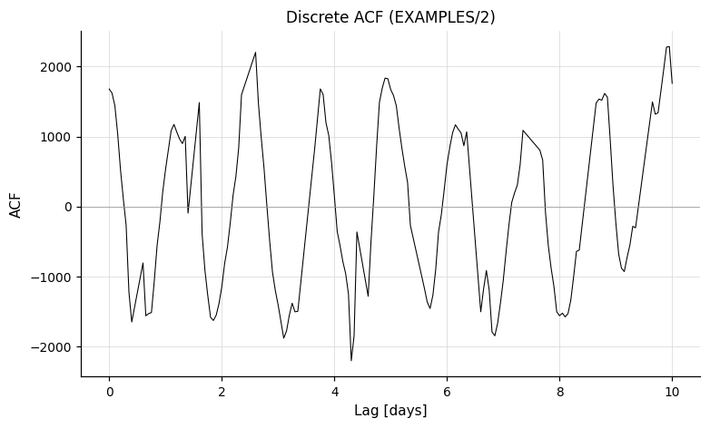

# Statistics

Commands for computing variability and scatter statistics on light curves.

---

## `-rms`

```
-rms
    ["maskpoints" maskvar]
```

Calculate the RMS of the light curves. The output includes the RMS, the mean magnitude, the expected RMS (derived from the formal photometric uncertainties), and the number of points in the light curve.

Python equivalent: [`rms`](../python/commands/statistics.md#rms-root-mean-square).

**Parameters**

- `"maskpoints" maskvar` — Optional. Only points with `maskvar > 0` are included in the calculation; all others are excluded.

**Examples**

**Example 1.** Calculate the mean magnitude, RMS, and expected RMS based on the formal magnitude uncertainties for all light curves in a list file.

```bash
vartools -l EXAMPLES/lc_list -header -rms
```

Output:
```
#Name Mean_Mag_0 RMS_0 Expected_RMS_0 Npoints_0
EXAMPLES/1   ...
EXAMPLES/2   ...
...EXAMPLES/10  ...
```

---

## `-rmsbin`

```
-rmsbin
    Nbin bintime1...bintimeN
    ["maskpoints" maskvar]
```

Calculate the RMS after applying a moving mean filter to the light curves. Similar to [`-chi2bin`](statistics.md#-chi2bin), this measures the correlated (red) noise component by binning on specified timescales. `Nbin` filters are applied, each producing a separate RMS estimate. The note that light curves passed to the next command are **unchanged** by this command.

Python equivalent: [`rmsbin`](../python/commands/statistics.md#rmsbin-binned-rms).

**Parameters**

- `Nbin` — Number of time bins (filters) to apply.
- `bintime1...bintimeN` — Half-widths of each moving mean filter, in **minutes**. The full filter window for filter *i* is `2.0 * bintimei`.
- `"maskpoints" maskvar` — Optional. Only points with `maskvar > 0` are included.

**Examples**

**Example 1.** Apply moving-mean filters to the light curves and compute statistical measures for each filter. The filters operate by replacing each point in the light curve with the mean of all points that are within the specified number of minutes of that point. This example uses five time-window filters (5.0, 10.0, 60.0, 1440.0, and 14400.0 minutes). The output table displays computed RMS values alongside expected RMS values assuming white noise for each binning window. As the filtering window increases, RMS values generally decrease.

```bash
vartools -l EXAMPLES/lc_list -header -rmsbin 5 5.0 10.0 60.0 1440.0 14400.0
```

---

## `-chi2`

```
-chi2
    ["maskpoints" maskvar]
```

Calculate chi-squared per degree of freedom (χ²/dof) for the light curves. The output includes χ²/dof and the error-weighted mean magnitude.

Python equivalent: [`chi2`](../python/commands/statistics.md#chi2-chi-squared-statistic).

**Parameters**

- `"maskpoints" maskvar` — Optional. Only points with `maskvar > 0` are included.

**Examples**

**Example 1.** Calculate chi-squared per degree of freedom and the weighted mean magnitude for all light curves in a list.

```bash
vartools -header -l EXAMPLES/lc_list -chi2
```

Output:
```
#Name Chi2_0 Weighted_Mean_Mag_0
EXAMPLES/1  34711.71793  10.24430
EXAMPLES/2   1709.50065  10.11178
EXAMPLES/3     27.06322  10.16684
EXAMPLES/4      5.19874  10.35137
EXAMPLES/5      8.26418  10.43932
EXAMPLES/6      3.94650  10.52748
EXAMPLES/7     10.39941  10.56951
EXAMPLES/8      4.19887  10.61132
EXAMPLES/9      2.67020  10.73129
EXAMPLES/10      3.72218  10.87763
```

---

## `-chi2bin`

```
-chi2bin
    Nbin bintime1...bintimeNbin
    ["maskpoints" maskvar]
```

Calculate χ²/dof after applying a moving mean filter to the light curves. As with `-rmsbin`, the light curves passed to the next command are unchanged. `Nbin` filters are used, producing `Nbin` separate estimates of χ²/dof and the error-weighted mean.

Python equivalent: [`chi2bin`](../python/commands/statistics.md#chi2bin-binned-chi-squared).

**Parameters**

- `Nbin` — Number of filters.
- `bintime1...bintimeNbin` — Half-widths of the moving mean filters, in **minutes**. The full window for filter *i* is `2.0 * bintimei`.
- `"maskpoints" maskvar` — Optional. Only points with `maskvar > 0` are included.

**Examples**

**Example 1.** Apply moving-mean filters to light curves and calculate chi-squared per degree of freedom along with the weighted mean magnitude for each filter. This example uses 5 filters with durations of 5.0, 10.0, 60.0, 1440.0, and 14400.0 minutes. As formal errors decrease according to white noise expectations, chi-squared values increase with larger filter sizes when red noise is present.

```bash
vartools -l EXAMPLES/lc_list -header -chi2bin 5 5.0 10.0 60.0 1440.0 14400.0
```

---

## `-stats`

```
-stats
    var1,var2,... stats1,stats2,...
    ["maskpoints" maskvar]
```

Compute one or more general statistics on one or more light-curve vectors (e.g., `t`, `mag`, `err`, or any user-defined variable). Every requested statistic is computed for every listed variable.

Python equivalent: [`stats`](../python/commands/statistics.md#stats-generic-statistics).

**Parameters**

- `var1,var2,...` — Comma-separated list of variable names to compute statistics on.
- `stats1,stats2,...` — Comma-separated list of statistics to compute. Every statistic is computed for every variable.
- `"maskpoints" maskvar` — Optional. Only points with `maskvar > 0` are used in the calculations.

**Available statistics strings**

| String | Description |
|--------|-------------|
| `mean` | Arithmetic mean |
| `weightedmean` | Mean weighted by 1/σ² |
| `median` | Median |
| `wmedian` | Median weighted by light curve uncertainties |
| `stddev` | Standard deviation with respect to the mean |
| `meddev` | Standard deviation with respect to the median |
| `medmeddev` | Median of the absolute deviations from the median |
| `MAD` | 1.483 × medmeddev. Equals stddev for a Gaussian distribution in the large-N limit |
| `kurtosis` | Kurtosis |
| `skewness` | Skewness |
| `pct%f` | The %f-th percentile, where %f is a floating point number between 0 and 100 (e.g., `pct25`) |
| `wpct%f` | Percentile including light curve uncertainties as weights |
| `max` | Maximum value (equivalent to `pct100`) |
| `min` | Minimum value (equivalent to `pct0`) |
| `sum` | Sum of all elements in the vector |

**Example**

```bash
vartools -l EXAMPLES/lc_list -stats mag,err mean,stddev,MAD
```

**Examples**

**Example 1.** Calculate various statistical measures for light curve magnitudes and magnitudes after adding Gaussian noise. The `-expr` parameter defines a new variable with noise added, while `-stats` specifies which variables and statistics to compute. Percentile statistics (`pct##`) represent the specified percentile values.

```bash
vartools -i EXAMPLES/3 \
    -oneline \
    -expr 'mag2=mag+0.01*gauss()' \
    -stats mag,mag2 \
        mean,weightedmean,median,stddev,meddev,medmeddev,MAD,kurtosis,skewness,pct10,pct20,pct80,pct90,max,min,sum
```

---

## `-alarm`

**Syntax**
```
-alarm
    ["maskpoints" maskvar]
```

**Description**

Calculate the alarm variability statistic for each light curve. This statistic is designed to detect time-correlated variability — long runs of consecutive positive or negative residuals are penalised more heavily than randomly distributed deviations of the same RMS, making the alarm sensitive to coherent signals that other low-order moments may miss.

Python equivalent: [`alarm`](../python/commands/statistics.md#alarm-alarm-statistic).

**Parameters**

| Parameter | Description |
|-----------|-------------|
| `"maskpoints" maskvar` | Optional. Only points with `maskvar > 0` contribute. |

**Output columns**: `Alarm_N`.

**References**

Cite [Tamuz, Mazeh, and North 2006](https://ui.adsabs.harvard.edu/abs/2006MNRAS.367.1521T/abstract), MNRAS, 367, 1521.

**Examples**

**Example 1.** Compute the alarm statistic for `EXAMPLES/2`.

```bash
vartools -i EXAMPLES/2 -header -alarm
```

---

## `-Jstet`

```
-Jstet
    timescale <"skipnormalize" | dates> ["maskpoints" maskvar]
```

Calculate Stetson's J statistic, L statistic, and the kurtosis for each light curve. The J statistic measures time-correlated variability by comparing pairs of observations that are close in time.

Python equivalent: [`Jstet`](../python/commands/statistics.md#jstet-stetson-j-statistic).

**Parameters**

- `timescale` — Time in minutes that distinguishes between "near" (correlated) and "far" (uncorrelated) observation pairs.
- The second positional argument selects the normalisation. It is **either**
  - `dates` — file containing JDs for *every possible observation* in the survey, in the first column. `weight_max` is computed once from that schedule, and the reported J is `J_stetson * (sum_w_actual / weight_max)` — a multiplier that downweights LCs missing observations relative to the full schedule. Useful within a single survey; misleading across surveys with different cadences. (This is the vartools historical default and differs from Stetson's original definition.)
  - **or** the literal keyword `"skipnormalize"` — skip the rescaling and report Stetson's original `J` and `L = J * Kurtosis`. Use this when comparing across surveys, or when you want the textbook definition.
- `"maskpoints" maskvar` — Optional. Only points with `maskvar > 0` are included.

**Citation:** [Stetson, P.B. 1996](https://ui.adsabs.harvard.edu/abs/1996PASP..108..851S/abstract), PASP, 108, 851.

**Examples**

**Example 1.** Calculate Stetson's J statistic, L statistic, and kurtosis for all light curves in a list, using 0.5 days to distinguish between "near" and "far" observations.

```bash
vartools -l EXAMPLES/lc_list -header \
    -Jstet 0.5 EXAMPLES/dates_tfa
```

Output:
```
#Name Jstet_0 Kurtosis_0 Lstet_0
EXAMPLES/1  98.13279   0.96779  94.97154
EXAMPLES/2  30.19309   0.94719  28.59852
EXAMPLES/3   0.65597   0.92816   0.60885
EXAMPLES/4   0.34402   0.84500   0.29070
EXAMPLES/5   0.58730   0.92120   0.54102
EXAMPLES/6   0.34455   0.93794   0.32317
EXAMPLES/7   0.41754   0.92501   0.38623
EXAMPLES/8   0.46381   0.96124   0.44583
EXAMPLES/9   0.22075   0.80997   0.17880
EXAMPLES/10   0.25784   0.92806   0.23929
```

**Example 2.** Same calculation, but report Stetson's original `J` / `L` (no `sum_w / weight_max` rescaling).

```bash
vartools -l EXAMPLES/lc_list -header \
    -Jstet 0.5 skipnormalize
```

The values are larger than in Example 1 because they aren't downscaled by the `sum_w / weight_max < 1` survey-completeness factor.

---

## `-autocorrelation`

```
-autocorrelation
    start stop step outdir ["maskpoints" maskvar]
```

Calculate the discrete auto-correlation function ([Edelson and Krolik 1988](https://ui.adsabs.harvard.edu/abs/1988ApJ...333..646E/abstract), ApJ, 333, 646) for each light curve. The results are written to files in `outdir` with the suffix `.autocorr` (i.e., `outdir/$basename.autocorr`).

Python equivalent: [`autocorrelation`](../python/commands/statistics.md#autocorrelation-autocorrelation-function).

!!! note "Cross-reference"
    For period-finding using autocorrelation-based methods, see the [Period Finding](period-finding.md) page.

**Parameters**

- `start` — Start time for sampling the autocorrelation, in days.
- `stop` — Stop time for sampling the autocorrelation, in days.
- `step` — Step size for sampling, in days.
- `outdir` — Directory where output `.autocorr` files are written.
- `"maskpoints" maskvar` — Optional. Only points with `maskvar > 0` are included.

**Notes**

Rather than using the variance in the denominator (as in the Edelson and Krolik formula), the formal uncertainty is used. This avoids imaginary numbers when measurement errors are overestimated. To use the variance in the denominator instead, issue `-changeerror` before calling this command.

Due to binning, when the variance is used in the denominator the autocorrelation function may be smaller than 1 unless the time step is less than the minimum time difference between consecutive measurements.

**Citation:** [Edelson, R.A. & Krolik, J.H. 1988](https://ui.adsabs.harvard.edu/abs/1988ApJ...333..646E/abstract), ApJ, 333, 646.

**Examples**

**Example 1.** Compute the discrete auto-correlation function (DACF) of a single light curve spanning time lags from 0 to 10.0 days with a step of 0.05 days. Output is written to `EXAMPLES/OUTDIR1/2.autocorr`.

```bash
vartools -i EXAMPLES/2 -header \
    -autocorrelation 0.0 10. 0.05 EXAMPLES/OUTDIR1
```

Output:
```
#Name
EXAMPLES/2
```



---

## `-vonNeumann`

**Syntax**
```
-vonNeumann
    ["weighted"]
    ["maskpoints" maskvar]
```

**Description**

Calculate the von Neumann (1941) ratio `η = δ² / s²` for each light curve, where `δ² = (1/(N−1)) · Σᵢ (yᵢ₊₁ − yᵢ)²` is the mean-square successive difference and `s² = (1/N) · Σᵢ (yᵢ − ȳ)²` is the variance. For uncorrelated Gaussian noise `E[η] = 2` (variance ≈ 4/N); smoothly varying (positively correlated) signals drive η well below 2, and anti-correlated (alternating) signals push η above 2. Widely used as a variability indicator for sparse and unevenly sampled photometric time series.

The statistic is order-dependent — the light curve is time-sorted automatically before the calculation (the parser sets `require_sort = 1`).

Python equivalent: [`vonNeumann`](../python/commands/statistics.md#vonneumann-von-neumann-ratio).

**Parameters**

| Parameter | Description |
|-----------|-------------|
| `"weighted"` | Optional. Switch to the inverse-variance-weighted form: per-point weights `wᵢ = 1/σᵢ²` enter the variance and pairwise weights `w_pair_i = 1/(σᵢ² + σᵢ₊₁²)` enter the mean-square successive difference. The weighted ratio is computed as `η_w = (2N/(N−1)) · Σᵢ w_pair_i (yᵢ₊₁ − yᵢ)² / Σᵢ wᵢ (yᵢ − ȳ_w)²`; the `2N/(N−1)` prefactor restores `E[η_w] = 2` for white noise regardless of the σ distribution (a raw ratio-of-weighted-averages instead converges to `⟨w⟩/⟨w_pair⟩`, which equals 2 only for homoscedastic errors). For homoscedastic σ the weighted form reduces exactly to the unweighted form. Points with NaN magnitude (or NaN / non-positive uncertainty when weighted) are dropped. |
| `"maskpoints" maskvar` | Optional. Only points with `maskvar > 0` are included. |

The trailing keyword block is parsed in strict order (`weighted` before `maskpoints`); mis-ordering or duplicating keywords produces a command-syntax error.

**Output columns**: `VonNeumann_Ratio_N`.

**References**

Cite [von Neumann, J. 1941](https://www.jstor.org/stable/2235951), Annals of Mathematical Statistics, 12, 367; for astronomical applications see [Sokolovsky, K. V., et al. 2017](https://ui.adsabs.harvard.edu/abs/2017MNRAS.464..274S/abstract), MNRAS, 464, 274.

**Examples**

**Example 1.** Unweighted η for a strongly periodic light curve (η ≪ 2 indicates strong sample-to-sample correlation).

```bash
vartools -i EXAMPLES/2 -oneline -vonNeumann
```

**Example 2.** Inverse-variance-weighted form.

```bash
vartools -i EXAMPLES/2 -oneline -vonNeumann weighted
```

**Example 3.** Weighted η with a mask restricting the calculation to the first 30 days of the LC.

```bash
vartools -i EXAMPLES/2 -oneline \
    -expr 'mask=((t-t[0])<30)' \
    -vonNeumann weighted maskpoints mask
```


## `-percentileratios`

**Syntax**
```
-percentileratios
    ["percentilepairs" p1:q1,p2:q2,...,pN:qN]
    ["maskpoints" maskvar]
```

**Description**

Compute robust scatter statistics from the magnitude distribution. For each pair of percentiles `(p, q)` with `0 < p < q < 100`, two statistics are emitted per light curve:

```
amp_p_q  = pct(q) - pct(p)
asym_p_q = (pct(q) - median) / (median - pct(p))
```

plus one additional statistic that does not depend on the pair list:

```
medmeddev_over_stddev = median(|x - median(x)|) / stddev(x)
```

For any symmetric distribution the `asym` statistics tend to `1.0`; positively-skewed distributions (heavy upper tail) produce `asym > 1` and negatively-skewed distributions produce `asym < 1`. For independent Gaussian noise `medmeddev/stddev` tends to `0.6745` in the large-N limit, with smaller values indicating heavier tails and larger values indicating lighter tails or significant outliers.

Percentile interpolation matches the [`-stats`](#stats) command (the same `percentile()` helper in `statistics.c`), so values are directly comparable to the corresponding `pct(p)` columns from `-stats`. NaN magnitudes are dropped before any statistic is computed; light curves with fewer than two finite magnitudes, and ratios with a zero denominator (e.g. `median == pct(p)`, or `stddev == 0`), produce NaN outputs.

When the `maskpoints` keyword is given, the median, the stddev, the MAD, and all percentile statistics are computed only over points with `maskvar > 0`. The mask filter is applied alongside NaN rejection, before any statistic is computed.

Python equivalent: [`percentileratios`](../python/commands/statistics.md#percentileratios-robust-scatter-ratios).

**Parameters**

| Parameter | Description |
|-----------|-------------|
| `"percentilepairs" p1:q1,p2:q2,...` | Optional. Comma-separated list of percentile pairs to use in place of the defaults `5:95,1:99`. Each pair must satisfy `0 < p, q < 100` and `p != q`; pairs given with `p > q` are silently canonicalized to `p < q`; duplicate pairs (after canonicalization) are rejected at parse time. Floating-point percentiles are accepted (e.g. `2.5:97.5`). |
| `"maskpoints" maskvar` | Optional. Name of a light-curve vector; only points with `maskvar > 0` are included in the calculation. The trailing keywords are parsed in strict order: `percentilepairs` must come before `maskpoints`. |

**Output columns**

| Column | Meaning |
|--------|---------|
| `PERCENTILERATIOS_amp_PCTp_PCTq_N` | `pct(q) - pct(p)` for pair `(p, q)`. |
| `PERCENTILERATIOS_asym_PCTp_PCTq_N` | `(pct(q) - median) / (median - pct(p))` for pair `(p, q)`. |
| `PERCENTILERATIOS_medmeddev_over_stddev_N` | `median(|x - median(x)|) / stddev(x)`. |

The `p` and `q` values are formatted with two decimal places in the column names (e.g. `PCT5.00`, `PCT97.50`), following the `-stats` convention. When referencing these columns as variables in `-expr`, replace `.` with `_` (e.g. `PERCENTILERATIOS_amp_PCT5_00_PCT95_00_N`); this substitution is handled by vartools' identifier parser.

**Examples**

**Example 1.** Defaults (`5:95` and `1:99` pairs) on EXAMPLES/2.

```bash
vartools -i EXAMPLES/2 -oneline -percentileratios
```

**Example 2.** Custom pairs with a mix of integer and floating-point percentiles. The `95:5` entry is canonicalized to `5:95` before column names are emitted.

```bash
vartools -i EXAMPLES/2 -oneline \
    -percentileratios percentilepairs 10:90,20:80,2.5:97.5,95:5
```

**Example 3.** A synthetic Gaussian LC: `asym_p_q ≈ 1` for any symmetric distribution and `medmeddev_over_stddev ≈ 0.6745` for independent Gaussian noise.

```bash
vartools -i EXAMPLES/2 -oneline \
    -expr 'mag=gauss()' \
    -percentileratios
```


## `-beyondNsigma`

**Syntax**
```
-beyondNsigma
    ["Nvalues" N1,N2,...,Nk]
    ["useMAD"]
    ["maskpoints" maskvar]
```

**Description**

For each light curve, compute the fraction of magnitudes that lie more than `N*sigma` above the median and the fraction that lie more than `N*sigma` below the median, for a user-supplied list of `N` values:

```
frac_above_N = #{ x : x > median + N*sigma } / N_rej
frac_below_N = #{ x : x < median - N*sigma } / N_rej
```

where `N_rej` is the number of finite magnitudes after NaN rejection. Comparisons are strict (`>` and `<`).

By default `sigma` is the sample standard deviation. When the `useMAD` keyword is given, `sigma` is taken to be `1.483 * median(|x - median(x)|)` instead — the Gaussian-consistent calibration of the MAD. The MAD-based scale is robust to heavy tails or outliers: outliers inflate the stddev and widen the `N*sigma` threshold, masking themselves, while the MAD reflects the bulk's scale and the same thresholds correctly flag the outliers.

The `N=1` instance of this statistic corresponds to the `Beyond1Std` feature of [Nun et al. 2015](https://arxiv.org/abs/1506.00010) (the FATS package for variable-star feature engineering), generalized here to an arbitrary list of `N` values and to a choice of stddev or MAD scale.

NaN magnitudes are dropped before any statistic is computed; light curves with fewer than two finite magnitudes produce NaN outputs. When `sigma == 0` (degenerate distribution in which every magnitude equals the median) the fractions are reported as zero, since no point strictly exceeds a zero threshold.

When the `maskpoints` keyword is given, the median, sigma, threshold counts, and the `N_rej` denominator are all computed only over points with `maskvar > 0`. The mask filter is applied alongside NaN rejection, before any statistic is computed.

Python equivalent: [`beyondNsigma`](../python/commands/statistics.md#beyondnsigma-fraction-beyond-n-sigma).

**Parameters**

| Parameter | Description |
|-----------|-------------|
| `"Nvalues" N1,N2,...,Nk` | Optional. Comma-separated list of `N` values to evaluate, replacing the defaults `1,3,5`. Each value must satisfy `N > 0`; duplicates are rejected at parse time. Floating-point values are accepted (e.g. `Nvalues 1.5,2.5,4.0`). |
| `"useMAD"` | Optional. If given, use `1.483 * MAD` as the scale instead of the sample standard deviation. |
| `"maskpoints" maskvar` | Optional. Name of a light-curve vector; only points with `maskvar > 0` are included in the calculation. |

The trailing keywords are parsed in strict order: `Nvalues`, then `useMAD`, then `maskpoints`.

**Output columns**

| Column | Meaning |
|--------|---------|
| `BEYONDNSIGMA_frac_above_NX.XX_M` | Fraction of magnitudes with `x > median + N*sigma`. |
| `BEYONDNSIGMA_frac_below_NX.XX_M` | Fraction of magnitudes with `x < median - N*sigma`. |

`X.XX` is the `N` value formatted with two decimal places (e.g. `N1.00`, `N2.50`) and `M` is the 0-indexed command position in the pipeline. When referencing these columns as variables in `-expr`, replace `.` with `_` (e.g. `BEYONDNSIGMA_frac_above_N1_00_M`); this substitution is handled by vartools' identifier parser.

**Examples**

**Example 1.** Defaults (`N = 1, 3, 5`) on EXAMPLES/2.

```bash
vartools -i EXAMPLES/2 -oneline -beyondNsigma
```

**Example 2.** Custom floating-point N values with the MAD-based scale, more robust to heavy tails or outliers than the stddev-based default.

```bash
vartools -i EXAMPLES/2 -oneline \
    -beyondNsigma Nvalues 0.5,1.0,1.5 useMAD
```

**Example 3.** A synthetic Gaussian LC. For independent Gaussian noise, `frac_above_N1.00 ≈ frac_below_N1.00 ≈ 0.1587` (one-tailed `1 - Phi(1)`) and `frac_above_N3.00 ≈ frac_below_N3.00 ≈ 0.00135`.

```bash
vartools -i EXAMPLES/2 -oneline \
    -expr 'mag=gauss()' \
    -beyondNsigma
```
