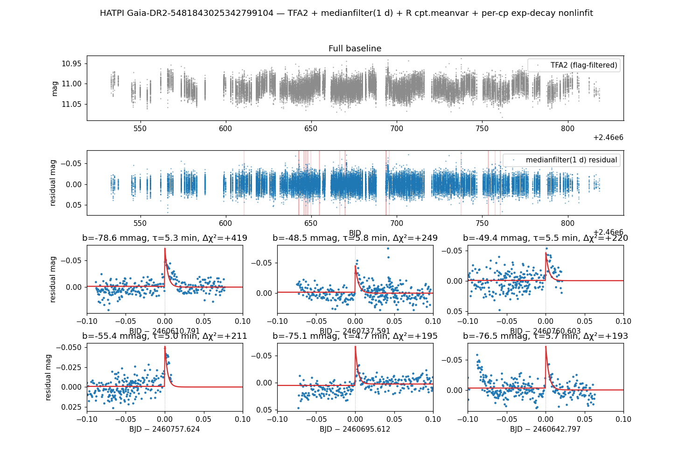

# HATPI flare detection with R changepoint analysis

Find stellar flares on a long-baseline HATPI light curve by running R's
[`changepoint`](https://cran.r-project.org/package=changepoint) package
inline inside a vartools pipeline, and then fitting an exponential-decay
model to each candidate via `-nonlinfit`.

The example uses the bundled HATPI subphot light curve
`EXAMPLES/Gaia-DR2-5481843025342799104_subphot.fits` — a 285-day
single-source FITS binary table for the M dwarf star TIC 150359500 =
Gaia DR2 5481843025342799104, which shows ~30 d rotational
variability, and a number of flare events.  The same pipeline can also
be applied to other HATPI light curves.

## Prerequisites

- vartools built with R support (`./configure --with-RHOME=/path/to/R`).
- R packages: `changepoint` v2.3+ (`install.packages("changepoint")`).

The HATPI `FLAG2` is a binary integer flag that is used to remove problematic data. A bitwise AND operation with the bit mask `0b111101 = 61` selects
all points to filter out.

## Pipeline overview

```text
read FITS  →  filter on FLAG2  →  high-pass at 1 d  →  R cpt.meanvar(BinSeg, Q=N)
                                                           │
              for each k = 1..N (changepoint slot):       ▼
                                  if !isnan(cp_t_k):
                                      flare_mask_k = |t - cp_t_k| < 0.5 d
                                      chi2_pre_k   = Σ(mag − mean)²/err²    over mask
                                      nonlinfit  amoeba  flare-decay model  fitmask=flare_mask_k
                                  fi
```

1. **Read FITS** with the standard HATPI column names; declare `flag` as
   an `int` LC vector via `LCColumn(col="FLAG2", type="int")` so the
   bitwise expression below has integer semantics.
2. **`-restricttimes expr "(flag & 61) == 0"`** drops flagged points.
   *Watch the parentheses* — The unparenthesised form `flag & 61 == 0` parses as
   `flag & (61 == 0) = flag & 0 = 0`, which filters out every observation.
3. **`-medianfilter time=1.0`** subtracts a 1-day running median, removing
   the slowly-evolving spot rotation while preserving short-duration
   events (flares).  This is high-pass mode (default); `replace=True`
   would give the low-pass form.
4. **`-R cpt.meanvar(PELT, manual penalty)` + top-N brightening filter
   in R** finds the changepoints in the high-passed magnitude series
   and emits the top `N=30` *brightenings* (cp_dmag<0) ranked by
   |cp_dmag|.  We use PELT because it is globally optimal in the
   number of changepoints (BinSeg is greedy and silently misses small
   events that lie in the middle of changepoints it has already chosen).  We
   use `penalty="Manual", pen.value=20` to select small-amplitude flares
   above the Gaussian noise floor without producing thousands
   of false positive changepoints; the R-side ranking step then keeps only the most
   significant brightenings, so we always run a fixed
   number of fits regardless of how many changepoints the algorithm chose.
   Each kept changepoint is returned as a scalar pair
   `(cp_t_k, cp_dmag_k)`, NA-padded if fewer than `N` survived.
5. **Per-candidate exp-decay fit** — for each `k=1..N`, an
   `if !isnan(cp_t_k)` block runs four commands inside it:
    - **`expr flare_mask_k = (abs(t - cp_t_k) < 0.1)`** — per-observation
      mask of points within ±0.1 d (±2.4 hr) of the changepoint.
    - **`expr chi2_pre_k = sum((mag − mean(mag,mask))² / err², mask)`** —
      pre-fit χ² of the masked window against its mean.  Provides the
      reference value for "how much does the exp-decay model help".
    - **`nonlinfit`** with the model
      `a*(t<t0) + (b*(t>=t0) * exp(−(t−t0)*(t>=t0)/c) + d)` and free
      parameters `(a, b, c, d, t0)`, initialised from the changepoint values
      and fit only on the masked points.  *Note the inner
      `(t>=t0)` factor multiplying `(t−t0)` inside the exponent* — that
      clamp keeps the exp argument finite for `t<t0` (otherwise
      `0 * exp(+∞) = NaN`, which freezes the
      Nelder-Mead simplex).
    - the closing `fi`.

The output table ends up with the changepoint summary plus, for each `k`, the
fitted parameters (`Nonlinfit_a_BestFit_*`, `_b_`, `_c_`, `_d_`,
`_t0_`), the post-fit χ² (`Nonlinfit_BestFit_Chi2_*`), and the pre-fit
χ² (`Expr_chi2_pre_k_*`).  A flare candidate is a changepoint where:

- **cp_dmag_k < 0** — the segment-mean dropped (star brightened), and
- **Δχ² = chi2_pre_k − chi2_post_k > 0** — the exp-decay model fits
  better than a constant baseline.

## Python

```python
import pyvartools as vt

PATH = "EXAMPLES/Gaia-DR2-5481843025342799104_subphot.fits"
N    = 30                      # max brightening cps to fit

# --- 1. R: detect cps with PELT, keep top-N brightenings by |cp_dmag| ---
R_CODE = f"N <- {N}L\n"
R_CODE += r"""
# PELT (globally optimal) with a moderately permissive manual penalty.
# A pen.value around 20 admits ~400 cps on a typical 285-day HATPI LC
# — most of those are noise-driven, but the ranking step below keeps
# only the strongest brightening signals.
cp <- cpt.meanvar(mag, method="PELT", penalty="Manual", pen.value=20)
allcps  <- cpts(cp)
mu      <- param.est(cp)$mean
alldmag <- mu[2:length(mu)] - mu[1:(length(mu)-1)]
# Brightening cps only (mag drop), sorted by |cp_dmag| descending.
brighten <- which(alldmag < 0)
ord      <- order(abs(alldmag[brighten]), decreasing=TRUE)
top      <- head(brighten[ord], N)
cps      <- allcps[top]
top_dmag <- alldmag[top]
# Time gap to the next cp in time order — rough segment duration,
# used as a smart initial value for the decay timescale c below.
top_dur <- numeric(length(top))
for (j in seq_along(top)) {
  i <- top[j]
  next_t <- if (i < length(allcps)) t[allcps[i+1]] else t[length(t)]
  top_dur[j] <- next_t - t[allcps[i]]
}
# Pre-compute the smart inits + steps that the per-cp nonlinfit's
# paramlist will reference by name (vartools' paramlist parser splits
# on ',' so we cannot use min(..,..) inline inside an init expression).
#   - b = 2*cp_dmag (segment-mean shift underestimates the peak),
#     b_step = 0.5 * |cp_dmag|.
#   - c = top_dur/4 clamped to [0.003, 0.025] d (~4-36 min),
#     c_step = top_dur/8 clamped to [0.0015, 0.0125] d.
top_b_init <- 2 * top_dmag
top_b_step <- 0.5 * abs(top_dmag)
top_c_init <- pmax(0.003,  pmin(0.025,  top_dur / 4))
top_c_step <- pmax(0.0015, pmin(0.0125, top_dur / 8))
n_cp <- length(cps)
pad_t      <- function(k) if (k <= n_cp) t[cps[k]]      else NA_real_
pad_dmag   <- function(k) if (k <= n_cp) top_dmag[k]    else NA_real_
pad_b_init <- function(k) if (k <= n_cp) top_b_init[k]  else NA_real_
pad_b_step <- function(k) if (k <= n_cp) top_b_step[k]  else NA_real_
pad_c_init <- function(k) if (k <= n_cp) top_c_init[k]  else NA_real_
pad_c_step <- function(k) if (k <= n_cp) top_c_step[k]  else NA_real_
n_cp_v <- as.numeric(n_cp)
"""
for k in range(1, N + 1):
    R_CODE += (
        f"cp_t_{k}      <- pad_t({k});      "
        f"cp_dmag_{k}   <- pad_dmag({k});\n"
        f"cp_b_init_{k} <- pad_b_init({k}); "
        f"cp_b_step_{k} <- pad_b_step({k});\n"
        f"cp_c_init_{k} <- pad_c_init({k}); "
        f"cp_c_step_{k} <- pad_c_step({k});\n"
    )

R_OUTVARS = ",".join(["n_cp_v"]
        + [f"cp_t_{k}"      for k in range(1, N + 1)]
        + [f"cp_dmag_{k}"   for k in range(1, N + 1)]
        + [f"cp_b_init_{k}" for k in range(1, N + 1)]
        + [f"cp_b_step_{k}" for k in range(1, N + 1)]
        + [f"cp_c_init_{k}" for k in range(1, N + 1)]
        + [f"cp_c_step_{k}" for k in range(1, N + 1)])

# --- 2. Build the pipeline ---
pipe = (vt.Pipeline()
        .restricttimes(mode="expr", expression="(flag & 61) == 0")
        .medianfilter(time=1.0, method="median", replace=False)  # high-pass
        .R(R_CODE,
           init="library(changepoint)",
           invars="t,mag",
           outvars=R_OUTVARS,
           outputcolumns=R_OUTVARS))

for k in range(1, N + 1):
    pipe = (pipe
        .ifcmd(condition=f"!isnan(cp_t_{k})")
        .expr(f"flare_mask_{k}=(abs(t-cp_t_{k})<0.1)")
        .expr(
            f"chi2_pre_{k}="
            f"sum(((mag-mean(mag,flare_mask_{k}>0.5))^2)/err^2,flare_mask_{k}>0.5)",
            vartype="listvar", outputcolumn=True)
        .nonlinfit(
            function="a*(t<t0) + (b*(t>=t0)*exp(-(t-t0)*(t>=t0)/c) + d)",
            # Smart inits:
            #   - b = 2 * cp_dmag (the segment-mean shift underestimates
            #     the peak amplitude since the segment averages over
            #     rise + decay); step = 0.5 * |cp_dmag|.
            #   - c = 1/4 of the time gap to the next cp in time order,
            #     clamped to [0.003, 0.025] d (~4 to 36 min); step = c/2.
            #   - t0 = cp_t, step 0.001 d (~90 sec).
            paramlist=(
                f"a=0:0.005,"
                f"b=cp_b_init_{k}:cp_b_step_{k},"
                f"c=cp_c_init_{k}:cp_c_step_{k},"
                f"d=0:0.005,"
                f"t0=cp_t_{k}:0.001"),
            optimizer="amoeba",
            amoeba_tolerance=1e-4, amoeba_maxsteps=10000,
            fitmask=f"flare_mask_{k}",
        )
        .ficmd())

result = pipe.run_file(PATH,
        columns={"t":    "TIME",
                 "mag":  "TFA2",
                 "err":  "ERR2",
                 "flag": vt.LCColumn(col="FLAG2", type="int")})

# --- 3. Filter changepoints that look like exponential brightenings ---
# Flare candidates: cp_dmag_k < 0 (mag dropped) AND
# dchi2 = chi2_pre_k - chi2_post_k > 0 (fit improved).
print("Flare candidates (cp_dmag<0 AND dchi2>0):")
for k in range(1, N + 1):
    cp_t = result.vars.get(f"R_cp_t_{k}_2", float("nan"))
    cp_d = result.vars.get(f"R_cp_dmag_{k}_2", float("nan"))
    if cp_t != cp_t:                           # NaN-skipped slot
        continue
    chi2_idx = 5 * k       # block layout: if/expr_mask/expr_chi2/nlf/fi
    nlf_idx  = 5 * k + 1
    chi2_pre  = result.vars.get(f"Expr_chi2_pre_{k}_{chi2_idx}", float("nan"))
    chi2_post = result.vars.get(f"Nonlinfit_BestFit_Chi2_{nlf_idx}", float("nan"))
    dchi2 = chi2_pre - chi2_post
    if cp_d < 0 and dchi2 > 0:
        b  = float(result.vars[f"Nonlinfit_b_BestFit_{nlf_idx}"])
        c  = float(result.vars[f"Nonlinfit_c_BestFit_{nlf_idx}"])
        t0 = float(result.vars[f"Nonlinfit_t0_BestFit_{nlf_idx}"])
        print(f"  cp {k}: t0={t0:.4f}  amplitude b={b:.4f} mag  "
              f"decay τ={c*24*60:.1f} min  dchi2={dchi2:+.1f}")
```

Output (top candidates by Δχ² shown — the full pipeline emits 17 with
`cp_dmag<0 AND dchi2>0`, plus per-cp fit columns for all 30 candidates
in the result table):

```
17 flare candidate(s), sorted by dchi2:
  cp  7: t0=2460610.7910  b=-0.0786 mag  τ= 5.3 min  dchi2=+418.8
  cp 26: t0=2460737.5909  b=-0.0485 mag  τ= 5.8 min  dchi2=+249.3
  cp 28: t0=2460760.6034  b=-0.0494 mag  τ= 5.5 min  dchi2=+219.8
  cp 20: t0=2460757.6241  b=-0.0554 mag  τ= 5.0 min  dchi2=+211.2
  cp 16: t0=2460695.6122  b=-0.0751 mag  τ= 4.7 min  dchi2=+195.4
  cp  8: t0=2460642.7969  b=-0.0765 mag  τ= 5.7 min  dchi2=+192.9
  cp 11: t0=2460642.6995  b=-0.0712 mag  τ= 7.2 min  dchi2=+155.5
  cp 15: t0=2460666.7120  b=-0.0654 mag  τ= 5.0 min  dchi2=+136.2
  cp 23: t0=2460654.7881  b=-0.0517 mag  τ= 5.7 min  dchi2=+129.1
  cp  6: t0=2460693.7544  b=-0.0753 mag  τ= 5.4 min  dchi2= +70.1
  cp 14: t0=2460753.6070  b=-0.0657 mag  τ= 5.6 min  dchi2= +31.9
  cp 27: t0=2460649.6789  b=-0.0485 mag  τ= 5.7 min  dchi2= +22.0
  ... (5 more with dchi2 ≤ +1.6)
```

The strongest candidates (`Δχ² ≳ 100`) are visually obvious
flare-shaped events with peak amplitudes `b ≈ −0.05` to `−0.08` mag
(~5–8 % flux brightening) and decay times `c ≈ 5` min; candidates
with `Δχ²` in the 20–100 range are smaller events worth manual
review; candidates with `Δχ² < 10` are likely noise-driven.

The full output table also contains fit results for every brightening
changepoint that the algorithm tried, plus the rejected non-brightening changepoints
(positive `cp_dmag`).  Inspecting those is useful for sanity-checking
the threshold rule — the rejected fits typically diverge to weird
parameter values when the underlying data isn't an exponential decay.



The top panel shows the flag-filtered raw TFA2 magnitudes (the ~30 d
spot rotation is clearly visible).  The middle panel is the
medianfilter(1 d) high-pass residual with all 17 surviving flare
candidates' fit windows shaded red.  The 2×3 grid below is per-flare
zooms on the top-6 candidates by Δχ² with the fitted exponential-decay
model overlaid in red.

Note that this algorithm is not optimized, and is not presented as a "best" practice method for finding flares. It is meant to illustrate an example of how VARTOOLS can be used to incorporate some of the advanced statistical processes of R into a python-driven light-curve analysis pipeline that can be extended to processing a large number of light curves.