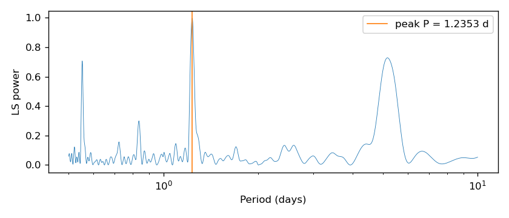
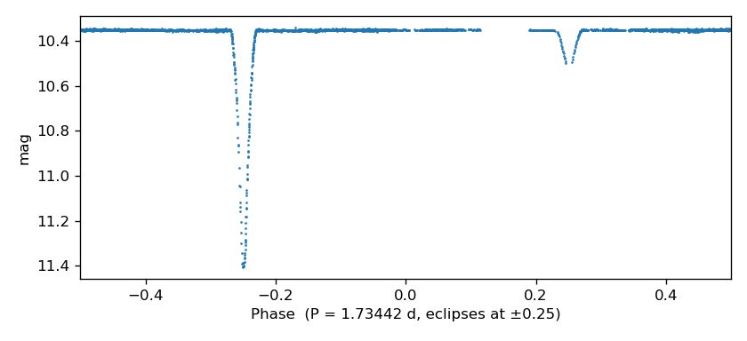

# Period finding

Run a Lomb-Scargle search on a light curve, then fit a single sinusoid at the
recovered period. `EXAMPLES/2` has a 1.2354-day, 0.05 mag sine injected into
it; the LS+harmonic fit should recover a peak-to-peak amplitude of ~0.1 mag.

## Command line

```bash
./vartools -i EXAMPLES/2 \
    -LS 1.0 2.0 0.01 1 0 \
    -harmonicfilter ls 0 0 1 EXAMPLES/OUTDIR1 \
    -oneline
```

```
Name                                       = EXAMPLES/2
LS_Period_1_0                              =     1.23538924
Log10_LS_Prob_1_0                          = -4199.53506
LS_Periodogram_Value_1_0                   =    0.99711
LS_SNR_1_0                                 =   20.55841
HarmonicFilter_Mean_Mag_1                  =  10.12192
HarmonicFilter_Period_1_1                  =     1.23538924
HarmonicFilter_Per1_Fundamental_Sincoeff_1 =  -0.04836
HarmonicFilter_Per1_Fundamental_Coscoeff_1 =  -0.01286
HarmonicFilter_Per1_Amplitude_1            =   0.10009
```

## Python

```python
import pyvartools as vt
from pyvartools import commands as cmd

lc = vt.LightCurve.from_file("EXAMPLES/2")

result = (vt.Pipeline()
        .LS(1.0, 2.0, 0.01, npeaks=1, save_periodogram=False)
        .harmonicfilter(period="ls", nharm=0, nsubharm=0)).run(lc)

print(result.vars)
```

```
Name                                                   2
LS_Period_1_0                                   1.235389
Log10_LS_Prob_1_0                            -4199.53506
LS_Periodogram_Value_1_0                         0.99711
LS_SNR_1_0                                      20.55841
HarmonicFilter_Mean_Mag_1                       10.12192
HarmonicFilter_Period_1_1                       1.235389
HarmonicFilter_Per1_Fundamental_Sincoeff_1      -0.04836
HarmonicFilter_Per1_Fundamental_Coscoeff_1      -0.01286
HarmonicFilter_Per1_Amplitude_1                  0.10009
```

## Capture and plot the LS periodogram

Capture the full LS frequency-power spectrum for `EXAMPLES/2`, read it into
Python as a DataFrame, and plot power vs. period.

### Command line

```bash
./vartools -i EXAMPLES/2 \
    -LS 0.5 10.0 0.001 1 1 EXAMPLES/OUTDIR1 \
    -oneline
```

The `1 EXAMPLES/OUTDIR1` at the end of the `-LS` args enables periodogram
output and writes it to `EXAMPLES/OUTDIR1/2.ls`:

```
# Column 1 = Frequency in cycles per input light curve time unit.
# Column 2 = Unnormalized P(omega) (equation 5 of Zechmeister &
#            K\"urster 2009, A&A, 496, 577).
# Column 3 = Logarithm of the false alarm probability.
0.10000931941552052 0.053061184352138094 -2148.7692206324959
0.10004060923970099 0.052928767751820608 -2147.0684086900499
0.10007189906388148 0.052797859472316708 -2145.3766960921931
...
```

### Python

`save_periodogram=True` captures the spectrum as a pandas DataFrame in
`result.files["LS_periodogram_0"]` (three columns: frequency, power, log₁₀
FAP). The example plots power against period with the LS peak marked.

```python
import matplotlib
matplotlib.use("Agg")           # headless backend; drop for interactive use
import matplotlib.pyplot as plt
import pyvartools as vt

lc = vt.LightCurve.from_file("EXAMPLES/2")
result = lc.LS(0.5, 10.0, 0.001, save_periodogram=True)

pgram = result.files["LS_periodogram_0"]
print(pgram.head())
print(f"shape: {pgram.shape}")

fig, ax = plt.subplots(figsize=(7, 3))
period = 1.0 / pgram[0]
ax.plot(period, pgram[1], lw=0.5)
ax.set_xscale("log")
ax.set_xlabel("Period (days)")
ax.set_ylabel("LS power")
ax.axvline(result.varobjs.LS.Period_1, color="C1", lw=1,
           label=f"peak P = {result.varobjs.LS.Period_1:.4f} d")
ax.legend()
fig.tight_layout()
fig.savefig("/tmp/ls_periodogram.png", dpi=100)
```

```
          0         1            2
0  0.100009  0.053061 -2148.769221
1  0.100041  0.052929 -2147.068409
2  0.100074  0.052798 -2145.376696
3  0.100106  0.052668 -2143.694210
4  0.100138  0.052539 -2142.021078
shape: (59104, 3)
```



The DataFrame has 59 104 rows spanning 0.10–2.0 cycles/day. Column indices
are integers because the vartools periodogram file has no header row —
column 0 is frequency, column 1 is power, column 2 is log₁₀ false-alarm
probability.

---

## AoV on a light curve with an injected eclipsing-binary signal

Inject a realistic detached eclipsing-binary signal into `EXAMPLES/4` using
the JKTEBOP model (shipped as a USERLIB extension), then run three
period-finders on the result to compare how each responds to a non-sinusoidal
signal with two dips per orbit.

The injection uses a 1.7345 d orbit, a/(R₁+R₂) = 8 (so sum of fractional
radii r₁+r₂ = 0.125), R₂/R₁ = 0.8, mass ratio 0.8, surface-brightness ratio
J₂/J₁ = 0.25, central eclipses (`bimpact = 0`), circular orbit, and
quadratic limb darkening with coefficients (0.6, 0.2) on both stars.

### Command line

Shell variable `T0` is the first observation in `EXAMPLES/4` (53725.17392),
which we use as the reference epoch so the first primary eclipse lands at
the start of the light curve.

```bash
T0=53725.17392
./vartools \
    -L /home/jhartman/SVN/HATpipe/data/vartools/USERLIBS/jktebop.so \
    -i EXAMPLES/4 \
    -jktebop inject \
        Period fix 1.7345 T0 fix $T0 \
        r1+r2 fix 0.125 r2/r1 fix 0.8 M2/M1 fix 0.8 J2/J1 fix 0.25 \
        bimpact fix 0.0 esinomega fix 0.0 ecosomega fix 0.0 \
        LD1 quad fix 0.6 0.2 \
        LD2 quad fix 0.6 0.2 \
    -LS 0.5 10.0 0.0005 1 0 \
    -aov Nbin 100 0.5 10.0 0.1 0.001 1 0 \
    -aov_harm 50 0.5 10.0 0.1 0.001 1 0 \
    -oneline
```

`-aov` uses `Nbin 100` instead of the default 8 — more phase bins mean the
two narrow eclipses fall inside their own bins, instead of being diluted
into the sinusoid-scale bin grid. `-aov_harm` uses `Nharm = 50` — far more
harmonics than typical for a sinusoidal signal, but appropriate for the
sharp, narrow eclipse profile of an EB.

```
Name                       = EXAMPLES/4
Jktebop_PERIOD_0           = 1.73450
Jktebop_T0_0               = 53725.17392
Jktebop_R1+R2_0            = 0.125
Jktebop_R2/R1_0            = 0.8
Jktebop_M2/M1_0            = 0.8
Jktebop_J2/J1_0            = 0.25
Jktebop_BIMPACT_0          = 0
Jktebop_INCLINATION_0      = 90
LS_Period_1_1              =     0.86992186
Log10_LS_Prob_1_1          =  -55.14150
LS_SNR_1_1                 =    4.80510
Period_1_2                 =     1.73441598
AOV_1_2                    =  487.90254
AOV_SNR_1_2                =   67.78358
Period_1_3                 =     1.73451269
AOV_HARM_1_3               =  5317.63
AOV_HARM_SNR_1_3           =   415.72
```

Lomb-Scargle finds the half-period harmonic (0.870 d) at SNR 4.8 because a
sinusoid at P/2 matches the symmetric primary-secondary structure about as
well as one at P. **Both AoV variants recover the true injected period
(1.7345 d)**. The higher bin/harmonic counts are the key: a
coarse model picks up the P/2 harmonic.

### Python

The typed `cmd.jktebop(...)` wrapper is auto-loaded from the installed
userlibs directory, so no `lib_path=` argument is needed in this example.

```python
import pyvartools as vt
from pyvartools import commands as cmd

lc = vt.LightCurve.from_file("EXAMPLES/4")
T0 = float(lc.t.min())

result = (vt.Pipeline()
        .jktebop(
            "inject",
            Period=1.7345, T0=T0,
            r1_r2=0.125, r2_r1=0.8, M2_M1=0.8, J2_J1=0.25,
            bimpact=0.0, esinomega=0.0, ecosomega=0.0,
            LD1_law="quad", LD1_coeffs=(0.6, 0.2),
            LD2_law="quad", LD2_coeffs=(0.6, 0.2),
        )
        .LS(0.5, 10.0, 0.0005, npeaks=1)
        .aov(0.5, 10.0, 0.1, finetune=0.001, nbin=100, npeaks=1)
        .aov_harm(nharm=50, minp=0.5, maxp=10.0, subsample=0.1,
                 finetune=0.001, npeaks=1)).run(lc)

print(f"injected : 1.73450 d (P/2 = 0.86725 d)")
print(f"LS       : P={result.vars['LS_Period_1_1']:.5f} d   "
      f"SNR={result.vars['LS_SNR_1_1']:.2f}")
print(f"AoV      : P={result.vars['Period_1_2']:.5f} d   "
      f"SNR={result.vars['AOV_SNR_1_2']:.2f}")
print(f"AoV_harm : P={result.vars['Period_1_3']:.5f} d   "
      f"SNR={result.vars['AOV_HARM_SNR_1_3']:.2f}")
```

```
injected : 1.73450 d (P/2 = 0.86725 d)
LS       : P=0.86992 d   SNR=4.80
AoV      : P=1.73442 d   SNR=67.78
AoV_harm : P=1.73451 d   SNR=415.72
```

The typed `jktebop` wrapper's attributes (`r1_r2`, `r2_r1`, `M2_M1`,
`J2_J1`) use underscores because `+` and `/` can't appear in Python
identifiers. The CLI-side `r1+r2`, `r2/r1`, etc. are emitted automatically.
`"inject"` mode is first-positional; the parameter defaults match the CLI's
`fix` keyword unless you pass `vary_Period=True` etc. to free them in a
fit (see the Model Fitting → `jktebop` command reference).

### Phase-folded at the AoV-recovered period

Inject, find the period, and phase-fold the light curve in one pipeline
using `-Phase`. The fold is placed on the AoV-recovered period (1.73442 d)
with a quarter-period T0 offset so the primary eclipse sits at phase −0.25
and the secondary at +0.25, giving each dip its own breathing room in a
[−0.5, 0.5] x-axis.

`-Phase` stores the per-point phase in the LC vector variable `ph` via
`phasevar`; `startphase -0.5` shifts the fold range from the default
[0, 1) to [−0.5, 0.5). The `T0` expression references the AoV
command's native `Period_1_1` output column. `myT0` is set via `-expr
listvar` so it's available in the `T0` expression. The variable `ph`
will be included in the captured output light curve, together with the
default variables `t`, `mag`, and `err`. Giving the `key="folded"`
option to `cmd.o()` allows access to the output light curve via
`result.files["folded"]`.

```python
import matplotlib
matplotlib.use("Agg")
import matplotlib.pyplot as plt
import pyvartools as vt
from pyvartools import commands as cmd

lc = vt.LightCurve.from_file("EXAMPLES/4")
T0 = float(lc.t.min())

result = (vt.Pipeline()
        .jktebop(
            "inject",
            Period=1.7345, T0=T0,
            r1_r2=0.125, r2_r1=0.8, M2_M1=0.8, J2_J1=0.25,
            bimpact=0.0, esinomega=0.0, ecosomega=0.0,
            LD1_law="quad", LD1_coeffs=(0.6, 0.2),
            LD2_law="quad", LD2_coeffs=(0.6, 0.2),
        )
        .aov(0.5, 10.0, 0.1, finetune=0.001, nbin=100, npeaks=1)
        .expr(f"myT0={T0}", vartype="listvar")
        .Phase(period="aov",
              T0="expr myT0+0.25*Period_1_1",
              phasevar="ph",
              startphase=-0.5)
        .o(capture=True, key="folded")).run(lc)

P_aov = float(result.varobjs.aov.Period_1)
df = result.files["folded"].to_dataframe()

fig, ax = plt.subplots(figsize=(7, 3.2))
ax.plot(df["ph"], df["mag"], ".", ms=1.2, color="C0")
ax.invert_yaxis()          # magnitude convention: brighter = lower y
ax.set_xlim(-0.5, 0.5)
ax.set_xlabel(f"Phase  (P = {P_aov:.5f} d, eclipses at ±0.25)")
ax.set_ylabel("mag")
fig.tight_layout()
fig.savefig("/tmp/eb_phased.png", dpi=120)
```



The above script produces this plot.

---

## Notes

The `0` at the end of the `-LS` argument list disables periodogram output;
pass a directory path (or set `save_periodogram=True` in Python) to write the
frequency-power spectrum for plotting.

`-harmonicfilter` with `ls` picks up the top LS period from the prior command.
The three zeros after `ls` request fundamental-only (no harmonics, no
sub-harmonics, output the model LC with the best-fit sine in the third
column). The `EXAMPLES/OUTDIR1` argument is the directory where the model LC
is written as `EXAMPLES/OUTDIR1/2.harmonicfilter.model`.

`-oneline` reformats the one-row-per-LC default into one-statistic-per-line
— handy for single-LC runs.

Useful variants:

- Save a periodogram for plotting: replace the `0` after the peak count with
  `operiodogram EXAMPLES/OUTDIR1` in the CLI, or set
  `save_periodogram=True` in `cmd.LS(...)`. With `save_periodogram=True`
  the periodogram is available as a DataFrame via
  `result.files["LS_periodogram_0"]`.
- Report more peaks: change the `1` after the frequency step (and
  `npeaks=1`) to a larger number; the output columns become
  `LS_Period_1_0` through `LS_Period_N_0`.
- AoV / multi-harmonic AoV: swap `-LS` for `-aov` or `-aov_harm NHARM`; the
  rest of the pipeline is identical.
- For some non-sinusoidal signals, `-aov_harm` can recover
  periods more reliably than Lomb-Scargle.
- Sigma-clip first to stop outliers from dominating the periodogram:
  prepend `-clip 5.0 1` (CLI) or `cmd.clip(5.0, iterative=True)` (Python).
