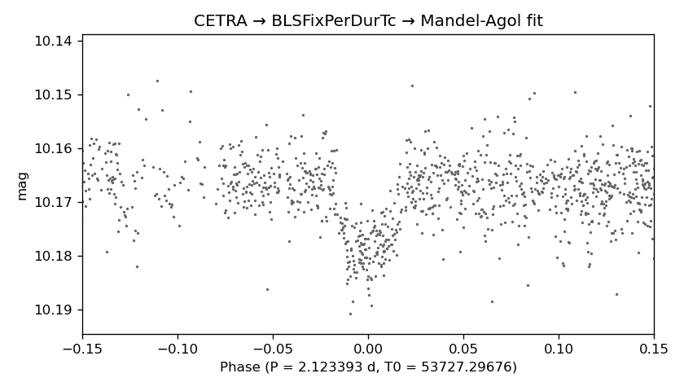
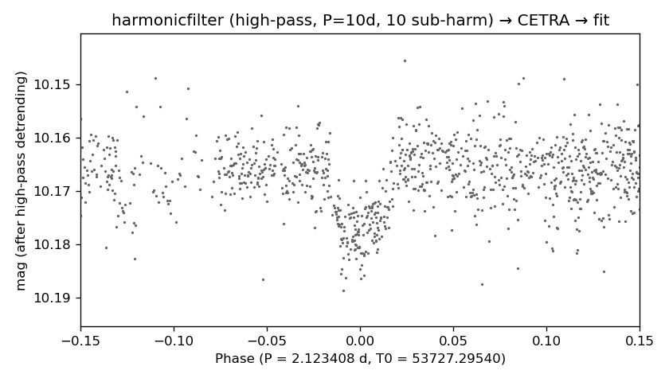

# Transit search and fit

Detrend with TFA and then search for transits with BLS using a trapezoidal
in-transit fit. The input is `EXAMPLES/3.transit`, the LC created by the
[transit injection](transit-injection.md) example.

## Command line

```bash
./vartools -l EXAMPLES/lc_list_tfa \
    -rms \
    -TFA EXAMPLES/trendlist_tfa EXAMPLES/dates_tfa 25.0 1 0 0 \
    -BLS density 1.41 0.5 2.0 0.5 5.0 optimal 0.1 200 7 2 0 1 EXAMPLES/OUTDIR1 1 fittrap \
    -rms \
    -oneline
```

```
Name                         = EXAMPLES/3.transit
Mean_Mag_0                   =  10.16727
RMS_0                        =   0.00542
Expected_RMS_0               =   0.00104
Npoints_0                    =  3417
TFA_MeanMag_1                =  10.16714
TFA_RMS_1                    =   0.00471
BLS_Period_1_2               =     2.12402761
BLS_Tc_1_2                   = 53727.294878968052
BLS_SN_1_2                   =  69.00454
BLS_SDE_1_2                  =   4.41122
BLS_Depth_1_2                =   0.01186
BLS_Qtran_1_2                =   0.03586
BLS_Qingress_1_2             =   0.16670
BLS_Npointsintransit_1_2     =   161
BLS_Ntransits_1_2            =     4
BLS_SignaltoPinknoise_1_2    =  15.93733
BLS_Period_2_2               =     1.35229047
...
RMS_3                        =   0.00405
```

## Python

```python
import pyvartools as vt
from pyvartools import commands as cmd

pipe = (vt.Pipeline()
        .rms()
        .TFA(
            trendlist="EXAMPLES/trendlist_tfa",
            dates_file="EXAMPLES/dates_tfa",
            pixelsep=25.0,
            correct_lc=True,
            save_coeffs=False,
            save_model=False,
        )
        .BLS(
            density_mode=True,
            stellar_density=1.41,        # solar density, g/cm³
            min_exp_dur_frac=0.5,
            max_exp_dur_frac=2.0,
            minper=0.5, maxper=5.0,
            subsample=0.1,               # oversampling for "optimal" grid
            nbins=200,
            timezone=7, npeaks=2,
            save_periodogram=False,
            correct_lc=True,
            fittrap=True,
        )
        .rms())

result = pipe.run_filelist("EXAMPLES/lc_list_tfa")

row = result.vars.iloc[0]
for col in ["RMS_0", "TFA_RMS_1", "BLS_Period_1_2", "BLS_Tc_1_2",
            "BLS_SN_1_2", "BLS_SDE_1_2", "BLS_Depth_1_2",
            "BLS_Qtran_1_2", "BLS_SignaltoPinknoise_1_2",
            "BLS_Period_2_2", "RMS_3"]:
    print(f"{col:<30} = {row[col]}")
```

```
RMS_0                          = 0.00542
TFA_RMS_1                      = 0.00471
BLS_Period_1_2                 = 2.12402761
BLS_Tc_1_2                     = 53727.29487896805
BLS_SN_1_2                     = 69.00454
BLS_SDE_1_2                    = 4.41122
BLS_Depth_1_2                  = 0.01186
BLS_Qtran_1_2                  = 0.03586
BLS_SignaltoPinknoise_1_2      = 15.93733
BLS_Period_2_2                 = 1.35229047
RMS_3                          = 0.00405
```

## Notes

`-TFA` fits a linear combination of template trend light curves to remove
shared systematics. The template list is `EXAMPLES/trendlist_tfa` (paths +
pixel coordinates for each star); `EXAMPLES/dates_tfa` is the global cadence
file. The `25.0` is the minimum pixel separation between target and template
— templates within 25 pixels of `EXAMPLES/3.transit` are excluded, so the
target's own signal can't leak back into the detrending model. The three
final flags are `correctlc=1 save_coeffs=0 save_model=0`.

`-BLS` then searches for transits on the detrended LC:

- `density 1.41 0.5 2.0` — stellar density (g/cm³) plus min/max fractional
  scaling of the expected transit duration; BLS computes the per-trial-period
  duration bounds from the density assuming a circular orbit.
- `0.5 5.0` — period range in days.
- `optimal 0.1` — optimal frequency grid with a subsampling factor of 0.1
  (finer than the native optimal spacing by 10×).
- `200` — phase bins.
- `7` — local timezone offset in hours (used for the one-night-fraction
  statistic).
- `2` — number of peaks to report.
- `0 1 EXAMPLES/OUTDIR1` — skip periodogram output, write the BLS model LC
  to the output dir.
- `1 fittrap` — subtract the best-fit box before passing to the next
  command, and fit a trapezoidal transit at each peak (which adds the
  `Qingress` and `OOTmag` columns).

The final `-rms` captures the residual scatter after the transit model is
subtracted. For this LC the RMS drops from 0.00542 mag (raw) to 0.00471 mag
(post-TFA) to 0.00405 mag (post-TFA + transit removal). The best BLS period,
2.12403 d, matches the injected 2.12345 d; the 1.352 d secondary peak is a
harmonic alias.

`BLS_SignaltoPinknoise` is the most useful single-statistic indicator for
transit candidates; values above ~10 are strong candidates once the LC has
been properly detrended.

### Variation: Mandel-Agol fit at the BLS period

After BLS finds a candidate, we seed a Mandel-Agol physical transit fit
with the BLS period, transit center, depth, and fractional duration; the
initial impact parameter is 0.1. `ophcurve` writes the fitted model as a
phase curve from −0.5 to 0.5 so it can be overplotted directly on the
folded observations.

```bash
./vartools -i EXAMPLES/3.transit \
    -BLS density 1.41 0.5 2.0 0.5 5.0 optimal 0.1 200 7 1 0 0 0 fittrap \
    -MandelAgolTransit \
        expr BLS_Period_1_0 expr BLS_Tc_1_0 \
        expr 'sqrt(BLS_Depth_1_0)' expr '1.0/(BLS_Qtran_1_0*pi)' \
        b 0.1 0.0 0.0 -1 quad 0.3 0.3 \
        1 1 1 1 0 0 1 0 0 0 0 0 \
        ophcurve EXAMPLES/OUTDIR1 -0.5 0.5 0.001 \
    -oneline
```

`expr BLS_Period_1_0` etc. pull the BLS outputs from the prior command
into the MA init values; `b 0.1` initializes the impact parameter (which
is what the fit varies, via `fitinclterm=1`). `mconst0 = -1` tells
vartools to estimate the out-of-transit magnitude from the light curve.

```
Name                         = EXAMPLES/3.transit
BLS_Period_1_0               =     2.12402761
BLS_Tc_1_0                   = 53727.294970417119
BLS_SN_1_0                   =  66.76648
BLS_SDE_1_0                  =   4.34232
BLS_Depth_1_0                =   0.01139
BLS_Qtran_1_0                =   0.03603
BLS_SignaltoPinknoise_1_0    =  13.48275
...
MandelAgolTransit_Period_1   =     2.12339179
MandelAgolTransit_T0_1       = 53727.29676768
MandelAgolTransit_r_1        =   0.09810
MandelAgolTransit_a_1        =   9.66412
MandelAgolTransit_bimpact_1  =   0.27251
MandelAgolTransit_inc_1      =  88.38413
MandelAgolTransit_mconst_1   =  10.16686
MandelAgolTransit_chi2_1     =  27.06389
```

The Python equivalent mirrors the CLI: expressions reference the BLS
output columns, `bimpact=0.1` is the initial impact parameter, and
`save_phcurve=True` with `ophcurve_phmin/phmax/phstep` captures the
fitted model as a DataFrame. A `cmd.Phase(...)` step after the fit
folds the observations on the MA-optimized ephemeris and stores the
per-point phase in a new LC vector `ph_obs`, which is picked up directly
by `cmd.o(capture=True)`.

```python
import matplotlib
matplotlib.use("Agg")
import matplotlib.pyplot as plt
import pyvartools as vt
from pyvartools import commands as cmd

lc = vt.LightCurve.from_file("EXAMPLES/3.transit")

result = (vt.Pipeline()
        .BLS(
            density_mode=True, stellar_density=1.41,
            min_exp_dur_frac=0.5, max_exp_dur_frac=2.0,
            minper=0.5, maxper=5.0,
            subsample=0.1, nbins=200,
            timezone=7, npeaks=1,
            save_periodogram=False, correct_lc=False, fittrap=True,
        )
        .MandelAgolTransit(
            P0="expr BLS_Period_1_0",
            T00="expr BLS_Tc_1_0",
            r0="expr sqrt(BLS_Depth_1_0)",
            a0="expr 1.0/(BLS_Qtran_1_0*pi)",
            bimpact=0.1,
            mconst0=-1,                  # let vartools estimate the baseline
            ld_coeffs=[0.3, 0.3],
            fitephem=1, fitr=1, fita=1, fitinclterm=1,
            fite=0, fitomega=0, fitmconst=1, fitldcoeffs=[0, 0],
            save_phcurve=True,
            ophcurve_phmin=-0.5, ophcurve_phmax=0.5, ophcurve_phstep=0.001,
        )
        .Phase(
            period="fixcolumn MandelAgolTransit_Period_1",
            T0="fixcolumn MandelAgolTransit_T0_1",
            phasevar="ph_obs",
            startphase=-0.5,
        )
        .o(capture=True, key="folded")).run(lc)

fit    = result.varobjs.MandelAgolTransit
folded = result.files["folded"].to_dataframe()
model  = result.files["MandelAgolTransit_phcurve_1"]

fig, ax = plt.subplots(figsize=(7, 3.5))
ax.plot(folded["ph_obs"], folded["mag"], ".", ms=1.5,
        color="0.6", label="observed")
ax.plot(model[0], model[1], "-", lw=1.3,
        color="C3", label="Mandel-Agol fit")
ax.set_xlim(-0.15, 0.15)
ax.invert_yaxis()
P, T0 = float(fit.Period), float(fit.T0)
ax.set_xlabel(f"Phase  (P = {P:.6f} d, T0 = {T0:.5f})")
ax.set_ylabel("mag")
ax.legend(loc="lower right")
fig.tight_layout()
fig.savefig("/tmp/mandel_agol_fit.png", dpi=120)

for name, val in [("P", float(fit.Period)),
                  ("T0", float(fit.T0)),
                  ("r", float(fit.r)),
                  ("a/R*", float(fit.a)),
                  ("bimpact", float(fit.bimpact)),
                  ("inc", float(fit.inc)),
                  ("mconst", float(fit.mconst)),
                  ("chi2", float(fit.chi2))]:
    print(f"{name:<8} = {val}")
```

```
P        = 2.12339179
T0       = 53727.29676768
r        = 0.0981
a/R*     = 9.66412
bimpact  = 0.27251
inc      = 88.38413
mconst   = 10.16686
chi2     = 27.06389
```


The fitted period (2.12339 d) shifts by ~0.9 minutes from the BLS grid
value (2.12403 d) and the fitted T0 (BJD 53727.29677) by ~2.6 minutes
from the BLS transit centre. The red curve is the Mandel-Agol model
written by `ophcurve` (directly on a [−0.5, 0.5] phase grid); the gray
points are the observations folded on the fitted ephemeris via
`cmd.Phase(..., phasevar="ph_obs", startphase=-0.5)`.

### Variation: GPU transit search with CETRA

[CETRA](https://github.com/leigh2/cetra) (Smith et al. 2025, MNRAS, 539, 297) is a CUDA-accelerated transit-detection algorithm that often outperforms BLS in both sensitivity and runtime.  Because it's a Python package rather than a vartools command, it slots into the pipeline through `cmd.python(inprocess=True)` — the in-process callback runs the user code in pyvartools' own interpreter, so `import cetra` (and the live PyCUDA context it spins up) sees the same GPU resources as the calling script.

Once CETRA finds the period / `T0` / duration, the rest of the pipeline is the same chain as the BLS variant above: `BLSFixPerDurTc` re-derives depth and other transit statistics at the CETRA ephemeris, then `MandelAgolTransit` fits a Mandel-Agol model.

!!! note "Requires CUDA + PyCUDA + CETRA"
    This variation needs an NVIDIA GPU, the CUDA toolkit on `PATH` (so `pycuda` can compile kernels), and the `cetra` Python package in the same conda env as pyvartools.  See the [CETRA README](https://github.com/leigh2/cetra) for installation.

```python
import numpy as np
import pyvartools as vt
import cetra
import matplotlib.pyplot as plt


def cetra_search(t, mag, mag_err):
    """Run CETRA on a magnitude LC, return the highest-SNR Transit object."""
    fluxes = 10.0 ** (-0.4 * mag)
    flux_errors = fluxes * mag_err / 1.0857
    medflux = float(np.median(fluxes))
    fluxes /= medflux
    flux_errors /= medflux
    lc_cetra = cetra.LightCurve(t, fluxes, flux_errors)
    td = cetra.TransitDetector(lc_cetra)
    td.linear_search()
    td.period_search()
    return td.get_max_snr_periodic_transit()


lc = vt.LightCurve.from_file("EXAMPLES/3.transit")

result = (vt.Pipeline()
          .python(
              "tr = cetra_search(t, mag, err); "
              "period   = float(tr.period); "
              "t0       = float(tr.t0); "
              "duration = float(tr.duration)",
              invars="t,mag,err",
              outvars="period,t0,duration",
              outputcolumns="period,t0,duration",
              inprocess=True)
          .BLSFixPerDurTc(period="period", duration="duration", Tc="t0",
                          correct_lc=False, fittrap=True)
          .MandelAgolTransit(
              P0="expr BLSFixPerDurTc_Period_1",
              T00="expr BLSFixPerDurTc_Tc_1",
              r0="expr sqrt(BLSFixPerDurTc_Depth_1)",
              a0="expr 1.0/(BLSFixPerDurTc_Qtran_1*pi)",
              bimpact=0.1, mconst0=-1,
              ld_coeffs=[0.3, 0.3],
              fitephem=1, fitr=1, fita=1, fitinclterm=1,
              fite=0, fitomega=0, fitmconst=1, fitldcoeffs=[0, 0])
          ).run(lc, capture_lc=True)

P  = float(result.vars["MandelAgolTransit_Period_2"])
T0 = float(result.vars["MandelAgolTransit_T0_2"])
print(f"CETRA period         = {result.vars['PYTHON_period_0']:.6f} d")
print(f"Mandel-Agol P        = {P:.6f} d")
print(f"Mandel-Agol T0       = {T0:.5f}")
print(f"Mandel-Agol r        = {result.vars['MandelAgolTransit_r_2']:.5f}")
print(f"Mandel-Agol a/R*     = {result.vars['MandelAgolTransit_a_2']:.4f}")
print(f"Mandel-Agol inc      = {result.vars['MandelAgolTransit_inc_2']:.3f} deg")
print(f"Mandel-Agol chi2     = {result.vars['MandelAgolTransit_chi2_2']:.3f}")

# Phase-fold the (untransformed) LC at the fitted Mandel-Agol ephemeris.
out = result.lc
ph = ((out.t - T0) / P)
ph -= np.floor(ph)
ph[ph > 0.5] -= 1.0

fig, ax = plt.subplots(figsize=(7, 4))
ax.plot(ph, out.mag, ".", ms=2, color="0.4")
ax.set_xlim(-0.15, 0.15)
ax.invert_yaxis()
ax.set_xlabel(f"Phase  (P = {P:.6f} d, T0 = {T0:.5f})")
ax.set_ylabel("mag")
ax.set_title("CETRA → BLSFixPerDurTc → Mandel-Agol")
fig.tight_layout()
fig.savefig("/tmp/cetra_transit_fold.png", dpi=120)
```

```
CETRA period         = 2.123535 d
Mandel-Agol P        = 2.123393 d
Mandel-Agol T0       = 53727.29676
Mandel-Agol r        = 0.09774
Mandel-Agol a/R*     = 9.9821
Mandel-Agol inc      = 89.153 deg
Mandel-Agol chi2     = 27.065
```



CETRA's grid period (2.1235 d) is within ~10 s of the Mandel-Agol fitted period (2.12339 d) — close enough that `BLSFixPerDurTc` finds the transit cleanly, and the subsequent Mandel-Agol fit produces parameters consistent with the BLS-seeded variant above (r = 0.098, a/R* = 9.98, i = 89.15°).

### Variation: high-pass detrending + CETRA + fit

CETRA is designed for *detrended* light curves, so a quick way to improve robustness on noisier data is to remove a few low-frequency Fourier modes first.  Setting `period=10.0` with `nharm=0` and `nsubharm=10` on `cmd.harmonicfilter` fits and subtracts the fundamental at 10 d plus sub-harmonics at 20, 30, …, 110 d — i.e. a high-pass that removes any structure on timescales ≥ 10 d while leaving the ~2 d transit signal alone.

```python
import numpy as np
import pyvartools as vt
import cetra
import matplotlib.pyplot as plt


def cetra_search(t, mag, mag_err):
    fluxes = 10.0 ** (-0.4 * mag)
    flux_errors = fluxes * mag_err / 1.0857
    medflux = float(np.median(fluxes))
    fluxes /= medflux
    flux_errors /= medflux
    lc_cetra = cetra.LightCurve(t, fluxes, flux_errors)
    td = cetra.TransitDetector(lc_cetra)
    td.linear_search()
    td.period_search()
    return td.get_max_snr_periodic_transit()


lc = vt.LightCurve.from_file("EXAMPLES/3.transit")

result = (vt.Pipeline()
          # High-pass at P=10 d: subtract the fundamental + 10 sub-harmonics
          # (covering periods 10, 20, …, 110 d).  nharm=0 → no harmonics
          # shorter than 10 d are removed, so the ~2 d transit stays intact.
          .harmonicfilter(period=10.0, nharm=0, nsubharm=10)
          .python(
              "tr = cetra_search(t, mag, err); "
              "period   = float(tr.period); "
              "t0       = float(tr.t0); "
              "duration = float(tr.duration)",
              invars="t,mag,err",
              outvars="period,t0,duration",
              outputcolumns="period,t0,duration",
              inprocess=True)
          .BLSFixPerDurTc(period="period", duration="duration", Tc="t0",
                          correct_lc=False, fittrap=True)
          .MandelAgolTransit(
              P0="expr BLSFixPerDurTc_Period_2",
              T00="expr BLSFixPerDurTc_Tc_2",
              r0="expr sqrt(BLSFixPerDurTc_Depth_2)",
              a0="expr 1.0/(BLSFixPerDurTc_Qtran_2*pi)",
              bimpact=0.1, mconst0=-1,
              ld_coeffs=[0.3, 0.3],
              fitephem=1, fitr=1, fita=1, fitinclterm=1,
              fite=0, fitomega=0, fitmconst=1, fitldcoeffs=[0, 0])
          ).run(lc, capture_lc=True)

P  = float(result.vars["MandelAgolTransit_Period_3"])
T0 = float(result.vars["MandelAgolTransit_T0_3"])
print(f"CETRA period         = {result.vars['PYTHON_period_1']:.6f} d")
print(f"Mandel-Agol P        = {P:.6f} d")
print(f"Mandel-Agol T0       = {T0:.5f}")
print(f"Mandel-Agol r        = {result.vars['MandelAgolTransit_r_3']:.5f}")
print(f"Mandel-Agol a/R*     = {result.vars['MandelAgolTransit_a_3']:.4f}")
print(f"Mandel-Agol inc      = {result.vars['MandelAgolTransit_inc_3']:.3f} deg")
print(f"Mandel-Agol chi2     = {result.vars['MandelAgolTransit_chi2_3']:.3f}")

# Phase-fold the (already detrended) LC at the fitted ephemeris.
out = result.lc
ph = ((out.t - T0) / P)
ph -= np.floor(ph)
ph[ph > 0.5] -= 1.0

fig, ax = plt.subplots(figsize=(7, 4))
ax.plot(ph, out.mag, ".", ms=2, color="0.4")
ax.set_xlim(-0.15, 0.15)
ax.invert_yaxis()
ax.set_xlabel(f"Phase  (P = {P:.6f} d, T0 = {T0:.5f})")
ax.set_ylabel("mag (after high-pass)")
ax.set_title("harmonicfilter (P=10d, nsubharm=10) → CETRA → Mandel-Agol")
fig.tight_layout()
fig.savefig("/tmp/cetra_highpass_transit_fold.png", dpi=120)
```

```
CETRA period         = 2.123535 d
Mandel-Agol P        = 2.123408 d
Mandel-Agol T0       = 53727.29540
Mandel-Agol r        = 0.09268
Mandel-Agol a/R*     = 10.3707
Mandel-Agol inc      = 89.097 deg
Mandel-Agol chi2     = 26.148
```



The high-pass step removes a small amount of long-timescale structure that BLS-style searches typically don't care about but that can bias a model fit; here the χ² drops modestly from 27.1 to 26.1, and the fitted radius / a /inclination shift by a fraction of their per-fit uncertainties — consistent with the picture that the input LC was already mostly clean.
