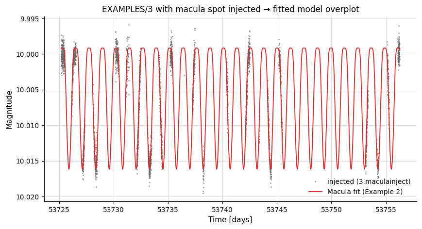

# Extension Commands

pyvartools ships typed wrappers for the USERLIB extensions bundled with vartools and a generic integration layer for hand-written extensions.

---

## User Extension Commands

vartools supports user-developed commands compiled as shared libraries (`.so` / `.la`). Eight such extensions are bundled with the source tree under `USERLIBS/src/` — `-fastchi2`, `-ftuneven`, `-hatpiflag`, `-jktebop`, `-macula`, `-magadd`, `-splinedetrend`, and `-stitch` (see [Extension Commands](../../cli/extensions.md) for the CLI reference). pyvartools ships typed Python wrappers for all eight, so they can be used exactly like a built-in command; it also exposes a generic integration layer for user-written extensions.

## How extensions are loaded

If the library has been installed into the vartools userlibs data directory (e.g. via `make install` in `USERLIBS/src/`), vartools loads it automatically and no `-L` flag is needed:

```bash
vartools -l lc_list -stitch mag err mask lcnum median -tab
```

If you want to load an extension that is not installed (or one that lives outside the installed search directory), pass it with `-L path/to/lib.so` placed immediately before the command flag. pyvartools mirrors both behaviours.


### Bundled typed wrappers

Every bundled extension has a dedicated class in `pyvartools.commands` with typed parameters. Each constructor takes an optional `lib_path=` argument; omit it when the extension is installed and auto-loaded, or pass the path to the `.so` / `.la` file explicitly:

```python
import pyvartools as vt
from pyvartools.commands import fastchi2, stitch

r = vt.fastchi2("EXAMPLES/2", Nharm=2, freqmax=24.0, freqmin=0.1)
```

Explicit `lib_path=` is supported for libraries that are not installed in the
default vartools userlibs directory; the path below is just an illustrative
placeholder:

```python
...                                          # illustrative only
pipe = (vt.Pipeline()
        .fastchi2(Nharm=2, freqmax=24.0, freqmin=0.1,
             lib_path="/path/to/fastchi2.so"))
```

All typed-wrapper pipelines automatically run in **subprocess mode** (library/in-process mode does not support dynamically loaded extensions).

---

### `magadd` — add a constant to magnitudes

**Syntax**

```python
cmd.magadd(value, lib_path=None)
```

**Description**

Add a scalar offset to every magnitude in the light curve. The offset can be a fixed constant, a per-LC value from the input list, a previously computed output statistic, or an analytic expression. This is also the canonical template extension included in the source tree to demonstrate how to write user-defined VARTOOLS extensions.

CLI equivalent: [`-magadd`](../../cli/extensions.md#-magadd).

**Parameters**

| Parameter | Type | Description |
|-----------|------|-------------|
| `value` | `float` or `str` | Bare number → `fix value`; string → split as `"fix v"`, `"list [column N]"`, `"fixcolumn NAME"`, or `"expr EXPR"`. |
| `lib_path` | `str`, optional | Path to `magadd.so` / `magadd.la`. Omit when installed and auto-loaded. |

**Output**

Suffix `N` is the pipeline command index:

| Column | Description |
|--------|-------------|
| `Magadd_addval_N` | The offset value applied for that LC. |

**Examples**

```python
from pyvartools.commands import magadd
pipe = vt.Pipeline().magadd(5.0)                      # fix 5.0
pipe = vt.Pipeline().magadd("fixcolumn MeanMag_0")    # from prior stats column
```

```python
# Add 0.5 mag to every observation of EXAMPLES/2; the two rms calls show the
# mean magnitude shifts by 0.5 while the RMS is unchanged.
lc = vt.LightCurve.from_file("EXAMPLES/2")
result = (vt.Pipeline()
          .rms()
          .magadd(0.5)
          .rms()).run(lc)
print(result.vars["RMS_0"], result.vars["RMS_2"])
```

---

### `hatpiflag` — HATPI binary flag combiner

**Syntax**

```python
cmd.hatpiflag(fiphot_string_flag_var, rejbadframe_mask_var,
              tfa_outlier_mask_var, pointing_outlier_flag_var,
              output_flag_var, lib_path=None)
```

**Description**

Combine four per-observation HATPI quality indicators (fiphot string flag, reject-bad-frame mask, TFA-outlier mask, pointing-outlier flag) into a single bit-packed flag variable suitable for HATPI photometry pipelines. Each input contributes a different bit to the output:

- bits 0–3 (values 1, 2, 4, 8): set from the fiphot string flag — `X` (bad photometry) sets bit 0, `C` (saturated/hot) sets bit 1, `A` (asteroid) sets bit 2, `S` (satellite) sets bit 3 (`H`/`I`/`J`/`K` set combinations of bits 1–3).
- bit 4 (value 16): set when the bad-frame mask flags the point as rejected.
- bit 5 (value 32): set when the TFA-outlier mask flags the point as an outlier.
- bit 6 (value 64): set when the pointing-outlier flag is 1.

CLI equivalent: [`-hatpiflag`](../../cli/extensions.md#-hatpiflag).

**Parameters**

| Parameter | Type | Description |
|-----------|------|-------------|
| `fiphot_string_flag_var` | `str` | Name of the LC vector of one-character string flags from fiphot. |
| `rejbadframe_mask_var` | `str` | Bad-frame mask vector (0 = rejected, 1 = keep). |
| `tfa_outlier_mask_var` | `str` | TFA outlier mask vector (0 = outlier, 1 = keep). |
| `pointing_outlier_flag_var` | `str` | Pointing outlier flag vector (1 = outlier, 0 = ok). |
| `output_flag_var` | `str` | Name of the LC vector to receive the combined binary flag. |
| `lib_path` | `str`, optional | Path to `hatpiflag.so` / `hatpiflag.la`. |

**Output**

`hatpiflag` writes its result into the named output LC vector (`output_flag_var`); it does not produce summary statistics directly. Use a downstream `stats` call to summarise the flag.

**Examples**

```python
from pyvartools.commands import hatpiflag
pipe = (vt.Pipeline()
        .hatpiflag("fiphot_flag", "rejbadframe_mask",
              "tfa_outlier_mask", "pointing_outlier_flag", "quality_flag"))
```

```python
# Read a 7-column LC (t/mag/err + four HATPI flag columns) and combine the
# four flag vectors into a single quality_flag.  The string-typed fiphot
# flag column is declared with vt.PerPointColumn(col=4, type="string") in the
# `perpoint_columns=` mapping.
batch = (vt.Pipeline()
         .hatpiflag("fiphot_flag", "rejbadframe", "tfa_mask",
                    "pointing_outlier", "quality_flag")
         .stats("quality_flag", "mean,sum,max")
         ).run_filelist(["EXAMPLES/2.hatpiflag"],
                        perpoint_columns={
                            "t": 1, "mag": 2, "err": 3,
                            "fiphot_flag": vt.PerPointColumn(col=4, type="string"),
                            "rejbadframe": 5,
                            "tfa_mask": 6,
                            "pointing_outlier": 7,
                        })
```

---

### `fastchi2` — Palmer (2009) fast chi² periodogram

**Syntax**

```python
cmd.fastchi2(Nharm, freqmax, freqmin=None, detrendorder=None,
             t0=None, timespan=None, oversample=None, chimargin=None,
             Npeak=None, norefitpeak=False,
             save_per=False, save_model=False,
             omodelvariable=None, lib_path=None)
```

**Description**

Compute the Fast χ² periodogram using Palmer's algorithm, which searches for the best-fitting multi-harmonic sinusoidal model at each trial frequency. Each parameter accepts one of three sources: a number (emitted as `fix N`), or a string `"fix V"` / `"list [column N]"` / `"fixcolumn NAME"` / `"expr EXPR"`.

CLI equivalent: [`-fastchi2`](../../cli/extensions.md#-fastchi2).

**Parameters**

| Parameter | Type | Description |
|-----------|------|-------------|
| `Nharm` | value-spec | Number of harmonics in the model (1 = fundamental only, 2 = +first overtone, …). |
| `freqmax` | value-spec | Maximum search frequency (cycles/day). |
| `freqmin` | value-spec, optional | Minimum search frequency (default 0). |
| `detrendorder` | value-spec, optional | Polynomial order for pre-detrending (default 0). |
| `t0` | value-spec, optional | Reference epoch for detrending. |
| `timespan` | value-spec, optional | Total time span used for the Nyquist frequency. |
| `oversample` | value-spec, optional | Oversampling factor for the periodogram grid. |
| `chimargin` | value-spec, optional | χ² margin for selecting periodogram peaks to refine. |
| `Npeak` | int, optional | Number of peaks to report. |
| `norefitpeak` | bool | Skip the fine peak search; emit raw periodogram peaks only. |
| `save_per` | `bool`, `str`, or `Output` | Periodogram output file. `True` captures as `result.files["fastchi2_per_N"]`. |
| `save_model` | `bool`, `str`, or `Output` | Best-fit harmonic model output file. |
| `omodelvariable` | `str`, optional | Name of an LC vector to store the model curve. |
| `lib_path` | `str`, optional | Path to `fastchi2.so` / `fastchi2.la`. |

**Output**

Per peak `k` (1 to `Npeak`) and command index `N`:

| Column | Description |
|--------|-------------|
| `Fastchi2_Frequency_k_N` | Frequency (cycles/day) of peak `k`. |
| `Fastchi2_Chi2Reduction_k_N` | χ² reduction at the peak (`χ²₀ − χ²` of the harmonic fit). |

When the corresponding `save_*` keyword is set:

| File key | Description |
|----------|-------------|
| `result.files["fastchi2_per_N"]` | DataFrame: frequency vs. χ² periodogram. |
| `result.files["fastchi2_model_N"]` | DataFrame: best-fit harmonic model evaluated at the observed times. |

**References**

Cite Palmer 2009, ApJ, 695, 496.

**Examples**

```python
from pyvartools.commands import fastchi2
pipe = (vt.Pipeline()
        .fastchi2(Nharm=2, freqmax=24.0, freqmin=0.1,
             oversample=4, Npeak=3, save_per=True))
```

```python
# Run Palmer's Fast chi^2 periodogram on EXAMPLES/2; search 0.1–10 cyc/day
# with one harmonic and capture the periodogram.
lc = vt.LightCurve.from_file("EXAMPLES/2")
result = lc.fastchi2(Nharm=1, freqmax=10.0, freqmin=0.1,
                     save_per="EXAMPLES/OUTDIR1")
```

---

### `splinedetrend` — basis-spline / poly / harmonic detrending

**Syntax**

```python
cmd.splinedetrend(detrendvecs, sigmaclip=None,
                  save_model=False, save_coeffs=False,
                  omodelvariable=None, lib_path=None)
```

**Description**

Fit a multivariate linear model to the light-curve magnitudes against one or more auxiliary variables (e.g. time, CCD *x*/*y* position, CCD temperature). Cross-terms between variables are not included.

Three basis types are supported per detrending variable: `spline:knotspacing:order` (B-spline basis using GSL `gsl_bspline_eval`), `poly:order` (polynomial), and `harm:nharm` (harmonic series; `nharm=0` for fundamental only with period = 2× variable range). Append `:groupbygap:gapsize` to split the fit at gaps in the variable larger than `gapsize`.

CLI equivalent: [`-splinedetrend`](../../cli/extensions.md#-splinedetrend).

**Parameters**

| Parameter | Type | Description |
|-----------|------|-------------|
| `detrendvecs` | `str` or `list` | Single comma-joined string or a list of `VAR:<spline:knotspacing:order \| poly:order \| harm:nharm>[:groupbygap:gapsize]` specs. |
| `sigmaclip` | value-spec, optional | Sigma-clip threshold; outliers above this σ level are excluded from the fit (the model is still evaluated and subtracted at clipped points). |
| `save_model` | `bool`, `str`, or `Output` | Best-fit model output file. `True` captures as `result.files["splinedetrend_model_N"]`. |
| `save_coeffs` | `bool`, `str`, or `Output` | Linear basis coefficients output file. |
| `omodelvariable` | `str`, optional | Comma-separated `outvar[:inputvar]` list specifying per-variable model contributions to store as LC vectors. |
| `lib_path` | `str`, optional | Path to `splinedetrend.so` / `splinedetrend.la`. |

**Output**

Suffix `N` is the pipeline command index:

| Column | Description |
|--------|-------------|
| `Splinedetrend_MedianMagnitude_N` | Median magnitude added back to the detrended LC. |
| `Splinedetrend_NOutliers_N` | Number of clipped outliers. |
| `Splinedetrend_NDataGroups_N` | Number of fit groups created by `groupbygap`. |
| `Splinedetrend_NFitParamsTotal_N` | Total free-parameter count of the model. |

When the corresponding `save_*` keyword is set:

| File key | Description |
|----------|-------------|
| `result.files["splinedetrend_model_N"]` | Best-fit model evaluated at the observed times. |
| `result.files["splinedetrend_coeffs_N"]` | Linear basis coefficients. |

**Examples**

```python
from pyvartools.commands import splinedetrend
pipe = (vt.Pipeline()
        .splinedetrend(["t:spline:0.1:3", "x:poly:2", "y:poly:2"],
                  sigmaclip=4.0, save_model=True))
```

The canonical example (a TESS sector-1 LC for GAIA DR2 6479535620075955328) reads several auxiliary columns (`x`, `y`, `temp`) from a FITS file. Because that requires a non-default `-inputlcformat` flag while loading the LC inside vartools, the cleanest Python equivalent invokes vartools directly via `subprocess`.

```python
import subprocess
subprocess.run([
    "vartools",
    "-i", "EXAMPLES/6479535620075955328_llc.fits",
    "-inputlcformat", "t:TMID_BJD,mag:IRM1,err:IRE1,x:XIC,y:YIC,temp:CCDTEMP",
    "-expr", "magorig=mag",
    "-splinedetrend",
    "t:spline:1.0:3:groupbygap:0.5,x:poly:1,y:poly:1,temp:poly:1",
    "sigmaclip", "fix", "3.0",
    "omodel", "EXAMPLES/OUTDIR1/",
    "omodelcoeffs", "EXAMPLES/OUTDIR1/",
    "omodelvariable", "tmod:t,xmod:x,ymod:y,tempmod:temp",
    "-o", "EXAMPLES/OUTDIR1/6479535620075955328.splinedetrend.lc.txt",
    "columnformat", "t,magorig,mag,err,x,y,temp,tmod,xmod,ymod,tempmod",
    "-rms", "-oneline",
], check=True)
```

---

### `ftuneven` — complex Fourier transform of unevenly-sampled data

**Syntax**

```python
cmd.ftuneven(output_vectors=None, output_file=False,
             save_outdir=None, nameformat=None,
             freqauto=False, freqrange=None,
             freqvariable=None, freqfile=None,
             ft_sign=None, tt_zero=None,
             changeinputvectors=None, lib_path=None)
```

**Description**

Compute the complex Fourier transform of an unevenly sampled time series using Scargle's method. Returns the real and imaginary components plus the absolute-square power spectrum (equivalent to the Lomb-Scargle periodogram). **Input and output frequencies are in radians per unit time.**

At least one output mode (`output_vectors`, `output_file`, or both) and exactly one frequency source (`freqauto`, `freqrange`, `freqvariable`, or `freqfile`) must be specified. To write both LC vectors and a per-LC file, pass `output_vectors=(...)` together with `output_file=True` (or a path). `freqrange` is a `(min, max, step)` tuple of value-specs.

CLI equivalent: [`-ftuneven`](../../cli/extensions.md#-ftuneven).

**Parameters**

Output mode (at least one; both may be combined):

| Parameter | Type | Description |
|-----------|------|-------------|
| `output_vectors` | tuple of 4 `str`, optional | Names of LC vectors `(freq, FTreal, FTimag, periodogram)`; all LC vectors are resized to the transform length. |
| `output_file` | `bool`, `str`, or `Output`, optional | Write per-LC files (default name `BASELC.ftuneven`; four whitespace columns: freq, FT_real, FT_imag, periodogram). |
| `save_outdir` | `str`, optional | Directory used when `output_file=True`; overrides the pipeline temp dir. |
| `nameformat` | `str`, optional | Format string for the per-LC output filename. |

Frequency source (choose one):

| Parameter | Type | Description |
|-----------|------|-------------|
| `freqauto` | `bool` | Determine frequencies automatically from the time baseline and cadence. |
| `freqrange` | `(min, max, step)` tuple of value-specs | Uniform grid. |
| `freqvariable` | `str` | Read frequencies from an existing LC vector. |
| `freqfile` | `str` | Read frequencies from the first column of an ASCII file (used identically for every LC). |

| Parameter | Type | Description |
|-----------|------|-------------|
| `ft_sign` | `int` or `str`, optional | Sign of the transform: `−1` (default) = forward; `+1` = inverse. |
| `tt_zero` | `float` or `str`, optional | Time origin (default 0). |
| `changeinputvectors` | tuple of 3 `str`, optional | Apply the transform to vectors other than `t`/`mag`: `(tvec, data_real_vec, data_imag_vec)`. |
| `lib_path` | `str`, optional | Path to `ftuneven.so` / `ftuneven.la`. |

**Output**

`ftuneven` writes its results into the named LC vectors and/or per-LC output files; it does not produce summary statistics directly.

**References**

Cite Scargle 1989, ApJ, 343, 874.

**Examples**

```python
from pyvartools.commands import ftuneven

# Write the FT into four light-curve variables
pipe = (vt.Pipeline()
        .ftuneven(output_vectors=("freq", "ft_real", "ft_imag", "periodogram"),
             freqrange=(0.01, 10.0, 0.001)))

# Write the FT to a per-LC file using an automatic frequency grid
pipe = vt.Pipeline().ftuneven(output_file=True, freqauto=True)
```

```python
# Compute Scargle's complex Fourier transform of EXAMPLES/2 over a uniform
# frequency grid (radians per unit time), writing the FT to a per-LC file.
lc = vt.LightCurve.from_file("EXAMPLES/2")
result = lc.ftuneven(output_file="EXAMPLES/OUTDIR1",
                     freqrange=(0.05, 5.0, 0.001))
```

---

### `stitch` — stitch multi-segment light curves at offsets

**Syntax**

```python
cmd.stitch(stitch_variables, uncertainty_variables, mask_variables,
           lcnum_var, method,
           refnum_var=None, groupbytime=None, groupbytime_start=None,
           fitonly=False,
           save_fitted_parameters=False, fitted_parameters_nameformat=None,
           add_stitchparams_fitsheader=False, add_stitchparams_mode=None,
           add_shifts_fitsheader=None, add_shifts_hdu=None,
           add_shifts_mode=None,
           shifts_file=None, append_refnum_to_fieldlabel=False,
           in_shifts_file=None, nobs_refit=None,
           header_basename_only=False,
           out_shifts_file=None, include_missing=False,
           lib_path=None)
```

**Description**

Designed for use with the `-l "combinelcs"` (or `-i "combinelcs"`) input mode, `-stitch` fits for and removes additive offsets between distinct light-curve segments (e.g. observations from different telescopes, cameras, or fields).

`method` is one of `"median"`, `"mean"`, `"weightedmean"`, `"poly ORDER"`, or `"harmseries PERIODVAR NHARM"`.

CLI equivalent: [`-stitch`](../../cli/extensions.md#-stitch).

**Parameters**

| Parameter | Type | Description |
|-----------|------|-------------|
| `stitch_variables` | `str` or `list` of `str` | Magnitude variable(s) to stitch (typically `"mag"`). |
| `uncertainty_variables` | `str` or `list` of `str` | Uncertainties for each magnitude variable (typically `"err"`). |
| `mask_variables` | `str` or `list` of `str` | Mask vector(s); points with `mask = 0` are *excluded* from the fit (1 = include). |
| `lcnum_var` | `str` | Variable identifying which input segment each observation belongs to (typically set by the `lcnumvar` keyword of `combinelcs`). |
| `method` | `str`, required | `"median"`, `"mean"`, `"weightedmean"`, `"poly ORDER"`, or `"harmseries PERIODVAR NHARM"`. |
| `refnum_var` | `str`, optional | Further subdivide segments by a second grouping variable. |
| `groupbytime` | `float`, optional | Group segments into time bins; the bin size is automatically widened if necessary so all segments can be inter-calibrated. |
| `groupbytime_start` | `float`, optional | Start time of the first time bin (only meaningful when `groupbytime` is set). |
| `fitonly` | `bool` | Compute the shifts but do not subtract them. |
| `save_fitted_parameters` | `bool`, `str`, or `Output` | Write per-source shift files. |
| `fitted_parameters_nameformat` | `str`, optional | Format string applied to the fitted-parameter filenames (`format` keyword). |
| `add_stitchparams_fitsheader` | `bool` or `str` | Add stitch parameters to the FITS header. Pass `True`, or `"primary"`/`"extension"` to select the HDU. |
| `add_stitchparams_mode` | `str`, optional | `"append"` or `"update"`. |
| `add_shifts_fitsheader` | `str`, optional | Keyword base (e.g. `"SHFT"`) used to log shifts into FITS headers. |
| `add_shifts_hdu` | `str`, optional | `"primary"` or `"extension"`. |
| `add_shifts_mode` | `str`, optional | `"append"` or `"update"`. |
| `shifts_file` | tuple of 2 `str`, optional | `(fieldlabelsvar, starnamevar)` — enables `shifts_file` mode for reading/writing previously determined shifts. |
| `append_refnum_to_fieldlabel` | `bool` | Append the `refnum_var` value to the field label in shifts files. |
| `in_shifts_file` | `str` or `list` of `str`, optional | Pre-existing shifts file(s) to read. **One file per stitched variable** — pass a single string when `stitch_variables` is a string, or a list of the same length as `stitch_variables` when it is a list. |
| `nobs_refit` | `int`, optional | Minimum new observations before re-fitting an existing shift. |
| `header_basename_only` | `bool` | Match shifts-file rows by basename only. |
| `out_shifts_file` | `str` or `list` of `str`, optional | Output shifts file(s) to write. **One file per stitched variable** — pass a single string when `stitch_variables` is a string, or a list of the same length as `stitch_variables` when it is a list. |
| `include_missing` | `bool` | Include un-fit (missing) sources in the output shifts file. |
| `lib_path` | `str`, optional | Path to `stitch.so` / `stitch.la`. |

**Output**

Suffix `N` is the pipeline command index:

| Column | Description |
|--------|-------------|
| `Stitch_NLCGroups_N` | Number of LC segment groups. |
| `Stitch_NTimeGroups_N` | Number of time-bin groups. |
| `Stitch_NFitParamsTotal_N` | Total free-parameter count of the stitch fit. |

When `save_fitted_parameters` is set:

| File key | Description |
|----------|-------------|
| `result.files["stitch_fitted_parameters_N"]` | Per-source shift file (suffix `.stitch`). |

**Examples**

```python
from pyvartools.commands import stitch
pipe = (vt.Pipeline()
        .stitch("mag", "err", "mask", "lcnum", method="median",
           groupbytime=30.0, save_fitted_parameters=True))

# Multiple magnitude/uncertainty/mask variables
pipe = (vt.Pipeline()
        .stitch(["mag_ap1", "mag_ap2"], ["err_ap1", "err_ap2"],
           ["mask_ap1", "mask_ap2"], "lcnum", method="poly 3"))
```

`-stitch` is most useful with the `-l ... combinelcs` input mode, which combines multiple files into a single in-memory LC. The cleanest way to drive that from pyvartools is `Pipeline.run_combinelc()` for a single combined LC or `run_combinelcs()` for many groups; both default to emitting `lcnumvar lcnum`, which `-stitch` consumes.

```python
import pyvartools as vt
from pyvartools.commands import stitch

# Combine EXAMPLES/2 and EXAMPLES/2.shifted (= EXAMPLES/2 with +0.3 mag) into a
# single LC and remove the inter-segment offset by median.  The two -rms calls
# show the offset before and after stitching.
result = (vt.Pipeline()
          .expr("mask=mag*0+1")
          .rms()
          .stitch("mag", "err", "mask", "lcnum", method="median")
          .rms()
          ).run_combinelc(["EXAMPLES/2", "EXAMPLES/2.shifted"])
print(result.vars[["RMS_1", "RMS_3"]])   # before / after stitching
```

#### Per-segment field labels and per-LC star names with `shifts_file`

`shifts_file=(fieldlabelsvar, starnamevar)` enables shifts-file mode, which writes (and optionally reads) measured offsets keyed by a per-observation field label and per-LC star name. The two variables are different vector types in vartools — `fieldlabelsvar` is a per-point string (one value broadcast across all rows of a segment) and `starnamevar` is a per-LC scalar — so they need to be supplied differently. The `perlcsegment_vars` and `perlc_vars` keywords on `run_combinelc()` / `run_combinelcs()` build the right list-file columns automatically:

```python
import pyvartools as vt

# EXAMPLES/2.shifted is EXAMPLES/2 with +0.3 mag added.  Tag the two
# segments "2_A" / "2_B" so the recovered shifts file can attribute the
# 0.3 mag offset to segment B; tag the combined LC with starname "2".
result = (vt.Pipeline()
          .expr("mask=1")
          .stitch("mag", "err", "mask", "lcnum",
                  method="poly 5", groupbytime=0.5,
                  groupbytime_start=54550.123, fitonly=True,
                  shifts_file=("fieldname", "starname"),
                  out_shifts_file="/tmp/shifts.txt")
          ).run_combinelc(
              ["EXAMPLES/2", "EXAMPLES/2.shifted"],
              perlcsegment_vars={"fieldname": ["2_A", "2_B"]},
              perlc_vars={"starname": "2"},
          )
print(open("/tmp/shifts.txt").read())
# 2 2_A,0,3313;2_B,0.30000000000003313,3313
```

The first column of the output shifts file is the star name; the second is a `;`-separated list of `<field>,<shift>,<nobs>` triplets.  See [`run_combinelcs()`](../pipeline.md#run_combinelcs) for the full specification of `perlcsegment_vars` / `perlc_vars`, including how to pass a `(values, type)` tuple to override the auto-detected type.

---

### `jktebop` — detached eclipsing-binary model

**Syntax**

```python
cmd.jktebop(mode,
            Period=None, vary_Period=False,
            T0=None, vary_T0=False,
            r1_r2=None, vary_r1_r2=False,
            r2_r1=None, vary_r2_r1=False,
            M2_M1=None, vary_M2_M1=False,
            J2_J1=None, vary_J2_J1=False,
            i=None, vary_i=False,
            bimpact=None, vary_bimpact=False,
            esinomega=None, vary_esinomega=False,
            ecosomega=None, vary_ecosomega=False,
            LD1_law="quad", LD1_coeffs=(0.3, 0.3), vary_LD1=False,
            LD2_law="lockLD1", LD2_coeffs=(), vary_LD2=False,
            gravdark1=None, vary_gravdark1=False,
            gravdark2=None, vary_gravdark2=False,
            reflection1=None, vary_reflection1=False,
            reflection2=None, vary_reflection2=False,
            L3=None, vary_L3=False,
            tidallag=None, vary_tidallag=False,
            correctlc=False,
            save_model=False, model_nameformat=None,
            save_curve=False, curve_xaxis=None,
            curve_step=None, curve_nameformat=None,
            lib_path=None)
```

**Description**

Fit or inject a JKTEBOP detached eclipsing-binary light-curve model. Use `mode="inject"` to add the model to the light curve, or `mode="fit"` to optimise the parameters. Pass `vary_*=True` to free the corresponding parameter during fitting.

Every mandatory parameter (`Period`, `T0`, `r1_r2`, `r2_r1`, `M2_M1`, `J2_J1`, `i` **or** `bimpact`, `esinomega`, `ecosomega`) is a value-spec; the corresponding `vary_*=True` flag frees that parameter in the fit. Optional physical parameters: `gravdark1/2` (default 1.0), `reflection1/2` (computed if absent or ≤ 0), `L3` (third light, default 0), `tidallag` (default 0). Limb-darkening laws are `"linear"`, `"quad"`, `"log"`, `"sqrt"`; `LD2_law="lockLD1"` forces the secondary to share the primary's coefficients.

CLI equivalent: [`-jktebop`](../../cli/extensions.md#-jktebop).

**Parameters**

| Parameter | Type | Description |
|-----------|------|-------------|
| `mode` | `str` | `"inject"` or `"fit"`. |
| `Period` | value-spec | Orbital period in days. |
| `T0` | value-spec | Central time of a primary eclipse. |
| `r1_r2` | value-spec | Sum of stellar radii divided by the semi-major axis (`r1+r2`). |
| `r2_r1` | value-spec | Ratio of stellar radii (`r2/r1`). |
| `M2_M1` | value-spec | Mass ratio. |
| `J2_J1` | value-spec | Surface brightness ratio. |
| `i` | value-spec, optional | Orbital inclination in degrees (90° = edge-on). |
| `bimpact` | value-spec, optional | Impact parameter at primary eclipse (alternative to `i`; 0 = central, 1 = grazing). |
| `esinomega`, `ecosomega` | value-spec | *e* sin ω and *e* cos ω. |
| `LD1_law` | `str` | `"linear"`, `"quad"`, `"log"`, or `"sqrt"`. |
| `LD1_coeffs` | tuple of 1 or 2 floats/strings | Limb-darkening coefficients. |
| `LD2_law` | `str` | `"lockLD1"`, `"linear"`, `"quad"`, `"log"`, or `"sqrt"`. |
| `LD2_coeffs` | tuple, optional | Used only when `LD2_law` is not `"lockLD1"`. |
| `gravdark1`, `gravdark2` | value-spec, optional | Gravity-darkening coefficients (default 1.0). |
| `reflection1`, `reflection2` | value-spec, optional | Reflection coefficients (computed if absent). |
| `L3` | value-spec, optional | Third light (default 0). |
| `tidallag` | value-spec, optional | Tidal lag in degrees (default 0). |
| `vary_*` | `bool` | Free the corresponding parameter during fitting. |
| `correctlc` | `bool` | Subtract the best-fit model from the LC. |
| `save_model` | `bool`, `str`, or `Output` | Write the model evaluated at the observed times. |
| `model_nameformat` | `str`, optional | Format string for the saved model filename. |
| `save_curve` | `bool`, `str`, or `Output` | Write a uniformly sampled model curve. |
| `curve_xaxis` | `"jd"` or `"phase"`, optional | Axis for the saved curve. |
| `curve_step` | `float`, optional | Step size for the saved curve. |
| `curve_nameformat` | `str`, optional | Format string for the saved curve filename. |
| `lib_path` | `str`, optional | Path to `jktebop.so` / `jktebop.la`. |

**Output**

Suffix `N` is the pipeline command index. The base parameter columns are produced unconditionally:

| Column | Description |
|--------|-------------|
| `Jktebop_PERIOD_N` | Best-fit (or injected) orbital period. |
| `Jktebop_T0_N` | Best-fit (or injected) reference epoch. |
| `Jktebop_R1+R2_N` | Best-fit (or injected) sum of fractional radii. |
| `Jktebop_R2/R1_N` | Best-fit (or injected) ratio of radii. |
| `Jktebop_M2/M1_N` | Best-fit (or injected) mass ratio. |
| `Jktebop_J2/J1_N` | Best-fit (or injected) surface-brightness ratio. |
| `Jktebop_INCLINATION_N` | Inclination (degrees). |
| `Jktebop_bimpact_N` | Impact parameter at primary eclipse. |
| `Jktebop_ESINOMEGA_N` | *e* sin ω. |
| `Jktebop_ECOSOMEGA_N` | *e* cos ω. |
| `Jktebop_STAR1_LD_COEFF_1_N` | Primary limb-darkening coefficient #1. |
| `Jktebop_STAR1_LD_COEFF_2_N` | Primary limb-darkening coefficient #2 (if the law has two). |

Conditional columns (added only when the input is set):

| Column | Condition |
|--------|-----------|
| `Jktebop_STAR2_LD_COEFF_1_N`, `Jktebop_STAR2_LD_COEFF_2_N` | When `LD2_law` is not `"lockLD1"`. |
| `Jktebop_GRAVDARK1_N`, `Jktebop_GRAVDARK2_N` | When `gravdark1` / `gravdark2` is given. |
| `Jktebop_REFLECTION1_N`, `Jktebop_REFLECTION2_N` | When `reflection1` / `reflection2` is given. |
| `Jktebop_L3_N` | When `L3` is given. |
| `Jktebop_TIDALLAG_N` | When `tidallag` is given. |
| `Jktebop_CHI2_N`, `Jktebop_NDOF_N` | When `mode="fit"` (best-fit χ² and degrees of freedom). |

When `save_model` is set, vartools writes a per-LC ASCII file with the columns `Time  Mag_lc  Err  Mag_model`. The file suffix is `.jktebop`.

When `save_curve` is set, vartools writes a uniformly-sampled model curve. With `curve_xaxis="phase"` (default `"jd"`) the file has columns `#Phase Mag_model`; with `curve_xaxis="jd"` it has `#Time Mag_model Phase`. The step size is `curve_step` (default 0.01 days for JD mode, 0.01 in fractional phase for phase mode). The file suffix is `.jktebopcurve` and the captured key is `result.files["jktebop_curve_N"]`.

**References**

Cite Southworth et al. 2004, MNRAS, 351, 1277; Popper & Etzel 1981, AJ, 86, 102; Etzel 1981, *Photometric and Spectroscopic Binary Systems*, 111; Nelson & Davis 1972, ApJ, 174, 617.

**Examples**

```python
from pyvartools.commands import jktebop
pipe = (vt.Pipeline()
        .jktebop("fit",
            Period=2.5,     vary_Period=True,
            T0=0.0,         vary_T0=True,
            r1_r2=0.3, r2_r1=0.5, M2_M1=1.0, J2_J1=1.0,
            i=89.0,         vary_i=True,
            esinomega=0.0, ecosomega=0.0,
            LD1_law="quad", LD1_coeffs=(0.3, 0.3),
            LD2_law="lockLD1",
            correctlc=True, save_model=True))
```

```python
# Inject a JKTEBOP detached EB signal (P=2.5d, R2/R1=0.5, J2/J1=0.3, i=89 deg,
# circular orbit, quadratic LD) into EXAMPLES/3 and recover the primary eclipse
# with -BLS.
lc = vt.LightCurve.from_file("EXAMPLES/3")
result = (vt.Pipeline()
          .jktebop("inject",
                   Period=2.5, T0=53727.0,
                   r1_r2=0.15, r2_r1=0.5,
                   M2_M1=0.6, J2_J1=0.3,
                   i=89.0,
                   esinomega=0.0, ecosomega=0.0,
                   LD1_law="quad", LD1_coeffs=(0.3, 0.3),
                   LD2_law="lockLD1",
                   save_model="EXAMPLES/OUTDIR1/")
          .BLS(1.0, 5.0, rmin=0.01, rmax=0.1,
               nbins=200, nfreq=5000, npeaks=1)).run(lc)
```

```python
# Capture the uniformly-sampled phase-folded model curve (one row per
# 0.01-phase step) into result.files["jktebop_curve_0"].
lc = vt.LightCurve.from_file("EXAMPLES/3")
r = (vt.Pipeline()
     .jktebop("inject",
              Period=2.5, T0=53727.0,
              r1_r2=0.15, r2_r1=0.5, M2_M1=0.6, J2_J1=0.3,
              i=89.0,
              esinomega=0.0, ecosomega=0.0,
              LD1_law="quad", LD1_coeffs=(0.3, 0.3),
              LD2_law="lockLD1",
              save_curve=True, curve_xaxis="phase", curve_step=0.01)
     ).run(lc)
curve = r.files["jktebop_curve_0"]   # 2 columns: phase, model magnitude
print(curve.shape, curve.head(3))
```

---

### `macula` — Kipping (2012) spot model

**Syntax**

```python
cmd.macula(mode, *,
           Prot=None, vary_Prot=False,
           istar=None, vary_istar=False,
           kappa2=None, vary_kappa2=False,
           kappa4=None, vary_kappa4=False,
           c1=None, vary_c1=False, c2=None, vary_c2=False,
           c3=None, vary_c3=False, c4=None, vary_c4=False,
           d1=None, vary_d1=False, d2=None, vary_d2=False,
           d3=None, vary_d3=False, d4=None, vary_d4=False,
           blend=None, vary_blend=False,
           spots=None,
           fluxinput=False, fluxoutput=False, correctlc=False,
           save_model=False, model_tdelv=False, model_nameformat=None,
           save_curve=False, curve_tdelv=False,
           curve_step=None, curve_nameformat=None,
           lib_path=None)
```

**Description**

Fit or inject Kipping's Macula analytic model for starspot modulation. Use `mode="inject"` to add the model signal to the light curve, or `mode="fit amoeba"` (Nelder-Mead simplex) / `mode="fit lm"` (Levenberg-Marquardt) to optimise the parameters. Pass `vary_*=True` to mark a global parameter free during fitting.

Each of the 13 global parameters (`Prot`, `istar`, `kappa2`, `kappa4`, `c1`–`c4`, `d1`–`d4`, `blend`) is a keyword-argument value-spec with a matching `vary_<name>` flag. `spots` is a list of dicts, one per active spot, each providing value-specs for the eight per-spot parameters (`Lambda0`, `Phi0`, `alphamax`, `fspot`, `tmax`, `life`, `ingress`, `egress`). Individual spot parameters can be marked free by passing a `(value, True)` tuple (or a `"vary_<name>": True` entry in the dict).

CLI equivalent: [`-macula`](../../cli/extensions.md#-macula).

**Parameters**

Stellar parameters:

| Parameter | Type | Description |
|-----------|------|-------------|
| `mode` | `str` | `"inject"`, `"fit amoeba"`, or `"fit lm"`. |
| `Prot` | value-spec | Equatorial rotation period (LC time units). |
| `istar` | value-spec | Stellar inclination (radians). |
| `kappa2`, `kappa4` | value-spec | Quadratic / quartic differential-rotation coefficients. |
| `c1`–`c4` | value-spec | Stellar limb-darkening coefficients. |
| `d1`–`d4` | value-spec | Spot limb-darkening coefficients. |
| `blend` | value-spec | Blend parameter. |

Per-spot dict keys (one entry in `spots` per active spot):

| Key | Description |
|-----|-------------|
| `Lambda0` | Longitude at maximum spot size (radians). |
| `Phi0` | Latitude at maximum spot size (radians). |
| `alphamax` | Maximum angular radius (radians). |
| `fspot` | Spot-to-star flux contrast. |
| `tmax` | Reference epoch of maximum spot size. |
| `life` | Spot lifetime, FWHM (LC time units). |
| `ingress` | Spot growth duration. |
| `egress` | Spot decay duration. |

Output / control flags:

| Parameter | Type | Description |
|-----------|------|-------------|
| `vary_<name>` | `bool` | Free the corresponding global parameter during fitting. |
| `fluxinput`, `fluxoutput` | `bool` | Toggle flux vs. magnitude input/output (default: magnitudes). |
| `correctlc` | `bool` | Subtract the model from the LC. |
| `save_model` | `bool`, `str`, or `Output` | Write the model evaluated at the observed times (suffix `.macula`). |
| `model_tdelv` | `bool` | Include predicted transit-depth variations in the saved model. |
| `model_nameformat` | `str`, optional | Format string for the model filename. |
| `save_curve` | `bool`, `str`, or `Output` | Write the model on a uniformly sampled time grid (suffix `.maculacurve`). |
| `curve_tdelv` | `bool` | Include predicted transit-depth variations in the saved curve. |
| `curve_step` | `float`, optional | Grid spacing for the saved curve. |
| `curve_nameformat` | `str`, optional | Format string for the curve filename. |
| `lib_path` | `str`, optional | Path to `macula.so` / `macula.la`. |

**Output**

Suffix `N` is the pipeline command index, and `s` is the 0-indexed spot number.

Always-emitted columns (one per global parameter and per per-spot parameter):

| Column | Description |
|--------|-------------|
| `Macula_Prot_N` | Equatorial rotation period. |
| `Macula_Istar_N` | Stellar inclination (radians). |
| `Macula_kappa2_N`, `Macula_kappa4_N` | Differential-rotation coefficients. |
| `Macula_c1_N`–`Macula_c4_N` | Stellar limb-darkening coefficients. |
| `Macula_d1_N`–`Macula_d4_N` | Spot limb-darkening coefficients. |
| `Macula_blend_N` | Blend parameter. |
| `Macula_lambda0_s_N` | Spot `s` longitude at max size. |
| `Macula_phi0_s_N` | Spot `s` latitude at max size. |
| `Macula_alphamax_s_N` | Spot `s` maximum angular radius. |
| `Macula_fspot_s_N` | Spot `s` flux contrast. |
| `Macula_tmax_s_N` | Spot `s` reference epoch. |
| `Macula_life_s_N` | Spot `s` lifetime FWHM. |
| `Macula_ingress_s_N`, `Macula_egress_s_N` | Spot `s` ingress/egress durations. |

Fit-mode columns (added when `mode` starts with `"fit"`):

| Column | Description |
|--------|-------------|
| `Macula_CHI2_N` | Best-fit χ². |
| `Macula_NDOF_N` | Degrees of freedom. |

The values reported in the parameter columns are the best-fit values when the matching `vary_*` is true, otherwise the input value (or, in `"inject"` mode, the value injected). Macula does **not** emit separate uncertainty columns.

When the corresponding `save_*` keyword is set:

| File key | Description |
|----------|-------------|
| `result.files["macula_model_N"]` | Model evaluated at the observed times. |
| `result.files["macula_curve_N"]` | Uniformly sampled model curve. |

**References**

Cite Kipping 2012, arXiv:1209.2985.

**Examples**

```python
from pyvartools.commands import macula
pipe = (vt.Pipeline()
        .macula("fit lm",
           Prot=10.0, vary_Prot=True,
           istar=1.4, kappa2=0.0, kappa4=0.0,
           c1=0.2, c2=0.1, c3=0.0, c4=0.0,
           d1=0.2, d2=0.1, d3=0.0, d4=0.0,
           blend=1.0,
           spots=[{
               "Lambda0": 0.0, "Phi0": 1.23, "alphamax": 0.2,
               "fspot": 0.1, "tmax": 0.0, "life": 1000.0,
               "ingress": 0.1, "egress": 0.1,
           }],
           save_model=True))
```

```python
# Inject a single spotted-star light curve into EXAMPLES/3 (Macula's
# "inject" mode), using the LC time sampling and replacing the magnitudes
# with Gaussian noise.  tmax is set to the start time computed by `stats`.
lc = vt.LightCurve.from_file("EXAMPLES/3")
pipe = (vt.Pipeline()
        .stats("t", "min")
        .expr("mag=10.0+err*gauss()")
        .macula(
            "inject",
            Prot=1.234567, istar=1.4567,
            kappa2=0.0, kappa4=0.0,
            c1=0.2, c2=0.1, c3=0.0, c4=0.0,
            d1=0.2, d2=0.1, d3=0.0, d4=0.0,
            blend=1.0,
            spots=[{
                "Lambda0": 0.0, "Phi0": 1.2345,
                "alphamax": 0.2, "fspot": 0.1,
                "tmax": "fixcolumn STATS_t_MIN_0",
                "life": 1000.0,
                "ingress": 0.1, "egress": 0.1,
            }])
        .o("EXAMPLES/OUTDIR1/3.maculainject"))
result = pipe.run(lc)
```

The injected light curve from Example 1 with the fitted-model curve overplotted (Example 2):




### Generic integration layer

For user-written extensions that do not ship with vartools — or for quick one-off use of a bundled extension — pyvartools provides four lower-level entry points: `UserCommand`, `load_userlib`, `discover_userlibs`, and the base-class subclass pattern.

## Usage pattern 1 — quick one-off (`UserCommand`)

`UserCommand` is the lowest-level entry point. When the library is installed and auto-loaded, pass `None` for the path along with the command name and the raw argument tokens:

```python
import pyvartools as vt
from pyvartools import commands as cmd

# -stitch needs a per-observation mask variable and a per-observation
# lcnum (assigned by run_combinelcs with `lcnumvar=...`).
groups = [["EXAMPLES/1", "EXAMPLES/2"], ["EXAMPLES/3", "EXAMPLES/4"]]

pipe = (vt.Pipeline()
        .expr("mask=0")
        .add(vt.UserCommand(None, "stitch", "mag err mask lcnum median")))
result = pipe.run_combinelcs(groups, lcnumvar="lcnum")
```

For an extension that has not been installed, pass the absolute path to the
`.so` file as the first argument; the path below is only an illustrative
placeholder:

```python
...                                          # illustrative only
pipe = (vt.Pipeline()
        .expr("mask=0")
        .add(vt.UserCommand(
            "/path/to/stitch.so",            # path to .so (illustrative)
            "stitch",                         # command name
            "mag err mask lcnum median",      # raw args (str or list)
        )))
result = pipe.run_combinelcs(groups, lcnumvar="lcnum")
```

`UserCommand` constructor parameters:

| Parameter | Type | Description |
|-----------|------|-------------|
| `lib_path` | `str`, `Path`, or `None` | Path to the `.so` / `.la` file. `None` or `""` means the library is auto-loaded from the vartools userlibs directory. |
| `name` | `str`, optional | Command name (e.g. `"stitch"`). Inferred from the filename stem when `lib_path` is given. |
| `args` | `str` or `list[str]` | Raw CLI tokens passed after the command flag. A plain string is split on whitespace. Default: empty. |

Call `.help()` or `.examples()` on any instance to print the vartools help text for the command (requires the binary and library to be loadable):

```python
...                                          # illustrative only
vt.UserCommand("/path/to/stitch.so", "stitch").help()
```

## Usage pattern 2 — named class (`load_userlib`)

`load_userlib()` creates a reusable `UserCommand` subclass with the library path and command name pre-bound. The returned class is functionally equivalent to a hand-written command wrapper and can be further subclassed.

```python
...                                          # illustrative only
# Use an absolute path to the .so / .la file (the path below is just an
# illustrative placeholder):
Stitch = vt.load_userlib("/path/to/stitch.so")

# Pipeline builder methods are generated at import time for the built-in
# command classes, so user classes created at runtime (like this one) are
# added with `.add(instance)`:
pipe = (vt.Pipeline()
        .expr("mask=0")
        .add(Stitch("mag err mask lcnum median")))
result = pipe.run_combinelcs(groups, lcnumvar="lcnum")
```

`load_userlib()` parameters:

| Parameter | Type | Description |
|-----------|------|-------------|
| `lib_path` | `str` or `Path` | Path to the `.so` / `.la` file. Resolved to an absolute path. |
| `name` | `str`, optional | Command name. Defaults to the filename stem. |
| `cls_name` | `str`, optional | Python class name for the returned type. Defaults to the title-cased command name (e.g. `"Stitch"`). |

The class docstring is populated by running `vartools -L lib -help -name` at creation time, so `help(Stitch)` or `Stitch.help()` shows live vartools documentation.

## Usage pattern 3 — auto-discovery (`discover_userlibs`)

`discover_userlibs()` scans known directories and returns a `{name: cls}` dict of all installed extensions. The default search order is:

1. Paths in `$VARTOOLS_USERLIBS` (colon-separated).
2. `$prefix/share/vartools/userlibs/` derived from the binary location.
3. Any paths passed explicitly via `search_paths`.

```python
# Auto-discover extensions installed system-wide:
cmds = vt.discover_userlibs()
print(sorted(cmds))                    # ['fastchi2', 'jktebop', ..., 'stitch']

pipe = (vt.Pipeline()
        .expr("mask=0")
        .add(cmds["stitch"]("mag err mask lcnum median")))
result = pipe.run_combinelcs(groups, lcnumvar="lcnum")
```

To search a directory that vartools doesn't know about, pass it via
`search_paths=`; the path below is just an illustrative placeholder:

```python
...                                          # illustrative only
cmds = vt.discover_userlibs(search_paths=["/path/to/userlibs/dir"])
```

## Usage pattern 4 — full Python wrapper (subclass)

For a production-quality wrapper with named, typed arguments, subclass `UserCommand` directly:

```python
class Stitch(vt.UserCommand):
    """Fit and remove zero-point offsets between light curve segments."""

    def __init__(
        self,
        variables: str,
        errors: str,
        masks: str,
        lcnum_var: str,
        method: str = "median",
        lib_path: str = "/usr/local/share/vartools/userlibs/stitch.so",
    ):
        super().__init__(
            lib_path, "stitch",
            f"{variables} {errors} {masks} {lcnum_var} {method}",
        )

# User-defined classes aren't attached as Pipeline builder methods, so
# add them with `.add(...)`:
pipe = (vt.Pipeline()
        .add(Stitch("mag", "err", "mask", "lcnum", method="weightedmean")))
```

Alternatively, build the base class from the factory for a one-line definition:

```python
...                                          # illustrative only
class Stitch(vt.load_userlib("/path/to/stitch.so", name="stitch")):
    def __init__(self, variables, errors, masks, lcnum, method="median"):
        super().__init__(f"{variables} {errors} {masks} {lcnum} {method}")
```

## Output statistics

Output statistics produced by user commands appear in `result.vars` automatically — vartools writes them to its standard output just like built-in commands, and pyvartools parses them in the same way.

## Pipeline execution mode

Pipelines that contain `UserCommand` (or any `cmd.fastchi2`, `cmd.stitch`, ... typed wrapper) instances run in pyvartools' in-process **library mode** when `libvartoolspipeline.so` is available — the same as built-in commands. Vartools' `lt_dlopen` resolves the extension's library dependencies (libgsl, libcfitsio, libcspice, ...) via symbols already loaded by `libvartoolspipeline.so`, so per-call overhead is the usual ~10 ms vs ~50 ms for the subprocess fallback.

The in-process Python callback path (`cmd.python(inprocess=True)`) is the one exception: it explicitly refuses combinations with `UserCommand` / `save_*=True` / `cmd.o(...)` because the cross-callback state has not been validated against those configurations.

---

