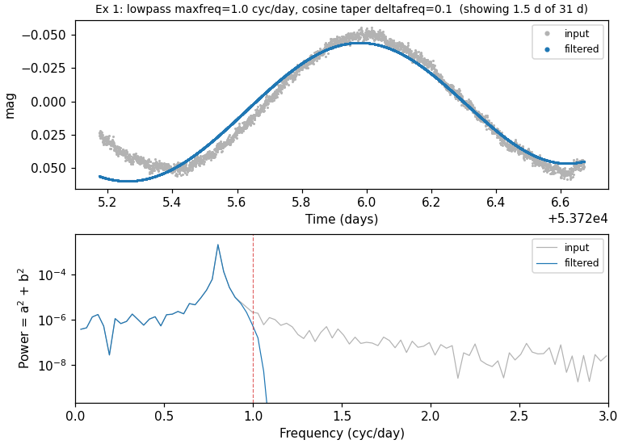
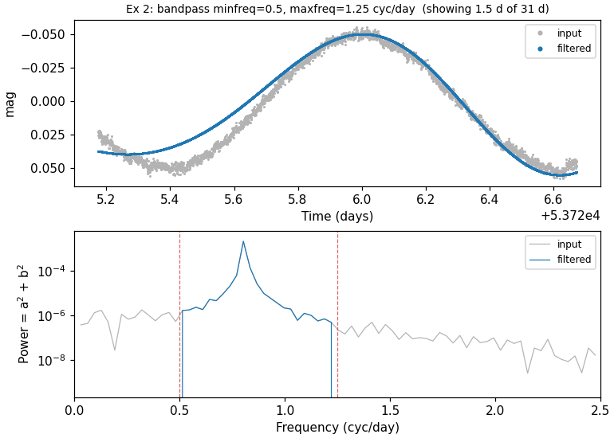
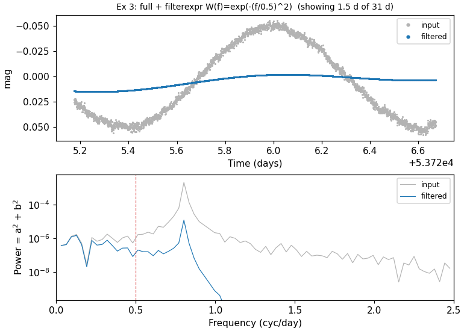
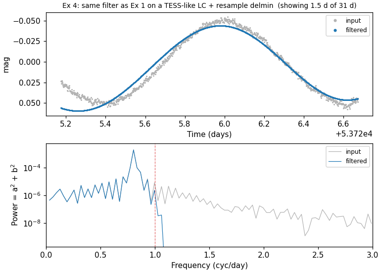
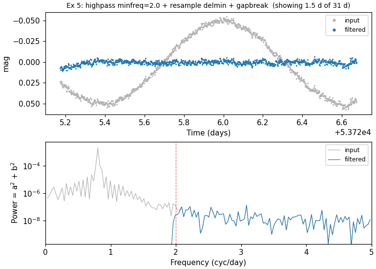

# Filtering & Detrending

Commands that reject outliers, smooth the light curve, or remove ensemble-level systematics.

---

### `clip` — Sigma clipping

**Syntax**

```python
cmd.clip(sigclip, iterative=True, niter=None, median=False,
         markclip=None, noinitmark=False, maskpoints=None)
```

**Description**

Sigma-clip outliers from the light curve. Points with errors `≤ 0` or NaN magnitude values are always removed. If `sigclip ≤ 0`, sigma-clipping is disabled but invalid points are still dropped. With `iterative=True` (the default) the clipping loop repeats until no further points are removed; pass `iterative=False` for a single pass, or set `niter` to clip a fixed number of times. Use `median=True` to clip relative to the median rather than the mean. The `markclip` keyword tags points instead of removing them — surviving points are set to `1`, clipped points to `0` — leaving the LC length unchanged.

CLI equivalent: [`-clip`](../../cli/filtering.md#-clip).

**Parameters**

| Parameter | Type | Description |
|-----------|------|-------------|
| `sigclip` | `float` or `str` | Clipping threshold in units of the standard deviation. Accepts a number, variable name, or expression string. |
| `iterative` | `bool` | Repeat clipping until no points are removed (default `True`). |
| `niter` | `int`, `str`, or `None` | Clip at most this many times (overrides `iterative`). Accepts a number, variable name, or expression. |
| `median` | `bool` | Clip relative to the median instead of the mean. |
| `markclip` | `str` or `None` | Variable name to record the clipping mask (`1` = kept, `0` = clipped). The light curve length is unchanged when this is set. |
| `noinitmark` | `bool` | Treat existing values of the `markclip` variable as an initial mask: only points with `markclip = 1` are considered for further clipping. |
| `maskpoints` | `str` or `None` | Mask variable; points with `maskvar ≤ 0` are excluded from the clipping statistics. |

**Output**

Suffix `N` is the pipeline command index:

| Column | Description |
|--------|-------------|
| `Nclip_N` | Number of points removed by the clip step. |

**Examples**

```python
lc = vt.LightCurve.from_file("EXAMPLES/5")

# Compute RMS, apply 3-sigma clipping, compute RMS of clipped LC
result = (
    lc.rms()
      .clip(3.0)
      .rms()
)
print(result.vars["Nclip_1"])    # 51 points removed
print(result.vars["RMS_2"])      # RMS after clipping
```


---

### `medianfilter` — Median filtering

**Syntax**

```python
cmd.medianfilter(time, method="median", replace=False)
```

**Description**

Apply a sliding-window high-pass or low-pass filter to the light curve. By default the local median magnitude (computed over points within `time` of each observation) is **subtracted** from each point — a high-pass filter. Set `method="average"` or `method="weightedaverage"` to use the running mean instead. Pass `replace=True` to **replace** each point with the running statistic rather than subtracting it, converting the operation to a low-pass filter.

CLI equivalent: [`-medianfilter`](../../cli/filtering.md#-medianfilter).

**Parameters**

| Parameter | Type | Description |
|-----------|------|-------------|
| `time` | `float` or `str` | Half-window width in the same units as the time coordinate. Accepts var/expr forms. |
| `method` | `str` | Local statistic: `"median"` (default), `"average"` (running mean), or `"weightedaverage"` (uncertainty-weighted mean). |
| `replace` | `bool` | When `True`, replace each point with the running statistic (low-pass filter). When `False` (default), subtract the statistic (high-pass filter). |

**Output**

`medianfilter` modifies the light curve in place and produces no per-LC statistics columns. With `replace=False` the magnitude of each point is replaced by `mag − running_statistic`; with `replace=True` it is replaced by the running statistic itself. Downstream commands operate on the filtered light curve.

**Examples**

```python
lc = vt.LightCurve.from_file("EXAMPLES/1")

# High-pass and low-pass median filter: save LC, process both ways
pipe = (vt.Pipeline()
        .chi2()
        .savelc()
        .medianfilter(0.05)
        .chi2()
        .restorelc(savenumber=1)
        .medianfilter(0.05, replace=True)
        .chi2())
result = pipe.run(lc)
print(result.vars["Chi2_0"])   # original
print(result.vars["Chi2_3"])   # after high-pass filter
print(result.vars["Chi2_6"])   # after low-pass filter
```


---

### `harmonicfilter` — Harmonic series subtraction

**Syntax**

```python
cmd.harmonicfilter(period="ls", nharm=3, nsubharm=0, save_model=False,
                   fitonly=False, output_format=None, clip=None,
                   maskpoints=None)
```

**Description**

Fit and (by default) subtract a truncated Fourier series at one or more *known* periods, whitening the light curve against those periods. The model has the form

```
sum_i [ sum_{k=0}^{Nharm}(a_{i,k} sin(2π(k+1) f_i t) + b_{i,k} cos(2π(k+1) f_i t))
      + sum_{k=0}^{Nsubharm}(c_{i,k} sin(2π f_i t/(k+1)) + d_{i,k} cos(2π f_i t/(k+1))) ]
```

By default the whitened light curve is passed downstream; pass `fitonly=True` to fit without subtracting. Use `harmonicfilter` when you know the period(s) you want to remove. For full-band filtering without a known period use [`fourierfilter`](#fourierfilter-full-band-fourier-domain-filter).

`cmd.Killharm(...)` is accepted as a backward-compatible synonym (it invokes
the same vartools command under the ``-Killharm`` token and produces output
columns under the legacy ``Killharm_*`` prefix; the new class produces
``HarmonicFilter_*``).  New code should use `cmd.harmonicfilter`.

CLI equivalent: [`-harmonicfilter`](../../cli/filtering.md#-harmonicfilter).

**Parameters**

| Parameter | Type | Description |
|-----------|------|-------------|
| `period` | `float` or `str` | Period to fit. Can be a number or `"ls"`, `"aov"`, `"bls"`, `"both"`, `"injectharm"`, `"fixcolumn NAME"`, or `"fix val1 val2..."` for multiple periods. |
| `nharm` | `int` | Number of higher harmonics (frequencies `2f₀, 3f₀, … (Nharm+1)f₀`). |
| `nsubharm` | `int` | Number of sub-harmonics (frequencies `f₀/2, f₀/3, … f₀/(Nsubharm+1)`). |
| `save_model` | `bool`, `str`, or `Output` | Auxiliary file output. `True` captures as `result.files["harmonicfilter_model_N"]` (or `"Killharm_model_N"` when called as `cmd.Killharm`). See [Auxiliary output files](index.md#auxiliary-output-files). |
| `fitonly` | `bool` | Fit the model but do not subtract it (statistics are still computed). |
| `output_format` | `str` or `None` | Coefficient output format: `"outampphase"`, `"outampradphase"`, `"outRphi"`, or `"outRradphi"`. |
| `clip` | `float` or `None` | Sigma-clipping threshold: fit, clip outliers, then refit. |
| `maskpoints` | `str` or `None` | Mask variable; points with `maskvar ≤ 0` are excluded from the fit. |

!!! tip "Back-references work across chain steps"
    `period` accepts `"ls"`, `"aov"`, `"bls"`, `"both"`, `"injectharm"`, and `"fixcolumn NAME"`. For `"aov"`, the most recent prior `-aov` *or* `-aov_harm` wins (whichever ran later). All of these resolve equally inside a single `Pipeline` or across chain boundaries. `"both"` supplies two periods (LS + AOV) and works in a single-LC chain, but raises `NotImplementedError` in batch-chain mode — use a single `Pipeline` invocation for batch `"both"` fitting. Missing prior command → `LookupError`.

**Output**

Suffix `N` is the pipeline command index; per-period coefficients are tagged with a `Per<k>` segment (`k` = 1, 2, … is the 1-based period index when more than one period is fit):

| Column | Description |
|--------|-------------|
| `HarmonicFilter_Mean_Mag_N` | Mean magnitude after the fit. |
| `HarmonicFilter_Period_k_N` | Period(s) used in the fit (one column per period). |
| `HarmonicFilter_Per<k>_Amplitude_N` | Peak-to-trough amplitude of the best-fit model at period `k`. |
| `HarmonicFilter_Per<k>_Fundamental_*_N`, `HarmonicFilter_Per<k>_Harm_<n>_*_N`, `HarmonicFilter_Per<k>_Subharm_<n>_*_N` | Per-period harmonic coefficients in one of four representations selected by `output_format` (default `{Sin,Cos}coeff`; `outampphase` → `{Amp,Phi}` in cycles; `outampradphase` → `{Amp,Phi}` in radians; `outRphi`/`outRradphi` → relative `R`/`Phi` representations). |

When called via the legacy `Killharm` synonym, columns appear under the `Killharm_*` prefix.

When `save_model` is enabled:

| File key | Description |
|----------|-------------|
| `result.files["harmonicfilter_model_N"]` | DataFrame: time, original magnitude, and the best-fit harmonic model. (`result.files["Killharm_model_N"]` when invoked via `cmd.Killharm`.) |

**Examples**

**Example 1.** Search `EXAMPLES/2` with Lomb-Scargle, then fit and subtract a sinusoid at the LS period. The two `rms`/`chi2` calls show the residual statistics before and after subtraction.

```python
lc = vt.LightCurve.from_file("EXAMPLES/2")
pipe = (vt.Pipeline()
        .LS(0.1, 10.0, 0.1, npeaks=1)
        .rms()
        .chi2()
        .harmonicfilter("ls", nharm=0, nsubharm=0)
        .rms()
        .chi2())
result = pipe.run(lc)
```

**Example 2.** Fit a 10-harmonic Fourier model to the RR Lyrae light curve `EXAMPLES/M3.V006.lc` at a fixed 0.514333-day period. The model is saved (`save_model`), the LC is left unchanged (`fitonly=True`), and amplitudes/phases are reported in the relative `R_k1, φ_k1` form (`output_format="outRphi"`) — that representation can be fed directly to `Injectharm` to inject the same RR-Lyrae shape with a different overall amplitude or phase.

```python
lc = vt.LightCurve.from_file("EXAMPLES/M3.V006.lc")
result = lc.harmonicfilter(period="fix 0.514333", nharm=10, nsubharm=0,
                           save_model="EXAMPLES/OUTDIR1",
                           fitonly=True,
                           output_format="outRphi")
```


---

### `fourierfilter` — Full-band Fourier-domain filter

**Syntax**

```python
cmd.fourierfilter(mode="full", minfreq=None, maxfreq=None,
                  filterexpr=None, freqvar=None,
                  fullspec=False, forcefft=False,
                  taper=None, taper_deltafreq=None, taper_beta=None,
                  resample=None,
                  gapbreak_type=None, gapbreak_value=None,
                  padmode=None, padfrac=None,
                  nowarn=False, save_fouriercoeffs=False)
```

**Description**

Apply a Fourier-domain filter to the whole light curve.  A band filter and/or an analytic `filterexpr` is applied in frequency space using GSL's mixed-radix complex FFT, and the filtered light curve replaces the input.  Distinct from `harmonicfilter`, which fits a Fourier series at one or more *known* periods; use `fourierfilter` when you want to keep or reject a *frequency band* without specifying any period in advance.

There are two algorithmic paths:

1. **Uniform sampling (or `forcefft=True`)** — the FFT runs directly on the input samples.
2. **`resample=<delta>`** — the LC is linearly interpolated onto a uniform grid first, FFT-filtered, IFFT-reconstructed, then interpolated back to the original sample times.  Required for non-uniformly sampled data; can be combined with `gapbreak_type`/`gapbreak_value` to filter each segment of a gapped LC independently.

!!! note "Non-uniform sampling without `resample`"
    If the LC is detected as non-uniform and `resample` is not given (and `forcefft` is not given either), the command prints a warning to stderr and **skips the filter for that LC** — the `mag` column passes through unchanged.  Subsequent LCs and subsequent pipeline commands continue normally.  Set `nowarn=True` to silence the warning in batch use.

CLI equivalent: [`-fourierfilter`](../../cli/filtering.md#-fourierfilter).

**Parameters**

| Parameter | Type | Description |
|-----------|------|-------------|
| `mode` | `str` | One of `"full"`, `"highpass"`, `"lowpass"`, `"bandpass"`, `"bandcut"`. |
| `minfreq` | `float` or `str`, conditional | Low-frequency cutoff (cycles per time-unit).  Required for `highpass`/`bandpass`/`bandcut`.  Accepts the var/expr/fixcolumn forms. |
| `maxfreq` | `float` or `str`, conditional | High-frequency cutoff.  Required for `lowpass`/`bandpass`/`bandcut`. |
| `filterexpr` | `str`, optional | Analytic filter `W(f)` multiplied into every Fourier coefficient.  The frequency variable defaults to `f`; use `freqvar` to rename. |
| `freqvar` | `str`, optional | Override the variable name used in `filterexpr`. |
| `fullspec` | `bool` | Compute coefficients across the full Nyquist range even when the band is narrower (useful with `save_fouriercoeffs`). |
| `forcefft` | `bool` | Force the direct-FFT path even when sampling is not detected as uniform. |
| `taper` | `str`, optional | Smooth-edge taper at each cut: `"linear"`, `"cosine"` (aliases `"tukey"`, `"hann"`), `"blackman"`, or `"kaiser"`. |
| `taper_deltafreq` | `float`, conditional | Half-width of the taper window in frequency units.  Required when `taper` is given. |
| `taper_beta` | `float`, conditional | Shape parameter for `taper="kaiser"` (≈5 ≈ Hann-like). |
| `resample` | `float`, `str`, or `None` | Enable the resample-FFT-IFFT-resample path.  Accepts `"delmin"` (LC's minimum `dt`), a positive number (fixed `Δt`), or a string expression. |
| `gapbreak_type` | `str`, optional | Split the resampled LC at gaps and filter each segment independently: `"fix"`, `"expr"`, `"frac_min_sep"`, `"frac_med_sep"`, or `"percentile_sep"`.  Requires `resample`. |
| `gapbreak_value` | `float` or `str`, conditional | Threshold value for the gap-break spec. |
| `padmode` | `str`, optional | Edge padding before the FFT: `"wrap"` (default; native FFT periodicity), `"reflect"`, or `"zero"`. |
| `padfrac` | `float`, optional | Pad length per side as a fraction of segment length.  Default 0.5 for `reflect`/`zero`, 0 for `wrap`. |
| `nowarn` | `bool` | Suppress per-LC runtime warnings (non-uniform advisory, gap-vs-minfreq, taper-edge overlap, etc.). |
| `save_fouriercoeffs` | `bool`, `str`, or `Output` | Write Fourier cos/sin coefficients to a file.  `True` captures as `result.files["fourierfilter_fouriercoeffs_N"]`.  See [Auxiliary output files](index.md#auxiliary-output-files). |

**Output**

Suffix `N` is the pipeline command index:

| Column | Description |
|--------|-------------|
| `FourierFilter_Mean_Mag_N` | Weighted mean magnitude (the FFT DC term; preserved across the filter). |
| `FourierFilter_RMS_In_N` | RMS of the input light curve. |
| `FourierFilter_RMS_Out_N` | RMS of the filtered light curve. |
| `FourierFilter_Nfreqcalc_N` | Total positive-frequency FFT bins computed up to Nyquist (`Ntot/2`, summed across gap-break segments). |
| `FourierFilter_Nfreqfilt_N` | Bins falling inside the filter pass band; equals `Nfreqcalc` for `mode="full"`. |

When `save_fouriercoeffs` is set:

| File key | Description |
|----------|-------------|
| `result.files["fourierfilter_fouriercoeffs_N"]` | DataFrame with frequency vs. cos/sin coefficient pair (and a second pair when `filterexpr` is set, for pre/post-filter coefficients). |

**Examples**

These mirror the five CLI examples on the [`-fourierfilter` reference page](../../cli/filtering.md#-fourierfilter).  Examples 1–3 use the uniformly-sampled light curve `EXAMPLES/2.simuniformsample`; examples 4–5 use `EXAMPLES/2.simtesssample` — the same underlying signal as 1–3, re-sampled at TESS short-cadence (~2 min) over a single 27-day sector with a ~1-day data-downlink gap mid-sector — and exercise the `resample` and `gapbreak_*` keywords.

**Example 1.** Low-pass filter at 1.0 cycles/day with a cosine taper to suppress Gibbs ringing at the cut edge.

```python
lc = vt.LightCurve.from_file("EXAMPLES/2.simuniformsample")
result = (vt.Pipeline()
          .rms()
          .fourierfilter(mode="lowpass", maxfreq=1.0,
                         taper="cosine", taper_deltafreq=0.1)
          .rms()).run(lc)
print(result.vars[["RMS_0", "FourierFilter_RMS_Out_1", "RMS_2"]])
```



**Example 2.** Band-pass filter between 0.5 and 1.25 cycles/day — chosen to enclose the ~0.81 cyc/day injected signal.  `save_fouriercoeffs=Output(..., capture=True)` writes the Fourier coefficients to disk *and* captures them as a DataFrame in `result.files`; pass a bare path string for the write-only form.

```python
lc = vt.LightCurve.from_file("EXAMPLES/2.simuniformsample")
result = lc.fourierfilter(mode="bandpass", minfreq=0.5, maxfreq=1.25,
                          save_fouriercoeffs=vt.Output("EXAMPLES/OUTDIR1",
                                                       capture=True))
coeffs = result.files["fourierfilter_fouriercoeffs_0"]
print(f"{len(coeffs)} frequency bins, columns: {list(coeffs.columns)}")
```



**Example 3.** Apply an analytic Gaussian filter `W(f) = exp(-(f/0.5)²)` to every Fourier coefficient on a full-band fit.  The variable `f` in the expression is in cycles per time-unit (cycles/day here); vartools' expression parser uses `^` for exponentiation.

```python
lc = vt.LightCurve.from_file("EXAMPLES/2.simuniformsample")
result = (vt.Pipeline()
          .rms()
          .fourierfilter(mode="full", filterexpr="exp(-(f/0.5)^2)")
          .rms()).run(lc)
print(result.vars[["RMS_0", "FourierFilter_RMS_Out_1", "RMS_2"]])
```



**Example 4.** Same low-pass filter as Example 1, applied to the TESS-like LC.  The data-downlink gap makes the sampling non-uniform, so `resample="delmin"` is required: the LC is interpolated onto a uniform grid at the minimum `dt`, FFT-filtered, then interpolated back.

```python
lc = vt.LightCurve.from_file("EXAMPLES/2.simtesssample")
result = (vt.Pipeline()
          .rms()
          .fourierfilter(mode="lowpass", maxfreq=1.0,
                         taper="cosine", taper_deltafreq=0.1,
                         resample="delmin")
          .rms()).run(lc)
print(result.vars[["RMS_0", "FourierFilter_RMS_Out_1", "RMS_2"]])
```



**Example 5.** High-pass filter with gap-break on the TESS-like LC.  `gapbreak_type="frac_med_sep", gapbreak_value=100` splits the light curve at any inter-sample gap wider than 100 × the median `dt`; only the ~1-day data-downlink gap qualifies, so the LC is filtered as two independent segments.  For `highpass`/`bandpass` modes all segments are anchored at the overall-LC weighted mean, so there are no inter-segment jumps.

```python
lc = vt.LightCurve.from_file("EXAMPLES/2.simtesssample")
result = (vt.Pipeline()
          .rms()
          .fourierfilter(mode="highpass", minfreq=2.0,
                         taper="cosine", taper_deltafreq=0.1,
                         resample="delmin",
                         gapbreak_type="frac_med_sep", gapbreak_value=100)
          .rms()).run(lc)
print(result.vars[["RMS_0", "FourierFilter_RMS_Out_1", "RMS_2"]])
```



---

### `restricttimes` / `restoretimes` — Time windowing

**Syntax**

```python
cmd.restricttimes(mode="JDrange", minJD=None, maxJD=None,
                  JDfilename=None, expression=None, exclude=False,
                  markrestrict=None, noinitmark=False)
cmd.restoretimes(prior_command=1)
```

**Description**

`restricttimes` filters observations from the light curve based on time, string IDs, or an analytic expression. By default only points **matching** the criterion are kept; pass `exclude=True` to **remove** matching points instead. Available modes are `"JDrange"` (a single JD interval applied to every LC), `"JDrangebylc"` (per-LC interval), `"JDlist"`/`"imagelist"` (read times or string IDs from a file), and `"expr"` (keep points where a boolean expression evaluates to `> 0`). With `markrestrict` set, points are tagged rather than removed: kept points get `markrestrict=1`, dropped points get `0`, and the light curve length is preserved.

`restoretimes` re-attaches points removed by a prior `restricttimes` command (referenced by 1-based pipeline index). Restored points are appended and the light curve is re-sorted by time. `restoretimes` cannot be used together with a `markrestrict`-style restriction.

CLI equivalent: [`-restricttimes`](../../cli/filtering.md#-restricttimes) and [`-restoretimes`](../../cli/filtering.md#-restoretimes).

**Parameters** (`restricttimes`)

| Parameter | Type | Description |
|-----------|------|-------------|
| `mode` | `str` | One of `"JDrange"`, `"JDrangebylc"`, `"JDlist"`, `"imagelist"`, `"expr"`. |
| `minJD`, `maxJD` | `float`, `str`, or `None` | JD bounds for `"JDrange"` / `"JDrangebylc"`. |
| `JDfilename` | `str` or `None` | File with allowed JD values (`"JDlist"`) or string IDs (`"imagelist"`). |
| `expression` | `str` or `None` | Boolean expression for `"expr"` mode (kept where `>0`). |
| `exclude` | `bool` | Invert the selection — remove matching points instead of keeping them. |
| `markrestrict` | `str` or `None` | Variable name to mark kept (`1`) and dropped (`0`) points instead of removing them. |
| `noinitmark` | `bool` | Treat existing `markrestrict` values as an initial mask. |

**Parameters** (`restoretimes`)

| Parameter | Type | Description |
|-----------|------|-------------|
| `prior_command` | `int` | 1-based index of the `restricttimes` step to undo. |

**Output**

Suffix `N` is the pipeline command index:

| Column | Description |
|--------|-------------|
| `RestrictTimes_MinJD_N` / `RestrictTimes_MaxJD_N` | When `mode="JDrange"` or `"JDrangebylc"`, the JD range applied to this light curve. |

`restoretimes` emits no statistics columns — it modifies the active light curve in place by re-appending the previously removed points.

**Examples**

**Example 1.** Restrict `EXAMPLES/3` to `53740 < t < 53750`. The two `stats` calls show the timespan before and after the cut.

```python
lc = vt.LightCurve.from_file("EXAMPLES/3")
pipe = (vt.Pipeline()
        .stats("t", "min,max")
        .restricttimes(mode="JDrange", minJD=53740, maxJD=53750)
        .stats("t", "min,max"))
result = pipe.run(lc)
```

**Example 2.** Restrict using a boolean expression on magnitude.

```python
pipe = (vt.Pipeline()
        .restricttimes(mode="expr",
                       expression="(mag>10.16311)&&(mag<10.17027)"))
result = pipe.run(lc, capture_lc=True)
```

**Example 3.** Cut by 20th–80th percentile of the magnitude distribution.

```python
pipe = (vt.Pipeline()
        .stats("mag", "pct20.0,pct80.0")
        .restricttimes(mode="expr",
                       expression="(mag>STATS_mag_PCT20_00_0)&&"
                                  "(mag<STATS_mag_PCT80_00_0)")
        .stats("mag", "min,max"))
result = pipe.run(lc)
```

**Example 4.** Restrict to a JD window, compute statistics, then restore the full light curve. The three `rms` calls show the full LC is recovered.

```python
pipe = (vt.Pipeline()
        .rms()
        .restricttimes(mode="JDrange", minJD=53740, maxJD=53750)
        .rms()
        .restoretimes(prior_command=1)
        .rms())
result = pipe.run(lc)
```

For a phased illustration, the next figure shows `EXAMPLES/3.transit` phased on its BLS period before and after `restricttimes(mode="expr", expression="(t<0.48)||(t>0.52)")` removes the in-transit points:


---

### `TFA` — Trend Filtering Algorithm

**Syntax**

```python
cmd.TFA(trendlist, dates_file, pixelsep, correct_lc=True,
        save_coeffs=False, save_model=False, xycol=None,
        clip=None, usemedian=False, useMAD=False,
        readformat=None, trend_coeff_priors=None,
        weight_by_template_stddev=False, fitmask=None,
        outfitmask=None)
```

**Description**

Run the Trend Filtering Algorithm (Kovács, Bakos & Noyes 2005) on the light curves. TFA fits each LC as a linear combination of a set of template (basis) light curves and subtracts the fit, yielding a detrended LC. A light-curve list (`run_filelist`) is required, and the `x`/`y` pixel positions of each LC must be available as columns in the list. Trend stars within `pixelsep` of the source are excluded to avoid self-filtering.

CLI equivalent: [`-TFA`](../../cli/filtering.md#-tfa).

**Parameters**

| Parameter | Type | Description |
|-----------|------|-------------|
| `trendlist` | `str` | Path to a file listing the trend (template) light curves. Each row: `trendname trendx trendy`. |
| `dates_file` | `str` | Path to the dates file (column 1: filename/id; column 2: JD). |
| `pixelsep` | `float` | Maximum pixel separation for selecting trend stars. Templates closer than this to the source are excluded. |
| `correct_lc` | `bool` | Subtract the TFA model from the light curve. Default `True`. |
| `save_coeffs` | `bool`, `str`, or `Output` | Per-LC trend coefficients. `True` captures as `result.files["TFA_coeffs_N"]`. See [Auxiliary output files](index.md#auxiliary-output-files). |
| `save_model` | `bool`, `str`, or `Output` | Per-LC TFA model. `True` captures as `result.files["TFA_model_N"]`. |
| `xycol` | `(int, int)` or `None` | Column numbers `(xcol, ycol)` for pixel coordinates in the trend list. |
| `clip` | `float` or `None` | Sigma-clipping threshold during TFA fitting (default 5σ when set). |
| `usemedian` | `bool` | Use median instead of mean as the clipping reference. |
| `useMAD` | `bool` | Use MAD instead of standard deviation for the clipping scatter. |
| `readformat` | `tuple` or `None` | `(Nskip, jdcol, magcol)` non-default light-curve read format. |
| `trend_coeff_priors` | `str` or `None` | Path to a Gaussian-prior file for trend coefficients. |
| `weight_by_template_stddev` | `bool` | Weight points by `1/ave_template_stddev` instead of `1/err`. |
| `fitmask` | `str` or `None` | Mask variable; only points where `fitmask = 1` are included in the trend fit. The model is still evaluated and subtracted at excluded points. |
| `outfitmask` | `str` or `None` | Variable name to record the post-clipping fit mask. |

**Output**

Suffix `N` is the pipeline command index:

| Column | Description |
|--------|-------------|
| `TFA_MeanMag_N` | Out-of-fit mean magnitude. |
| `TFA_RMS_N` | Post-filter RMS. |

When `save_*` keywords are set:

| File key | Description |
|----------|-------------|
| `result.files["TFA_coeffs_N"]` | DataFrame: trend coefficients for each template. |
| `result.files["TFA_model_N"]` | DataFrame: the TFA model evaluated at each observation. |

**References**

Kovács, Bakos & Noyes 2005, MNRAS, 356, 557.

**Examples**

**Example 1.** Apply TFA to the light curves in `EXAMPLES/lc_list_tfa` (`EXAMPLES/3.transit` is the only LC in the list); trend stars within 25 pixels of the source are excluded.

```python
batch = (vt.Pipeline()
         .rms()
         .TFA(trendlist="EXAMPLES/trendlist_tfa",
              dates_file="EXAMPLES/dates_tfa",
              pixelsep=25.0, xycol=(2, 3),
              correct_lc=True)
         ).run_filelist("EXAMPLES/lc_list_tfa")
```

---

### `TFA_SR` — TFA with signal reconstruction

**Syntax**

```python
cmd.TFA_SR(trendlist, dates_file, pixelsep, dotfafirst=1,
           tfathresh=0.001, maxiter=10, signal_mode="bin",
           signal_params=None, signal_period=None,
           correct_lc=True, decorr_params=None, ...)
```

**Description**

Run TFA in Signal Reconstruction (SR) mode. TFA-SR iteratively applies TFA and fits a signal model to the light curve, allowing the algorithm to preserve astrophysical signal that would otherwise be partially filtered out by plain TFA. The signal model is selected by `signal_mode`: `"bin"` (phase-binned), `"signal"` (read from a per-LC signal file), or `"harm"` (truncated Fourier series with `signal_params=(Nharm, Nsubharm)`). Most other parameters mirror `TFA` — see that command for the shared keywords.

CLI equivalent: [`-TFA_SR`](../../cli/filtering.md#-tfa_sr).

**Parameters** (in addition to those of `TFA`)

| Parameter | Type | Description |
|-----------|------|-------------|
| `dotfafirst` | `int` | `1` = apply TFA first each iteration, then fit the signal to the residual; `0` = subtract the signal first, then apply TFA. |
| `tfathresh` | `float` | Iteration stops when the fractional RMS change falls below this threshold. |
| `maxiter` | `int` | Maximum number of TFA-SR iterations. |
| `signal_mode` | `str` | Signal-model type: `"bin"`, `"signal"`, or `"harm"`. |
| `signal_params` | varies | For `"bin"`: `nbins` (`int`). For `"signal"`: filename (`str`). For `"harm"`: `(Nharm, Nsubharm)` tuple. |
| `signal_period` | `float`, `str`, or `None` | Period sub-option for `"bin"` or `"harm"` signal modes. Float emits `"period" val`; string keyword `"ls"`, `"aov"`, or `"bls"` inherits the best period from the most recent matching prior command. The keyword resolves equally in a single `Pipeline` and across chain steps. Missing prior command → `LookupError`. |
| `decorr_params` | `str` or `None` | Raw token string for simultaneous EPD decorrelation, e.g. `"0 2 col1 1 col2 2"` (`iterativeflag Nlcterms lccolumn1 lcorder1 ...`). |

**Output**

Suffix `N` is the pipeline command index:

| Column | Description |
|--------|-------------|
| `TFA_SR_MeanMag_N` | Out-of-fit mean magnitude. |
| `TFA_SR_RMS_N` | Post-filter RMS. |

When `save_*` keywords are set, file keys mirror those of `TFA` (`result.files["TFA_coeffs_N"]`, `result.files["TFA_model_N"]`).

**References**

Kovács, Bakos & Noyes 2005, MNRAS, 356, 557.

!!! warning "Known issue"
    The current wrapper emits the `xycol` block *before* the positional `pixelsep` value, which the CLI rejects. Until that is fixed in pyvartools, examples that need `xycol` should drop down to `subprocess.run`.

**Examples**

The canonical TFA_SR example involves several steps (LS / Killharm before-after / TFA / TFA_SR) and the `xycol` issue noted above. The shortest runnable Python equivalent goes via `subprocess`:

```python
import subprocess
subprocess.run([
    "vartools",
    "-l", "EXAMPLES/lc_list_tfa_sr_harm", "-oneline", "-rms",
    "-LS", "0.1", "10.", "0.1", "1", "0",
    "-savelc",
    "-Killharm", "ls", "0", "0", "0",
    "-rms", "-restorelc", "1",
    "-TFA", "EXAMPLES/trendlist_tfa", "EXAMPLES/dates_tfa",
        "25.0", "xycol", "2", "3", "1", "0", "0",
    "-Killharm", "ls", "0", "0", "0",
    "-rms", "-restorelc", "1",
    "-TFA_SR", "EXAMPLES/trendlist_tfa", "EXAMPLES/dates_tfa",
        "25.0", "xycol", "2", "3", "1",
        "1", "EXAMPLES/OUTDIR1", "1", "EXAMPLES/OUTDIR1",
        "0", "0.001", "100", "harm", "0", "0", "period", "ls",
    "-o", "EXAMPLES/OUTDIR1", "nameformat", "2.test_tfa_sr_harm",
    "-Killharm", "ls", "0", "0", "0",
    "-rms", "-restorelc", "1",
], check=True)
```

---

### `SYSREM` — Systematic noise removal

**Syntax**

```python
cmd.SYSREM(ninput_color, ninput_airmass, initial_airmass_file,
           sigma_clip1=5.0, sigma_clip2=5.0, saturation=1e9,
           correct_lc=True, save_model=False, save_trends=False,
           useweights=1, col=None)
```

**Description**

Run the SYSREM PCA-like algorithm of Tamuz, Mazeh & Zucker (2005) to identify and remove ensemble trends from a set of light curves. SYSREM iteratively fits a small number of "color"-like (per-star) and "airmass"-like (per-image) terms to the residuals and subtracts them. This command requires a light-curve list (`run_filelist`) and automatically sets the `-readall` option.

CLI equivalent: [`-SYSREM`](../../cli/filtering.md#-sysrem).

**Parameters**

| Parameter | Type | Description |
|-----------|------|-------------|
| `ninput_color` | `int` | Number of initial "color"-like (per-star) trends. Values are read from the input light-curve list. |
| `col` | `int` or `None` | Column in the input list for the first color term (subsequent terms follow in order). |
| `ninput_airmass` | `int` | Number of initial "airmass"-like (per-image) trends. |
| `initial_airmass_file` | `str` | File with initial airmass trends (column 1: JD; subsequent columns: trend values). |
| `sigma_clip1` | `float` | σ-clipping threshold for the mean-magnitude calculation. |
| `sigma_clip2` | `float` | σ-clipping threshold for which points contribute to the airmass/color terms. |
| `saturation` | `float` | Magnitudes brighter than this value do not contribute to the fit. |
| `correct_lc` | `bool` | Subtract the SYSREM model from each light curve. |
| `save_model` | `bool`, `str`, or `Output` | Per-LC model. `True` captures as `result.files["SYSREM_model_N"]`. See [Auxiliary output files](index.md#auxiliary-output-files). |
| `save_trends` | `bool`, `str`, or `Output` | Single global trend file (the converged airmass/color trend vectors for the run). `True` writes to a default path inside the per-command output directory and captures as `result.files["SYSREM_trends_N"]`; pass a string path to write to a specific file (and still capture). |
| `useweights` | `int` | `1` to weight observations by their formal uncertainties; `0` to weight uniformly. |

**Output**

Suffix `N` is the pipeline command index:

| Column | Description |
|--------|-------------|
| `SYSREM_MeanMag_N` | Mean magnitude after SYSREM. |
| `SYSREM_RMS_N` | Post-filter RMS. |
| `SYSREM_Trend_<k>_Coeff_N` | Per-LC trend coefficient for trend `k` (`k = 0, 1, … ninput_color + ninput_airmass − 1`). |

When `save_*` keywords are set:

| File key | Description |
|----------|-------------|
| `result.files["SYSREM_model_N"]` | Per-LC SYSREM model (`JD mag mag_model sig clip`). One DataFrame per LC (list-valued in batch results). |
| `result.files["SYSREM_trends_N"]` | Single global trends file: row per JD, columns `JD trend_0 trend_1 … trend_{Ntrends−1}` where `Ntrends = ninput_color + ninput_airmass`. **Single DataFrame** (not a list) — the file is shared across the whole batch. |

**References**

Tamuz, Mazeh & Zucker 2005, MNRAS, 356, 1466.

**Examples**

**Example 1.** Apply SYSREM to the light curves listed in `EXAMPLES/trendlist_tfa`. Two color-like terms (cols 2 and 3 of the list) and one airmass-like term (the time series in `EXAMPLES/3`) are used; the corrected light curves are passed downstream, and both the per-LC SYSREM models and the single global trends file are captured.

```python
batch = (vt.Pipeline()
         .rms()
         .SYSREM(ninput_color=2, ninput_airmass=1,
                 initial_airmass_file="EXAMPLES/3",
                 sigma_clip1=5.0, sigma_clip2=5.0,
                 saturation=8.0,
                 correct_lc=True,
                 save_model=True,
                 save_trends=True,
                 useweights=1)
         .rms()
         ).run_filelist("EXAMPLES/trendlist_tfa")
trends = batch.files["SYSREM_trends_1"]   # single DataFrame: JD + 3 trend columns
print(trends.shape, trends.head())
```

---
