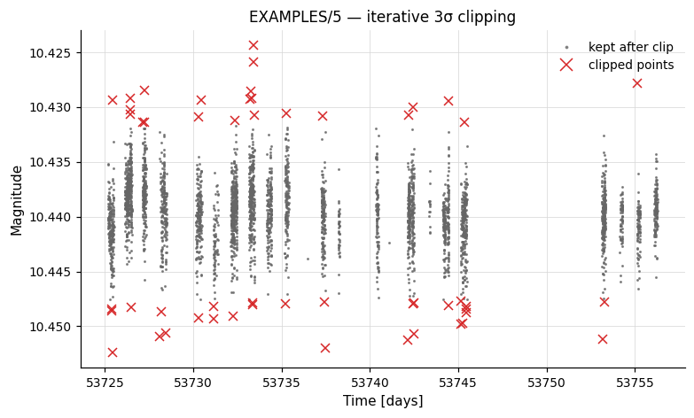
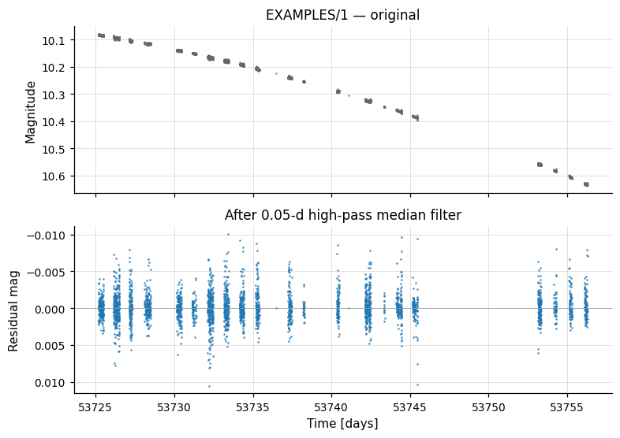
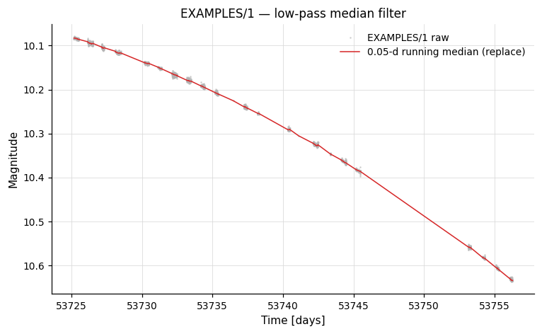
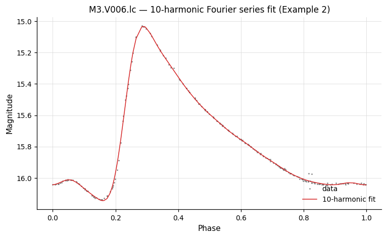
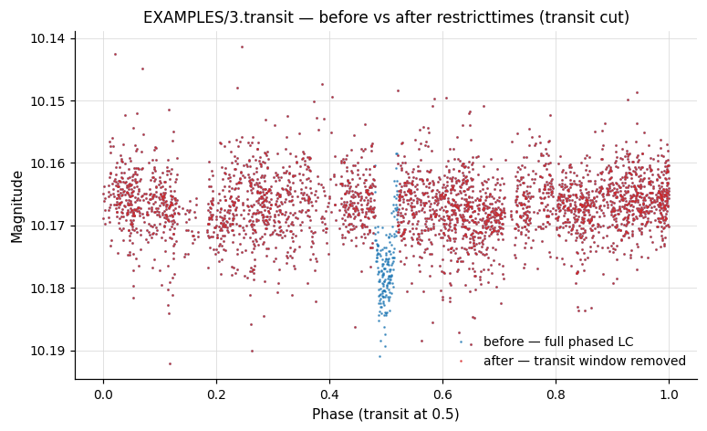

# Filtering & Detrending

Commands that reject outliers, smooth the light curve, or remove ensemble-level systematics.

---

## `clip` — Sigma clipping

```python
cmd.clip(sigclip, iterative=True, niter=None, median=False,
         markclip=None, noinitmark=False, maskpoints=None)
```

| Parameter | Type | Description |
|-----------|------|-------------|
| `sigclip` | `float` or `str` | Clipping threshold in units of standard deviation. Accepts a number, variable name, or expression string. |
| `iterative` | `bool` | Repeat clipping until no points are removed (default `True`). |
| `niter` | `int`, `str`, or `None` | Clip at most this many times (overrides `iterative`). Accepts a number, variable name, or expression. |
| `median` | `bool` | Clip relative to the median instead of the mean. |
| `markclip` | `str` or `None` | Variable name to record clipping mask (1 = kept, 0 = clipped). |

CLI equivalent: `-clip <sigclip|var|expr> <iter|var|expr> [niter <N|var|expr>] [median] ...`

**Examples**

```python
lc = vt.LightCurve.from_file("EXAMPLES/5")

# Compute RMS, apply 3-sigma clipping, compute RMS of clipped LC
result = (
    lc.rms()
      .clip(3.0)
      .rms()
)
print(result.vars["Nclip_1"])    # 51 points removed
print(result.vars["RMS_2"])      # RMS after clipping
```



---

## `medianfilter` — Median filtering

```python
cmd.medianfilter(time, method="median", replace=False)
```

Apply a sliding-window median (or mean) filter with window width `time`. `replace=True` writes the smoothed values back into the magnitude column.

**Examples**

```python
lc = vt.LightCurve.from_file("EXAMPLES/1")

# High-pass and low-pass median filter: save LC, process both ways
pipe = (vt.Pipeline()
        .chi2()
        .savelc()
        .medianfilter(0.05)
        .chi2()
        .restorelc(savenumber=1)
        .medianfilter(0.05, replace=True)
        .chi2())
result = pipe.run(lc)
print(result.vars["Chi2_0"])   # original
print(result.vars["Chi2_3"])   # after high-pass filter
print(result.vars["Chi2_6"])   # after low-pass filter
```




---

## `harmonicfilter` — Harmonic series subtraction

```python
cmd.harmonicfilter(period="ls", nharm=3, nsubharm=0, save_model=False,
                   fitonly=False, output_format=None, clip=None,
                   maskpoints=None)
```

`cmd.Killharm(...)` is accepted as a backward-compatible synonym (it invokes
the same vartools command under the ``-Killharm`` token and produces output
columns under the legacy ``Killharm_*`` prefix; the new class produces
``HarmonicFilter_*``).  New code should use `cmd.harmonicfilter`.

| Parameter | Type | Description |
|-----------|------|-------------|
| `period` | `float` or `str` | Period to fit. Can be a number or `"ls"`, `"aov"`, `"bls"`, `"both"`, `"injectharm"`, `"fixcolumn NAME"`, or `"fix val1 val2..."` for multiple periods. |
| `nharm` | `int` | Number of harmonics. |
| `nsubharm` | `int` | Number of sub-harmonics. |
| `save_model` | `bool`, `str`, or `Output` | Auxiliary file output. `True` captures as `result.files["harmonicfilter_model_N"]` (or `"Killharm_model_N"` when called as `cmd.Killharm`). See [Auxiliary output files](index.md#auxiliary-output-files). |
| `fitonly` | `bool` | Fit the model but do not subtract it (statistics are still computed). |
| `output_format` | `str` or `None` | Coefficient output format: `"outampphase"`, `"outampradphase"`, `"outRphi"`, or `"outRradphi"`. |
| `clip` | `float` or `None` | Sigma-clipping threshold: fit, clip outliers, then refit. |

!!! tip "Back-references work across chain steps"
    `period` accepts `"ls"`, `"aov"`, `"bls"`, `"both"`, `"injectharm"`, and `"fixcolumn NAME"`. For `"aov"`, the most recent prior `-aov` *or* `-aov_harm` wins (whichever ran later). All of these resolve equally inside a single `Pipeline` or across chain boundaries. `"both"` supplies two periods (LS + AOV) and works in a single-LC chain, but raises `NotImplementedError` in batch-chain mode — use a single `Pipeline` invocation for batch `"both"` fitting. Missing prior command → `LookupError`.

**Examples**

**Example 1.** Search `EXAMPLES/2` with Lomb-Scargle, then fit and subtract a sinusoid at the LS period. The two `rms`/`chi2` calls show the residual statistics before and after subtraction.

```python
lc = vt.LightCurve.from_file("EXAMPLES/2")
pipe = (vt.Pipeline()
        .LS(0.1, 10.0, 0.1, npeaks=1)
        .rms()
        .chi2()
        .harmonicfilter("ls", nharm=0, nsubharm=0)
        .rms()
        .chi2())
result = pipe.run(lc)
```

**Example 2.** Fit a 10-harmonic Fourier model to the RR Lyrae light curve `EXAMPLES/M3.V006.lc` at a fixed 0.514333-day period. The model is saved (`save_model`), the LC is left unchanged (`fitonly=True`), and amplitudes/phases are reported in the relative `R_k1, φ_k1` form (`output_format="outRphi"`) — that representation can be fed directly to `Injectharm` to inject the same RR-Lyrae shape with a different overall amplitude or phase.

```python
lc = vt.LightCurve.from_file("EXAMPLES/M3.V006.lc")
result = lc.harmonicfilter(period="fix 0.514333", nharm=10, nsubharm=0,
                           save_model="EXAMPLES/OUTDIR1",
                           fitonly=True,
                           output_format="outRphi")
```



---

## `restricttimes` / `restoretimes` — Time windowing

```python
cmd.restricttimes(mode="JDrange", minJD=None, maxJD=None,
                  JDfilename=None, expression=None, exclude=False,
                  markrestrict=None, noinitmark=False)
cmd.restoretimes(prior_command=1)
```

`restricttimes` discards observations outside a time window or list. `restoretimes` undoes a prior restriction.

Modes: `"JDrange"` (min/max), `"JDlist"` (file of times), `"expr"` (boolean expression).

**Examples**

**Example 1.** Restrict `EXAMPLES/3` to `53740 < t < 53750`. The two `stats` calls show the timespan before and after the cut.

```python
lc = vt.LightCurve.from_file("EXAMPLES/3")
pipe = (vt.Pipeline()
        .stats("t", "min,max")
        .restricttimes(mode="JDrange", minJD=53740, maxJD=53750)
        .stats("t", "min,max"))
result = pipe.run(lc)
```

**Example 2.** Restrict using a boolean expression on magnitude.

```python
pipe = (vt.Pipeline()
        .restricttimes(mode="expr",
                       expression="(mag>10.16311)&&(mag<10.17027)"))
result = pipe.run(lc, capture_lc=True)
```

**Example 3.** Cut by 20th–80th percentile of the magnitude distribution.

```python
pipe = (vt.Pipeline()
        .stats("mag", "pct20.0,pct80.0")
        .restricttimes(mode="expr",
                       expression="(mag>STATS_mag_PCT20_00_0)&&"
                                  "(mag<STATS_mag_PCT80_00_0)")
        .stats("mag", "min,max"))
result = pipe.run(lc)
```

**Example 4.** Restrict to a JD window, compute statistics, then restore the full light curve. The three `rms` calls show the full LC is recovered.

```python
pipe = (vt.Pipeline()
        .rms()
        .restricttimes(mode="JDrange", minJD=53740, maxJD=53750)
        .rms()
        .restoretimes(prior_command=1)
        .rms())
result = pipe.run(lc)
```

For a phased illustration, the next figure shows `EXAMPLES/3.transit` phased on its BLS period before and after `restricttimes(mode="expr", expression="(t<0.48)||(t>0.52)")` removes the in-transit points:



---

## `TFA` — Trend Filtering Algorithm

```python
cmd.TFA(trendlist, dates_file, pixelsep, correct_lc=True,
        save_coeffs=False, save_model=False, xycol=None,
        clip=None, usemedian=False, useMAD=False,
        readformat=None, trend_coeff_priors=None,
        weight_by_template_stddev=False, fitmask=None,
        outfitmask=None)
```

| Parameter | Type | Description |
|-----------|------|-------------|
| `trendlist` | `str` | Path to a file listing the trend (template) light curves, one per line. |
| `dates_file` | `str` | Path to the dates file (one epoch per line, matching the observation cadence). |
| `pixelsep` | `float` | Maximum pixel separation for selecting trend stars. Stars further than this threshold are excluded. |
| `correct_lc` | `bool` | Subtract the TFA model from the light curve. Default `True`. |
| `save_coeffs` | `bool`, `str`, or `Output` | Auxiliary file output. `True` captures as `result.files["TFA_coeffs_N"]`. See [Auxiliary output files](index.md#auxiliary-output-files). |
| `xycol` | `(int, int)` or `None` | Column numbers `(xcol, ycol)` for pixel coordinates in the trend list. |
| `clip` | `float` or `None` | Sigma-clipping threshold during TFA fitting. |

**Examples**

**Example 1.** Apply TFA to the light curves in `EXAMPLES/lc_list_tfa` (`EXAMPLES/3.transit` is the only LC in the list); trend stars within 25 pixels of the source are excluded.

```python
batch = (vt.Pipeline()
         .rms()
         .TFA(trendlist="EXAMPLES/trendlist_tfa",
              dates_file="EXAMPLES/dates_tfa",
              pixelsep=25.0, xycol=(2, 3),
              correct_lc=True)
         ).run_filelist("EXAMPLES/lc_list_tfa")
```

---

## `TFA_SR` — TFA with signal reconstruction

```python
cmd.TFA_SR(trendlist, dates_file, pixelsep, dotfafirst=1,
           tfathresh=0.001, maxiter=10, signal_mode="bin",
           signal_params=None, signal_period=None,
           correct_lc=True, decorr_params=None, ...)
```

Simultaneous TFA detrending and signal reconstruction. `signal_mode` controls the signal model: `"bin"` (phase-binned), `"signal"` (from file), or `"harm"` (harmonic series with `signal_params=(nharm, nsubharm)`).

| Parameter | Type | Description |
|-----------|------|-------------|
| `signal_period` | `float`, `str`, or `None` | Period sub-option for `"bin"` or `"harm"` signal modes. Float emits `"period" val`; string keyword `"ls"`, `"aov"`, or `"bls"` inherits the best period from the most recent matching prior command. The keyword resolves equally in a single `Pipeline` and across chain steps. Missing prior command → `LookupError`. |
| `decorr_params` | `str` or `None` | Raw token string for simultaneous EPD decorrelation, e.g. `"0 2 col1 1 col2 2"` (iterative_flag Nlcterms lccolumn1 lcorder1 ...). |

!!! warning "Known issue"
    The current wrapper emits the `xycol` block *before* the positional `pixelsep` value, which the CLI rejects. Until that is fixed in pyvartools, examples that need `xycol` should drop down to `subprocess.run`.

**Examples**

The canonical TFA_SR example involves several steps (LS / Killharm before-after / TFA / TFA_SR) and the `xycol` issue noted above. The shortest runnable Python equivalent goes via `subprocess`:

```python
import subprocess
subprocess.run([
    "vartools",
    "-l", "EXAMPLES/lc_list_tfa_sr_harm", "-oneline", "-rms",
    "-LS", "0.1", "10.", "0.1", "1", "0",
    "-savelc",
    "-Killharm", "ls", "0", "0", "0",
    "-rms", "-restorelc", "1",
    "-TFA", "EXAMPLES/trendlist_tfa", "EXAMPLES/dates_tfa",
        "25.0", "xycol", "2", "3", "1", "0", "0",
    "-Killharm", "ls", "0", "0", "0",
    "-rms", "-restorelc", "1",
    "-TFA_SR", "EXAMPLES/trendlist_tfa", "EXAMPLES/dates_tfa",
        "25.0", "xycol", "2", "3", "1",
        "1", "EXAMPLES/OUTDIR1", "1", "EXAMPLES/OUTDIR1",
        "0", "0.001", "100", "harm", "0", "0", "period", "ls",
    "-o", "EXAMPLES/OUTDIR1", "nameformat", "2.test_tfa_sr_harm",
    "-Killharm", "ls", "0", "0", "0",
    "-rms", "-restorelc", "1",
], check=True)
```

---

## `SYSREM` — Systematic noise removal

```python
cmd.SYSREM(ninput_color, ninput_airmass, initial_airmass_file,
           sigma_clip1=5.0, sigma_clip2=5.0, saturation=1e9,
           correct_lc=True, save_model=False, save_trends=False,
           useweights=1, col=None)
```

Tamuz et al. (2005) SYSREM algorithm. Removes systematic effects correlated with colour and airmass across an ensemble of light curves. `save_model` accepts `bool`, `str`, or `Output` — see [Auxiliary output files](index.md#auxiliary-output-files). The model is captured as `result.files["SYSREM_model_N"]`.

!!! warning "Known issue: `save_trends`"
    The CLI form of `-SYSREM` writes the converged trend vectors to a single **file path**, not a directory; the current wrapper treats `save_trends` as a directory-style `Output` spec and so cannot drive the trend-output flag correctly. Use `subprocess.run` to capture the trend file until this is fixed.

**Examples**

**Example 1.** Apply SYSREM to the light curves listed in `EXAMPLES/trendlist_tfa`. Two color-like terms (cols 2 and 3 of the list) and one airmass-like term (the time series in `EXAMPLES/3`) are used; the corrected light curves are passed downstream and the per-LC SYSREM models are written.

```python
batch = (vt.Pipeline()
         .rms()
         .SYSREM(ninput_color=2, ninput_airmass=1,
                 initial_airmass_file="EXAMPLES/3",
                 sigma_clip1=5.0, sigma_clip2=5.0,
                 saturation=8.0,
                 correct_lc=True,
                 save_model=True,
                 useweights=1)
         .rms()
         ).run_filelist("EXAMPLES/trendlist_tfa")
```

---
