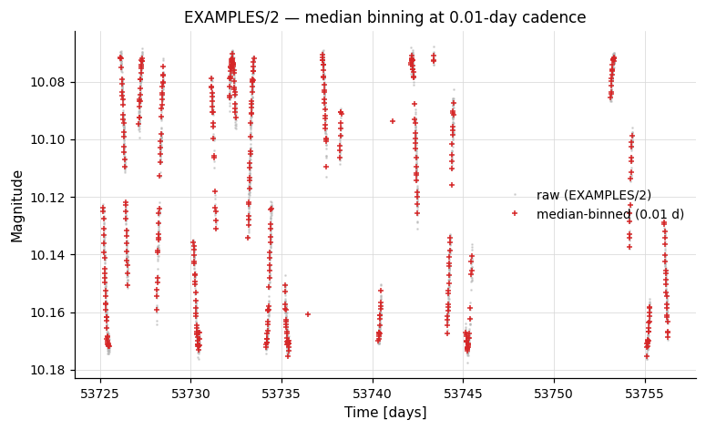
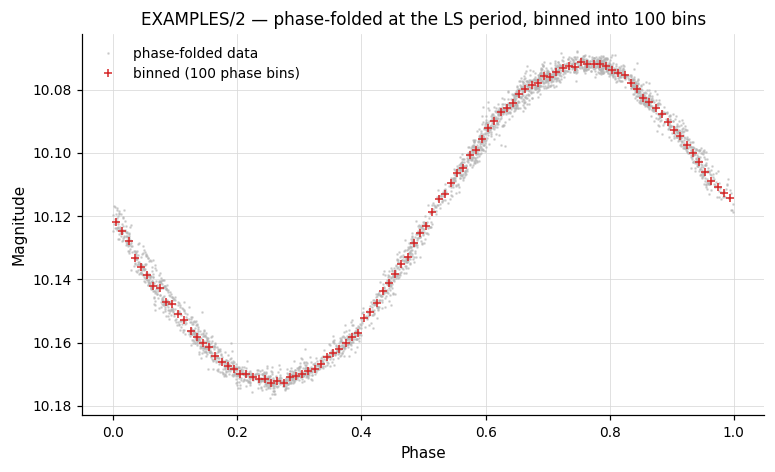
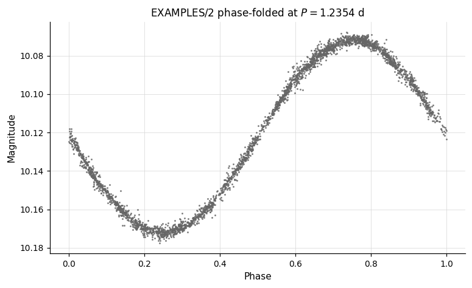
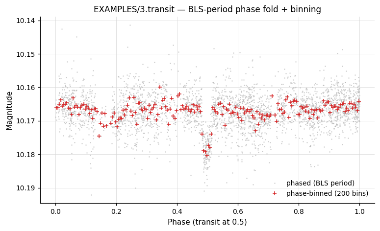
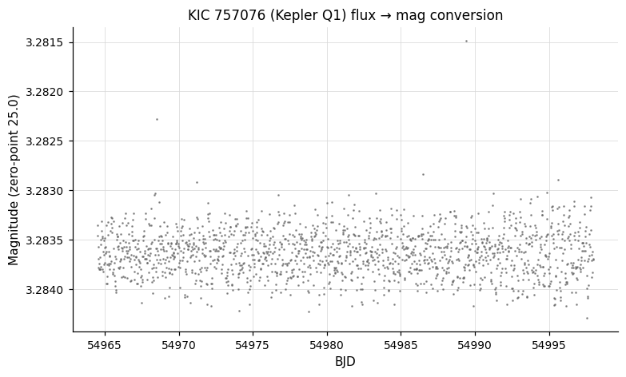

# Light Curve Manipulation

Commands that transform, resample, or reinterpret the light curve in-memory — column arithmetic, time manipulation, unit conversions, and Fourier transforms of evenly-sampled data.

---

### `sortlc` — Sort observations

**Syntax**

```python
cmd.sortlc(var=None, reverse=False)
```

**Description**

Sort the light curve observations. By default, observations are sorted by time (ascending). Use `var` to sort by another named variable (e.g. `"mag"`) and `reverse=True` to sort in descending order. If a subsequent command requires time-sorted data, vartools automatically restores time order at the start of that command.

CLI equivalent: [`-sortlc`](../../cli/manipulation.md#-sortlc).

**Parameters**

| Parameter | Type | Description |
|-----------|------|-------------|
| `var` | `str` or `None` | Name of the variable to sort by. `None` (default) sorts by time. |
| `reverse` | `bool` | Sort in descending order instead of ascending. |

**Output**

Modifies the LC in-place: reorders all per-observation vectors by the chosen sort key; no output statistics.

**Examples**

```python
lc = vt.LightCurve.from_file("EXAMPLES/2")

# Reverse-time sort
(vt.Pipeline().sortlc(reverse=True)
              .o("EXAMPLES/OUTDIR1/2.rev.txt")).run(lc)

# Sort by magnitude (brightest first)
(vt.Pipeline().sortlc(var="mag")
              .o("EXAMPLES/OUTDIR1/2.magsorted.txt")).run(lc)
```

---

### `binlc` — Bin in time

**Syntax**

```python
cmd.binlc(method="average", binsize=None, nbins=None,
          time_output="tcenter", bincolumns=None,
          bincolumnsonly=False, T0=None, firstbinshift=None,
          maskpoints=None)
```

**Description**

Bin the light curve in time (or in phase, when applied after a `Phase` command). All light-curve vectors are binned together using the chosen statistic. Specify the bin width via `binsize` or the total number of equal-width bins via `nbins` (one of the two is required).

CLI equivalent: [`-binlc`](../../cli/manipulation.md#-binlc).

**Parameters**

| Parameter | Type | Description |
|-----------|------|-------------|
| `method` | `str` | Combination statistic: `"average"`, `"median"`, or `"weightedaverage"`. |
| `binsize` | `float` or `str` | Bin width in time (or phase) units. Either `binsize` or `nbins` must be provided. Accepts variable names and expressions. |
| `nbins` | `int` or `str` | Number of equal-width bins to divide the time span into (alternative to `binsize`). |
| `time_output` | `str` | Output time for each bin: `"tcenter"`, `"taverage"`, `"tmedian"`, or `"tnoshrink"` (replace each point with its binned value without shrinking the LC). |
| `bincolumns` | `str` or `None` | Override the binning statistic for specific named columns, e.g. `"col1,col2:median"`. |
| `bincolumnsonly` | `bool` | With `time_output="tnoshrink"`, restrict replacement to columns listed in `bincolumns`. |
| `T0` | `float`, `str`, or `None` | Reference time for bin-edge alignment. A float emits `"fix T0"`; a string is split and forwarded verbatim (e.g. `"list"` or `"fixcolumn colname"`). |
| `firstbinshift` | `float`, `str`, or `None` | Shift the first bin edge by this amount. Accepts variable/expression forms. |
| `maskpoints` | `str` or `None` | Mask variable; only points with `maskvar > 0` contribute. Masked-out points still receive the binned value when `tnoshrink` is active. |

**Output**

Modifies the LC in-place: replaces all per-observation vectors with their binned values (the LC length is reduced unless `time_output="tnoshrink"`); no output statistics.

**Examples**

```python
lc = vt.LightCurve.from_file("EXAMPLES/2")

# Bin in time with 0.01-day bins (median combination)
result = lc.binlc(method="median", binsize=0.01)
binned_lc = result.lc

# Phase-fold then bin into 100 phase bins.  `cmd.Phase(period="ls")`
# back-references the prior LS and works both in a single Pipeline and
# across chain steps.
pipe = (vt.Pipeline()
        .LS(0.1, 10.0, 0.1, npeaks=1)
        .Phase(period="ls")
        .binlc(method="median", nbins=100))
result = pipe.run(lc, capture_lc=True)
phase_binned_lc = result.lc
```




---

### `Phase` — Phase-fold the light curve

**Syntax**

```python
cmd.Phase(period="ls", T0=None, phasevar=None, startphase=None)
```

**Description**

Replace the time axis of the light curve with its phase, computed as `((t − T0) mod P) / P`, and sort by phase. Phases run from 0 to 1 by default (or from `startphase` to `startphase + 1`). After `Phase`, time-based binning commands like `binlc` operate in phase space.

CLI equivalent: [`-Phase`](../../cli/manipulation.md#-phase).

**Parameters**

| Parameter | Type | Description |
|-----------|------|-------------|
| `period` | `float` or `str` | Period to fold on. Accepts a number, or a back-reference keyword: `"ls"`, `"aov"`, `"bls"`, `"fixcolumn NAME"`, `"list"`. |
| `T0` | `float`, `str`, or `None` | Reference epoch. Accepts a number, or `"bls <phase_offset>"` to derive `T0 = Tc − phase_offset · Period` from the prior BLS result (e.g. `T0="bls 0.5"` puts mid-transit at phase 0.5). Default: the earliest time in the LC. |
| `phasevar` | `str` or `None` | Name of the output phase variable. Default: overwrites `t`. |
| `startphase` | `float` or `None` | Starting phase (default 0). Phase range becomes `[startphase, startphase + 1)`. |

!!! tip "Back-references work across chain steps"
    `period` accepts `"ls"`, `"aov"`, `"bls"`, and `"fixcolumn NAME"`; `T0` accepts the `"bls <phase_offset>"` form. All of these resolve correctly inside a single `Pipeline` *and* across chain boundaries (e.g. `lc.LS(...).Phase(period="ls")` or `lc.BLS(...).Phase(period="bls", T0="bls 0.5")`). In batch-chain mode the resolved values become per-LC, so each light curve is folded on its own period / Tc. Missing prior command → `LookupError`.

**Output**

Modifies the LC in-place: replaces `t` (or writes to `phasevar`) with phase values and re-sorts the LC; no output statistics.

**Examples**

```python
lc = vt.LightCurve.from_file("EXAMPLES/2")

# Phase-fold at a known period
result = lc.Phase(period=1.2354)
phased_lc = result.lc   # time column replaced by orbital phase

# Use period found by BLS, set mid-transit at phase 0.5.
# `period="bls"` and `T0="bls 0.5"` work across the chain boundary —
# pyvartools reads BLS_Period_1 / BLS_Tc_1 from the prior result.
lc_transit = vt.LightCurve.from_file("EXAMPLES/3.transit")
result = (
    lc_transit
        .BLS(0.5, 5.0, rmin=0.01, rmax=0.1, nbins=200, nfreq=20000, npeaks=1)
        .Phase(period="bls", T0="bls 0.5")
        .binlc(method="median", nbins=200)
)
phase_binned_lc = result.lc
```




---

### `resample` — Resample onto a new time grid

**Syntax**

```python
cmd.resample(method="linear",
             left=None, right=None,
             nbreaks=None, order=None,
             file_times=None, file_column=None,
             gaps=None,
             tstart=None, tstop=None, delt=None, Npoints=None)
```

**Description**

Resample the light curve onto a new time base by interpolating all light-curve vectors. The default output grid runs from the first to the last observed time with a step equal to the minimum observed time separation. Specify the new grid with `delt` (step size), `Npoints` (number of points), or `file_times` (times read from a file). String-type columns (e.g. image IDs) are always resampled with the `"nearest"` method.

CLI equivalent: [`-resample`](../../cli/manipulation.md#-resample).

**Parameters**

| Parameter | Type | Description |
|-----------|------|-------------|
| `method` | `str` | Interpolation method: `"nearest"`, `"linear"`, `"spline"`, `"splinemonotonic"`, or `"bspline"`. |
| `left` | `float` or `None` | First-derivative boundary condition at the left edge of the spline. Only for `method="spline"` (or `"splinemonotonic"`). |
| `right` | `float` or `None` | First-derivative boundary condition at the right edge of the spline. |
| `nbreaks` | `int` or `None` | Number of interior break points for B-spline fitting. Only for `method="bspline"`. If `< 2`, breaks are increased until χ²/dof ≤ 1 (can be slow). |
| `order` | `int` or `None` | Polynomial order of the B-spline (only for `method="bspline"`). |
| `file_times` | `str` or `None` | Path to a file containing times (emits `"file" "fix" path`), or a string starting with `"list"` for list-column mode (e.g. `"list column 2"`). |
| `file_column` | `int` or `None` | Column number in the times file. Only used with the `"fix"` form (path given). |
| `gaps` | `str` or `None` | Gap-handling spec, e.g. `"percentile_sep 80 bspline"` — switches interpolation method beyond a separation threshold. |
| `tstart`, `tstop` | `float`, `str`, or `None` | Start and stop of the new time grid. Accepts variable/expression/per-LC forms. |
| `delt` | `float`, `str`, or `None` | Time step of the new grid. |
| `Npoints` | `int`, `str`, or `None` | Number of points in the new grid (alternative to `delt`). |

**Output**

Modifies the LC in-place: replaces every per-observation vector by interpolating onto the new time grid; no output statistics.

**Examples**

```python
lc = vt.LightCurve.from_file("EXAMPLES/2")

# Linear interpolation with default time grid
result = lc.resample(method="linear")

# Monotonic spline onto a fixed time grid with 1000 points
result2 = lc.resample(method="splinemonotonic",
                      tstart=53726, tstop=53756, Npoints=1000)

# B-spline with 20 break points, order 3
result3 = lc.resample(method="bspline", nbreaks=20, order=3, Npoints=500)
```

---

### `expr` — Analytic expression

**Syntax**

```python
cmd.expr(expression, vartype=None, outputcolumns=None)
```

**Description**

Evaluate an analytic expression and assign the result to a named variable. The expression has the form `varname=formula`, e.g. `"residual=mag-model"`. If the variable does not yet exist it is created as a per-observation light-curve vector by default; the optional `vartype` keyword selects another lifetime — see the [`vartype` aggregation note](#vartype-and-aggregate-functions) below.

The expression engine supports aggregate functions like `mean(mag)`, `stddev(mag)`, `pct(mag, 95.0)`, and filtering like `mean(mag, t>53730)`. See the [Analytic Expressions](../../cli/expressions.md) reference for the complete list of operators, functions, and constants.

CLI equivalent: [`-expr`](../../cli/manipulation.md#-expr).

**Parameters**

| Parameter | Type | Description |
|-----------|------|-------------|
| `expression` | `str` | Expression of the form `varname=formula`. The LHS may reference any existing light-curve vector, scalar from prior commands, or output-column header name. |
| `vartype` | `str` or `None` | Type of the LHS variable: `None` (per-observation, default), `"listvar"` (per-star), `"scalar"` (per-thread), or `"const"` (global constant). See [`vartype` and aggregate functions](#vartype-and-aggregate-functions). If the variable already exists, its type is preserved regardless of this setting. |
| `outputcolumns` | `str` or `None` | Comma-separated list of column names to output. |

**Output**

Modifies the LC in-place: creates or updates the named variable; emits no statistics columns by default. Variables listed in `outputcolumns` appear in the output table.

**Examples**

```python
lc = vt.LightCurve.from_file("EXAMPLES/1")

# Apply a mathematical transform in-place
result = lc.expr("mag=sqrt(mag+5)")

# Compute per-star mean magnitude using an aggregate function.
# `avg` is a `listvar` variable created inside vartools — it must be visible
# to the next `-expr` step, so these three commands share one Pipeline.
pipe = (vt.Pipeline()
        .expr("avg=mean(mag)", vartype="listvar")
        .expr("dmag=mag-avg")
        .rms())
result = pipe.run(lc)

# Define a global constant and use it
pipe = (vt.Pipeline()
        .expr("zp=25.0", vartype="const")
        .expr("flux=10^(-0.4*(mag-zp))"))

# Convert to flux, normalise by median, then compute statistics
pipe = (vt.Pipeline()
        .expr("flux=10^(-0.4*(mag-25.0))")
        .stats("flux", ["median"])
        .expr("flux=flux/STATS_flux_MEDIAN_1")
        .stats(["flux", "mag"], ["median", "stddev"]))
result = pipe.run(lc)
print(result.vars["STATS_flux_MEDIAN_1"])   # original median flux
print(result.vars["STATS_flux_MEDIAN_3"])   # ≈ 1.0 after normalisation
```

---

### `FFT` / `IFFT` — Fast Fourier Transform

**Syntax**

```python
cmd.FFT(input_real, input_imag, output_real, output_imag)
cmd.IFFT(input_real, input_imag, output_real, output_imag)
```

**Description**

Compute the Fast Fourier Transform (`FFT`) or inverse Fast Fourier Transform (`IFFT`) of two named light-curve variables (real and imaginary parts), using GSL's `gsl_fft_complex_forward()` / `..._backward()`. Element `k` of the transform corresponds to frequency `k / (N · Δ)` for `k < N/2` (negative frequencies for `k > N/2`), where `Δ` is the assumed uniform time step and `N` is the number of points.

Use `"NULL"` for either input component to substitute a zero vector; use `"NULL"` for either output component to discard that component.

CLI equivalent: [`-FFT`](../../cli/manipulation.md#-fft) / [`-IFFT`](../../cli/manipulation.md#-ifft).

**Parameters**

| Parameter | Type | Description |
|-----------|------|-------------|
| `input_real` | `str` | Name of the LC vector holding the real part of the input signal, or `"NULL"`. |
| `input_imag` | `str` | Name of the LC vector holding the imaginary part, or `"NULL"`. |
| `output_real` | `str` | Variable name to store the real part of the transform, or `"NULL"`. |
| `output_imag` | `str` | Variable name to store the imaginary part of the transform, or `"NULL"`. |

**Output**

Modifies the LC in-place: writes the transform into the named output variables; no output statistics.

**Examples**

```python
lc = vt.LightCurve.from_file("EXAMPLES/11")

# High-pass Fourier filter on a uniformly sampled light curve
pipe = (vt.Pipeline()
        .FFT("mag", "NULL", "fftreal", "fftimag")
        .rms()
        .expr("fftreal=(NR>(Npoints_1/500.0))*(NR<(Npoints_1*499.0/500.0))*fftreal")
        .expr("fftimag=(NR>(Npoints_1/500.0))*(NR<(Npoints_1*499.0/500.0))*fftimag")
        .IFFT("fftreal", "fftimag", "mag_filter", "NULL"))
result = pipe.run(lc, capture_lc=True)
```

---

### `difffluxtomag` / `fluxtomag` — Flux conversions

**Syntax**

```python
cmd.difffluxtomag(mag_constant, offset=0.0, magcolumn=None)
cmd.fluxtomag(mag_constant, offset=0.0)
```

**Description**

Convert flux values to magnitudes:

- **`fluxtomag`** — Convert absolute flux to magnitude using `mag = mag_constant − 2.5·log10(flux) + offset`.
- **`difffluxtomag`** — Convert ISIS image-subtraction differential flux to magnitude using `mag = mag_constant − 2.5·log10(ref_flux + diff_flux) + offset`. Requires a list input where the reference magnitude of each star (after aperture correction) is supplied as an additional column.

`mag_constant` and `offset` accept numbers, variable names, or expression strings.

CLI equivalent: [`-fluxtomag`](../../cli/manipulation.md#-fluxtomag) / [`-difffluxtomag`](../../cli/manipulation.md#-difffluxtomag).

**Parameters**

| Parameter | Type | Description |
|-----------|------|-------------|
| `mag_constant` | `float` or `str` | Magnitude corresponding to a flux of 1 ADU (zero-point). |
| `offset` | `float` or `str` | Additive constant applied to the output magnitudes. |
| `magcolumn` | `int` or `None` | (`difffluxtomag` only) Column in the input list containing the reference magnitude. Default: next available column. |

**Output**

Modifies the LC in-place: replaces `mag` with the converted magnitude values; no output statistics.

**Examples**

```python
# Synthesize a flux-unit light curve from an existing magnitude LC,
# then convert it back to magnitudes using `fluxtomag`.
import numpy as np

lc_mag = vt.LightCurve.from_file("EXAMPLES/2")
t, mag, err = lc_mag.t, lc_mag.mag, lc_mag.err
flux = 10.0 ** (-0.4 * (mag - 25.0))
lc_flux = vt.LightCurve.from_arrays(t, flux, err * flux * np.log(10) / 2.5)

# `mag_constant` is the zero-point magnitude (here 25.0, matching the
# synthesis above).
result = lc_flux.fluxtomag(25.0, offset=0.0)
print(result.lc.mag[:3])   # back to approximately the original values
```



---

### `changeerror` — Rescale measurement uncertainties

**Syntax**

```python
cmd.changeerror(maskpoints=None)
```

**Description**

Replace the formal per-point measurement uncertainties with the RMS of the light curve. Useful before χ² or MCMC fitting when the quoted uncertainties are known to be mis-calibrated, or when no formal errors are available.

CLI equivalent: [`-changeerror`](../../cli/manipulation.md#-changeerror).

**Parameters**

| Parameter | Type | Description |
|-----------|------|-------------|
| `maskpoints` | `str` or `None` | Mask variable; only points with `maskvar > 0` contribute to the RMS. |

**Output**

Suffix `N` is the pipeline command index.

| Column | Description |
|--------|-------------|
| `Mean_Mag_N` | Mean magnitude of the light curve. |
| `RMS_N` | RMS of the light curve (the value the `err` column is replaced with). |
| `Npoints_N` | Number of points used. |

The LC's `err` column is also modified in-place: every entry becomes the value reported as `RMS_N`.

**Examples**

```python
lc = vt.LightCurve.from_file("EXAMPLES/4")
result = (
    lc.chi2()
      .changeerror()
      .chi2()
)
print(result.vars["Chi2_0"])   # 5.19874 (original)
print(result.vars["Chi2_2"])   # ≈ 1.0 (after rescaling errors to RMS)
```

---

### `converttime` — Time system conversion

**Syntax**

```python
cmd.converttime(input_format, output_format, ra=None, dec=None,
                input_subtract=None, output_subtract=None,
                input_sys=None, output_sys=None, ephemfile=None,
                leapsecfile=None)
```

**Description**

Convert the light curve's time column between Modified Julian Date (MJD), Julian Date (JD), Heliocentric Julian Date (HJD), and Barycentric Julian Date (BJD) systems. BJD conversion requires VARTOOLS to be linked to the JPL NAIF cspice library. The internal precision near J2000.0 is approximately 0.1 milliseconds. For HJD/BJD conversions, provide `ra` and `dec` in degrees.

CLI equivalent: [`-converttime`](../../cli/manipulation.md#-converttime).

**Parameters**

| Parameter | Type | Description |
|-----------|------|-------------|
| `input_format` | `str` | Input time system: `"mjd"`, `"jd"`, `"hjd"`, or `"bjd"`. |
| `output_format` | `str` | Output time system. |
| `ra` | `float`, `str`, or `None` | Right ascension (deg) for HJD/BJD. A float emits `"radec fix ra dec"` (requires `dec`); a string is split and forwarded verbatim (e.g. `"list"`). |
| `dec` | `float` or `None` | Declination (deg), used together with a numeric `ra`. |
| `input_subtract` | `float` or `None` | Constant subtracted from the stored input times (e.g. `2400000` if input is `HJD-2400000`). |
| `output_subtract` | `float` or `None` | Constant subtracted from the output times. |
| `input_sys` | `str` or `None` | Input time system: `"tdb"` or `"utc"`. Default: UTC. |
| `output_sys` | `str` or `None` | Output time system: `"tdb"` or `"utc"`. |
| `ephemfile` | `str` or `None` | Path to a JPL ephemeris kernel (BJD/TDB conversions). |
| `leapsecfile` | `str` or `None` | Path to a leap-second kernel file. |

**Output**

Modifies the LC in-place: replaces `t` with times in the requested system; no output statistics.

**Examples**

```python
lc = vt.LightCurve.from_file("EXAMPLES/1")

# Convert JD (minus 2400000) to HJD for a known sky position
result = lc.converttime(
    input_format="jd",
    output_format="hjd",
    ra=88.079166,
    dec=32.5533,
    input_subtract=2400000.0,
)
hjd_lc = result.lc
```

---

### `match` — Match against a catalog

**Syntax**

```python
cmd.match(catalog, matchcolumn, addcolumns, missing="nanmissing",
          source="file", inlist_column=None, skipnum=None,
          skipchar=None, delimiter=None, opencommand=None)
```

**Description**

Perform a row-by-row match of an external data file to the light curve, merging columns from the catalog into the LC. The match is performed on a specified variable (by default the time `t`). Float/double columns are matched within the tolerance set by the global `-jdtol`; all other types are matched exactly. New variables are created from the catalog; existing variables are overwritten.

CLI equivalent: [`-match`](../../cli/manipulation.md#-match).

**Parameters**

| Parameter | Type | Description |
|-----------|------|-------------|
| `catalog` | `str` | Path to the catalog file (FITS table for `.fits` extensions). Ignored when `source="inlist"`. |
| `source` | `str` | `"file"` (default) — one catalog for all LCs; `"inlist"` — each LC specifies its own catalog in a list column. |
| `inlist_column` | `str`, `int`, or `None` | Column number/name in the input list that holds per-LC catalog paths. Required when `source="inlist"`. |
| `matchcolumn` | `str` | Match-key spec: `"varname:colnum"` (e.g. `"t:1"`) or just `"colnum"`. |
| `addcolumns` | `str` | Comma-separated `varname:colnum[:dtype[:colformat]]` specs for columns to import (e.g. `"ra:2,dec:3"`). |
| `missing` | `str` | How to handle unmatched rows: `"cullmissing"`, `"nanmissing"`, or `"missingval <value>"`. |
| `skipnum` | `int` or `None` | Number of header lines to skip in the catalog. |
| `skipchar` | `str` or `None` | Comma-separated comment characters (default `#`). |
| `delimiter` | `str` or `None` | Column delimiter (default whitespace). |
| `opencommand` | `str` or `None` | Shell pre-processor for each match file; `%s` is replaced with the filename. |

**Output**

Modifies the LC in-place: appends the imported columns as new LC variables (or overwrites existing ones). With `missing="cullmissing"`, unmatched rows are removed from the LC. No output statistics.

**Examples**

```python
# Join EXAMPLES/1 with the dates file by time, importing the
# imagename string column and culling unmatched rows.
lc = vt.LightCurve.from_file("EXAMPLES/1")
(vt.Pipeline()
        .match("EXAMPLES/dates_tfa",
               matchcolumn="t:2",
               addcolumns="imagename:1:string",
               missing="cullmissing")
        .o("EXAMPLES/OUTDIR1/1_withID.txt",
           columnformat="imagename,t,mag,err")).run(lc)
```

---

### `rescalesig` / `ensemblerescalesig` — Rescale per-point uncertainties

**Syntax**

```python
cmd.rescalesig(maskpoints=None)
cmd.ensemblerescalesig(sigclip=5.0, maskpoints=None)
```

**Description**

Rescale the formal per-point magnitude uncertainties so that the reduced χ² (relative to the weighted mean magnitude) equals 1.

- **`rescalesig`** operates on each light curve independently — one rescale factor per LC.
- **`ensemblerescalesig`** computes a single rescaling factor from the full collection of light curves by fitting a linear relation between `E(rms)²` and `χ²·E(rms)²` across the ensemble (where `E(rms)` is the expected RMS based on the photometric uncertainties). The result is that χ²/dof is distributed about unity across the ensemble. Requires a list input; all light curves are read into memory. This is the more common choice for survey-scale photometry pipelines dominated by well-behaved constant sources.

CLI equivalents: [`-rescalesig`](../../cli/manipulation.md#-rescalesig), [`-ensemblerescalesig`](../../cli/manipulation.md#-ensemblerescalesig).

**Parameters**

| Parameter | Type | Description |
|-----------|------|-------------|
| `sigclip` | `float` | (`ensemblerescalesig` only) σ-clipping threshold for identifying outlier stars during the ensemble factor determination. Default `5.0`. |
| `maskpoints` | `str` or `None` | Mask variable; only points with `maskvar > 0` contribute to the χ²/dof and expected RMS. |

**Output**

Suffix `N` is the pipeline command index. Both commands emit the same column name:

| Column | Description |
|--------|-------------|
| `SigmaRescaleFactor_N` | Factor applied to the LC's `err` column. For `rescalesig` this is `sqrt(chi2_before)`; for `ensemblerescalesig` it is the average rescale factor `sqrt(chi2_after / chi2_before)` for each LC. |

The LC's `err` column is also modified in-place by the chosen factor.

**Examples**

```python
lc = vt.LightCurve.from_file("EXAMPLES/4")

# Per-LC rescaling: chi2_before, rescale, chi2_after ≈ 1
result = (
    lc.chi2()
      .rescalesig()
      .chi2()
)
print(result.vars["Chi2_0"])                  # 5.19874 (original)
print(result.vars["SigmaRescaleFactor_1"])    # 0.43858 — applied factor
print(result.vars["Chi2_2"])                  # ≈ 1.0 after rescaling
```

---

## Shared topics

### `vartype` and aggregate functions

The `vartype` parameter on [`expr`](#expr-analytic-expression) controls what kind of variable is created on the left-hand side:

- **`None`** (default) — per-observation light-curve vector, one value per point.
- **`"listvar"`** — per-star variable that persists across all light curves. LC vectors on the RHS are evaluated at the first observation (index 0). Useful with aggregate functions.
- **`"scalar"`** — per-thread scalar value.
- **`"const"`** — global constant, same value for all LCs.

Aggregate functions operate over **all observations** in the current light curve and return a single scalar value. They are most useful with `vartype="listvar"` to compute per-star summary statistics:

- `mean(x [, filter])`, `median(x)`, `stddev(x)`, `MAD(x)`
- `vmin(x)`, `vmax(x)`, `sum(x)`
- `pct(x, pctval)`, `wpct(x, w, pctval)`
- `weightedmean(x, w)`, `wmedian(x, w)`
- `kurtosis(x)`, `skewness(x)`, `meddev(x)`, `medmeddev(x)`

All accept an optional filter argument, e.g. `mean(mag, t>53730)` computes the mean of `mag` only for observations where `t > 53730`. See the [Analytic Expressions](../../cli/expressions.md) reference for the full list of operators, scalar functions, aggregate functions, and constants.
