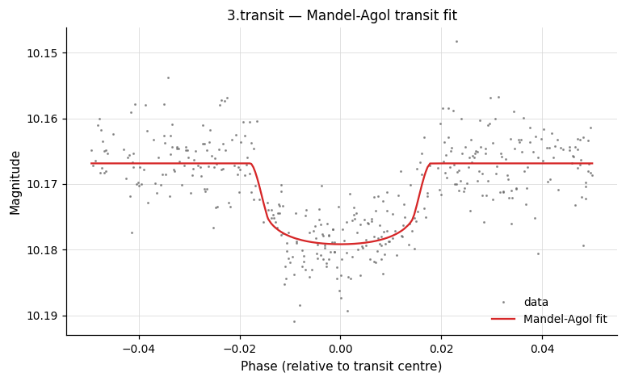
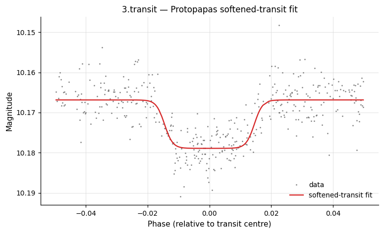
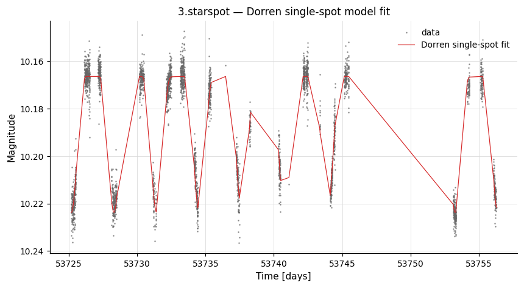
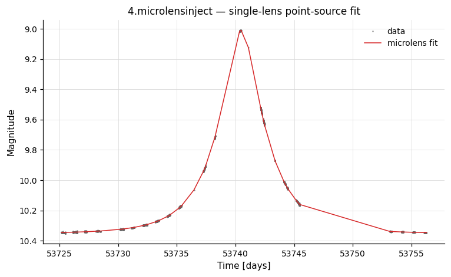

# Model Fitting

Parametric models fit to a light curve: transits, starspots, microlensing, generic linear / non-linear fits.

---

### `linfit` — Linear combination fitting

**Syntax**

```python
cmd.linfit(function, paramlist,
           modelvar=None,
           reject=None, reject_usemad=False, reject_iter=False,
           reject_fixednum=None,
           correct_lc=False, save_model=False,
           model_nameformat=None, fitmask=None)
```

**Description**

Fit a function that is linear in its free parameters to each light curve using least squares. `function` is a vartools expression string (e.g. `'a1*t^2+a2*t+a3'`); `paramlist` is a comma-separated list of free parameter names (e.g. `'a1,a2,a3'`). Parameter names must not conflict with built-in vector variables (`t`, `mag`, `err`, …). Optional sigma-clipping rejection and refit is available, the best-fit model can be subtracted from the LC (`correct_lc=True`), and the model can be written to disk via `save_model`.

CLI equivalent: [`-linfit`](../../cli/model-fitting.md#-linfit).

**Parameters**

| Parameter | Type | Description |
|-----------|------|-------------|
| `function` | `str` | Analytic function to fit (e.g. `'a*(t-t0)^2+b*(t-t0)+c'`). |
| `paramlist` | `str` | Comma-separated list of free parameter names (e.g. `'a,b,c'`). |
| `modelvar` | `str` or `None` | Variable name used to store the best-fit model values on the light curve (vector variable for use by later commands). |
| `reject` | `float` or `None` | Sigma-clipping threshold: fit, clip outliers beyond this threshold (in σ), then refit. |
| `reject_usemad` | `bool` | Use MAD instead of standard deviation for the scatter estimate during rejection. |
| `reject_iter` | `bool` | Iteratively reject and refit until no more points are clipped. |
| `reject_fixednum` | `int` or `None` | Maximum number of rejection/refit iterations (requires `reject_iter=True`). |
| `correct_lc` | `bool` | Subtract the best-fit model from the light curve before passing to the next command. |
| `save_model` | `bool`, `str`, or `Output` | Auxiliary file output. `True` captures as `result.files["linfit_model_N"]`; a path string writes to that directory without capturing; `Output(path, capture=True)` does both. See [Auxiliary output files](index.md#auxiliary-output-files). |
| `model_nameformat` | `str` or `None` | Format string for the model output filename (e.g. `"%s.linfit.model"`). |
| `fitmask` | `str` or `None` | Name of a mask variable; only points with `maskvar > 0` are included in the fit. |

**Output**

Suffix `N` is the 0-indexed pipeline command position. For each free parameter `<p>` in `paramlist`:

| Column | Description |
|--------|-------------|
| `Linfit_<p>_N` | Best-fit value of parameter `<p>`. |
| `Linfit_err<p>_N` | 1-σ uncertainty in `<p>` (from the covariance matrix). |

When `save_model` is set:

| File key | Description |
|----------|-------------|
| `result.files["linfit_model_N"]` | DataFrame: time-sampled best-fit model values for the light curve. |

**Examples**

```python
lc = vt.LightCurve.from_file("EXAMPLES/1")

# Fit a quadratic polynomial, using minimum time as reference epoch
pipe = (vt.Pipeline()
        .stats("t", ["min"])
        .expr("t0=STATS_t_MIN_0")
        .linfit("a*(t-t0)^2+b*(t-t0)+c", "a,b,c"))
result = pipe.run(lc)
print(result.vars["Linfit_a_2"])   # quadratic coefficient
print(result.vars["Linfit_b_2"])   # linear coefficient
print(result.vars["Linfit_c_2"])   # constant offset
```

---

### `nonlinfit` — Non-linear least-squares fitting

**Syntax**

```python
cmd.nonlinfit(function, paramlist,
              optimizer="amoeba",
              linfit_params=None, errors=None,
              covariance=None, priors=None, constraints=None,
              amoeba_tolerance=None, amoeba_maxsteps=None,
              mcmc_naccept=None, mcmc_nlinkstotal=None,
              mcmc_fracburnin=None, mcmc_eps=None,
              mcmc_skipamoeba=False, mcmc_maxmemstore=None,
              mcmc_outchains=False, mcmc_chains_format=None,
              mcmc_chains_printevery=None,
              correct_lc=False, save_model=False,
              model_nameformat=None, modelvar=None,
              fitmask=None)
```

**Description**

Fit an arbitrary analytic function that is non-linear in its free parameters to each light curve. Two optimisers are supported: `"amoeba"` (downhill simplex / Nelder-Mead, fast greedy local minimisation) and `"mcmc"` (differential-evolution Markov chain Monte Carlo, full posterior exploration). Parameters that enter the model linearly may be moved out of the non-linear search and fit by linear least squares (`linfit_params`), which is faster and more numerically stable. Optional Gaussian-process covariance kernels (`squareexp`, `exp`, `matern`) handle correlated errors; arbitrary priors and constraints can be added.

`paramlist` has the form `name=initial:step[:min:max], ...` for `"amoeba"`, or supplies initial values and proposal step sizes for `"mcmc"`.

CLI equivalent: [`-nonlinfit`](../../cli/model-fitting.md#-nonlinfit).

**Parameters**

| Parameter | Type | Description |
|-----------|------|-------------|
| `function` | `str` | Analytic function to fit (e.g. `'a+b*exp(-(t-c)^2/(2*d^2))'`). |
| `paramlist` | `str` | Comma-separated parameters with initial guesses and step sizes (e.g. `'c=5.0:2.0,d=10.0:8.0'`). |
| `optimizer` | `str` | `"amoeba"` (Nelder-Mead, default) or `"mcmc"` (differential-evolution MCMC). |
| `linfit_params` | `str` or `None` | Comma- or space-separated names of parameters that enter linearly; solved analytically at each step. Not included in MCMC posteriors. |
| `errors` | `str` or `None` | Expression or variable name providing per-point measurement errors (overrides the default error column). |
| `covariance` | `str` or `None` | Gaussian-process kernel tokens, e.g. `"squareexp amp_v rho_v"`, `"exp amp rho"`, `"matern amp rho nu"`. Linear-only fitting is not permitted with `covariance`. |
| `priors` | `str` or `None` | Comma-separated list of prior expressions, each evaluating to `-2 ln P` (e.g. `'(t0-4.0)^2/3.0^2'`). |
| `constraints` | `str` or `None` | Comma-separated list of constraint expressions (e.g. `'sigma>0'`). |
| `amoeba_tolerance` | `float` or `None` | Δχ² convergence tolerance for the amoeba optimizer. |
| `amoeba_maxsteps` | `int` or `None` | Maximum number of steps for the amoeba optimizer. |
| `mcmc_naccept` | `int` or `None` | Number of accepted links to collect (mutually exclusive with `mcmc_nlinkstotal`). |
| `mcmc_nlinkstotal` | `int` or `None` | Total number of MCMC links (accepted + rejected). |
| `mcmc_fracburnin` | `float` or `None` | Fraction of links to discard as burn-in (default 0.1). |
| `mcmc_eps` | `float` or `None` | Initial step size for the MCMC proposal distribution (default 0.001). |
| `mcmc_skipamoeba` | `bool` | Skip the initial amoeba pre-optimisation in MCMC mode. |
| `mcmc_maxmemstore` | `int` or `None` | Maximum number of chain links (or GB; default 4) to hold in memory simultaneously. |
| `mcmc_outchains` | `bool`, `str`, or `Output` | Write MCMC chain files. `True` captures as `result.files["nonlinfit_chains_N"]`. |
| `mcmc_chains_format` | `str` or `None` | Naming format string for chain output files. |
| `mcmc_chains_printevery` | `int` or `None` | Write every Nth accepted link to the chain file. |
| `correct_lc` | `bool` | Subtract the best-fit model from the light curve before passing to the next command. |
| `save_model` | `bool`, `str`, or `Output` | Auxiliary file output. `True` captures as `result.files["nonlinfit_model_N"]`. See [Auxiliary output files](index.md#auxiliary-output-files). |
| `model_nameformat` | `str` or `None` | Format string for the model output filename. |
| `modelvar` | `str` or `None` | Variable name used to store the best-fit model values on the light curve. |
| `fitmask` | `str` or `None` | Name of a mask variable; only points with `maskvar > 0` are included in the fit. |

**Output**

Suffix `N` is the 0-indexed pipeline command position. Columns differ between the two optimisers:

`optimizer="amoeba"`:

| Column | Description |
|--------|-------------|
| `Nonlinfit_<p>_BestFit_N` | Best-fit value of each non-linear parameter and (for `linfit_params` parameters) each linear coefficient. |
| `Nonlinfit_<p>_Err_N` | 1-σ uncertainty in each parameter, derived from the covariance matrix at the optimum. |
| `Nonlinfit_BestFit_Chi2_N` | χ² of the best-fit model. |
| `Nonlinfit_HasConverged_N` | `1` if the amoeba optimiser converged within `amoeba_maxsteps`, `0` otherwise. |

`optimizer="mcmc"`:

| Column | Description |
|--------|-------------|
| `Nonlinfit_<p>_BestFit_N` | Best-fit (lowest-χ²) value of each non-linear parameter sampled by the chain. |
| `Nonlinfit_<p>_MEDIAN_N` | Posterior median of each parameter. |
| `Nonlinfit_<p>_STDDEV_N` | Posterior standard deviation of each parameter. |
| `Nonlinfit_BestFit_Chi2_N` | χ² of the best-fit model. |

When `save_model` is set:

| File key | Description |
|----------|-------------|
| `result.files["nonlinfit_model_N"]` | DataFrame: time-sampled best-fit model. |

`mcmc_outchains` writes per-LC chain files named `<lcname>.mcmc` to the supplied directory; these files are written but are not currently captured into `result.files`.

**Examples**

**Example 1.** Inject a Gaussian into `EXAMPLES/3` and fit it back. Two parameters (`c`, the peak time, and `d`, the width) are searched non-linearly with amoeba; the linear parameters (`a`, `b`) are obtained by linear least squares (`linfit_params`).

```python
lc = vt.LightCurve.from_file("EXAMPLES/3")
pipe = (vt.Pipeline()
        .stats("t", "min,max")
        .expr("t1=STATS_t_MIN_0")
        .expr("Dt=(STATS_t_MAX_0-STATS_t_MIN_0)")
        .expr("mag=mag+0.1*exp(-0.5*((t-(t1+Dt*0.2))/(Dt*0.05))^2)")
        .nonlinfit("a+b*exp(-(t-c)^2/(2*d^2))",
                   "c=(t1+Dt*0.3):(0.1*Dt),d=(Dt*0.1):(0.1*Dt)",
                   optimizer="amoeba",
                   linfit_params="a,b",
                   save_model="EXAMPLES/OUTDIR1/"))
result = pipe.run(lc)
```

**Example 2.** Same model and injection as Example 1, but explore the χ² landscape with MCMC. All four parameters are now free non-linear parameters with their own initial guesses and step sizes.

```python
lc = vt.LightCurve.from_file("EXAMPLES/3")
pipe = (vt.Pipeline()
        .stats("t", "min,max")
        .expr("t1=STATS_t_MIN_0")
        .expr("Dt=(STATS_t_MAX_0-STATS_t_MIN_0)")
        .expr("mag=mag+0.1*exp(-0.5*((t-(t1+Dt*0.2))/(Dt*0.05))^2)")
        .nonlinfit("a+b*exp(-(t-c)^2/(2*d^2))",
                   "a=10.167:0.0002,b=0.1:0.0008,"
                   "c=(t1+Dt*0.2):(0.005),d=(Dt*0.05):(0.016)",
                   optimizer="mcmc",
                   mcmc_nlinkstotal=10000,
                   mcmc_outchains="EXAMPLES/OUTDIR1/"))
result = pipe.run(lc)
```

---

### `decorr` — Decorrelation

**Syntax**

```python
cmd.decorr(correct_lc=True, zeropointterm=1, subtractfirstterm=0,
           global_files=None, lc_columns=None, save_model=False,
           maskpoints=None)
```

**Description**

Decorrelate the light curve against external trend vectors and/or light-curve-internal columns using polynomial regression. `global_files` is a list of `(filename, polynomial_order)` tuples for external trend files (each formatted `JD signal_value`); `lc_columns` is a list of `(column_number, polynomial_order)` tuples for light-curve-internal trends.

CLI equivalent: [`-decorr`](../../cli/model-fitting.md#-decorr).

!!! warning "Deprecated"
    The underlying `-decorr` command is deprecated as of VARTOOLS 1.3. Use [`linfit`](#linfit-linear-combination-fitting) instead.

**Parameters**

| Parameter | Type | Description |
|-----------|------|-------------|
| `correct_lc` | `bool` | Apply the decorrelation to the light curve (`True`) or just compute and output coefficients without modifying it (`False`). |
| `zeropointterm` | `int` | `1` to include a zero-point offset term in the fit; `0` to omit it. |
| `subtractfirstterm` | `int` | `1` to decorrelate against `(signal − signal[0])` rather than `signal` directly (useful for detrending against JD). |
| `global_files` | list of `(str, int)` or `None` | List of `(filename, polynomial_order)` tuples for external trend files. |
| `lc_columns` | list of `(int, int)` or `None` | List of `(column_number, polynomial_order)` tuples for light-curve-internal trends. |
| `save_model` | `bool`, `str`, or `Output` | Auxiliary file output. `True` captures as `result.files["decorr_model_N"]`. See [Auxiliary output files](index.md#auxiliary-output-files). |
| `maskpoints` | `str` or `None` | Mask variable; only points with `maskvar > 0` contribute to the fit. |

**Output**

Suffix `N` is the 0-indexed pipeline command position. The exact set of columns depends on the number of `global_files` and `lc_columns` terms and on `zeropointterm`; each polynomial coefficient is reported with its 1-σ error, plus an overall χ²:

| Column | Description |
|--------|-------------|
| `Decorr_constant_term_N` | Zero-point offset (only when `zeropointterm=1`). |
| `Decorr_constant_term_err_N` | 1-σ uncertainty in the zero-point offset. |
| `Global_<i>_coeff_<order>_N` | Best-fit coefficient for global trend file `i` (1-indexed) at polynomial `order`. |
| `Global_<i>_coeff_err_<order>_N` | 1-σ uncertainty in the corresponding global-trend coefficient. |
| `LCColumn_<col>_coeff_<order>_N` | Best-fit coefficient for light-curve column `col` at polynomial `order`. |
| `LCColumn_<col>_coeff_err_<order>_N` | 1-σ uncertainty in the corresponding LC-column coefficient. |
| `Decorr_chi2_N` | χ² of the decorrelation fit. |

When `save_model` is set:

| File key | Description |
|----------|-------------|
| `result.files["decorr_model_N"]` | DataFrame: time-sampled best-fit decorrelation model. |

**Examples**

```python
lcs = [vt.LightCurve.from_file(f"EXAMPLES/{i}") for i in range(1, 11)]

# Decorrelate against the time column using a quadratic polynomial
pipe = (vt.Pipeline()
        .rms()
        .decorr(correct_lc=True, zeropointterm=1, subtractfirstterm=1,
               lc_columns=[(1, 2)])
        .rms())
batch = pipe.run_batch(lcs)
print(batch.vars[["Name", "RMS_0", "RMS_2"]])
```

---

### `MandelAgolTransit` — Mandel-Agol transit model

**Syntax**

```python
cmd.MandelAgolTransit(P0, T00, r0=0.1, a0=10.0, inclination=90.0,
                      bimpact=None,
                      e0=0.0, omega0=0.0, mconst0=0.0,
                      ld_type="quad", ld_coeffs=None,
                      fitephem=1, fitr=1, fita=1,
                      fitinclterm=1, fite=0, fitomega=0,
                      fitmconst=1, fitldcoeffs=None,
                      rv_file=None, rv_model_file=None,
                      K0=None, gamma0=None, fitK=0, fitgamma=0,
                      correct_lc=False, save_model=False,
                      modelvar=None,
                      save_phcurve=False,
                      ophcurve_phmin=0.0, ophcurve_phmax=1.0,
                      ophcurve_phstep=0.005,
                      save_jdcurve=False, ojdcurve_jdstep=0.02)
```

**Description**

Fit a Mandel & Agol (2002) transit model to the light curve. Initial values for the period and transit centre can be entered directly or seeded from a preceding `BLS` / `BLSFixPer` run (`P0="bls"` or `"blsfixper"`). Quadratic or non-linear (Claret) limb darkening is supported. Each model parameter has an explicit `fit*` flag (`0` = fixed, `1` = free). Optional simultaneous radial-velocity fitting is enabled by passing `rv_file`.

CLI equivalent: [`-MandelAgolTransit`](../../cli/model-fitting.md#-mandelagoltransit).

**Parameters**

| Parameter | Type | Description |
|-----------|------|-------------|
| `P0`, `T00` | `float` or `str` | Initial period (days) and transit epoch (BJD). `P0` also accepts `"bls"` or `"blsfixper"` to seed the transit model from a prior BLS / BLSFixPer — see the admonition below. |
| `r0` | `float` | Initial planet-to-star radius ratio. |
| `a0` | `float` | Initial semi-major axis in stellar radii. |
| `inclination` | `float` | Initial orbital inclination in degrees. Used when `bimpact` is `None`. |
| `bimpact` | `float` or `None` | Initial impact parameter. When set, replaces `inclination` in the CLI (`"b" bimpact` instead of `"i" inclination`). |
| `e0`, `omega0`, `mconst0` | `float` | Initial eccentricity, argument of periastron (degrees), and out-of-transit magnitude (negative `mconst0` ⇒ estimate from the data). |
| `ld_type` | `str` | Limb-darkening law: `"quad"` (2 coefficients) or `"nonlin"` (4 Claret coefficients). |
| `ld_coeffs` | list | Initial limb-darkening coefficients. Default `[0.3, 0.3]`. |
| `fitephem` | `int` | Fit the transit epoch and period together (0 = fixed, 1 = free). The CLI `fitephem` flag controls both simultaneously. |
| `fitr`, `fita`, `fitinclterm`, `fite`, `fitomega`, `fitmconst` | `int` | Toggle fitting of each parameter (0 = fixed, 1 = free). |
| `fitldcoeffs` | list of `int` or `None` | Toggle fitting of each limb-darkening coefficient. |
| `rv_file` | `str` or `None` | Path to an RV data file (columns: JD, RV, RV-error). When provided, simultaneous RV fitting is enabled. |
| `rv_model_file` | `str` or `None` | Output path for the best-fit RV model. |
| `K0`, `gamma0` | `float` or `None` | Initial RV semi-amplitude (km/s) and systemic RV (km/s). |
| `fitK`, `fitgamma` | `int` | Fit `K` and `γ` respectively (0 = fixed, 1 = free). |
| `correct_lc` | `bool` | Subtract the best-fit transit from the LC before passing to the next command. |
| `save_model` | `bool`, `str`, or `Output` | Best-fit transit model on the input cadence. `True` captures as `result.files["MandelAgolTransit_model_N"]`. See [Auxiliary output files](index.md#auxiliary-output-files). |
| `modelvar` | `str` or `None` | Variable name used to store the best-fit model on the light curve (requires `save_model` to be set). |
| `save_phcurve` | `bool`, `str`, or `Output` | Phase-folded model curve. `True` captures as `result.files["MandelAgolTransit_phcurve_N"]`. |
| `ophcurve_phmin`, `ophcurve_phmax`, `ophcurve_phstep` | `float` | Phase range (start, end, step) for the phase curve, used when `save_phcurve` is set. Defaults `0.0`, `1.0`, `0.005`. |
| `save_jdcurve` | `bool`, `str`, or `Output` | JD-sampled model curve. `True` captures as `result.files["MandelAgolTransit_jdcurve_N"]`. |
| `ojdcurve_jdstep` | `float` | Time step (days) for the JD curve, used when `save_jdcurve` is set. Default `0.02`. |

!!! tip "Back-reference seeding from BLS / BLSFixPer"
    When `P0="bls"` (or `"blsfixper"`) is used after a prior `-BLS` / `-BLSFixPer` in the chain, pyvartools pulls Period, Tc, Depth, and Qtran from the prior result and seeds four fields at once: `P0 = BLS.Period_1`, `T00 = BLS.Tc_1`, `r0 = sqrt(BLS.Depth_1)`, `a0 = 1 / (π · BLS.Qtran_1)`. Any of those four values you pass explicitly override the seeded default. This resolves equally in a single `Pipeline` or across chain steps; in batch chains each LC gets its own seed values. Missing prior BLS → `LookupError`.

**Output**

Suffix `N` is the 0-indexed pipeline command position. All of the following parameter columns appear regardless of whether each parameter was fixed or fit:

| Column | Description |
|--------|-------------|
| `MandelAgolTransit_Period_N` | Best-fit orbital period (days). |
| `MandelAgolTransit_T0_N` | Best-fit mid-transit epoch. |
| `MandelAgolTransit_r_N` | Best-fit `Rp/R★`. |
| `MandelAgolTransit_a_N` | Best-fit `a/R★`. |
| `MandelAgolTransit_inc_N` | Best-fit inclination (degrees). |
| `MandelAgolTransit_bimpact_N` | Best-fit impact parameter `b = (a/R★) cos(i)`. |
| `MandelAgolTransit_e_N` | Best-fit eccentricity. |
| `MandelAgolTransit_omega_N` | Best-fit argument of periastron (degrees). |
| `MandelAgolTransit_mconst_N` | Best-fit out-of-transit magnitude. |
| `MandelAgolTransit_ldcoeff<i>_N` | Best-fit limb-darkening coefficients (`i = 1, 2` for `quad`; `1..4` for `nonlin`). |
| `MandelAgolTransit_chi2_N` | χ² of the best-fit model. |
| `MandelAgolTransit_K_N`, `MandelAgolTransit_gamma_N` | Best-fit RV semi-amplitude (km/s) and systemic velocity (only when `rv_file` is given). |

When `save_*` keywords are set:

| File key | Description |
|----------|-------------|
| `result.files["MandelAgolTransit_model_N"]` | DataFrame: time-sampled best-fit transit model. |
| `result.files["MandelAgolTransit_phcurve_N"]` | DataFrame: model phase curve sampled on `[0, 1]`. |
| `result.files["MandelAgolTransit_jdcurve_N"]` | DataFrame: model curve sampled in JD space. |

**References**

Mandel, K. & Agol, E. 2002, ApJ, 580, L171.

**Examples**

```python
lc = vt.LightCurve.from_file("EXAMPLES/3.transit")

# 1. Run BLS to locate the transit, then 2. fit Mandel-Agol with numeric seeds.
r_bls = lc.BLS(0.5, 5.0, rmin=0.01, rmax=0.1, nbins=200, nfreq=20000, npeaks=1)
P0  = float(r_bls.vars["BLS_Period_1_0"])
Tc0 = float(r_bls.vars["BLS_Tc_1_0"])

result = lc.MandelAgolTransit(
    P0=P0, T00=Tc0,
    r0=0.11, a0=10.0, inclination=90.0,
    ld_type="quad", ld_coeffs=[0.3471, 0.3180],
    fitephem=1, fitr=1, fita=1, fitinclterm=1,
    fite=0, fitomega=0, fitmconst=1,
    save_model=True, save_phcurve=True,
)
print(result.vars["MandelAgolTransit_Period_0"])   # 2.12328176
print(result.vars["MandelAgolTransit_r_0"])        # Rp/R* ~ 0.11
model   = result.files["MandelAgolTransit_model_0"]    # fitted model LC
phcurve = result.files["MandelAgolTransit_phcurve_0"]  # phase-folded model
```



---

### `SoftenedTransit` — Softened (trapezoidal) transit

**Syntax**

```python
cmd.SoftenedTransit(init_params="bls", fitephem=1, fiteta=1,
                    fitcval=1, fitdelta=1, fitmconst=1,
                    correct_lc=False, save_model=False,
                    fit_harm=0, fit_harm_method=None,
                    fit_harm_nharm=None, fit_harm_nsubharm=None)
```

**Description**

Fit a Protopapas, Jiménez & Alcock (2005) "softened" trapezoidal transit model. `init_params` can be `"bls"` or `"blsfixper"` to initialise from a prior BLS / BLSFixPer result, `"ls"` or `"aov"` to seed the period from the corresponding periodogram, or a tuple `(P0, T00, eta0, delta0, mconst0, cval0)` of explicit numeric initial values.

CLI equivalent: [`-SoftenedTransit`](../../cli/model-fitting.md#-softenedtransit).

!!! tip "Back-reference seeding from BLS / BLSFixPer"
    `init_params="bls"` (or `"blsfixper"`) seeds four fields from the prior result: period, T0, eta (= Qtran), and delta (= Depth). This works both in a single `Pipeline` and across chain steps. Batch-chain mode is **not** supported for the multi-field `"bls"` / `"blsfixper"` case (would require per-LC propagation of four fields); use a single `Pipeline` invocation for batch runs. `"ls"` and `"aov"` seed only the period and work in both single- and batch-chain modes. Missing prior command → `LookupError`.

**Parameters**

| Parameter | Type | Description |
|-----------|------|-------------|
| `init_params` | `str` or tuple | `"bls"` / `"blsfixper"` (multi-field seed), `"ls"` / `"aov"` (period-only seed), or a tuple `(P0, T00, eta0, delta0, mconst0, cval0)` of explicit values. |
| `fitephem`, `fiteta`, `fitcval`, `fitdelta`, `fitmconst` | `int` | Fit each model parameter (0 = fixed, 1 = free). `fitephem` controls period and T0 simultaneously. |
| `correct_lc` | `bool` | Subtract the best-fit transit from the LC before passing to the next command. |
| `save_model` | `bool`, `str`, or `Output` | Auxiliary file output. `True` captures as `result.files["SoftenedTransit_model_N"]`. See [Auxiliary output files](index.md#auxiliary-output-files). |
| `fit_harm` | `int` | Harmonic fitting flag. `0` = no harmonic component (default); when > 0, a harmonic series is fitted simultaneously. |
| `fit_harm_method` | `str` or `None` | Source of the harmonic period: `"aov"`, `"ls"`, `"bls"`, `"list"`, or `"fix"`. Only used when `fit_harm > 0`. |
| `fit_harm_nharm` | `int` or `None` | Number of harmonics for the harmonic component. |
| `fit_harm_nsubharm` | `int` or `None` | Number of sub-harmonics for the harmonic component. |

**Output**

Suffix `N` is the 0-indexed pipeline command position:

| Column | Description |
|--------|-------------|
| `SoftenedTransit_Period_N` | Best-fit orbital period (days). |
| `SoftenedTransit_T0_N` | Best-fit mid-transit epoch. |
| `SoftenedTransit_eta_N` | Best-fit transit-duration parameter. |
| `SoftenedTransit_cval_N` | Best-fit softening parameter. |
| `SoftenedTransit_delta_N` | Best-fit transit depth. |
| `SoftenedTransit_mconst_N` | Best-fit out-of-transit magnitude. |
| `SoftenedTransit_chi2perdof_N` | Reduced χ² of the best-fit model. |

When `save_model` is set:

| File key | Description |
|----------|-------------|
| `result.files["SoftenedTransit_model_N"]` | DataFrame: time-sampled best-fit softened-transit model. |

**References**

Protopapas, P., Jiménez, R. & Alcock, C. 2005, MNRAS, 362, 460.

**Examples**

```python
lc = vt.LightCurve.from_file("EXAMPLES/3.transit")

pipe = (vt.Pipeline()
        .BLS(0.5, 5.0, rmin=0.01, rmax=0.1, nbins=200, nfreq=20000, npeaks=1)
        .SoftenedTransit(init_params="bls",
                        fitephem=1, fiteta=1, fitcval=1,
                        fitdelta=1, fitmconst=1,
                        correct_lc=False, save_model=True))
result = pipe.run(lc)
print(result.vars["SoftenedTransit_Period_1"])     # 2.12322112
print(result.vars["SoftenedTransit_chi2perdof_1"])
model = result.files["SoftenedTransit_model_1"]   # SoftenedTransit is at index 1
```



---

### `Starspot` — Starspot model

**Syntax**

```python
cmd.Starspot(period="ls",
             a0=0.1, b0=0.5, alpha0=20.0, i0=85.0,
             chi0=30.0, psi00=0.0, mconst0=0.0,
             fit_period=1, fit_a=1, fit_b=1, fit_alpha=1,
             fit_i=1, fit_chi=1, fit_psi=1, fit_mconst=1,
             correct_lc=False, save_model=False)
```

**Description**

Fit a Dorren (1987) single-spot model — a circular, uniform-temperature starspot — to a photometric light curve. Initial parameters `a0`, `b0`, `alpha0`, `i0`, `chi0`, `psi00` are as defined in Dorren 1987 (spot fractional radius, latitude in radians, longitude in degrees, stellar inclination, spot contrast, phase offset). Set `mconst0` negative to estimate the unspotted magnitude automatically.

CLI equivalent: [`-Starspot`](../../cli/model-fitting.md#-starspot).

!!! warning "Deprecated"
    The underlying `-Starspot` command is deprecated as of VARTOOLS 1.3. Use the `macula` extension command instead.

**Parameters**

| Parameter | Type | Description |
|-----------|------|-------------|
| `period` | `float` or `str` | Starting period. Can be a number or `"ls"`, `"aov"`, or `"fixcolumn NAME"` to inherit from a prior pipeline command. These back-references resolve correctly both in a single `Pipeline` and across chain steps (e.g. `lc.aov(...).Starspot(period="aov")`). Missing prior command → `LookupError`. |
| `a0` | `float` | Initial spot fractional radius (default `0.1`). |
| `b0` | `float` | Initial spot latitude in radians (default `0.5`). |
| `alpha0` | `float` | Initial spot longitude in degrees (default `20.0`). |
| `i0` | `float` | Initial stellar inclination in degrees (default `85.0`). |
| `chi0` | `float` | Initial spot contrast (default `30.0`). |
| `psi00` | `float` | Initial spot phase offset (default `0.0`). |
| `mconst0` | `float` | Initial magnitude offset (default `0.0`; negative ⇒ estimate from data). |
| `fit_period` | `int` | Fit the period (0 = fixed, 1 = free; default `1`). |
| `fit_a`, `fit_b`, `fit_alpha`, `fit_i`, `fit_chi`, `fit_psi`, `fit_mconst` | `int` | Fit each model parameter (0 = fixed, 1 = free; all default `1`). |
| `correct_lc` | `bool` | Subtract the best-fit spot model from the LC before passing to the next command. |
| `save_model` | `bool`, `str`, or `Output` | Auxiliary file output. `True` captures as `result.files["Starspot_model_N"]`. See [Auxiliary output files](index.md#auxiliary-output-files). |

**Output**

Suffix `N` is the 0-indexed pipeline command position:

| Column | Description |
|--------|-------------|
| `Starspot_Period_N` | Best-fit rotation period (days). |
| `Starspot_a_N` | Best-fit spot fractional radius. |
| `Starspot_b_N` | Best-fit spot latitude (radians). |
| `Starspot_alpha_N` | Best-fit spot longitude (degrees). |
| `Starspot_inclination_N` | Best-fit stellar inclination (degrees). |
| `Starspot_chi_N` | Best-fit spot contrast. |
| `Starspot_psi0_N` | Best-fit spot phase offset. |
| `Starspot_mconst_N` | Best-fit unspotted magnitude. |
| `Starspot_chi2perdof_N` | Reduced χ² of the best-fit model. |

When `save_model` is set:

| File key | Description |
|----------|-------------|
| `result.files["Starspot_model_N"]` | DataFrame: time-sampled best-fit starspot model. |

**References**

Dorren 1987, ApJ, 320, 756.

**Examples**

```python
lc = vt.LightCurve.from_file("EXAMPLES/3.starspot")

# Determine rotation period with AOV then fit Dorren starspot model
pipe = (vt.Pipeline()
        .aov(0.1, 10.0, 0.1, 0.01, npeaks=5, nbin=20)
        .Starspot(
            period="aov",
            a0=0.0298, b0=0.08745, alpha0=20.0, i0=85.0,
            chi0=30.0, psi00=0.0, mconst0=-1.0,
            fit_period=1, fit_a=1, fit_b=1, fit_alpha=1,
            fit_i=1, fit_chi=1, fit_psi=1, fit_mconst=1,
            correct_lc=False,
            save_model=True,
        ))
result = pipe.run(lc)
print(result.vars["Starspot_Period_1"])
print(result.vars["Starspot_chi2perdof_1"])
model = result.files["Starspot_model_1"]   # Starspot is at index 1
```



---

### `microlens` — Microlensing model

**Syntax**

```python
cmd.microlens(f0=None, f1=None, u0=None, t0=None, tmax=None,
              correct_lc=False, save_model=False,
              f0_step=None, f0_novary=False,
              f1_step=None, f1_novary=False,
              u0_step=None, u0_novary=False,
              t0_step=None, t0_novary=False,
              tmax_step=None, tmax_novary=False)
```

**Description**

Fit a Wozniak (2001) point-source single-lens microlensing model to the light curve using a downhill-simplex optimiser. Each parameter (`f0`, `f1`, `u0`, `t0`, `tmax`) can be a float (free-fit initial value), `"auto"` (vartools auto-estimate), a string passthrough (e.g. `"fixcolumn colname"`, `"list column 3"`), or `None` (omit). Use `{name}_step` to set the initial step size and `{name}_novary=True` to hold a parameter fixed during fitting.

CLI equivalent: [`-microlens`](../../cli/model-fitting.md#-microlens).

!!! tip "Back-reference via `fixcolumn`"
    Each of `f0`, `f1`, `u0`, `t0`, `tmax` accepts `"fixcolumn NAME"` to pull the initial value from an output column of a prior command. This resolves identically in a single `Pipeline` and across chain steps. In the chained form the column *name* (not a numeric column index) is required. Missing column in the prior result → `LookupError`.

**Parameters**

| Parameter | Type | Description |
|-----------|------|-------------|
| `f0`, `f1`, `u0`, `t0`, `tmax` | `float`, `str`, or `None` | Initial values for the five model parameters. Float = free-fit initial value; `"auto"` = vartools auto-estimate; string passthrough (e.g. `"fixcolumn colname"`, `"list column 3"`); `None` = omit. |
| `f0_step`, `f1_step`, `u0_step`, `t0_step`, `tmax_step` | `float` or `None` | Initial step sizes for the downhill simplex (per parameter). |
| `f0_novary`, `f1_novary`, `u0_novary`, `t0_novary`, `tmax_novary` | `bool` | Hold the corresponding parameter fixed at its initial value. |
| `correct_lc` | `bool` | Subtract the best-fit microlens model from the LC before passing to the next command. |
| `save_model` | `bool`, `str`, or `Output` | Auxiliary file output. `True` captures as `result.files["microlens_model_N"]`. See [Auxiliary output files](index.md#auxiliary-output-files). |

**Output**

Suffix `N` is the 0-indexed pipeline command position:

| Column | Description |
|--------|-------------|
| `Microlens_f0_N` | Best-fit baseline flux. |
| `Microlens_f1_N` | Best-fit lensed-source flux. |
| `Microlens_u0_N` | Best-fit minimum impact parameter. |
| `Microlens_t0_N` | Best-fit Einstein-radius crossing time. |
| `Microlens_tmax_N` | Best-fit time of peak magnification. |
| `Microlens_chi2perdof_N` | Reduced χ² of the best-fit model. |

When `save_model` is set:

| File key | Description |
|----------|-------------|
| `result.files["microlens_model_N"]` | DataFrame: time-sampled best-fit microlens model. |

**References**

Wozniak, P. R. et al. 2001, AcA, 51, 175.

**Examples**

```python
lc = vt.LightCurve.from_file("EXAMPLES/4.microlensinject")

result = lc.microlens(f0="auto", f1="auto", u0="auto",
                      t0="auto", tmax="auto", save_model=True)
print(result.vars["Microlens_u0_0"])
print(result.vars["Microlens_tmax_0"])
print(result.vars["Microlens_chi2perdof_0"])
model = result.files["microlens_model_0"]
```



---
