# Period Finding

Periodogram-based algorithms for discovering or refining periodicities: Lomb-Scargle, Analysis of Variance, Box-Least-Squares, DFT CLEAN, and the Weighted Wavelet Z-transform.

---

### `LS` — Generalized Lomb-Scargle

**Syntax**

```python
cmd.LS(minp, maxp, subsample, npeaks=5, save_periodogram=False,
       noGLS=False, whiten=False, clip=None, clipiter=None,
       bootstrap=None, maskpoints=None, fixperiod_snr=None)
```

**Description**

Perform a Generalized Lomb-Scargle (GLS) period search for sinusoidal signals. The search runs over frequencies from `fmin = 1/maxp` to `fmax = 1/minp` with a uniform frequency step `Δf = subsample/T`, where `T` is the time baseline. The GLS implementation of Zechmeister & Kürster (2009) allows a floating mean and heteroscedastic errors, unlike the traditional LS periodogram.

The reported statistic is `LS = (χ0² − χ(f)²) / χ0²`, where `χ0²` is χ² about the weighted mean and `χ(f)²` is χ² about the best-fit sinusoid at frequency `f`. With `noGLS=True` the wrapper instead computes the standard un-normalized Lomb-Scargle power.

CLI equivalent: [`-LS`](../../cli/period-finding.md#-ls-generalized-lomb-scargle).

**Parameters**

| Parameter | Type | Description |
|-----------|------|-------------|
| `minp`, `maxp` | `float`, `str`, numpy array, `PerLC`, or `pd.Series` | Period search range (same units as the time column, typically days). Numeric forms are validated at construction time: `minp > 0`, `maxp > 0`, and `minp < maxp`; a clear `ValueError` is raised otherwise.  Non-numeric forms (variable references, expressions, per-LC arrays) are accepted as-is since their numeric value isn't known until run time.  See [Variable and expression parameters](#variable-and-expression-parameters); for batch per-LC values see [Per-LC array parameters](../pipeline.md#per-lc-array-parameters). |
| `subsample` | `float`, `str`, numpy array, `PerLC`, or `pd.Series` | Frequency step as a fraction of 1/T (time span). Smaller values = finer resolution. Typical: `1e-3`. Accepts variable names, expressions, and per-LC arrays. |
| `npeaks` | `int` | Number of highest peaks to find and report. Default `5`. |
| `save_periodogram` | `bool`, `str`, or `Output` | Auxiliary file output. `True` captures as `result.files["LS_periodogram_N"]`; a path string writes to that directory without capturing; `Output(path, capture=True)` does both. See [Auxiliary output files](index.md#auxiliary-output-files). |
| `noGLS` | `bool` | Compute the traditional (non-generalised) Lomb-Scargle periodogram instead of the GLS form. |
| `whiten` | `bool` | After each peak, whiten the light curve at that period before searching for the next. The SNR of each peak is computed on the whitened periodogram. |
| `clip`, `clipiter` | `float`, `int` | Sigma-clipping parameters for the mean / RMS used in the SNR estimate. `clip` is the σ factor; `clipiter=1` enables iterative clipping (default: iterative 5σ). |
| `bootstrap` | `int` or `None` | Number of bootstrap resamples for false-alarm probability estimation. Each simulation reuses the observed times with magnitudes drawn randomly with replacement. |
| `maskpoints` | `str` or `None` | Name of a mask variable; points where the variable is `≤ 0` are excluded from the periodogram. |
| `fixperiod_snr` | `float`, `int`, `str`, or `None` | Evaluate the periodogram at a known period and report its significance. See [`fixperiod_snr` — fixed-period significance](#fixperiod_snr-fixed-period-significance). |

**Output**

Per peak `k` (1 to `npeaks`) and command index `N`:

| Column | Description |
|--------|-------------|
| `LS_Period_k_N` | Best period of peak `k` (days). |
| `Log10_LS_Prob_k_N` | Log₁₀ of the formal false-alarm probability. |
| `LS_Periodogram_Value_k_N` | Periodogram statistic at peak `k`. |
| `LS_SNR_k_N` | Spectroscopic SNR: `(LS − ⟨LS⟩) / RMS(LS)`. |

When `fixperiod_snr` is set, four additional columns are appended — see [`fixperiod_snr` — fixed-period significance](#fixperiod_snr-fixed-period-significance).

When `save_periodogram` is enabled:

| File key | Description |
|----------|-------------|
| `result.files["LS_periodogram_N"]` | DataFrame with columns `freq`, `power` (and the prewhitened periodogram rows when `whiten=True`). |

**References**

Zechmeister & Kürster 2009, A&A, 496, 577 and Press et al. 1992 (*Numerical Recipes*) for the GLS form. For the traditional LS periodogram, also cite Lomb 1976, ApSS, 39, 447; Scargle 1982, ApJ, 263, 835; Press & Rybicki 1989, ApJ, 338, 277.

**Examples**

```python
import pyvartools as vt
from pyvartools import commands as cmd

lc = vt.LightCurve.from_file("EXAMPLES/2")

# Fixed values — search periods 0.1–10 days, report top 5 peaks with whitening
result = (vt.Pipeline()
        .LS(0.1, 10.0, 0.1, npeaks=5, whiten=True, clip=5.0, clipiter=1,
           save_periodogram=True)).run(lc)
print(result.vars["LS_Period_1_0"])       # 1.23440877
print(result.vars["Log10_LS_Prob_1_0"])   # -4000.59209
pgram = result.files["LS_periodogram_0"]   # pd.DataFrame: frequency vs power

# Expression form — set period range relative to the time baseline of each LC.
# First compute min/max time with cmd.stats, then define tspan with cmd.expr,
# then pass expressions to LS.  LS is at pipeline index 2, so keys end in "_2".
result = (vt.Pipeline()
        .stats("t", "min,max")
        .expr("tspan=STATS_t_MAX_0-STATS_t_MIN_0")
        .LS("tspan/200", "tspan/2", 1e-3, npeaks=1)).run(lc)
print(result.vars["LS_Period_1_2"])       # 1.23534018

# Variable form — minp and maxp are per-star variables read from a list file.
# Each row in the list file supplies different search bounds for each LC.
# batch = pipe.run_filelist("lc_list.txt")   # list file has minp and maxp columns

# Batch: run on many light curves in parallel
lcs = [vt.LightCurve.from_file(f"EXAMPLES/{i}") for i in range(1, 11)]
batch = vt.Pipeline().LS(0.1, 10.0, 0.1, npeaks=1).run_batch(lcs, nthreads=4)
print(batch.vars[["Name", "LS_Period_1_0", "Log10_LS_Prob_1_0"]])

# fixperiod_snr — evaluate LS at a known period
lc = vt.LightCurve.from_file("EXAMPLES/2")

# Fixed number form: evaluate at period = 1.234
r = vt.Pipeline().LS(0.1, 10.0, 0.1, fixperiod_snr=1.234).run(lc)
print(r.vars["LS_SNR_PeriodFix_0"])            # SNR at period 1.234

# "ls" form: evaluate at the best peak from a prior LS search
r = (vt.Pipeline()
        .LS(0.1, 10.0, 0.1, npeaks=1)
        .LS(0.1, 10.0, 0.1, fixperiod_snr="ls")).run(lc)
print(r.vars["LS_SNR_PeriodFix_1"])            # SNR at period found by first LS

# "aov" form: evaluate LS at the best period from a prior AOV search
r = (vt.Pipeline()
        .aov(0.1, 10.0, 0.1, 0.01, npeaks=1)
        .LS(0.1, 10.0, 0.1, fixperiod_snr="aov")).run(lc)
print(r.vars["LS_SNR_PeriodFix_1"])

# "fixcolumn" form: read the period from a named per-star column
r = (vt.Pipeline()
        .LS(0.1, 10.0, 0.1, npeaks=1)
        .LS(0.1, 10.0, 0.1, fixperiod_snr="fixcolumn LS_Period_1_0")).run(lc)
print(r.vars["LS_PeriodFix_1"])
print(r.vars["Log10_LS_Prob_PeriodFix_1"])
```

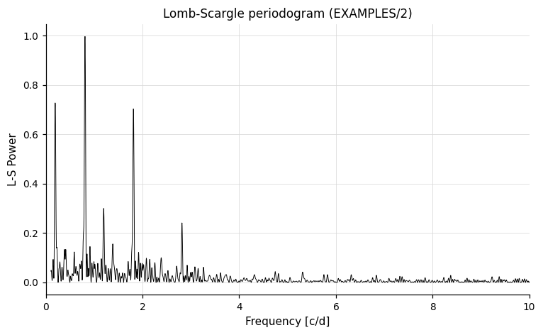

After pre-whitening peak 1 the periodogram looks like this — the dominant 1.234-day signal has been removed:

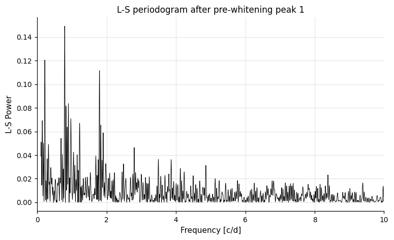

---

### `aov` — Phase-Binned Analysis of Variance

**Syntax**

```python
cmd.aov(minp, maxp, subsample, finetune, npeaks=5, nbin=None,
        save_periodogram=False, whiten=False, clip=None,
        clipiter=None, uselog=False, maskpoints=None, fixperiod_snr=None)
```

**Description**

Perform an Analysis of Variance (AoV) period search using phase binning. For each trial frequency, the light curve is phase-folded and binned; the AoV statistic θ_aov measures how much variance is explained by the phase bins relative to the total variance. A high θ_aov indicates a phase-coherent signal.

The initial search uses a frequency step of `subsample/T`. The top peaks are refined to a resolution of `finetune/T`. Use AoV instead of LS when the signal is strictly periodic but non-sinusoidal (e.g. eclipsing binaries, pulsating stars) — AoV is less sensitive to the shape of the variation.

CLI equivalent: [`-aov`](../../cli/period-finding.md#-aov-phase-binned-analysis-of-variance).

**Parameters**

| Parameter | Type | Description |
|-----------|------|-------------|
| `minp`, `maxp`, `subsample` | `float`, `str`, numpy array, `PerLC`, or `pd.Series` | Period range and frequency step (same forms as `LS`). See [Variable and expression parameters](#variable-and-expression-parameters); for batch per-LC values see [Per-LC array parameters](../pipeline.md#per-lc-array-parameters). |
| `finetune` | `float` or `str` | Fine-tuning frequency step factor applied near peak frequencies. Accepts var/expr forms and per-LC arrays. |
| `npeaks` | `int` | Number of peaks to report. Default `5`. |
| `nbin` | `int`, `str`, or `None` | Number of phase bins. Default `None` (vartools default = 8). Accepts var/expr forms and per-LC arrays. |
| `save_periodogram` | `bool`, `str`, or `Output` | Auxiliary file output. `True` captures as `result.files["aov_periodogram_N"]`. See [Auxiliary output files](index.md#auxiliary-output-files). |
| `whiten` | `bool` | Whiten the light curve at each peak before searching for the next. |
| `clip`, `clipiter` | `float`, `int` | Sigma-clipping parameters for the SNR calculation (default: iterative 5σ). |
| `uselog` | `bool` | Use `−ln(θ_aov)` for the SNR statistic; also outputs the mean and RMS of `−ln(θ_aov)`. |
| `maskpoints` | `str` or `None` | Name of a mask variable; points where the variable is `≤ 0` are excluded. |
| `fixperiod_snr` | `float`, `int`, `str`, or `None` | Evaluate the AoV periodogram at a known period and report its significance. See [`fixperiod_snr` — fixed-period significance](#fixperiod_snr-fixed-period-significance). |

**Output**

Per peak `k` (1 to `npeaks`) and command index `N`:

| Column | Description |
|--------|-------------|
| `Period_k_N` | Best period of peak `k` (days). |
| `AOV_k_N` | θ_aov statistic (default; replaced by `AOV_LOGSNR_k_N` when `uselog=True`). |
| `AOV_SNR_k_N` | Signal-to-noise ratio in the periodogram (omitted when `uselog=True`). |
| `AOV_NEG_LN_FAP_k_N` | `−ln(FAP)` (formal false alarm probability). Omitted when `uselog=True`. |
| `AOV_LOGSNR_k_N` | SNR computed on `−ln(θ_aov)`. Only when `uselog=True`. |
| `Mean_lnAOV_N` | Mean of `−ln(θ_aov)` (always emitted unless both `whiten=True` and `uselog=True`). |
| `RMS_lnAOV_N` | RMS of `−ln(θ_aov)` (same condition as `Mean_lnAOV_N`). |
| `Mean_lnAOV_k_N`, `RMS_lnAOV_k_N` | Per-peak whitened mean / RMS. Only when both `whiten=True` and `uselog=True`. |

When `fixperiod_snr` is set, four additional columns are appended — see [`fixperiod_snr` — fixed-period significance](#fixperiod_snr-fixed-period-significance).

When `save_periodogram` is enabled:

| File key | Description |
|----------|-------------|
| `result.files["aov_periodogram_N"]` | DataFrame: frequency vs. θ_aov. |

**References**

Schwarzenberg-Czerny 1989, MNRAS, 241, 153 and Devor 2005, ApJ, 628, 411.

**Examples**

```python
lc = vt.LightCurve.from_file("EXAMPLES/2")

result = lc.aov(0.1, 10.0, 0.1, 0.01, npeaks=5, nbin=20,
                whiten=True, clip=5.0, clipiter=1, save_periodogram=True)
print(result.vars["Period_1_0"])   # 1.23583047 — top-peak period
pgram = result.files["aov_periodogram_0"]   # pd.DataFrame: frequency vs AOV statistic

# fixperiod_snr — evaluate AOV at a known period.
# `fixperiod_snr="aov"` back-references the prior -aov call, so both steps
# must share one vartools invocation — use Pipeline here.
result = (vt.Pipeline()
        .aov(0.1, 10.0, 0.1, 0.01, npeaks=1)
        .aov(0.1, 10.0, 0.1, 0.01, fixperiod_snr="aov")).run(lc)
print(result.vars["AOV_SNR_PeriodFix_1"])
```

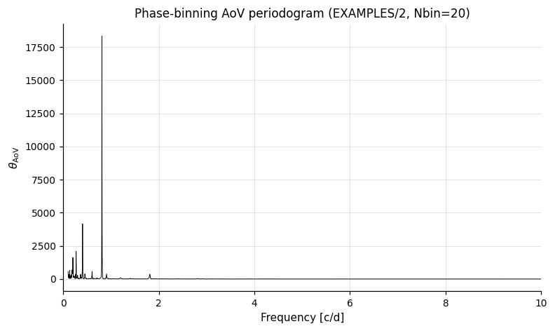

---

### `aov_harm` — Multi-Harmonic Analysis of Variance

**Syntax**

```python
cmd.aov_harm(nharm, minp, maxp, subsample, finetune, npeaks=5,
             save_periodogram=False, whiten=False, clip=None,
             clipiter=None, maskpoints=None, fixperiod_snr=None)
```

**Description**

Perform an AoV period search fitting a multi-harmonic model in place of phase bins. The model signal has `nharm` harmonics; if `nharm < 1`, the number of harmonics is varied automatically to minimise the false-alarm probability (with a penalty for overfitting). All other parameters behave identically to `aov`.

Multi-harmonic AoV is preferable to phase-binned AoV for highly non-sinusoidal but smoothly-varying signals such as RR Lyrae, Cepheids, and W UMa systems.

CLI equivalent: [`-aov_harm`](../../cli/period-finding.md#-aov_harm-multi-harmonic-analysis-of-variance).

**Parameters**

| Parameter | Type | Description |
|-----------|------|-------------|
| `nharm` | `int`, `str`, numpy array, `PerLC`, or `pd.Series` | Number of harmonics in the model (≥ 1). Set to `0` or negative for automatic selection. Accepts variable names (`"nharmvar"`), expressions (`"npeaks*2"`), and per-LC arrays. |
| `minp`, `maxp`, `subsample`, `finetune` | `float`, `str`, numpy array, `PerLC`, or `pd.Series` | Same as `aov`. |
| `npeaks` | `int` | Number of peaks to report. |
| `save_periodogram` | `bool`, `str`, or `Output` | Auxiliary file output. `True` captures as `result.files["aov_harm_periodogram_N"]`. |
| `whiten`, `clip`, `clipiter`, `maskpoints` | — | Same as `aov`. |
| `fixperiod_snr` | `float`, `int`, `str`, or `None` | Evaluate the multi-harmonic AoV periodogram at a known period. See [`fixperiod_snr` — fixed-period significance](#fixperiod_snr-fixed-period-significance). |

**Output**

Per peak `k` (1 to `npeaks`) and command index `N`:

| Column | Description |
|--------|-------------|
| `Period_k_N` | Best period of peak `k` (days). |
| `AOV_HARM_k_N` | Multi-harmonic AoV statistic. Only when `nharm > 0`. |
| `AOV_HARM_NEG_LOG_FAP_k_N` | `−log(FAP)`. Always emitted; when `nharm <= 0` (auto-select) it carries the periodogram value at the peak instead of the AoV statistic. |
| `AOV_HARM_NHARM_k_N` | Number of harmonics chosen at peak `k`. Only when `nharm <= 0` (automatic harmonic selection). |
| `AOV_HARM_SNR_k_N` | Signal-to-noise ratio in the periodogram. |
| `Mean_AOV_HARM_N` | Mean of the AoV-harm statistic (always emitted unless `whiten=True`). |
| `RMS_AOV_HARM_N` | RMS of the AoV-harm statistic (same condition as `Mean_AOV_HARM_N`). |
| `Mean_AOV_HARM_k_N`, `RMS_AOV_HARM_k_N` | Per-peak whitened mean / RMS. Only when `whiten=True`. |

When `fixperiod_snr` is set, four additional columns are appended — see [`fixperiod_snr` — fixed-period significance](#fixperiod_snr-fixed-period-significance).

When `save_periodogram` is enabled:

| File key | Description |
|----------|-------------|
| `result.files["aov_harm_periodogram_N"]` | DataFrame: frequency vs. multi-harmonic AoV statistic. |

**References**

Schwarzenberg-Czerny 1996, ApJ, 460, L107.

**Examples**

```python
lc = vt.LightCurve.from_file("EXAMPLES/2")

result = lc.aov_harm(1, 0.1, 10.0, 0.1, 0.01, npeaks=2,
                     whiten=True, clip=5.0, clipiter=1, save_periodogram=True)
print(result.vars["Period_1_0"])   # 1.23533969 — top-peak period
pgram = result.files["aov_harm_periodogram_0"]

# fixperiod_snr — evaluate AOV_HARM at a known period (numeric, or back-refs
# to a prior -aov or -Injectharm call inside the same Pipeline).
result = lc.aov_harm(2, 0.1, 10.0, 0.1, 0.01, fixperiod_snr=1.23440877)
print(result.vars["AOV_HARM_SNR_PeriodFix_0"])
```

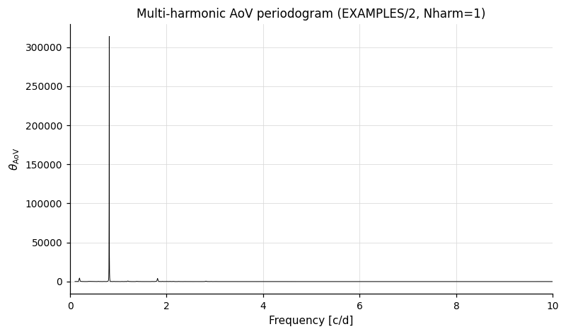

---

### `BLS` — Box-fitting Least Squares

**Syntax**

```python
cmd.BLS(minper, maxper, rmin=0.01, rmax=0.1, nbins=200,
        timezone=0, npeaks=1, subsample=1.0, nfreq=None,
        qmin=None, qmax=None,
        density_mode=False, stellar_density=None,
        min_exp_dur_frac=0.5, max_exp_dur_frac=1.5,
        df=None, extraparams=False, nobinnedrms=False,
        freq_grid=None, adjust_qmin=False, reduce_nbins=False,
        reportharmonics=False,
        save_periodogram=False, save_model=False,
        save_phcurve=False, save_jdcurve=False,
        ophcurve_phmin=0, ophcurve_phmax=1, ophcurve_phstep=0.005,
        ojdcurve_jdstep=0.02,
        correct_lc=False, fittrap=False, maskpoints=None)
```

**Description**

Run the Box-Least Squares (BLS) transit search algorithm of Kovács, Zucker & Mazeh (2002). BLS searches for periodic box-shaped (or trapezoidal) dips consistent with a transiting companion. The search is performed over a grid of trial periods and phase bins.

The transit-duration grid can be specified three ways:

- **`r` mode** (default): pass `rmin`/`rmax` as the minimum/maximum stellar radius in solar radii. The fractional-duration range for each period is derived from `q = 0.076 · R^(2/3) · P^(-2/3)`.
- **`q` mode**: pass `qmin`/`qmax` directly as the fractional transit duration (ingress-to-egress fraction).
- **density mode**: set `density_mode=True` and supply `stellar_density` (g/cm³) plus `min_exp_dur_frac` / `max_exp_dur_frac` to bracket the expected circular-orbit duration.

CLI equivalent: [`-BLS`](../../cli/period-finding.md#-bls-box-fitting-least-squares).

**Parameters**

| Parameter | Type | Description |
|-----------|------|-------------|
| `minper`, `maxper` | `float`, `str`, numpy array, `PerLC`, or `pd.Series` | Period search range (days). See [Variable and expression parameters](#variable-and-expression-parameters); for batch per-LC values see [Per-LC array parameters](../pipeline.md#per-lc-array-parameters). |
| `rmin`, `rmax` | `float` or `str` | `r`-mode duration bounds (default mode). Ignored when `qmin`/`qmax` are set. |
| `qmin`, `qmax` | `float`, `str`, or `None` | `q`-mode duration bounds (fractional transit duration). When set, emits `"q" qmin qmax` instead of `"r" rmin rmax`. |
| `nbins` | `int` or `str` | Number of phase bins (≥ `2/qmin`). Accepts var/expr/PerLC forms. |
| `timezone` | `float` | Time-zone offset (0 for HJD/BJD); affects the single-night Δχ² fraction. |
| `npeaks` | `int` | Number of transit candidates to report. |
| `subsample` | `float` or `str` | Frequency oversampling factor. |
| `nfreq` | `int`, `str`, or `None` | Fixed number of test frequencies (overrides `subsample`). |
| `density_mode` | `bool` | Use stellar density to set transit-duration bounds. Required for the Ofir (2014) optimal grid. |
| `stellar_density` | `float`, `str`, or `None` | Stellar density (g/cm³) for density mode. |
| `min_exp_dur_frac`, `max_exp_dur_frac` | `float` or `str` | Expected-duration fractions for density mode (default `0.5` and `1.5`). |
| `df` | `float`, `str`, or `None` | Fixed frequency step (alternative to `subsample`). |
| `extraparams` | `bool` | Include additional false-positive diagnostic columns in the output. |
| `nobinnedrms` | `bool` | Compute `BLS_SN` without binned RMS (faster, but SN is suppressed for high-significance peaks). |
| `freq_grid` | `str` or `None` | `"stepP"` for uniform period sampling, `"steplogP"` for log-uniform. |
| `adjust_qmin` | `bool` | Adaptively increase `qmin` at each frequency to `max(qmin, mindt·f)`. |
| `reduce_nbins` | `bool` | (With `adjust_qmin=True`) adaptively reduce `nbins` at each frequency. |
| `reportharmonics` | `bool` | Report period harmonics (½, ⅓, …) as additional candidates. |
| `save_periodogram` | `bool`, `str`, or `Output` | BLS spectrum file. `True` captures as `result.files["BLS_periodogram_N"]`. See [Auxiliary output files](index.md#auxiliary-output-files). |
| `save_model` | `bool`, `str`, or `Output` | Best-fit transit model. `True` captures as `result.files["BLS_model_N"]`. |
| `save_phcurve` | `bool`, `str`, or `Output` | Phase-folded model curve. `True` captures as `result.files["BLS_phcurve_N"]`. |
| `ophcurve_phmin`, `ophcurve_phmax`, `ophcurve_phstep` | `float` | Phase range and step for the phase-curve output. Defaults `0.0`, `1.0`, `0.005`. |
| `save_jdcurve` | `bool`, `str`, or `Output` | JD-sampled model curve. `True` captures as `result.files["BLS_jdcurve_N"]`. |
| `ojdcurve_jdstep` | `float` | Time step (days) for the JD-curve output. Default `0.02`. |
| `correct_lc` | `bool` | Subtract the best-fit transit from the LC before passing to the next command. |
| `fittrap` | `bool` | Fit a trapezoidal rather than box-shaped transit at each peak. Adds `BLS_Qingress_k_N` and `BLS_OOTmag_k_N` to the output. |
| `maskpoints` | `str` or `None` | Mask variable; points with `maskvar ≤ 0` are excluded from the BLS spectrum. |

**Output**

Per peak `k` (1 to `npeaks`) and command index `N`:

| Column | Description |
|--------|-------------|
| `BLS_Period_k_N` | Best period of peak `k` (days). |
| `BLS_Tc_k_N` | Mid-transit epoch. |
| `BLS_SN_k_N` | Signal-to-noise ratio in the BLS spectrum. |
| `BLS_SR_k_N` | BLS spectral residual. |
| `BLS_SDE_k_N` | Signal detection efficiency. |
| `BLS_Depth_k_N` | Transit depth (magnitudes). |
| `BLS_Qtran_k_N` | Fractional transit duration `q`. |
| `BLS_i1_k_N`, `BLS_i2_k_N` | Phases of transit ingress and egress. |
| `BLS_deltaChi2_k_N` | Δχ² of the best-fit transit. |
| `BLS_fraconenight_k_N` | Fraction of Δχ² from a single night. |
| `BLS_Npointsintransit_k_N` | Points within the transit window. |
| `BLS_Ntransits_k_N` | Number of observed transits. |
| `BLS_Npointsbeforetransit_k_N`, `BLS_Npointsaftertransit_k_N` | Points immediately before/after each transit (used for diagnostics). |
| `BLS_Rednoise_k_N` | Estimated red noise level. |
| `BLS_Whitenoise_k_N` | Estimated white noise level. |
| `BLS_SignaltoPinknoise_k_N` | Signal-to-pink-noise ratio. |
| `BLS_Qingress_k_N`, `BLS_OOTmag_k_N` | Ingress fraction and out-of-transit magnitude. Only when `fittrap=True`. |
| `BLS_Period_invtransit_N` | Period of the largest *inverted* (anti-transit) Δχ² peak — diagnostic for symmetric systematics. |
| `BLS_deltaChi2_invtransit_N` | Δχ² of the inverse-transit peak. |
| `BLS_MeanMag_N` | Out-of-transit mean magnitude. |

When `extraparams=True` is set, the following additional per-peak columns are appended: `BLS_SRSum_k_N`, `BLS_ResSig_k_N`, `BLS_DipSig_k_N`, `BLS_SRShift_k_N`, `BLS_SRSig_k_N`, `BLS_SRShiftSNR_k_N`, `BLS_DSP_k_N`, `BLS_DSPG_k_N`, `BLS_FreqLow_k_N`, `BLS_FreqHigh_k_N`, `BLS_LogProb_k_N`, `BLS_PeakArea_k_N`, `BLS_PeakMean_k_N`, `BLS_PeakDev_k_N`, `BLS_LombLog_k_N`, `BLS_NTV_k_N`, `BLS_GDSP_k_N`, `BLS_OOTSig_k_N`, `BLS_TRSig_k_N`, `BLS_OOTDFTF_k_N`, `BLS_OOTDFTA_k_N`, `BLS_BinSN_k_N`, `BLS_MaxPhaseGap_k_N`, `BLS_Dip1DblPeriod_k_N`, `BLS_Dip2DblPeriod_k_N`, `BLS_DelChi2DblPeriod_k_N`, `BLS_SRSecondary_k_N`, `BLS_SRSumSecondary_k_N`, `BLS_QSecondary_k_N`, `BLS_EpochSecondary_k_N`, `BLS_HSecondary_k_N`, `BLS_LSecondary_k_N`, `BLS_DepthSecondary_k_N`, `BLS_NPointsInTransitSecondary_k_N`, `BLS_NTransitsSecondary_k_N`, `BLS_SignaltoPinknoiseSecondary_k_N`, `BLS_DeltaChi2TransitSecondary_k_N`, `BLS_BinSNSecondary_k_N`, `BLS_PhaseOffsetSecondary_k_N`, `BLS_HarmMean_k_N`, `BLS_fundA_k_N`, `BLS_fundB_k_N`, `BLS_harmA_k_N`, `BLS_harmB_k_N`, `BLS_HarmAmp_k_N`, `BLS_HarmDeltaChi2_k_N`.

When the corresponding `save_*` keyword is set:

| File key | Description |
|----------|-------------|
| `result.files["BLS_periodogram_N"]` | DataFrame: frequency vs. BLS spectral residual. |
| `result.files["BLS_model_N"]` | DataFrame: phased data with best-fit transit model overlaid. |
| `result.files["BLS_phcurve_N"]` | DataFrame: model phase curve sampled on `[ophcurve_phmin, ophcurve_phmax]`. |
| `result.files["BLS_jdcurve_N"]` | DataFrame: model curve sampled in JD space at `ojdcurve_jdstep`. |

**References**

Kovács, Zucker & Mazeh 2002, A&A, 391, 369. For the Ofir (2014) optimal frequency sampling (used in density mode), cite Ofir 2014, A&A, 561, A138.

**Examples**

```python
lc = vt.LightCurve.from_file("EXAMPLES/3.transit")

# Fixed fractional duration (r mode) — simplest default.
result = lc.BLS(0.1, 20.0, rmin=0.01, rmax=0.1,
                nbins=200, nfreq=10000, npeaks=1, fittrap=True,
                save_periodogram=True, save_model=True)
print(result.vars["BLS_Period_1_0"])    # 2.12334706
print(result.vars["BLS_SN_1_0"])        # signal-to-noise
print(result.vars["BLS_SDE_1_0"])       # signal detection efficiency
pgram = result.files["BLS_periodogram_0"]   # pd.DataFrame: frequency vs BLS power

# Q mode (specify min/max fractional transit duration directly)
result2 = lc.BLS(0.1, 20.0, qmin=0.01, qmax=0.1,
                 nbins=200, nfreq=10000, npeaks=3)

# Density mode (recommended when stellar density is known).
# stellar_density in g/cm^3; min/max_exp_dur_frac scale the expected duration.
# Use a wide enough frac range — narrow ranges can exclude all trial periods.
result3 = lc.BLS(0.1, 20.0,
                 density_mode=True, stellar_density=1.4,
                 min_exp_dur_frac=0.1, max_exp_dur_frac=3.0,
                 nbins=200, nfreq=10000, npeaks=1)

# Log-uniform frequency grid with auto qmin adjustment (density mode).
result4 = lc.BLS(0.5, 10.0,
                 density_mode=True, stellar_density=1.4,
                 min_exp_dur_frac=0.1, max_exp_dur_frac=3.0,
                 nbins=200, nfreq=5000,
                 freq_grid="steplogP", adjust_qmin=True, reduce_nbins=True)
```

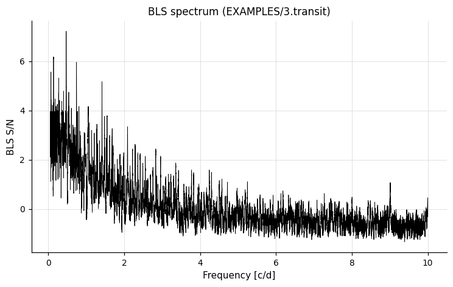

The output `*.bls.model` file contains the phased data and the best-fit trapezoidal model:

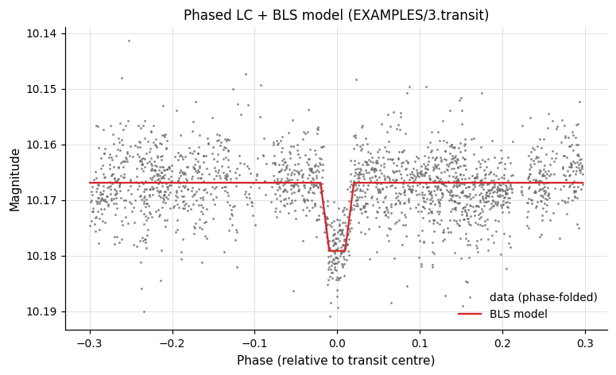

---

### `BLSFixPer` — BLS at a Fixed Period

**Syntax**

```python
cmd.BLSFixPer(period, rmin=0.01, rmax=0.1, nbins=200, timezone=0,
              qmin=None, qmax=None,
              save_model=False, correct_lc=False, fittrap=False,
              maskpoints=None)
```

**Description**

Run BLS at a single fixed period, searching only for the transit phase, depth, and duration. Useful as a second pass after a full BLS or LS period search.

CLI equivalent: [`-BLSFixPer`](../../cli/period-finding.md#-blsfixper-bls-at-a-fixed-period).

**Parameters**

| Parameter | Type | Description |
|-----------|------|-------------|
| `period` | `float` or `str` | Fixed period (days). Accepts back-reference keywords — see the tip below. |
| `rmin`, `rmax` | `float` or `str` | `r`-mode duration bounds. |
| `qmin`, `qmax` | `float` or `None` | `q`-mode duration bounds (ingress-to-egress fraction). When set, emits `"q" qmin qmax` instead of `"r" rmin rmax`. |
| `nbins` | `int` or `str` | Number of phase bins. |
| `timezone` | `float` | Time-zone offset (0 for HJD/BJD). |
| `save_model` | `bool`, `str`, or `Output` | Best-fit transit model. `True` captures as `result.files["BLSFixPer_model_N"]`. |
| `correct_lc` | `bool` | Subtract the best-fit transit from the LC before passing to the next command. |
| `fittrap` | `bool` | Fit a trapezoidal transit instead of a box. |
| `maskpoints` | `str` or `None` | Mask variable; points with `maskvar ≤ 0` are excluded. |

!!! tip "Back-references for `period`"
    `period` accepts `"ls"`, `"aov"`, and `"fixcolumn NAME"` in addition to numeric values. The keyword resolves to the best period from the most recent matching prior command and works equally inside a single `Pipeline` or across chain steps (e.g. `lc.LS(...).BLSFixPer(period="ls")`). With no matching prior command in the chain, a `LookupError` is raised.

**Output**

Suffix `N` is the pipeline command index:

| Column | Description |
|--------|-------------|
| `BLSFixPer_Period_N` | Period used. |
| `BLSFixPer_Tc_N` | Mid-transit epoch. |
| `BLSFixPer_SR_N` | BLS spectral residual. |
| `BLSFixPer_Depth_N` | Transit depth (mag). |
| `BLSFixPer_Qtran_N` | Fractional transit duration. |
| `BLSFixPer_Qingress_N`, `BLSFixPer_OOTmag_N` | Ingress fraction and out-of-transit magnitude. Only when `fittrap=True`. |
| `BLSFixPer_i1_N`, `BLSFixPer_i2_N` | Phases of transit ingress and egress. |
| `BLSFixPer_deltaChi2_N` | Δχ² of the transit. |
| `BLSFixPer_fraconenight_N` | Fraction of Δχ² from one night. |
| `BLSFixPer_Npointsintransit_N` | Points within the transit window. |
| `BLSFixPer_Ntransits_N` | Number of observed transits. |
| `BLSFixPer_Npointsbeforetransit_N`, `BLSFixPer_Npointsaftertransit_N` | Points immediately before/after each transit. |
| `BLSFixPer_Rednoise_N`, `BLSFixPer_Whitenoise_N` | Noise estimates. |
| `BLSFixPer_SignaltoPinknoise_N` | Signal-to-pink-noise. |
| `BLSFixPer_deltaChi2_invtransit_N` | Δχ² of the largest inverted (anti-transit) peak. |
| `BLSFixPer_MeanMag_N` | Out-of-transit mean magnitude. |

When `save_model` is enabled:

| File key | Description |
|----------|-------------|
| `result.files["BLSFixPer_model_N"]` | DataFrame: phased data with the best-fit transit model. |

**References**

Kovács, Zucker & Mazeh 2002, A&A, 391, 369.

**Examples**

```python
lc = vt.LightCurve.from_file("EXAMPLES/3.transit")

# Compute RMS, fit transit at fixed period, then check RMS on residuals
result = (
    lc.rms()
      .BLSFixPer("fix 2.12345", rmin=0.01, rmax=0.1, nbins=200, fittrap=True)
      .rms()
)
print(result.vars["BLSFixPer_Period_1"])    # 2.12345
print(result.vars["BLSFixPer_Depth_1"])     # transit depth
print(result.vars["BLSFixPer_Qtran_1"])     # fractional duration
```

---

### `BLSFixDurTc` — BLS with Fixed Transit Duration and Epoch

**Syntax**

```python
cmd.BLSFixDurTc(duration, Tc,
                minper=0.1, maxper=100.0, nfreq=10000,
                timezone=0, npeaks=1,
                fixdepth=None, qgress=None,
                save_periodogram=False, save_model=False,
                correct_lc=False, fittrap=False,
                save_phcurve=False, ophcurve_phmin=0.0,
                ophcurve_phmax=1.0, ophcurve_phstep=0.005,
                save_jdcurve=False, ojdcurve_jdstep=0.02,
                maskpoints=None)
```

**Description**

Run BLS with the transit duration and reference epoch fixed; the period is searched over a grid from `minper` to `maxper`. Optionally the transit depth and ingress fraction (`qgress`) can also be fixed. For `qgress`: `0` = box-shaped, `0.5` = V-shaped (grazing).

`duration` and `Tc` each accept either a float (→ `fix <value>`), `"fixcolumn <colname>"`, or `"list"` / `"list column <N>"`.

CLI equivalent: [`-BLSFixDurTc`](../../cli/period-finding.md#-blsfixdurtc-bls-with-fixed-transit-duration-and-epoch).

**Parameters**

| Parameter | Type | Description |
|-----------|------|-------------|
| `duration` | `float` or `str` | Transit duration (days). |
| `Tc` | `float` or `str` | Mid-transit epoch (JD/BJD). |
| `minper`, `maxper` | `float` or `str` | Period search range (days). |
| `nfreq` | `int` or `str` | Number of trial frequencies. |
| `timezone` | `float` | Time-zone offset (0 for UTC/BJD). |
| `npeaks` | `int` | Number of peaks to report. |
| `fixdepth` | `float`, `str`, or `None` | Fix transit depth to this value (or column/list spec); `None` to optimise. |
| `qgress` | `float`, `str`, or `None` | Fractional ingress/egress duration (requires `fixdepth`). |
| `save_periodogram`, `save_model`, `save_phcurve`, `save_jdcurve` | `bool`, `str`, or `Output` | Auxiliary file outputs (BLS spectrum, model, phase curve, JD curve). |
| `ophcurve_phmin`, `ophcurve_phmax`, `ophcurve_phstep` | `float` | Phase range and step for the phase-curve output. Defaults `0.0`, `1.0`, `0.005`. |
| `ojdcurve_jdstep` | `float` | Time step (days) for the JD-curve output. Default `0.02`. |
| `correct_lc` | `bool` | Subtract the best-fit transit from the LC before passing to the next command. |
| `fittrap` | `bool` | Fit a trapezoidal transit instead of a box. |
| `maskpoints` | `str` or `None` | Mask variable; points with `maskvar ≤ 0` are excluded. |

**Output**

Suffix `N` is the pipeline command index. Per-peak quantities use suffix `k_N` (1 to `npeaks`).

| Column | Description |
|--------|-------------|
| `BLSFixDurTc_Duration_N` | Fixed transit duration used. |
| `BLSFixDurTc_Tc_N` | Fixed epoch used. |
| `BLSFixDurTc_Depth_N` | Fixed depth used. Only when `fixdepth` is set. |
| `BLSFixDurTc_Qingress_N` | Fixed ingress fraction used. Only when `fixdepth` is set. |
| `BLSFixDurTc_Period_k_N` | Best-fit period of peak `k`. |
| `BLSFixDurTc_SN_k_N` | Signal-to-noise of peak `k`. |
| `BLSFixDurTc_SR_k_N` | BLS spectral residual. |
| `BLSFixDurTc_SDE_k_N` | Signal detection efficiency. |
| `BLSFixDurTc_Depth_k_N` | Best-fit transit depth. |
| `BLSFixDurTc_Qtran_k_N` | Fractional transit duration. |
| `BLSFixDurTc_Qingress_k_N`, `BLSFixDurTc_OOTmag_k_N` | Ingress fraction and out-of-transit magnitude. Only when `fittrap=True` and `fixdepth` is **not** set. |
| `BLSFixDurTc_deltaChi2_k_N` | Δχ² of the best transit. |
| `BLSFixDurTc_fraconenight_k_N` | Fraction of Δχ² from one night. |
| `BLSFixDurTc_Npointsintransit_k_N` | Points within the transit window. |
| `BLSFixDurTc_Ntransits_k_N` | Number of observed transits. |
| `BLSFixDurTc_Npointsbeforetransit_k_N`, `BLSFixDurTc_Npointsaftertransit_k_N` | Points immediately before/after each transit. |
| `BLSFixDurTc_Rednoise_k_N`, `BLSFixDurTc_Whitenoise_k_N` | Noise estimates. |
| `BLSFixDurTc_SignaltoPinknoise_k_N` | Signal-to-pink-noise. |
| `BLSFixDurTc_Period_invtransit_N` | Period of the largest inverted (anti-transit) Δχ² peak. |
| `BLSFixDurTc_deltaChi2_invtransit_N` | Δχ² of the inverse-transit peak. |
| `BLSFixDurTc_MeanMag_N` | Out-of-transit mean magnitude. |

When `save_*` keywords are set:

| File key | Description |
|----------|-------------|
| `result.files["BLSFixDurTc_periodogram_N"]` | BLS spectrum (frequency vs. SR). |
| `result.files["BLSFixDurTc_model_N"]` | Phased data with the best-fit transit model. |
| `result.files["BLSFixDurTc_phcurve_N"]` | Model phase curve. |
| `result.files["BLSFixDurTc_jdcurve_N"]` | Model curve in JD space. |

**References**

Kovács, Zucker & Mazeh 2002, A&A, 391, 369.

**Examples**

```python
# Run a BLS search on EXAMPLES/3.transit with the transit duration
# and epoch held fixed.  The two `rms` calls show the residual scatter
# before and after subtracting the best-fit transit model.
lc = vt.LightCurve.from_file("EXAMPLES/3.transit")
pipe = (vt.Pipeline()
        .rms()
        .BLSFixDurTc(duration=0.076996297, Tc=53727.29676321477,
                     minper=0.1, maxper=20.0, nfreq=100000,
                     timezone=0, npeaks=1,
                     correct_lc=True, fittrap=True)
        .rms())
result = pipe.run(lc)
```

---

### `BLSFixPerDurTc` — BLS with Fixed Period, Duration, and Epoch

**Syntax**

```python
cmd.BLSFixPerDurTc(period, duration, Tc,
                   timezone=0,
                   fixdepth=None, qgress=None,
                   save_model=False, correct_lc=False, fittrap=False,
                   save_phcurve=False, ophcurve_phmin=0.0,
                   ophcurve_phmax=1.0, ophcurve_phstep=0.005,
                   save_jdcurve=False, ojdcurve_jdstep=0.02,
                   maskpoints=None)
```

**Description**

Compute BLS transit statistics for a fully specified signal — no period search is performed. The period, duration, and `Tc` are all fixed; the depth is optimised by default (or also fixed when `fixdepth` is given).

`period`, `duration`, and `Tc` each accept a float, `"fixcolumn <colname>"`, or `"list"` / `"list column <N>"` (same forms as `BLSFixDurTc`).

CLI equivalent: [`-BLSFixPerDurTc`](../../cli/period-finding.md#-blsfixperdurtc-bls-with-fixed-period-duration-and-epoch).

**Parameters**

| Parameter | Type | Description |
|-----------|------|-------------|
| `period` | `float` or `str` | Transit period (days). |
| `duration` | `float` or `str` | Transit duration (days). |
| `Tc` | `float` or `str` | Mid-transit epoch (JD/BJD). |
| `timezone` | `float` | Time-zone offset (0 for UTC/BJD). |
| `fixdepth` | `float`, `str`, or `None` | Fix transit depth (or column/list spec); `None` to optimise. |
| `qgress` | `float`, `str`, or `None` | Fractional ingress/egress duration (requires `fixdepth`). |
| `save_model`, `save_phcurve`, `save_jdcurve` | `bool`, `str`, or `Output` | Auxiliary file outputs. |
| `ophcurve_phmin`, `ophcurve_phmax`, `ophcurve_phstep` | `float` | Phase range and step for the phase-curve output. Defaults `0.0`, `1.0`, `0.005`. |
| `ojdcurve_jdstep` | `float` | Time step (days) for the JD-curve output. Default `0.02`. |
| `correct_lc` | `bool` | Subtract the best-fit transit from the LC before passing to the next command. |
| `fittrap` | `bool` | Fit a trapezoidal transit instead of a box. |
| `maskpoints` | `str` or `None` | Mask variable; points with `maskvar ≤ 0` are excluded. |

**Output**

Suffix `N` is the pipeline command index:

| Column | Description |
|--------|-------------|
| `BLSFixPerDurTc_Period_N` | Period used. |
| `BLSFixPerDurTc_Duration_N` | Duration used. |
| `BLSFixPerDurTc_Tc_N` | Epoch used. |
| `BLSFixPerDurTc_Depth_N` | Transit depth (fixed input when `fixdepth` is set, otherwise best-fit). |
| `BLSFixPerDurTc_Qtran_N` | Fractional transit duration. |
| `BLSFixPerDurTc_Qingress_N`, `BLSFixPerDurTc_OOTmag_N` | Ingress fraction and out-of-transit magnitude. Only when `fittrap=True` and `fixdepth` is **not** set. When `fixdepth` is set, only `BLSFixPerDurTc_Qingress_N` (the fixed input value) is emitted. |
| `BLSFixPerDurTc_deltaChi2_N` | Δχ² of the transit signal. |
| `BLSFixPerDurTc_fraconenight_N` | Fraction of Δχ² from one night. |
| `BLSFixPerDurTc_Npointsintransit_N` | Points within the transit window. |
| `BLSFixPerDurTc_Ntransits_N` | Number of observed transits. |
| `BLSFixPerDurTc_Npointsbeforetransit_N`, `BLSFixPerDurTc_Npointsaftertransit_N` | Points immediately before/after each transit. |
| `BLSFixPerDurTc_Rednoise_N`, `BLSFixPerDurTc_Whitenoise_N` | Noise estimates. |
| `BLSFixPerDurTc_SignaltoPinknoise_N` | Signal-to-pink-noise. |
| `BLSFixPerDurTc_MeanMag_N` | Out-of-transit mean magnitude. |

When `save_*` keywords are set:

| File key | Description |
|----------|-------------|
| `result.files["BLSFixPerDurTc_model_N"]` | Phased data with the best-fit transit model. |
| `result.files["BLSFixPerDurTc_phcurve_N"]` | Model phase curve. |
| `result.files["BLSFixPerDurTc_jdcurve_N"]` | Model curve in JD space. |

**References**

Kovács, Zucker & Mazeh 2002, A&A, 391, 369.

**Examples**

```python
# Evaluate BLS statistics on EXAMPLES/3.transit with period, duration,
# and Tc all fixed; subtract the best-fit transit model.
lc = vt.LightCurve.from_file("EXAMPLES/3.transit")
pipe = (vt.Pipeline()
        .rms()
        .BLSFixPerDurTc(period=2.12345,
                        duration=0.076996297,
                        Tc=53727.29676321477,
                        timezone=0,
                        correct_lc=True, fittrap=True)
        .rms())
result = pipe.run(lc)
```

---

### `dftclean` — DFT Power Spectrum + CLEAN

**Syntax**

```python
cmd.dftclean(nbeam, maxfreq=None, save_dspec=False, save_wfunc=False,
             save_cspec=False, gain=0.1, SNlimit=3.0, npeaks=None,
             finddirtypeaks=None, finddirtypeaks_clip=None,
             finddirtypeaks_clipiter=None,
             outcbeam=False, useampspec=False, verboseout=False,
             maskpoints=None)
```

**Description**

Compute the Discrete Fourier Transform (DFT) power spectrum of the light curve using the FDFT algorithm of Kurtz (1985), and optionally deconvolve it with the CLEAN algorithm of Roberts, Lehar & Dreher (1987) to remove aliasing due to the window function.

The CLEAN iteration starts from the dirty spectrum, identifies the strongest peak, subtracts a scaled CLEAN beam centred on that peak, and repeats until the residual is below `SNlimit · noise`. The `gain` parameter (∈ [0.1, 1.0]) controls how aggressively each iteration removes the peak: smaller is slower but more thorough.

CLI equivalent: [`-dftclean`](../../cli/period-finding.md#-dftclean-dft-power-spectrum-clean).

**Parameters**

| Parameter | Type | Description |
|-----------|------|-------------|
| `nbeam` | `int` or `str` | Number of frequency samples per `1/T` element (`T` = light-curve baseline). Controls spectral resolution. |
| `maxfreq` | `float`, `str`, or `None` | Maximum frequency (cycles/day). Default: `1 / (2 · min_time_separation)` (Nyquist). |
| `save_dspec`, `save_cspec`, `save_wfunc` | `bool`, `str`, or `Output` | Save the dirty spectrum, CLEAN spectrum, and window function. Captured as `result.files["dftclean_dspec_N"]`, `result.files["dftclean_cspec_N"]`, `result.files["dftclean_wfunc_N"]`. |
| `gain`, `SNlimit` | `float` | CLEAN gain (∈ [0.1, 1.0]) and SN-stop threshold. CLEAN runs only when at least one of `save_cspec` / `npeaks` / `finddirtypeaks` is set. |
| `npeaks` | `int` or `None` | Number of peaks to find in the *clean* spectrum. |
| `finddirtypeaks` | `int` or `None` | Number of peaks to find in the *dirty* spectrum. |
| `finddirtypeaks_clip`, `finddirtypeaks_clipiter` | `float`, `int` | Sigma-clipping for dirty-peak SNR (default: iterative 5σ). |
| `outcbeam` | `bool`, `str`, or `Output` | Write the CLEAN beam to a file. `True` captures as `result.files["dftclean_cbeam_N"]`. |
| `useampspec` | `bool` | Compute SNR on the amplitude spectrum instead of the power spectrum. |
| `verboseout` | `bool` | Include the mean and stddev of the spectrum (before and after clipping) in the output. |
| `maskpoints` | `str` or `None` | Mask variable; points with `maskvar ≤ 0` are excluded. |

**Output**

Peak indices in `dftclean` output columns are **0-indexed** (`k` runs from 0 to `npeaks − 1` or `finddirtypeaks − 1`). `N` is the pipeline command index:

| Column | Description |
|--------|-------------|
| `DFTCLEAN_DSPEC_PEAK_FREQ_k_N` | Frequency of dirty-spectrum peak `k` (cycles/day). Only when `finddirtypeaks` is set. |
| `DFTCLEAN_DSPEC_PEAK_POW_k_N` | Power at the dirty peak. Only when `finddirtypeaks` is set. |
| `DFTCLEAN_DSPEC_PEAK_SNR_k_N` | SNR of the dirty peak. Only when `finddirtypeaks` is set. |
| `DFTCLEAN_CSPEC_PEAK_FREQ_k_N`, `_POW_k_N`, `_SNR_k_N` | Same trio for the CLEAN-spectrum peaks. Only when `npeaks` is set. |
| `DFTCLEAN_DSPEC_AVESPEC_N`, `DFTCLEAN_DSPEC_STDSPEC_N` | Mean / RMS of the (sigma-clipped) dirty power spectrum. Only when `verboseout=True` and `finddirtypeaks` is set. |
| `DFTCLEAN_DSPEC_AVESPEC_NOCLIP_N`, `DFTCLEAN_DSPEC_STDSPEC_NOCLIP_N` | Same statistics computed without sigma-clipping. Same condition. |
| `DFTCLEAN_CSPEC_AVESPEC_N`, `DFTCLEAN_CSPEC_STDSPEC_N` | Mean / RMS of the (sigma-clipped) CLEAN spectrum. Only when `verboseout=True` and `npeaks` is set. |
| `DFTCLEAN_CSPEC_AVESPEC_NOCLIP_N`, `DFTCLEAN_CSPEC_STDSPEC_NOCLIP_N` | Same statistics without sigma-clipping. Same condition. |

When `save_*` keywords are set:

| File key | Description |
|----------|-------------|
| `result.files["dftclean_dspec_N"]` | DataFrame: dirty power spectrum (frequency vs. power). |
| `result.files["dftclean_cspec_N"]` | DataFrame: CLEAN power spectrum. |
| `result.files["dftclean_wfunc_N"]` | DataFrame: window function. |
| `result.files["dftclean_cbeam_N"]` | DataFrame: CLEAN beam (when `outcbeam=True`). |

**References**

Kurtz 1985, MNRAS, 213, 773 for the FDFT algorithm. Roberts, Lehar & Dreher 1987, AJ, 93, 4 for the CLEAN algorithm.

**Examples**

```python
lc = vt.LightCurve.from_file("EXAMPLES/2")

# Compute DFT CLEAN periodogram and find the top peak
result = lc.dftclean(4, maxfreq=10.0, npeaks=1, save_dspec=True)
print(result.vars["DFTCLEAN_CSPEC_PEAK_FREQ_0_0"])  # top CLEAN-spectrum peak frequency (cycles/day)
dspec = result.files["dftclean_dspec_0"]   # pd.DataFrame: dirty spectrum (frequency vs power)
```

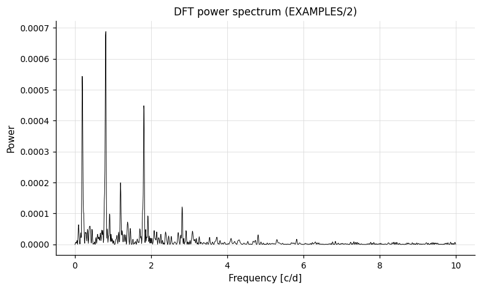

A second example injects three harmonics, runs CLEAN, and writes the four output products (dirty spectrum, cleaned spectrum, CLEAN beam, window function):

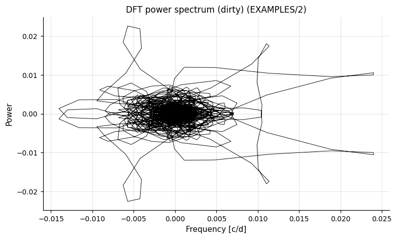
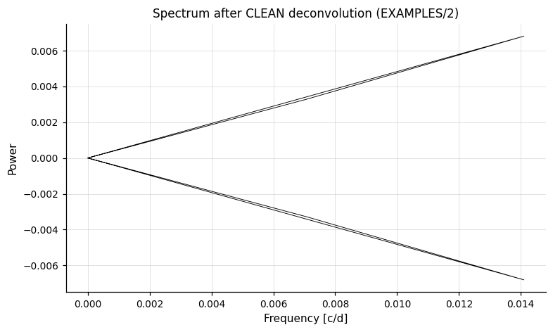
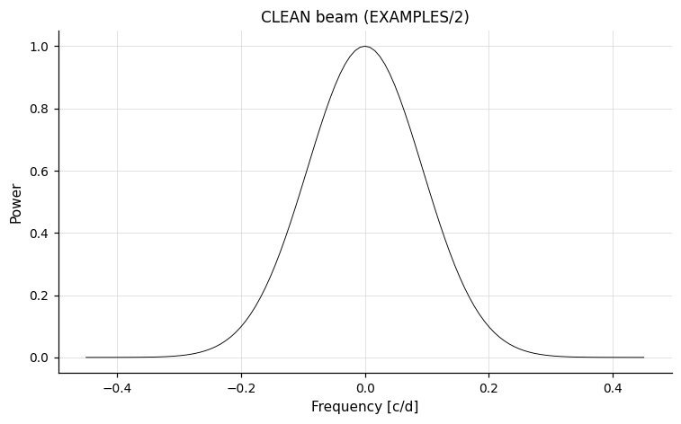
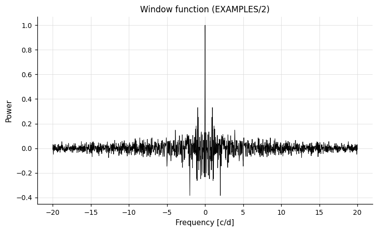

---

### `wwz` — Weighted Wavelet Z-Transform

**Syntax**

```python
cmd.wwz(maxfreq="auto", freqsamp=None, tau0="auto", tau1="auto",
        dtau="auto", c=0.0125, save_transform=False,
        save_maxtransform=False,
        transform_format=None, transform_name=None,
        maxtransform_name=None, maskpoints=None)
```

**Description**

Compute the Weighted Wavelet Z-Transform (WWZ) as defined by Foster (1996), using an abbreviated Morlet wavelet:

```
f(z) = exp(i·2π·f·(t − τ) − c·(2π·f)²·(t − τ)²)
```

The transform is computed for all combinations of trial frequency (up to `maxfreq`) and time shift (`tau0` to `tau1` in steps of `dtau`). The result is a time-frequency map of signal power, especially useful for non-stationary signals. The decay constant `c` controls the trade-off between time and frequency resolution.

CLI equivalent: [`-wwz`](../../cli/period-finding.md#-wwz-weighted-wavelet-z-transform).

**Parameters**

| Parameter | Type | Description |
|-----------|------|-------------|
| `maxfreq` | `float`, `str`, or `"auto"` | Maximum frequency in cycles/day. `"auto"` = `1 / (2 · min_time_separation)`. |
| `freqsamp` | `float`, `str`, or `None` | Frequency sampling as a multiple of `1/T`. |
| `tau0`, `tau1` | `float`, `str`, or `"auto"` | Start and end times for the time-shift scan. `"auto"` uses min/max of the LC time. |
| `dtau` | `float`, `str`, or `"auto"` | Step size in time shift. `"auto"` = minimum time separation. |
| `c` | `float` or `str` | Morlet wavelet decay constant (default: `1/(8π²) ≈ 0.0125`). |
| `save_transform` | `bool`, `str`, or `Output` | Write the full 2-D transform; captured as `result.files["wwz_transform_N"]`. |
| `save_maxtransform` | `bool`, `str`, or `Output` | Write the max-Z projection over frequency; captured as `result.files["wwz_maxtransform_N"]`. |
| `transform_format` | `str` or `None` | Output format for the full transform: `"fits"` or `"pm3d"`. Only used when `save_transform` is set. |
| `transform_name`, `maxtransform_name` | `str` or `None` | Naming format strings for the output files (e.g. `"%s.wwz"`). |
| `maskpoints` | `str` or `None` | Mask variable; points with `maskvar ≤ 0` are excluded. |

**Output**

Suffix `N` is the pipeline command index:

| Column | Description |
|--------|-------------|
| `MaxWWZ_N` | Maximum value of the Z-transform over all time-shifts and frequencies. |
| `MaxWWZ_Freq_N` | Frequency at the maximum Z. |
| `MaxWWZ_TShift_N` | Time-shift τ at the maximum Z. |
| `MaxWWZ_Power_N` | Power at the maximum Z. |
| `MaxWWZ_Amplitude_N` | Amplitude at the maximum Z. |
| `MaxWWZ_Neffective_N` | Effective number of data points at the maximum Z. |
| `MaxWWZ_AverageMag_N` | Local mean magnitude at the maximum Z. |
| `Med_WWZ_N` | Median Z over τ at the max-Z frequency. |
| `Med_Freq_N` | Median frequency over τ. |
| `Med_Power_N` | Median power over τ. |
| `Med_Amplitude_N` | Median amplitude over τ. |
| `Med_Neffective_N` | Median Neffective over τ. |
| `Med_AverageMag_N` | Median local mean magnitude over τ. |

When `save_*` keywords are set:

| File key | Description |
|----------|-------------|
| `result.files["wwz_transform_N"]` | Full time-frequency map of the transform. |
| `result.files["wwz_maxtransform_N"]` | DataFrame: time vs. peak-frequency power. |

**References**

Foster 1996, AJ, 112, 1709.

**Examples**

```python
lc = vt.LightCurve.from_file("EXAMPLES/8")

# tau0 / tau1 set the time range scanned by the wavelet; derive them
# from the observed time baseline of the light curve.
result = lc.wwz(maxfreq=2.0, freqsamp=0.25,
                tau0=float(lc.t.min()), tau1=float(lc.t.max()),
                dtau=0.1, save_transform=True, save_maxtransform=True)
maxt = result.files["wwz_maxtransform_0"]   # pd.DataFrame: time vs peak frequency/power
```

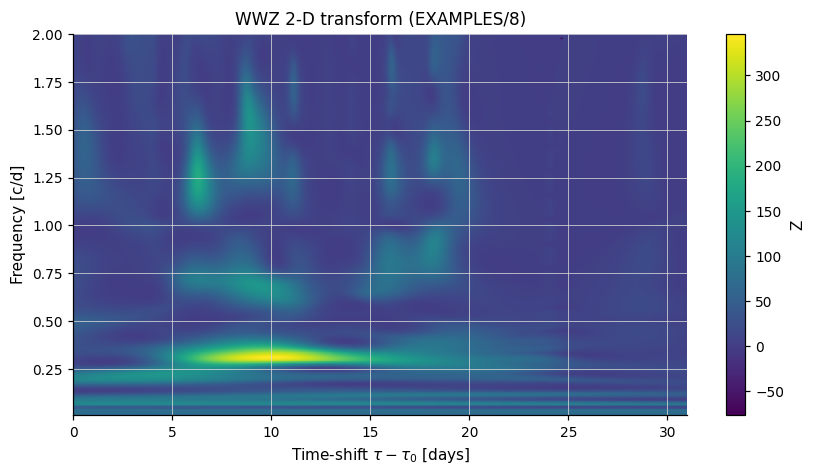

The transient ~0.3 cyc/day signal is visible only between days 5–20 of the series.

---

### `GetLSAmpThresh` — Minimum Detectable Amplitude

**Syntax**

```python
cmd.GetLSAmpThresh(period="ls", minp=0.1, thresh=10.0,
                   mode="harm", nharm=1, nsubharm=0,
                   listfile=None, noGLS=False)
```

**Description**

Determine the minimum peak-to-peak amplitude that a signal at a given period must have to be detected by a Lomb-Scargle search with `−ln(FAP) > thresh`. The signal shape is either a Fourier series (`mode="harm"`) or read from a file (`mode="file"`). The threshold is computed by scaling the signal template until the LS statistic reaches the detection limit.

Used primarily in injection-recovery studies — typically chained after a Lomb-Scargle search and a harmonic fit (see the example below).

CLI equivalent: [`-GetLSAmpThresh`](../../cli/period-finding.md#-getlsampthresh-minimum-detectable-amplitude).

**Parameters**

| Parameter | Type | Description |
|-----------|------|-------------|
| `period` | `float` or `str` | Reference period. Accepts the `"ls"` back-reference keyword (use the period from the most recent `-LS`). See the tip below. |
| `minp` | `float` | Minimum period that would be searched (sets the FAP scale). |
| `thresh` | `float` | Desired `−ln(FAP)` detection threshold. |
| `mode` | `str` | Signal model: `"harm"` (Fourier series, default) or `"file"` (read template from `listfile`). |
| `nharm` | `int` | Number of harmonics (only when `mode="harm"`). |
| `nsubharm` | `int` | Number of sub-harmonics (only when `mode="harm"`). |
| `listfile` | `str` or `None` | Path to template-signal list file (required when `mode="file"`). |
| `noGLS` | `bool` | Use classical Lomb-Scargle instead of the generalised (GLS) form. |

!!! tip "Back-reference for `period`"
    `period` accepts the `"ls"` keyword to inherit the best period from the most recent prior `LS`. Unlike most back-references, this one is *only* meaningful in single-`Pipeline` usage and cannot take a bare number — only `"ls"` or `"list"` is accepted in this slot. Across a chain boundary the lookup is not supported; pyvartools raises `NotImplementedError` when no prior `LS` is present in the chain. In that case, use a single `Pipeline` invocation that includes the `LS` step.

**Output**

Suffix `N` is the pipeline command index:

| Column | Description |
|--------|-------------|
| `LS_AmplitudeScaleFactor_N` | Scale factor applied to the template signal at the detection threshold. |
| `LS_MinimumAmplitude_N` | Resulting minimum peak-to-peak amplitude (mag). |

**References**

Same references as `LS` (Zechmeister & Kürster 2009; Press et al. 1992; Lomb 1976; Scargle 1982; Press & Rybicki 1989).

**Examples**

```python
lc = vt.LightCurve.from_file("EXAMPLES/2")

# Run LS, fit harmonic (fitonly), then compute minimum detectable amplitude
pipe = (vt.Pipeline()
        .LS(0.1, 10.0, 0.1, npeaks=1)
        .harmonicfilter("ls", nharm=0, nsubharm=0, fitonly=True)
        .GetLSAmpThresh("ls", minp=0.1, thresh=-100.0, nharm=0, nsubharm=0))
result = pipe.run(lc)
print(result.vars["LS_Period_1_0"])           # 1.23440877
print(result.vars["LS_MinimumAmplitude_2"])   # 0.00248 mag
```

---

## Shared topics

### `fixperiod_snr` — fixed-period significance

Several period-finding commands (`LS`, `aov`, `aov_harm`) accept a `fixperiod_snr` keyword that evaluates the periodogram at a single known period and reports its significance, in addition to the regular peak search.

When set, extra output columns are appended (N = 0-based pipeline index of the command). The exact column names differ across the three commands:

For `LS`:

| Column | Description |
|--------|-------------|
| `LS_PeriodFix_N` | The fixed period used. |
| `Log10_LS_Prob_PeriodFix_N` | Log₁₀ false-alarm probability at that period. |
| `LS_Periodogram_Value_PeriodFix_N` | Periodogram statistic at that period. |
| `LS_SNR_PeriodFix_N` | SNR = `(power − ⟨power⟩) / σ`. |

For `aov` (with default `uselog=False`):

| Column | Description |
|--------|-------------|
| `PeriodFix_N` | The fixed period used. |
| `AOV_PeriodFix_N` | θ_aov statistic at that period. |
| `AOV_SNR_PeriodFix_N` | SNR at that period. |
| `AOV_NEG_LN_FAP_PeriodFix_N` | `−ln(FAP)` at that period. |

When `uselog=True`, only `PeriodFix_N` and `AOV_LOGSNR_PeriodFix_N` are emitted.

For `aov_harm`:

| Column | Description |
|--------|-------------|
| `PeriodFix_N` | The fixed period used. |
| `AOV_HARM_PeriodFix_N` | Multi-harmonic AoV statistic at that period. |
| `AOV_HARM_SNR_PeriodFix_N` | SNR at that period. |
| `AOV_HARM_NEG_LN_FAP_PeriodFix_N` | `−ln(FAP)` at that period. Only when `nharm > 0`. |

Accepted Python values:

| Python value | When to use |
|---|---|
| `1.234` (number) | Period known at pipeline-construction time. |
| `"ls"` | Use the best period found by the most recent prior `LS` run. |
| `"aov"` | Use the best period found by the most recent prior `aov` (or `aov_harm`) run. |
| `"injectharm"` | Use the injected-signal period from a prior injection run. |
| `"fixcolumn LS_Period_1_0"` | Read the period from a named per-LC variable. |
| `"list"` | Read the period from a list-file column (list-mode runs only). |
| `"list column 2"` | Read the period from column 2 of the list file. |

!!! tip "Back-references work across chain steps"
    `fixperiod_snr` accepts `"ls"`, `"aov"`, `"injectharm"`, and `"fixcolumn NAME"` in both single-`Pipeline` usage and across chain boundaries (e.g. `lc.LS(...).LS(fixperiod_snr="ls")`). Across a chain boundary, pyvartools substitutes the concrete numeric value pulled from the prior `Result`. The `"aov"` keyword picks the most recent prior `aov` *or* `aov_harm`, whichever ran later. `"fixcolumn NAME"` requires a column name (not a numeric column index) when used across a chain boundary. A missing prior command raises `LookupError`.

---

### Variable and expression parameters

Most numeric parameters throughout pyvartools accept variable names and expressions in addition to fixed numeric values. This includes parameters on the period-finding commands above as well as `clip`, `fluxtomag`, `difffluxtomag`, `medianfilter`, `harmonicfilter`, `linfit`, `Injectharm`, `Injecttransit`, `MandelAgolTransit`, `Starspot`, `nonlinfit`, `BLSFixDurTc`, `BLSFixPerDurTc`, `autocorrelation`, `dftclean`, `wwz`, `binlc`, `addnoise`, `microlens`, and `Phase`.

As an example, `minp`, `maxp`, and `subsample` on `LS` each accept four forms:

| Value | When to use |
|-------|-------------|
| A number (`float` or `int`) | Fixed value known at pipeline-construction time. |
| A bare identifier string, e.g. `"minperiod"` | Value is read from a named per-LC variable — typically one supplied via `perlc_vars` on the run method, or by an earlier command in the chain. |
| Any other string, e.g. `"tspan/200"` | Evaluated as a math expression per light curve. |
| A numpy array, `PerLC`, or `pd.Series` | A different value for each light curve in a batch run. See [Per-LC array parameters](../pipeline.md#per-lc-array-parameters). |

The identifier rule is: if the string matches `[A-Za-z_]\w*` it is treated as a variable name; otherwise it is treated as an expression.

!!! note "Defining variables for the `expr` form"
    The `expr` keyword evaluates an expression against vartools' internal variable registry at the time each light curve is processed. Variables such as `tspan` are *not* built-in; they must be defined by prior commands in the same pipeline. Use `cmd.stats` to compute per-star statistics and `cmd.expr` to derive new variables from them:

    ```python
    cmd.stats("t", "min,max")                         # → STATS_t_MIN_0, STATS_t_MAX_0
    cmd.expr("tspan=STATS_t_MAX_0-STATS_t_MIN_0")     # → tspan
    ```

    The `var` form similarly requires the named variable to exist in the per-star variable registry. This is most naturally supplied via `run_filelist` with a list file that includes per-star columns for `minp` and `maxp`.
