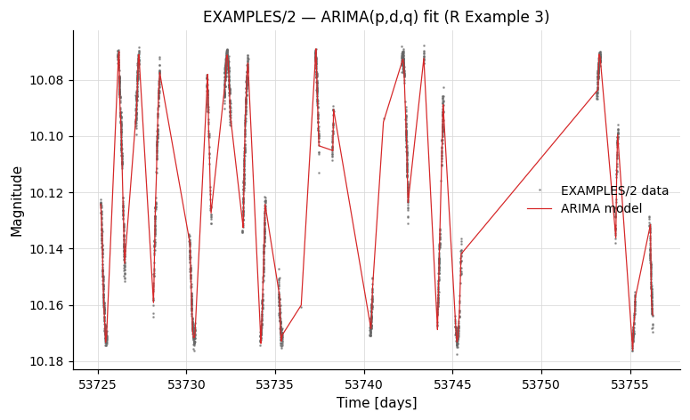
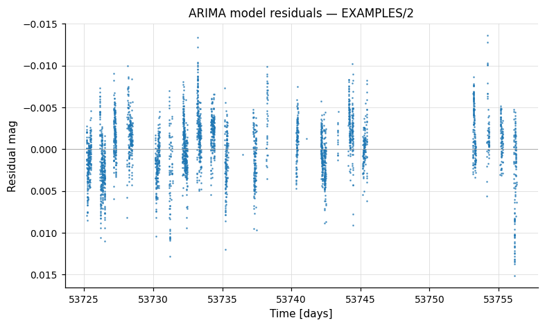
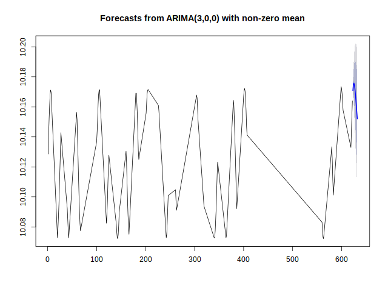
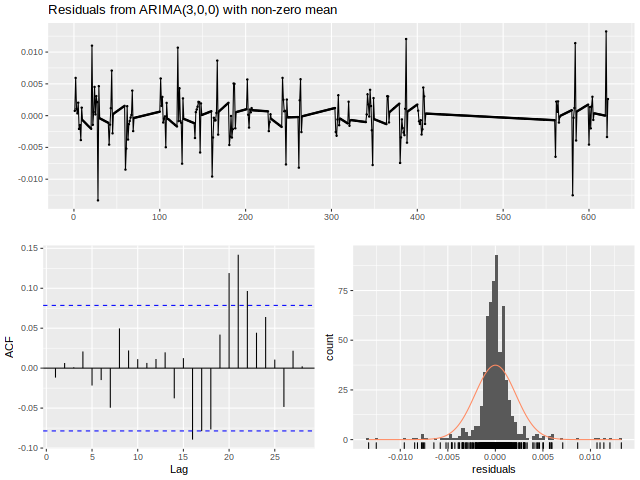
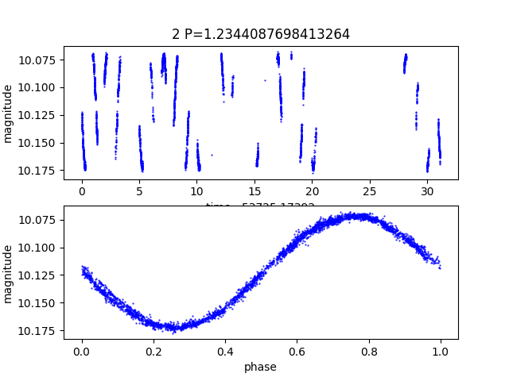

# Calling Python or R

Wrappers for vartools' embedded `-python` / `-R` interpreters, used to run user code on each light curve from within a pipeline.

---

### `R` — Run R code

**Syntax**

```python
cmd.R(command, fromfile=False, init=None, init_fromfile=False,
      vars=None, invars=None, outvars=None, outputcolumns=None,
      process_all_lcs=False, verbose=False, continueprocess=None)
```

**Description**

Execute arbitrary R code on each light curve. VARTOOLS embeds the user-supplied code in an R function and calls it once per light curve (or once for all light curves with `process_all_lcs=True`). Light-curve variables are passed to R as native R vectors. `vars` specifies variables to pass both into and out of R; `invars`/`outvars` allow separate control. `init` is R code run once before the batch loop begins (typically used for library imports and function definitions).

The `R_HOME` environment variable must be set before calling vartools (find the correct value with `R RHOME`; adding `export R_HOME=$(R RHOME)` to your `.bashrc` is recommended). Under `-parallel`, a separate R sub-process is launched per thread; initialization runs independently for each thread, and globals are not shared between threads.

CLI equivalent: [`-R`](../../cli/python-r.md#-r).

**Parameters**

| Parameter | Type | Description |
|-----------|------|-------------|
| `command` | `str` | Inline R code (default), or path to an R script file when `fromfile=True`. |
| `fromfile` | `bool` | If `True`, treat `command` as a file path rather than an inline string. |
| `init` | `str` or `None` | R code (or file path when `init_fromfile=True`) executed once before processing. Typical use: library imports and function definitions. |
| `init_fromfile` | `bool` | If `True`, `init` is a file path. |
| `vars` | `str` or `None` | Comma-separated list of variables passed both into and received back from R. |
| `invars` | `str` or `None` | Variables passed into R only (alternative to `vars`). |
| `outvars` | `str` or `None` | Variables received back from R only (alternative to `vars`). |
| `outputcolumns` | `str` or `None` | Subset of out-vars to emit in the output statistics table as `R_<name>_N`. |
| `process_all_lcs` | `bool` | Pass all light curves at once. Vector inputs arrive as lists of vectors; scalar inputs as lists. The output variables must also be lists with one entry per LC. |
| `verbose` | `bool` | Allow R to print to stdout (default: R runs in `--slave` mode). |
| `continueprocess` | `int` or `None` | Reuse the sub-process from the *N*-th prior `-R` (1-indexed). Shares R state; no initialization code may be supplied. |

**Output**

This command produces no output statistics by default; user-defined `outputcolumns` appear as `R_<name>_N` in `result.vars`.

**Examples**

**Example 1.** Compute the standard deviation of the magnitudes for each light curve in `EXAMPLES/lc_list` using R; the result appears as `R_b_0` in the output table.

```python
batch = (vt.Pipeline()
         .R("b <- sd(mag)",
            invars="mag", outvars="b", outputcolumns="b")
         ).run_filelist("EXAMPLES/lc_list",
                        columns={"t": 1, "mag": 2, "err": 3})
print(batch.vars[["Name", "R_b_0"]])
```

**Example 2.** Same as Example 1 but using `process_all_lcs=True` to send the whole batch to R at once. Inside R, `mag` arrives as a list of vectors and the output `b` must also be a list (one entry per LC).

```python
batch = (vt.Pipeline()
         .R("b <- list(); for(i in 1:length(mag)) "
            "{ b[[i]] <- sd(mag[[i]]); }",
            invars="mag", outvars="b", outputcolumns="b",
            process_all_lcs=True)
         ).run_filelist("EXAMPLES/lc_list",
                        columns={"t": 1, "mag": 2, "err": 3})
```

**Example 3.** ARIMA modelling using R's `forecast` package. After saving the original `mag`, we bin and resample the LC onto a uniform grid (ARIMA needs evenly-sampled data), call `auto.arima`, and subtract the residuals to obtain the smoothed model `mag_arima`. The model is then resampled back to the original time grid (using the [list-form `resample`](manipulation.md#resample-resample-onto-a-new-time-grid)) and the original `mag` is restored. Requires `tseries` and `forecast` to be installed in R.

```python
batch = (vt.Pipeline()
         .savelc()
         .binlc(method="average", binsize=0.05, time_output="taverage")
         .resample(method="linear", delt=0.05)
         .R(("mag_ts <- ts(mag, start=1, end=length(t), frequency=1); "
             "arima_model <- auto.arima(mag_ts); "
             "mag_arima <- mag - as.vector(arima_model$residuals);"),
            init="library(tseries); library(forecast);",
            invars="mag,t", outvars="mag_arima")
         .resample(method="linear",
                   file_times="list", list_column=1, t_column=1)
         .restorelc(1, vars="mag")
         .o("EXAMPLES/OUTDIR1",
            nameformat="%s.arimamodel",
            columnformat="t,mag,mag_arima")
         ).run_filelist("EXAMPLES/lc_list",
                        columns={"t": 1, "mag": 2, "err": 3})
```

The resulting `*.arimamodel` files contain `t`, the original `mag`, and the smoothed `mag_arima`:




**Example 4.** Same as Example 3 but with the ARIMA fit + diagnostic plots wrapped in a function `DoArimaFitPlot` defined in `EXAMPLES/Rexample4.R`. A `-python` step strips the directory prefix off `Name` to get the per-LC basename (a stand-in for any place where Python's string handling is more convenient than R's), then `-R` is loaded with `init_fromfile=True` so the `Rexample4.R` definitions are read once and `DoArimaFitPlot` is called per LC. The function writes per-LC `*.arimaforecast.png` and `*.arimaresiduals.png` files via R's `forecast` plotting helpers.

```python
batch = (vt.Pipeline()
         .savelc()
         .binlc(method="average", binsize=0.05, time_output="taverage")
         .resample(method="linear", delt=0.05)
         .python('lcbasename = Name.split("/")[-1]',
                 invars="Name", outvars="lcbasename")
         .R('mag_arima <- DoArimaFitPlot(mag, "EXAMPLES/OUTDIR1/", lcbasename)',
            init="EXAMPLES/Rexample4.R", init_fromfile=True,
            invars="mag,t,lcbasename", outvars="mag_arima")
         .resample(method="linear",
                   file_times="list", list_column=1, t_column=1)
         .restorelc(1, vars="mag")
         .o("EXAMPLES/OUTDIR1",
            nameformat="%s.arimamodel",
            columnformat="t,mag,mag_arima")
         ).run_filelist("EXAMPLES/lc_list",
                        columns={"t": 1, "mag": 2, "err": 3})
```




---

### `python` — Run Python code

**Syntax**

```python
cmd.python(command, fromfile=False, init=None, init_fromfile=False,
           vars=None, invars=None, outvars=None, outputcolumns=None,
           process_all_lcs=False, skipfail=False, continueprocess=None,
           inprocess=False, namespace=None)
```

**Description**

Execute arbitrary Python code on each light curve (or once for the whole batch with `process_all_lcs=True`). vartools embeds the user-supplied code inside a generated function and dispatches it to a per-thread Python sub-process (one sub-process per `-parallel` worker), shovelling the named light-curve and per-star variables across a Unix socket. Numeric LC vectors arrive as `numpy.ndarray` objects; string columns arrive as Python `list`s. `numpy` is automatically imported in the worker's namespace.

CLI equivalent: [`-python`](../../cli/python-r.md#-python).

!!! note "subprocess vs in-process"
    The default path runs the user code in a vartools-spawned Python sub-process — fully isolated from the calling pyvartools interpreter, so neither sub-process libpython nor user globals leak across the boundary.

    Setting `inprocess=True` instead routes the user code through a C-level callback into your live pyvartools Python interpreter, so the code sees your imports, globals, and an explicit `namespace=` dict. This requires library mode (no `save_*` / `cmd.o(...)` outputs, no `UserCommand` / userlib extensions, no `randseed`/`skipmissing`/`jdtol`/`matchstringid`, no `init_lc_vars`, no `timeout=` — and only the single-LC `Pipeline.run(lc)` path, since the batch entry points always go through the subprocess). If any of those conditions force the subprocess path, `inprocess=True` raises `RuntimeError` with a list of the obstacles rather than silently falling back.

    In-process v1 marshalling supports `DOUBLE`, `FLOAT`, `INT`, `LONG` scalars and LC vectors. String columns and `process_all_lcs=True` aren't yet wired through the callback — fall through to the subprocess form for those.

**Parameters**

| Parameter | Type | Description |
|-----------|------|-------------|
| `command` | `str` | Inline Python code, or — with `fromfile=True` — a path to a `.py` file containing the body. |
| `fromfile` | `bool` | Treat `command` as a file path (emits CLI `fromfile <path>`). |
| `init` | `str` or `None` | Initialisation Python (inline string, or a file path with `init_fromfile=True`) executed once per Python worker before per-LC processing. Use this for `import` statements and helper-function definitions. |
| `init_fromfile` | `bool` | Treat `init` as a file path (emits `init file <path>`). |
| `vars` | `str` or `None` | Comma-separated list of vartools variables passed both into and back out of Python (round-trip). Mutually exclusive with `invars`/`outvars` per the CLI grammar. |
| `invars` | `str` or `None` | Variables to pass into Python only. |
| `outvars` | `str` or `None` | Variables to receive back from Python only. |
| `outputcolumns` | `str` or `None` | Subset of out-vars to emit in the per-star statistics table; each becomes `PYTHON_<name>_N`. |
| `process_all_lcs` | `bool` | Send the whole batch to Python in one call. Vector invars arrive as a list of `numpy.ndarray`s (length `Nlc`); scalar invars as a numpy array of length `Nlc`. Outputs must follow the same shape. |
| `skipfail` | `bool` | If a per-LC Python exception is raised, skip the remaining pipeline processing for that LC instead of aborting the run. |
| `continueprocess` | `int` or `None` | Reuse the Python sub-process from the *N*-th prior `-python` (1-indexed), preserving its module-level state. Mutually exclusive with `init`. To share variables across calls, declare them `global` in the user code. |
| `inprocess` | `bool` | When `True` and pyvartools is in library mode, executes user code in the host Python interpreter rather than a vartools sub-process — user code shares `sys.modules` and the supplied `namespace=` dict with the caller. Subprocess-only run paths (`run_filelist`, `run_batch`, `run_combinelcs`) and library-mode-blocking flags raise `RuntimeError`; see the note above. |
| `namespace` | `dict` or `None` | Only used when `inprocess=True`. Globals dict the user code is `exec`'d in (default: caller's `__main__.__dict__`). Useful for sandboxing or for exposing a specific module's globals. |

**Output**

Per command index `N`:

| Column | Description |
|--------|-------------|
| `PYTHON_<varname>_N` | One column per name in `outputcolumns`. The runtime type is whatever the user code wrote into the named outvar (numeric scalar → float column; string → string column). |

User code can also modify any LC vector named in `vars` / `outvars`; modifications are written back to the LC and visible to subsequent pipeline commands.

**References**

The embedded Python interpreter is a feature of vartools 1.41+. For details on the sub-process / socket protocol, see `src/runpython.c` in the vartools source tree.

**Examples**

**Example 1.** Compute the variance of the magnitudes for each light curve in `EXAMPLES/lc_list`.  `mag` arrives as a numpy array; `b` is a Python float written back as `PYTHON_b_0` in the per-star table.

```python
batch = (vt.Pipeline()
         .python("b = numpy.var(mag)",
                 invars="mag", outvars="b", outputcolumns="b")
         ).run_filelist("EXAMPLES/lc_list",
                        columns={"t": 1, "mag": 2, "err": 3})
print(batch.vars[["Name", "PYTHON_b_0"]])
```

**Example 2.** Same as Example 1 but using `process_all_lcs=True` to send the whole batch to Python at once.  `mag` arrives as a list of numpy arrays and the output `b` must also be a list (one entry per LC).

```python
code = (
    "b = []\n"
    "for arr in mag: b.append(float(numpy.var(arr)))\n"
)
batch = (vt.Pipeline()
         .python(code,
                 invars="mag", outvars="b", outputcolumns="b",
                 process_all_lcs=True)
         ).run_filelist("EXAMPLES/lc_list",
                        columns={"t": 1, "mag": 2, "err": 3})
```

**Example 3.** Use `matplotlib.pyplot` to make a `.png` plot for each light curve with a sufficiently strong LS detection.  The plotting function lives in a separate file (`EXAMPLES/plotlc.py`) loaded via `init_fromfile=True`; the wrapper command then calls it inside an `if` block conditioned on the LS false-alarm probability.  Modelled on the CLI `-python` Example 2.

```python
# Mirror of the CLI Example 2.  vartools must be compiled against a
# Python that can `import matplotlib`.
batch = (vt.Pipeline()
         .LS(0.1, 100., 0.1, npeaks=1)
         .ifcmd("Log10_LS_Prob_1_0<-100")
             .Phase("ls", phasevar="ph")
             .python("plotlc(Name, 'EXAMPLES/', t, ph, mag, LS_Period_1_0)",
                     init="EXAMPLES/plotlc.py", init_fromfile=True)
         .ficmd()
         ).run_filelist("EXAMPLES/lc_list",
                        columns={"t": 1, "mag": 2, "err": 3})
```

The plot below is the actual `EXAMPLES/2.png` produced by `plotlc()` — LC vs time on the top panel, phase-folded at the LS period on the bottom:



**Example 4.** Same as Example 3, but use `process_all_lcs=True` so the whole list goes through one `-python` call. With `process_all_lcs` enabled, vector inputs (`t`, `ph`, `mag`) arrive as lists of numpy arrays; scalar inputs (`Name`, `LS_Period_1_0`) arrive as numpy arrays of length `Nlc`, so the user code loops over each light curve manually.

```python
code = (
    "for i in range(0, len(mag)):\n"
    "    plotlc(Name[i], 'EXAMPLES/', t[i], ph[i], mag[i], LS_Period_1_0[i])\n"
)
batch = (vt.Pipeline()
         .LS(0.1, 100., 0.1, npeaks=1)
         .Phase("ls", phasevar="ph")
         .python(code,
                 init="EXAMPLES/plotlc.py", init_fromfile=True,
                 process_all_lcs=True)
         ).run_filelist("EXAMPLES/lc_list",
                        columns={"t": 1, "mag": 2, "err": 3})
```

**Example 5.** Reuse Python state across two `-python` calls in the same pipeline using `continueprocess`. The first call defines a module-global cached value; the second reads it. To survive across calls (which run inside per-call wrapper functions), mutable state must be declared `global`.

```python
batch = (vt.Pipeline()
         .python("global _shared_mult\n_shared_mult = 1000.0",
                 invars="mag", outvars="mag")
         .python("global _shared_mult\n"
                 "b = _shared_mult * float(numpy.var(mag))",
                 continueprocess=1,
                 invars="mag", outvars="b", outputcolumns="b")
         ).run_filelist("EXAMPLES/lc_list",
                        columns={"t": 1, "mag": 2, "err": 3})
print(batch.vars[["Name", "PYTHON_b_1"]])
```

**Example 6.** In-process mode (`inprocess=True`).  User code shares the calling script's globals — it can reference imports, helpers, or class instances defined at module scope without going through `init`.  This works only with single-LC `Pipeline.run(lc)` in library mode; batch entry points raise `RuntimeError`.

```python
import numpy as np

# A helper defined in *your* script — visible to the -python body
# below because the in-process callback execs into __main__.__dict__.
def fancy_metric(arr):
    return float(np.std(arr) - np.median(np.diff(arr)))

lc = vt.LightCurve.from_file("EXAMPLES/2")
result = (vt.Pipeline()
          .python("b = fancy_metric(mag)",
                  invars="mag", outvars="b", outputcolumns="b",
                  inprocess=True)
          ).run(lc)
print(result.vars["PYTHON_b_0"])
```

To sandbox the inline code (so it can't see `__main__`), pass `namespace=...`:

```python
sandbox = {"my_factor": 7.0}
lc = vt.LightCurve.from_file("EXAMPLES/2")
result = (vt.Pipeline()
          .python("b = my_factor * float(numpy.var(mag))",
                  invars="mag", outvars="b", outputcolumns="b",
                  inprocess=True, namespace=sandbox)
          ).run(lc)
print(result.vars["PYTHON_b_0"])
```

---
