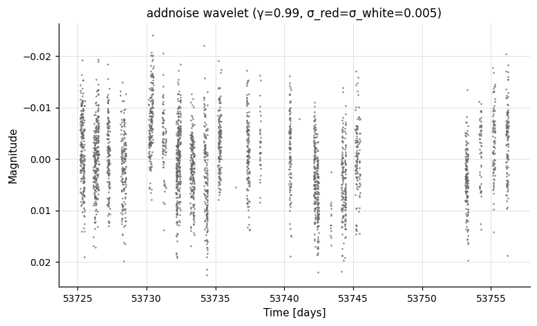
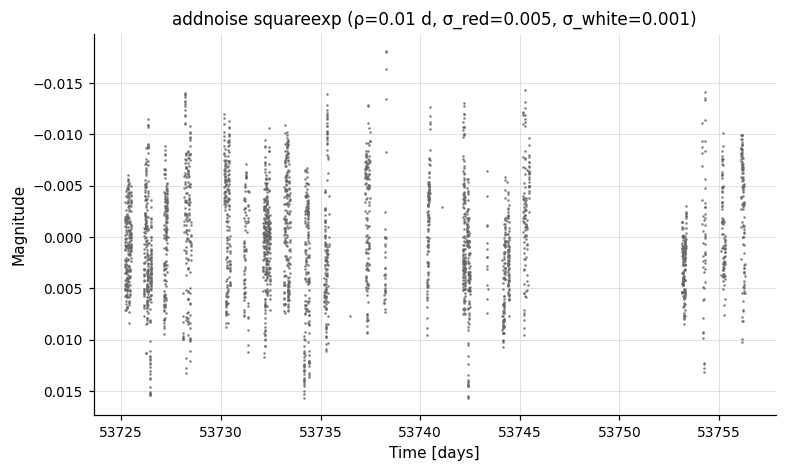
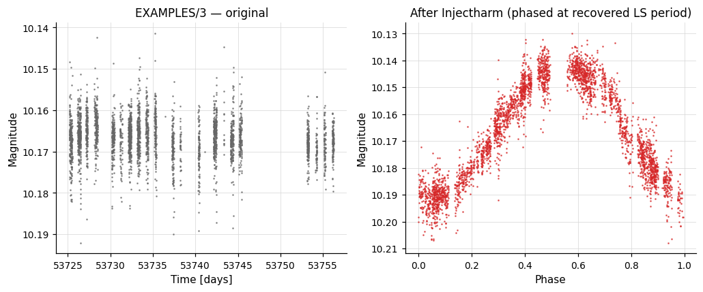
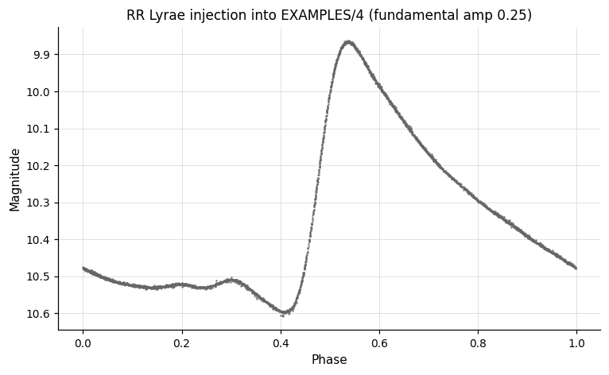
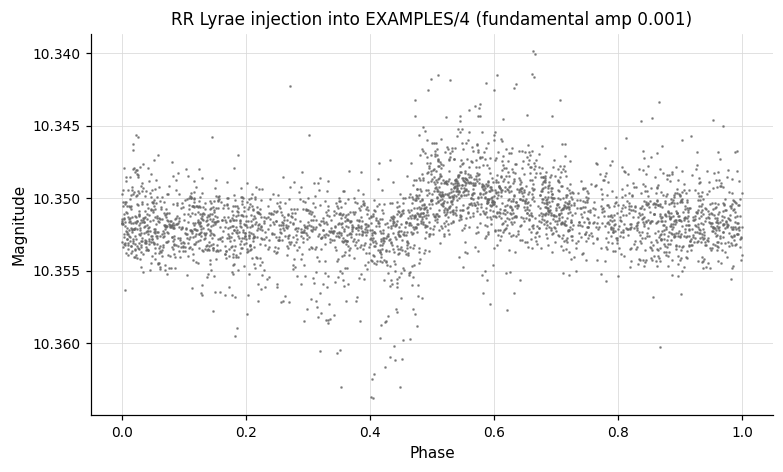
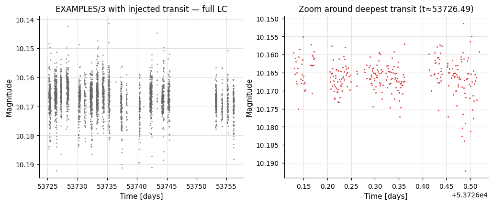

# Light Curve Simulation

Inject signals or synthetic noise into a light curve, or duplicate the light curve for Monte-Carlo studies.

---

### `addnoise` — Add synthetic noise

**Syntax**

```python
cmd.addnoise(noise_type="white", sig_white=0.001, rho=None,
             sig_red=None, nu=None, gamma=None, bintime=None)
```

**Description**

Add time-correlated Gaussian noise to the light curve, drawn from a specified covariance model. `noise_type` selects one of five models:

| `noise_type` | Required parameters | Covariance |
|---|---|---|
| `"white"` | `sig_white` | Independent Gaussian noise. |
| `"squareexp"` | `rho`, `sig_red`, `sig_white`, *opt.* `bintime` | `sig_red²·exp(−(Δt)²/(2ρ²))` plus white. |
| `"exp"` | `rho`, `sig_red`, `sig_white`, *opt.* `bintime` | `sig_red²·exp(−|Δt|/ρ)` plus white. |
| `"matern"` | `nu`, `rho`, `sig_red`, `sig_white` | Matérn covariance with smoothness `nu`. |
| `"wavelet"` | `gamma`, `sig_red`, `sig_white` | `1/f^γ` red noise (McCoy & Walden 1996) plus white. |

All amplitude and timescale parameters accept either a numeric value or a vartools variable-name string (the wrapper inserts the appropriate `fix` / `var` / `expr` keyword).

CLI equivalent: [`-addnoise`](../../cli/simulation.md#-addnoise).

**Parameters**

| Parameter | Type | Description |
|-----------|------|-------------|
| `noise_type` | `str` | One of `"white"`, `"squareexp"`, `"exp"`, `"matern"`, `"wavelet"`. |
| `sig_white` | `float` or `str` | White noise amplitude (used by all models). |
| `rho` | `float`, `str`, or `None` | Correlation timescale (`"squareexp"`, `"exp"`, `"matern"`). |
| `sig_red` | `float`, `str`, or `None` | Red-noise amplitude (all correlated models). |
| `nu` | `float`, `str`, or `None` | Matérn smoothness parameter (`"matern"` only; must be > 0). |
| `gamma` | `float`, `str`, or `None` | Wavelet power-law index (`"wavelet"` only; `−1 < γ < 1`). |
| `bintime` | `float`, `str`, or `None` | Optional bin-integration time for `"squareexp"` and `"exp"`. Accelerates simulation when the LC duration is much greater than `rho`. |

**Output**

`addnoise` modifies the light curve in place; no per-LC output columns are emitted. The downstream pipeline sees the noise-added LC.

**Examples**

```python
import numpy as np
import pyvartools as vt
from pyvartools import commands as cmd

# Build a zero-magnitude light curve with EXAMPLES/1 time sampling
lc_ref = vt.LightCurve.from_file("EXAMPLES/1")
t = lc_ref.t
lc_blank = vt.LightCurve.from_arrays(t, np.zeros_like(t), np.full_like(t, 0.005))

# Simulate wavelet (1/f-like) red noise + white noise
# (`gamma` sets the spectral-slope exponent; 2 ≈ 1/f^2 random walk)
result = lc_blank.addnoise(noise_type="wavelet", gamma=2.0,
                           sig_red=0.005, sig_white=0.005)
noisy_lc = result.lc

# Squared-exponential red noise with 0.01-day correlation timescale
result2 = lc_blank.addnoise(noise_type="squareexp", rho=0.01,
                            sig_red=0.005, sig_white=0.001)
```




---

### `Injectharm` — Inject a harmonic signal

**Syntax**

```python
cmd.Injectharm(period, amplitude, nharm=1, phase=0.0,
               nsubharm=0, save_model=False)
```

**Description**

Inject a Fourier-series signal (sinusoid plus optional harmonics and sub-harmonics) into the light curve, primarily for injection-recovery tests. The injected model is

```
A_1·cos(2π·(t/P + φ_1))
  + Σ_{k=2..nharm} A_k·cos(2π·(t·k/P + φ_k))
  + Σ_{k=2..nsubharm+1} A_k·cos(2π·(t/(k·P) + φ_k))
```

`period` accepts a float (emits `fix`) or a string passed through verbatim — for example `"logrand 1.0 5.0"` for a log-uniform random period or `"rand 0.5 5.0"` for uniform random. `amplitude` accepts a float (`ampfix`), a bare-identifier string (`ampvar`), or an expression string (`ampexpr`). The wrapper exposes only the most common modes: for `amprand`, `amplist`, period-`list`, or period-`rand` modes, use `cmd.Raw()`.

CLI equivalent: [`-Injectharm`](../../cli/simulation.md#-injectharm).

**Parameters**

| Parameter | Type | Description |
|-----------|------|-------------|
| `period` | `float` or `str` | Period of the injected signal. Float → `"fix val"`. String passes through (e.g. `"rand 1.0 5.0"`, `"logrand 0.5 5.0"`, `"randfreq …"`, `"lograndfreq …"`, `"list"`). |
| `amplitude` | `float` or `str` | Per-harmonic amplitude. Float → `"ampfix val"`. Bare-identifier string → `"ampvar name"`; other strings → `"ampexpr expr"` (e.g. `"amplogrand 0.01 0.1"`). |
| `nharm` | `int` | Number of harmonics including the fundamental (≥ 1). The CLI receives `Nharm = nharm − 1`. |
| `phase` | `float` or `str` | Initial phase of each harmonic (0–1). Same float / var / expr forms as `amplitude` (uses `phasefix` / `phasevar` / `phaseexpr`); `"phaserand"` is accepted as a string for a uniform random draw. |
| `nsubharm` | `int` | Number of sub-harmonics after the fundamental. Sub-harmonic specs use the default `ampfix 0.0 phasefix 0.0` (use `cmd.Raw()` for non-trivial sub-harmonic injection). |
| `save_model` | `bool`, `str`, or `Output` | Write the injected model as a `.injectharm.model` file. `True` captures as `result.files["Injectharm_model_N"]`. See [Auxiliary output files](index.md#auxiliary-output-files). |

**Output**

Suffix `N` is the 0-indexed pipeline command position:

| Column | Description |
|--------|-------------|
| `Injectharm_Period_N` | Injected period (days). |
| `Injectharm_Fundamental_Amp_N` | Amplitude of the fundamental. |
| `Injectharm_Fundamental_Phase_N` | Phase of the fundamental. |
| `Injectharm_Harm_k_Amp_N`, `Injectharm_Harm_k_Phase_N` | Amplitude and phase of harmonic `k` (for `k = 2 … nharm`). |
| `Injectharm_Subharm_k_Amp_N`, `Injectharm_Subharm_k_Phase_N` | Amplitude and phase of sub-harmonic `k` (for `k = 2 … nsubharm + 1`). |

When `save_model` is set:

| File key | Description |
|----------|-------------|
| `result.files["Injectharm_model_N"]` | DataFrame of the injected model light curve (suffix `.injectharm.model`). |

**Examples**

```python
lc = vt.LightCurve.from_file("EXAMPLES/3")

# Inject a sine wave at a random log-uniform period, then try to recover it.
# `logrand`, `amplogrand`, and `phaserand` are vartools-side random draws that
# create scalar variables on the LC — we use a single Pipeline so those
# variables stay in the same invocation as the recovery step.
result = (vt.Pipeline()
        .Injectharm(period="logrand 1.0 5.0",
                   amplitude="amplogrand 0.001 0.1",
                   nharm=0, phase="phaserand",
                   save_model=True)
        .LS(0.5, 10.0, 0.1, npeaks=1)).run(lc)
print(result.vars["Injectharm_Period_0"])   # injected period
print(result.vars["LS_Period_1_1"])         # recovered period
```



The same script with the canonical RR-Lyrae harmonic coefficients (and the fundamental amplitude reduced) shows the multi-harmonic shape directly:




---

### `Injecttransit` — Inject a transit signal

**Syntax**

```python
cmd.Injecttransit(period, Rp, Mp, phase, sini, Mstar, Rstar,
                  e=0.0, omega=0.0,
                  hk=False, h=0.0, k=0.0,
                  dilute=None,
                  ld_type="quad", ld_coeffs=None, save_model=False)
```

**Description**

Inject a Mandel-Agol limb-darkened transit signal into the light curve. Each physical parameter accepts a float (the wrapper emits `<prefix>fix val`) or a string passed through verbatim — strings can use any of the CLI source keywords (`Plogrand`, `Plist`, `Pexpr`, `phaserand`, `sinirand`, …). Eccentricity is supplied either as `(e, omega)` (default) or as `(h, k)` when `hk=True`. Limb darkening is either quadratic (`ld_type="quad"`, two coefficients) or non-linear (`ld_type="nonlin"`, four coefficients).

CLI equivalent: [`-Injecttransit`](../../cli/simulation.md#-injecttransit).

**Parameters**

| Parameter | Type | Description |
|-----------|------|-------------|
| `period` | `float` or `str` | Orbital period (days). Float → `"Pfix val"`. String passthrough (e.g. `"Plogrand 0.2 2.0"`, `"Plist"`). |
| `Rp` | `float` or `str` | Planet radius (Jupiter radii). Float → `"Rpfix val"` (e.g. `"Rplogrand 0.05 0.15"`). |
| `Mp` | `float` or `str` | Planet mass (Jupiter masses). |
| `phase` | `float` or `str` | Phase of transit centre (0–1). Common string form: `"phaserand"`. |
| `sini` | `float` or `str` | Sine of orbital inclination. Common string form: `"sinirand"` (uniform-orientation draw constrained to produce a transit). |
| `Mstar` | `float` or `str` | Stellar mass (M☉). |
| `Rstar` | `float` or `str` | Stellar radius (R☉). |
| `e` | `float` or `str` | Eccentricity (used with the default `eomega` mode). |
| `omega` | `float` or `str` | Argument of periastron in degrees (default mode). |
| `hk` | `bool` | When `True`, switch to `(h, k)` parameterisation: `h = e·sin(ω)`, `k = e·cos(ω)`. |
| `h`, `k` | `float` or `str` | Used when `hk=True`. |
| `dilute` | `float`, `str`, or `None` | Optional dilution factor (flux fraction from the target). Float → `["dilute", "fix", val]`; string passthrough (e.g. `"list"`). |
| `ld_type` | `str` | `"quad"` (2 coefficients) or `"nonlin"` (4 coefficients). |
| `ld_coeffs` | `list` of `float` | Limb-darkening coefficients. Default `[0.3, 0.3]`. |
| `save_model` | `bool`, `str`, or `Output` | Write the injected model. `True` captures as `result.files["Injecttransit_model_N"]`. |

**Output**

Suffix `N` is the 0-indexed pipeline command position:

| Column | Description |
|--------|-------------|
| `Injecttransit_Period_N` | Injected period (days). |
| `Injecttransit_Rp_N` | Planet radius (Jupiter radii). |
| `Injecttransit_Mp_N` | Planet mass (Jupiter masses). |
| `Injecttransit_phase_N` | Injected phase. |
| `Injecttransit_sin_i_N` | Injected `sin i`. |
| `Injecttransit_h_N`, `Injecttransit_k_N` | Eccentricity components (only when `hk=False`; values are the supplied `e`, `omega`). |
| `Injecttransit_e_N`, `Injecttransit_omega_N` | Eccentricity components (only when `hk=True`; values are the supplied `h`, `k`). |
| `Injecttransit_Mstar_N` | Stellar mass (M☉). |
| `Injecttransit_Rstar_N` | Stellar radius (R☉). |
| `Injecttransit_ld_k_N` | Limb-darkening coefficient `k` (1 to `Nld`). |

When `save_model` is set:

| File key | Description |
|----------|-------------|
| `result.files["Injecttransit_model_N"]` | DataFrame of the injected model light curve (suffix `.injecttransit.model`). |

**Examples**

```python
lc = vt.LightCurve.from_file("EXAMPLES/4")

# Inject a Jupiter-sized transit at a random period, then search with BLS.
# As with Injectharm, the per-LC random draws (`Plogrand`, `phaserand`, …) are
# scalar-variables produced inside vartools, so we run inject + recover in a
# single Pipeline invocation.
result = (vt.Pipeline()
        .Injecttransit(
            period="Plogrand 0.2 2.0",
            Rp="Rpfix 0.1",     # Rp/R*
            Mp="Mpfix 0.001",   # M_sun
            phase="phaserand",
            sini="sinirand",
            Mstar="Mstarfix 1.0",
            Rstar="Rstarfix 1.0",
            ld_type="quad",
            ld_coeffs=[0.3471, 0.3180],
            save_model=True,
        )
        .BLS(0.1, 5.0, rmin=0.01, rmax=0.1, nbins=200, nfreq=20000, npeaks=1)).run(lc)
print(result.vars["Injecttransit_Period_0"])   # injected period
print(result.vars["BLS_Period_1_1"])           # recovered period
```



---

### `copylc` — Duplicate the light curve in-memory

**Syntax**

```python
cmd.copylc(ncopies)
```

**Description**

Replicate the current light curve `ncopies` times in memory. Each copy is processed independently by all subsequent pipeline commands; the per-LC output table is replicated for every copy. Each copy's name has the suffix `_copy$copycommandnum.$copynum` appended, where `$copycommandnum` is the index of the `copylc` command and `$copynum` runs from `0` to `ncopies − 1`.

A common use is bootstrap / noise-replica Monte Carlo, where the same input is shifted into many parallel replicas that can be analysed by the downstream pipeline.

`copylc` cannot be used together with the `-readall` global option.

CLI equivalent: [`-copylc`](../../cli/simulation.md#-copylc).

**Parameters**

| Parameter | Type | Description |
|-----------|------|-------------|
| `ncopies` | `int` | Number of copies to create. |

**Output**

`copylc` does not emit per-LC output columns of its own; instead it expands the output table by a factor of `ncopies + 1`. Downstream commands' columns are reported once per copy.

**Example**

```python
lc = vt.LightCurve.from_file("EXAMPLES/2")
pipe_bs = (vt.Pipeline()
        .LS(0.1, 10.0, 0.1, npeaks=1)
        .copylc(100)
        .expr("mag=err*gauss()")
        .LS(0.1, 10.0, 0.1, npeaks=1))
batch_bs = pipe_bs.run_batch([lc])
```

---
