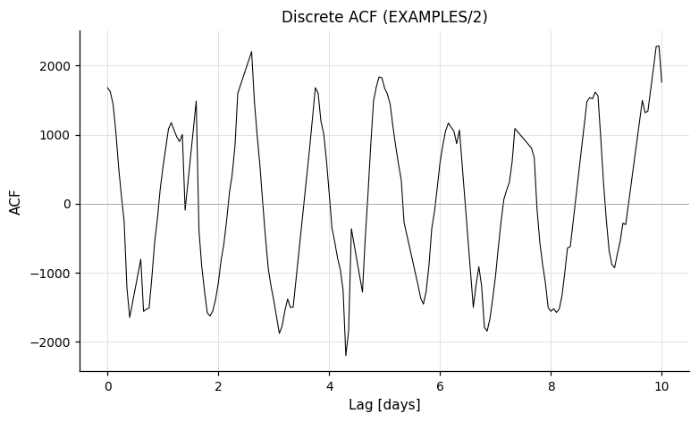

# Statistics

Scalar summary statistics computed over a light curve: moments, autocorrelation, variability indicators, and uncertainty rescaling.

---

### `rms` — Root mean square

**Syntax**

```python
cmd.rms(maskpoints=None)
```

**Description**

Compute the RMS of the light curve. The output includes the unweighted RMS, the mean magnitude, the expected RMS derived from the formal photometric uncertainties, and the number of points used. The light curve passed to subsequent commands is unchanged.

CLI equivalent: [`-rms`](../../cli/statistics.md#-rms).

**Parameters**

| Parameter | Type | Description |
|-----------|------|-------------|
| `maskpoints` | `str` or `None` | Name of a mask variable; only points with `maskvar > 0` are included in the calculation. |

**Output**

Suffix `N` is the 0-indexed pipeline command position:

| Column | Description |
|--------|-------------|
| `Mean_Mag_N` | Arithmetic mean magnitude. |
| `RMS_N` | Unweighted RMS. |
| `Expected_RMS_N` | RMS predicted from the formal photometric uncertainties (assuming they are accurate). |
| `Npoints_N` | Number of points used. |

**Examples**

```python
# Single light curve
lc = vt.LightCurve.from_file("EXAMPLES/2")
result = vt.Pipeline().rms().run(lc)
print(result.vars["Mean_Mag_0"])
print(result.vars["RMS_0"])

# Batch: compute RMS for all 10 example light curves
lcs = [vt.LightCurve.from_file(f"EXAMPLES/{i}") for i in range(1, 11)]
batch = vt.Pipeline().rms().run_batch(lcs)
print(batch.vars[["Name", "Mean_Mag_0", "RMS_0", "Expected_RMS_0"]])
```

---

### `rmsbin` — Binned RMS

**Syntax**

```python
cmd.rmsbin(nbin, bintimes, maskpoints=None)
```

**Description**

Apply a moving-mean filter to the light curve at one or more timescales and report the RMS of each filtered series. Used to characterise correlated (red) noise: as the filter window grows, white noise averages down as `1/sqrt(N)` while red noise persists. The light curve passed to subsequent commands is unchanged.

`bintimes` are interpreted as half-widths in **minutes** (matching the CLI). The full filter window for each entry is `2 · bintime`.

CLI equivalent: [`-rmsbin`](../../cli/statistics.md#-rmsbin).

**Parameters**

| Parameter | Type | Description |
|-----------|------|-------------|
| `nbin` | `int` | Number of timescale bins (filters) to apply. |
| `bintimes` | list of `float` | Filter half-widths in minutes; one entry per filter. Must have length `nbin`. |
| `maskpoints` | `str` or `None` | Name of a mask variable; only points with `maskvar > 0` are included. |

**Output**

For each binning timescale `T_i` (in minutes) and command index `N`, vartools emits an `RMSBin_<T_i>_N` column (and an associated `Expected_RMS_Bin_<T_i>_N` column). The timescale tag in the column name is built from the input minutes value with a one-decimal-place form (e.g. `5.0` minutes becomes `RMSBin_5.0_0`); two distinct input values that round to the same tag will produce duplicate column names, so choose well-separated values.

**Examples**

```python
lcs = [vt.LightCurve.from_file(f"EXAMPLES/{i}") for i in range(1, 11)]

# Compute binned RMS at a range of timescales, in minutes.
# (vartools truncates bin times when forming column names,
# so pick values that are well separated.)
bintimes_min = [5.0, 10.0, 60.0, 1440.0, 14400.0]
batch = vt.Pipeline().rmsbin(5, bintimes_min).run_batch(lcs)
print(batch.vars)
```

---

### `chi2` — Chi-squared statistic

**Syntax**

```python
cmd.chi2(maskpoints=None)
```

**Description**

Compute χ²/dof for the light curve relative to the error-weighted mean magnitude. A value much greater than 1 indicates the formal photometric uncertainties under-predict the observed scatter, signalling either real variability or under-estimated errors. The light curve passed to subsequent commands is unchanged.

CLI equivalent: [`-chi2`](../../cli/statistics.md#-chi2).

**Parameters**

| Parameter | Type | Description |
|-----------|------|-------------|
| `maskpoints` | `str` or `None` | Name of a mask variable; only points with `maskvar > 0` are included. |

**Output**

Suffix `N` is the 0-indexed pipeline command position:

| Column | Description |
|--------|-------------|
| `Chi2_N` | χ²/dof of the light curve relative to its error-weighted mean. |
| `Weighted_Mean_Mag_N` | Error-weighted mean magnitude. |

**Examples**

```python
# Batch: chi-squared for all example light curves
lcs = [vt.LightCurve.from_file(f"EXAMPLES/{i}") for i in range(1, 11)]
batch = vt.Pipeline().chi2().run_batch(lcs)
print(batch.vars[["Name", "Chi2_0", "Weighted_Mean_Mag_0"]])
```

---

### `chi2bin` — Binned chi-squared

**Syntax**

```python
cmd.chi2bin(nbin, bintimes, maskpoints=None)
```

**Description**

Same idea as `rmsbin` but reports χ²/dof rather than RMS at each binning timescale. With pure white noise, the binned uncertainties shrink as `1/sqrt(N)` and the binned χ² stays near 1; rising χ² with bin size signals red noise.

`bintimes` are half-widths in **minutes**. The light curve passed to subsequent commands is unchanged.

CLI equivalent: [`-chi2bin`](../../cli/statistics.md#-chi2bin).

**Parameters**

| Parameter | Type | Description |
|-----------|------|-------------|
| `nbin` | `int` | Number of filters. |
| `bintimes` | list of `float` | Filter half-widths in minutes; one entry per filter. |
| `maskpoints` | `str` or `None` | Name of a mask variable; only points with `maskvar > 0` are included. |

**Output**

For each binning timescale `T_i` (in minutes) and command index `N`, vartools emits a `Chi2Bin_<T_i>_N` column and a `Weight_Mean_Mag_Bin_<T_i>_N` column. The timescale tag is formatted the same way as for [`rmsbin`](#rmsbin-binned-rms) (e.g. `60.0` minutes becomes `Chi2Bin_60.0_0`); choose well-separated bin times to avoid duplicate column names.

**Examples**

```python
lcs = [vt.LightCurve.from_file(f"EXAMPLES/{i}") for i in range(1, 11)]
bintimes_min = [5.0, 10.0, 60.0, 1440.0, 14400.0]
batch = vt.Pipeline().chi2bin(5, bintimes_min).run_batch(lcs)
print(batch.vars)
```

---

### `stats` — Generic statistics

**Syntax**

```python
cmd.stats(variables, statistics, maskpoints=None)
```

**Description**

Compute one or more general statistics on one or more light-curve vectors (e.g. `t`, `mag`, `err`, or any user-defined variable). Every requested statistic is computed for every listed variable, producing a `STATS_<var>_<STAT>_N` column for each combination. Useful for downstream variable references (e.g. computing `tspan = STATS_t_MAX_0 - STATS_t_MIN_0`).

`variables` and `statistics` may each be either a comma-separated string or a Python list of strings. Available statistics include `mean`, `weightedmean`, `median`, `wmedian`, `stddev`, `meddev`, `medmeddev`, `MAD`, `kurtosis`, `skewness`, `pct<f>` / `wpct<f>` (any percentile from 0 to 100), `max`, `min`, and `sum`.

CLI equivalent: [`-stats`](../../cli/statistics.md#-stats).

**Parameters**

| Parameter | Type | Description |
|-----------|------|-------------|
| `variables` | `str` or list of `str` | Variable name(s) to compute statistics on. List form is joined with commas before being passed to the CLI. |
| `statistics` | `str` or list of `str` | Statistic name(s); see the table below. List form is joined with commas. |
| `maskpoints` | `str` or `None` | Name of a mask variable; only points with `maskvar > 0` contribute. |

**Available statistics**

| String | Description |
|--------|-------------|
| `mean` | Arithmetic mean. |
| `weightedmean` | Mean weighted by `1/σ²`. |
| `median` | Median. |
| `wmedian` | Median weighted by light-curve uncertainties. |
| `stddev` | Standard deviation about the mean. |
| `meddev` | Standard deviation about the median. |
| `medmeddev` | Median absolute deviation from the median. |
| `MAD` | `1.483 × medmeddev` (matches stddev for a Gaussian distribution at large `N`). |
| `kurtosis`, `skewness` | Higher moments. |
| `pct<f>` | The `<f>`-th percentile (`0 < f < 100`), e.g. `pct25`. |
| `wpct<f>` | Weighted percentile using the light-curve uncertainties. |
| `max`, `min` | Maximum (`pct100`) and minimum (`pct0`). |
| `sum` | Sum of the elements. |

**Output**

Per variable `V`, statistic `S`, and command index `N`:

| Column | Description |
|--------|-------------|
| `STATS_V_S_N` | Value of statistic `S` computed on variable `V`. The statistic name is upper-cased in the column (e.g. `STATS_mag_MEAN_0`, `STATS_t_MAX_0`). |

**Examples**

```python
lc = vt.LightCurve.from_file("EXAMPLES/3")

# Compute percentile and distribution statistics after adding Gaussian noise
pipe = (vt.Pipeline()
        .expr("mag2=mag+0.01*gauss()")
        .stats(
            ["mag", "mag2"],
            ["mean", "weightedmean", "median", "stddev", "MAD",
             "kurtosis", "skewness", "pct10", "pct90", "max", "min"],
        ))
result = pipe.run(lc)
print(result.vars["STATS_mag_MEAN_1"])
print(result.vars["STATS_mag_MEDIAN_1"])
print(result.vars["STATS_mag2_STDDEV_1"])
```

---

### `autocorrelation` — Autocorrelation function

**Syntax**

```python
cmd.autocorrelation(start, stop, step, save_result=True, maskpoints=None)
```

**Description**

Compute the discrete autocorrelation function (DACF) of the magnitude series following Edelson and Krolik (1988). The DACF is sampled at lags from `start` to `stop` in steps of `step` (all in days). Unlike the original Edelson and Krolik formulation, the formal measurement uncertainties are used in the denominator rather than the variance, which avoids imaginary values when errors are over-estimated; precede with `-changeerror` (in the same Pipeline) to recover the variance-based form.

The vartools CLI **always** writes the autocorrelation file to disk; `save_result=False` only suppresses Python capture. The file in that case is written to a temporary directory and discarded after the run.

CLI equivalent: [`-autocorrelation`](../../cli/statistics.md#-autocorrelation).

**Parameters**

| Parameter | Type | Description |
|-----------|------|-------------|
| `start`, `stop`, `step` | `float`, `str`, numpy array, `PerLC`, or `pd.Series` | Lag range and step size (days). |
| `save_result` | `bool`, `str`, or `Output` | Auxiliary file output. `True` (default) captures as `result.files["autocorrelation_result_N"]`; a path string writes to that directory without capturing; `Output(path, capture=True)` does both. See [Auxiliary output files](index.md#auxiliary-output-files) and the note below. |
| `maskpoints` | `str` or `None` | Name of a mask variable; only points with `maskvar > 0` are included. |

!!! note "File is always written"
    The vartools CLI always writes the autocorrelation file to disk — there is no CLI option to suppress it. Setting `save_result=False` only suppresses Python capture; the file is still written to a temp directory and discarded after the run completes.

**Output**

The command emits no per-LC scalar columns; the autocorrelation function is delivered through the auxiliary output file:

| File key | Description |
|----------|-------------|
| `result.files["autocorrelation_result_N"]` | DataFrame: time-lag (days) vs. autocorrelation. In a batch run this becomes a list of DataFrames, one per light curve. |

**References**

Edelson, R.A. & Krolik, J.H. 1988, ApJ, 333, 646.

**Examples**

```python
lc = vt.LightCurve.from_file("EXAMPLES/2")

# Default (save_result=True): ACF captured into result.files
result = vt.Pipeline().autocorrelation(0.0, 10.0, 0.05).run(lc)
acf = result.files["autocorrelation_result_0"]   # pd.DataFrame: time-lag vs autocorrelation

# save_result=False: file written to temp dir but not captured
result = vt.Pipeline().autocorrelation(0.0, 10.0, 0.05, save_result=False).run(lc)
# result.files has no "autocorrelation_result_0"

# Write to a specific directory and capture (Mode 2)
from pyvartools import Output
result = (vt.Pipeline()
        .autocorrelation(0.0, 10.0, 0.05,
                        save_result=Output("EXAMPLES/OUTDIR1", capture=True))).run(lc)
acf = result.files["autocorrelation_result_0"]   # from EXAMPLES/OUTDIR1/

# Batch — result.files["autocorrelation_result_0"] is a list of DataFrames
lcs = [vt.LightCurve.from_file(f"EXAMPLES/{i}") for i in range(1, 4)]
batch = vt.Pipeline().autocorrelation(0.0, 10.0, 0.05).run_batch(lcs)
acfs = batch.files["autocorrelation_result_0"]   # list of DataFrames, one per LC
```



---

### `Jstet` — Stetson J-statistic

**Syntax**

```python
cmd.Jstet(timescale, dates, maskpoints=None)
```

**Description**

Compute Stetson's J variability index, the L statistic, and the kurtosis of the residuals. J measures time-correlated variability by pairing observations that fall within `timescale` minutes of each other; pairs with consistent sign are counted positively and pairs of opposite sign negatively. A `dates` file listing the JDs of all possible observations is required to compute the maximum possible weight, and the J reported here includes an extra factor `(sum(weights) / weight_max)` relative to Stetson's original definition.

CLI equivalent: [`-Jstet`](../../cli/statistics.md#-jstet).

**Parameters**

| Parameter | Type | Description |
|-----------|------|-------------|
| `timescale` | `float` | Time in **minutes** that distinguishes "near" (correlated) from "far" (uncorrelated) observation pairs. |
| `dates` | `str` | Path to a file listing the JDs of all possible observations in the first column. Required to compute the maximum possible weight. |
| `maskpoints` | `str` or `None` | Name of a mask variable; only points with `maskvar > 0` are included. |

**Output**

Suffix `N` is the 0-indexed pipeline command position:

| Column | Description |
|--------|-------------|
| `Jstet_N` | Stetson's J variability index (with the additional weight factor). |
| `Kurtosis_N` | Kurtosis of the residuals from the mean. |
| `Lstet_N` | Stetson's L statistic = `J × Kurtosis`. |

**References**

Stetson, P.B. 1996, PASP, 108, 851.

**Examples**

```python
lcs = [vt.LightCurve.from_file(f"EXAMPLES/{i}") for i in range(1, 11)]
batch = vt.Pipeline().Jstet(0.5, "EXAMPLES/dates_tfa").run_batch(lcs)
print(batch.vars[["Name", "Jstet_0", "Kurtosis_0", "Lstet_0"]])
```

---

### `alarm` — Alarm statistic

**Syntax**

```python
cmd.alarm(maskpoints=None)
```

**Description**

Compute the alarm variability statistic of Tamuz, Mazeh and North (2006). The alarm is a detection statistic for coherent signals: long runs of consecutive positive or negative residuals from the mean are penalised more heavily than randomly distributed deviations of the same RMS, making it sensitive to time-correlated structure that low-order moments may miss.

CLI equivalent: [`-alarm`](../../cli/statistics.md#-alarm).

**Parameters**

| Parameter | Type | Description |
|-----------|------|-------------|
| `maskpoints` | `str` or `None` | Name of a mask variable; only points with `maskvar > 0` contribute. |

**Output**

Suffix `N` is the 0-indexed pipeline command position:

| Column | Description |
|--------|-------------|
| `Alarm_N` | The alarm statistic. |

**References**

Tamuz, O., Mazeh, T. and North, P. 2006, MNRAS, 367, 1521.

**Examples**

```python
lc = vt.LightCurve.from_file("EXAMPLES/2")
result = lc.alarm()
print(result.vars["Alarm_0"])
```

---
